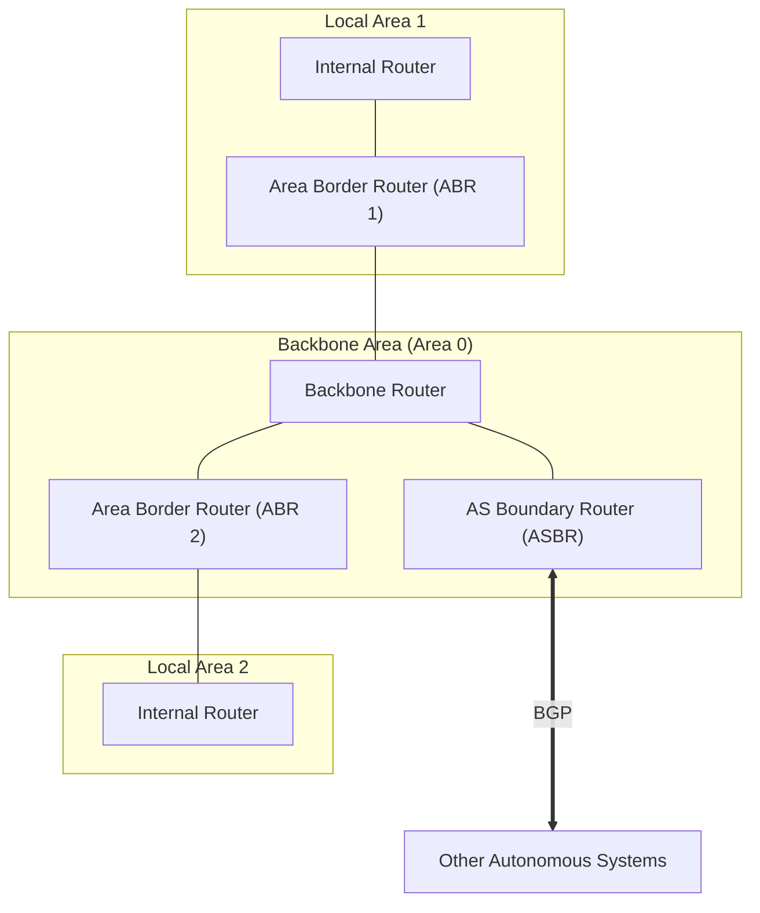

# 03 - Intra-AS Routing & OSPF

> [!abstract] Key Takeaway
> **Autonomous Systems (ASes)** partition the Internet into independently administered domains. 
> **OSPF (Open Shortest Path First - RFC 2328)** is the dominant **Intra-AS Link-State protocol**, running directly over IP (**Protocol 89**) and utilizing a **two-level area hierarchy** to scale.

---

## 1. Why Hierarchical Routing is Mandatory

A flat routing model where every router knows every other router fails due to:
1. **Scale:** Millions of destinations in a flat link-state graph would exhaust memory and CPU, and flooding link-state updates globally would consume all bandwidth.
2. **Administrative Autonomy:** An ISP must be free to run its internal network with its own choice of cost metrics without revealing internal topology to competitors.

---

## 2. OSPF Core Features (RFC 2328)

- **Direct IP Encapsulation:** OSPF packets are encapsulated directly inside IP datagrams with **`IP Protocol = 89`** (no TCP or UDP).
- **LSA Flooding:** Routers flood Link State Advertisements (LSAs) on state changes or periodically (every 30 mins).
- **Security:** All OSPF messages are authenticated (using MD5/HMAC cryptographic hashes).
- **Equal-Cost Multi-Path (ECMP):** Multiple equal-cost shortest paths are used concurrently for load balancing.

---

## 3. Hierarchical OSPF Architecture

### Router Classification in Hierarchical OSPF

| Router Type | Location | Operational Responsibility |
| :--- | :--- | :--- |
| **Internal Router (IR)** | Inside a local area | Executes Dijkstra solely on local area topology; forwards packets within the local area. |
| **Area Border Router (ABR)** | Connects local area to Area 0 | Summarizes local area topology and advertises summarized directional vectors into the Backbone Area. |
| **Backbone Router (BR)** | Inside Area 0 | Routes traffic between different local areas across the high-speed backbone. |
| **AS Boundary Router (ASBR)** | Perimeter gateway | Exchanges routes with other external Autonomous Systems using **BGP**. |

---
#### Navigation
← Previous: [[02 - Distance-Vector Routing & Bellman-Ford]] | Next: [[04 - Inter-AS Routing & BGP-4]] →
