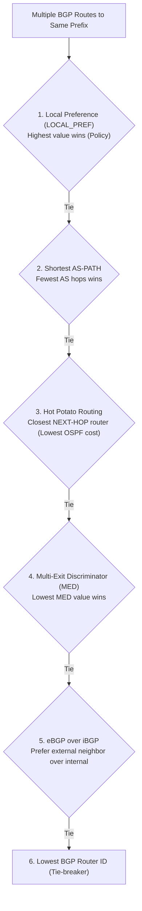

# 04 - Inter-AS Routing & BGP-4

> [!abstract] Key Takeaway
> **BGP (Border Gateway Protocol - RFC 4271)** is the standard **Inter-AS Path-Vector routing protocol** of the global Internet. 
> BGP runs over **TCP (Port 179)** and enables autonomous networks to enforce commercial **routing policies**, prevent loops via the **`AS-PATH`** attribute, and execute **Hot Potato Routing**.

---

## 1. eBGP vs iBGP Architecture

```mermaid
flowchart LR
    subgraph AS1 ["Autonomous System 1 (AS 1)"]
        1a["Router 1a"] <===>|iBGP| 1c["Border Router 1c"]
        1a <===>|iBGP| 1b["Border Router 1b"]
        1b <===>|iBGP| 1c
    end

    subgraph AS2 ["Autonomous System 2 (AS 2)"]
        2a["Border Router 2a"] <===>|iBGP| 2b["Border Router 2b"]
    end

    subgraph AS3 ["Autonomous System 3 (AS 3)"]
        3a["Border Router 3a"]
    end

    1c <===>|eBGP (TCP 179)| 2a
    1b <===>|eBGP (TCP 179)| 3a
```

- **eBGP (External BGP):** Exchanged between gateway routers in **different** ASes.
- **iBGP (Internal BGP):** Exchanged between routers **within the same** AS to distribute externally learned routes internally.

---

## 2. BGP Route Attributes: `AS-PATH` and `NEXT-HOP`

$$\text{BGP Route} = \text{Prefix} + \text{Attributes}$$

1. **`AS-PATH` Attribute:** Contains the ordered list of ASes through which the advertisement has traveled. If a router sees its **own ASN** in the `AS-PATH`, it **immediately drops** the advertisement (loop prevention).
2. **`NEXT-HOP` Attribute:** The IP address of the router interface that begins the `AS-PATH`.

---

## 3. BGP Route Selection Elimination Algorithm



---

## 4. Hot Potato Routing: "Get Rid of the Packet ASAP"

> [!info] Operational Definition
> **Hot Potato Routing:** A router chooses the gateway that has the **lowest internal intra-domain (OSPF) cost**, regardless of how many AS hops the packet will travel once it leaves the local AS.

---

## 5. Intra-AS vs Inter-AS Routing Comparison

| Dimension | Intra-AS (OSPF) | Inter-AS (BGP-4) |
| :--- | :--- | :--- |
| **Primary Goal** | **Performance Optimization** (lowest latency/cost). | **Policy & Business Enforcement** (commercial transit agreements). |
| **Scale** | Modest (thousands of subnets inside one AS). | **Internet-Wide** ($> 900,000$ global prefix routes). |
| **Trust Model** | High (single administration). | **Zero Trust** (competing commercial entities). |
| **Underlying Protocol** | Native IP (`Protocol 89`) | **TCP (Port 179)** |

---
#### Navigation
← Previous: [[03 - Intra-AS Routing & OSPF]] | Next: [[05 - ICMP & Traceroute Mechanics]] →
