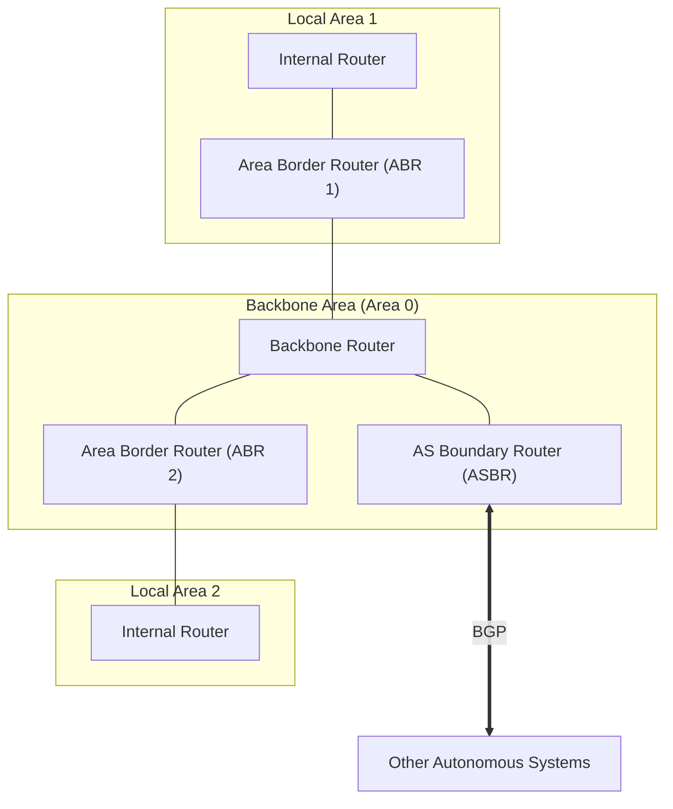

# 04 - Intra-AS Routing & OSPF

> [!abstract] Key Takeaway
> **Autonomous Systems (ASes)** partition the global Internet into independently administered domains. 
> **OSPF (Open Shortest Path First)** is the dominant **Intra-AS (Interior Gateway) Link-State protocol**, running directly over IP (**Protocol 89**) and utilizing a **two-level area hierarchy** to scale to massive enterprise networks.

---

## 1. Why Hierarchical Routing is Mandatory

A flat routing model where every router knows every other router in the world fails due to:
1. **Scale:** Storing millions of destination prefixes in a flat link-state graph would exhaust router memory, and flooding link-state updates globally would consume all network bandwidth.
2. **Administrative Autonomy:** An ISP must be free to run its internal network with its own choice of cost metrics (e.g., shortest delay vs lowest financial cost) without revealing internal topology to competitors.

---

## 2. OSPF Core Features (RFC 2328)

OSPF is an open, standardized **Link-State** protocol using Dijkstra's algorithm.

### Key Protocol Characteristics
- **Direct IP Encapsulation:** OSPF packets are encapsulated directly inside IP datagrams with **`IP Protocol = 89`** (it does not use TCP or UDP).
- **LSA Flooding:** Routers flood Link State Advertisements (LSAs) whenever a link changes state or periodically (at least every 30 minutes).
- **Security:** All OSPF message exchanges are authenticated (using MD5/HMAC cryptographic hashes) to prevent rogue routers from injecting malicious routes.
- **Equal-Cost Multi-Path (ECMP):** When multiple shortest paths with equal cost exist to a destination, OSPF load-balances traffic across all of them.

---

## 3. Hierarchical OSPF Architecture

To scale inside massive enterprise and ISP networks, an AS can be structured into a **two-level hierarchy**:

### Router Classification in Hierarchical OSPF

| Router Type | Location | Operational Responsibility |
| :--- | :--- | :--- |
| **Internal Router (IR)** | Resides entirely within a non-backbone local area | Executes Dijkstra solely on the local area topology; forwards packets using local intra-area routes. |
| **Area Border Router (ABR)** | Belongs to both a local area and the Backbone Area 0 | Summarizes local area topology into directional distance vectors and advertises them into the Backbone Area. |
| **Backbone Router (BR)** | Resides within Area 0 (includes ABRs) | Routes traffic between different local areas across the high-speed backbone. |
| **AS Boundary Router (ASBR)** | Gateway at the perimeter of the AS | Exchanges routes with other external Autonomous Systems using **BGP**. |

---

## 4. How Packet Routing Works Across OSPF Areas

When a host in Area 1 sends a packet to a destination host in Area 2:
1. **Intra-Area Step:** The packet is routed within Area 1 to **ABR 1**.
2. **Backbone Step:** ABR 1 routes the packet across **Backbone Area 0** to **ABR 2**.
3. **Inter-Area Delivery:** ABR 2 routes the packet down into **Area 2** to the final destination host.

> [!tip] Why Hierarchical OSPF Saves Resources
> Detailed link-state topology flooding is **strictly contained within local area boundaries**. Backbone and area border routers only advertise summarized network prefixes, drastically reducing memory and CPU load.

---
#### Navigation
← Previous: [[03 - Distance-Vector Routing & Bellman-Ford]] | Next: [[05 - Inter-AS Routing & BGP-4]] →
