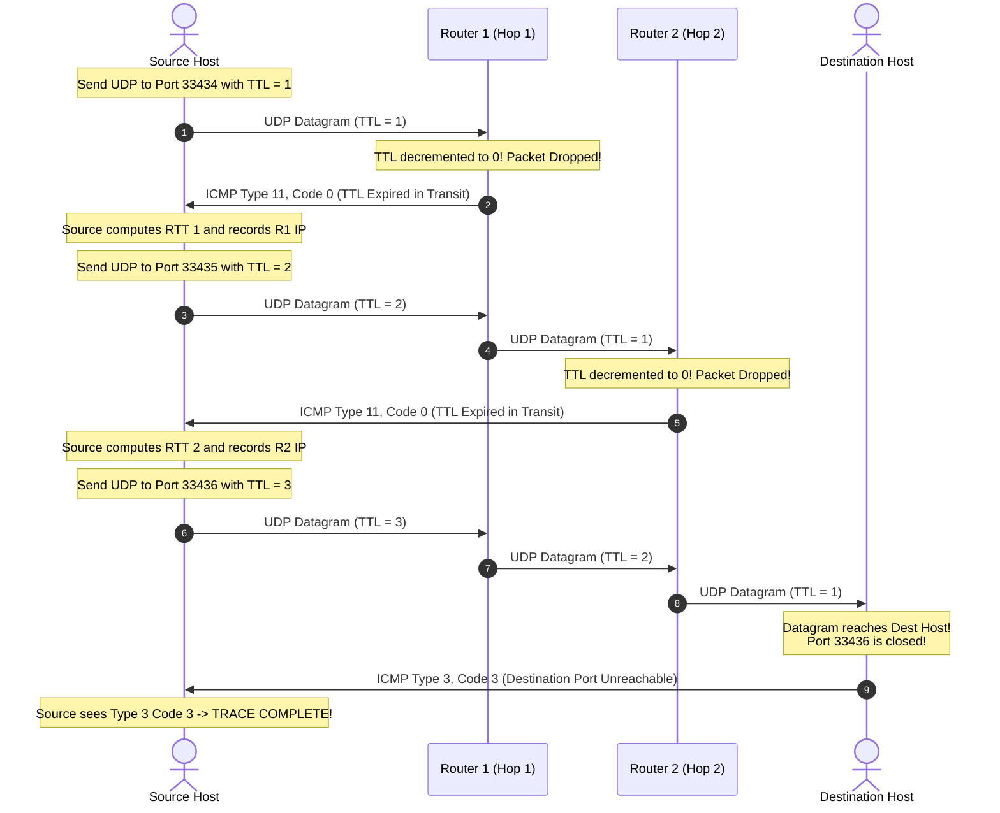

# 05 - ICMP & Traceroute Mechanics

> [!abstract] Key Takeaway
> **ICMP (Internet Control Message Protocol - RFC 792)** is carried directly inside IP datagrams (**`IP Protocol = 1`**) and is used for network-layer diagnostic and error reporting, powering **Ping** and **Traceroute**.

---

## 1. ICMP Message Architecture

```
 0                   1                   2                   3
 0 1 2 3 4 5 6 7 8 9 0 1 2 3 4 5 6 7 8 9 0 1 2 3 4 5 6 7 8 9 0 1
+-+-+-+-+-+-+-+-+-+-+-+-+-+-+-+-+-+-+-+-+-+-+-+-+-+-+-+-+-+-+-+-+
|     Type      |     Code      |          Checksum             |
+-+-+-+-+-+-+-+-+-+-+-+-+-+-+-+-+-+-+-+-+-+-+-+-+-+-+-+-+-+-+-+-+
|                 Contents depend on Type & Code                |
|  (Includes IP Header + First 8 Bytes of Offending Datagram)   |
+-+-+-+-+-+-+-+-+-+-+-+-+-+-+-+-+-+-+-+-+-+-+-+-+-+-+-+-+-+-+-+-+
```

---

## 2. Master Table of High-Yield ICMP Types & Codes

| Type | Code | Description / Meaning | Associated Context |
| :---: | :---: | :--- | :--- |
| **0** | **0** | **Echo Reply** | `ping` response |
| **8** | **0** | **Echo Request** | `ping` request |
| **3** | **0** | Destination Network Unreachable | Routing failure |
| **3** | **1** | Destination Host Unreachable | Host offline / ARP failure |
| **3** | **2** | Destination Protocol Unreachable | Protocol unsupported |
| **3** | **3** | **Destination Port Unreachable** | **Traceroute termination signal** |
| **3** | **4** | **Fragmentation Needed and DF Set** | **Path MTU Discovery (PMTUD)** |
| **11** | **0** | **TTL Expired in Transit** | **Traceroute intermediate hop signal** |
| **11** | **1** | Fragment Reassembly Time Exceeded | Reassembly timer expired at destination |

---

## 3. Traceroute Protocol Deep Dive



---

## 4. "Why" Questions & Exam Traps

> [!question] Why does Traceroute use UDP to high ports instead of Ping Echo?
> **Answer:**
> Intermediate routers decrement TTL and drop packets solely because $\text{TTL} = 0$, returning **ICMP Type 11 Code 0**. When the packet reaches the destination host, the closed UDP port triggers **ICMP Type 3 Code 3 (Port Unreachable)**. This distinct code signals to the sender that the target host was reached, terminating the trace.

---
#### Navigation
← Previous: [[04 - Inter-AS Routing & BGP-4]] | Next: [[06 - Book Extras & Professor Traps]] →
