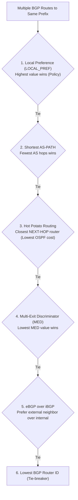

# 05 - Inter-AS Routing & BGP-4

> [!abstract] Key Takeaway
> **BGP (Border Gateway Protocol - RFC 4271)** is the de facto standard **Inter-AS Path-Vector routing protocol** of the global Internet. 
> BGP runs over **TCP (Port 179)** and enables autonomous networks to enforce commercial **routing policies**, prevent routing loops via the **`AS-PATH`** attribute, and execute **Hot Potato Routing**.

---

## 1. eBGP vs iBGP Architecture

```mermaid
flowchart LR
    subgraph AS1 ["Autonomous System 1 (AS 1)"]
        1a["Router 1a"] <===>|iBGP| 1c["Border Router 1c"]
        1a <===>|iBGP| 1b["Border Router 1b"]
        1b <===>|iBGP| 1c
    end

    subgraph AS2 ["Autonomous System 2 (AS 2)"]
        2a["Border Router 2a"] <===>|iBGP| 2b["Border Router 2b"]
    end

    subgraph AS3 ["Autonomous System 3 (AS 3)"]
        3a["Border Router 3a"]
    end

    1c <===>|eBGP (TCP 179)| 2a
    1b <===>|eBGP (TCP 179)| 3a
```

- **eBGP (External BGP):** Exchanged between physically adjacent gateway routers belonging to **different** ASes to learn subnet reachability.
- **iBGP (Internal BGP):** Exchanged between routers **within the same** AS to distribute externally learned routes to all internal routers.

---

## 2. BGP Route Attributes: `AS-PATH` and `NEXT-HOP`

In BGP, a route consists of an **IP Prefix** paired with several **Attributes**:
$$\text{BGP Route} = \text{Prefix} + \text{Attributes}$$

### 1. `AS-PATH` Attribute
- Contains the ordered list of Autonomous Systems through which the prefix advertisement has traveled (e.g., `AS-PATH: AS 123 -> AS 701 -> AS 209`).
- **Loop Prevention:** If a router receives an advertisement containing its **own ASN** in the `AS-PATH`, it **immediately drops** the advertisement!

### 2. `NEXT-HOP` Attribute
- The IP address of the router interface that begins the `AS-PATH`. For an eBGP advertisement, `NEXT-HOP` is the IP address of the neighboring border router in the upstream AS.

---

## 3. The BGP Route Selection Elimination Algorithm

When a router learns multiple valid BGP routes to the same destination prefix, it resolves ties using the following strict priority sequence:



---

## 4. Hot Potato Routing: "Get Rid of the Packet ASAP"

> [!info] Operational Definition
> **Hot Potato Routing:** A router chooses the gateway that has the **lowest internal intra-domain (OSPF) cost**, regardless of how many AS hops the packet will travel once it leaves the local AS.

```
                  [ AS 1 ]
  Router 1a (Ingress)
      │
      ├── (Intra-AS OSPF cost = 2) ──► Gateway 1b ──► (Leaves AS1 to AS3)
      │
      └── (Intra-AS OSPF cost = 8) ──► Gateway 1c ──► (Leaves AS1 to AS2)

Decision at Router 1a:
Chooses Gateway 1b because OSPF cost (2) < OSPF cost (8).
"Drop the hot potato out of our network as cheaply as possible!"
```

---

## 5. Why Intra-AS and Inter-AS Routing Differ

| Comparison Dimension | Intra-AS Routing (OSPF / IS-IS) | Inter-AS Routing (BGP-4) |
| :--- | :--- | :--- |
| **Primary Goal** | **Performance Optimization** (lowest latency, highest bandwidth). | **Policy & Business Enforcement** (commercial transit agreements). |
| **Scale** | Modest (thousands of subnets inside a single organization). | **Internet-Wide** ($> 900,000$ global prefix routes). |
| **Trust Model** | High (all routers administered by same organization). | **Zero Trust** (competing commercial entities). |
| **Underlying Protocol** | Native IP / Raw Link-State | **TCP (Port 179)** for reliable stateful peering |

---
#### Navigation
← Previous: [[04 - Intra-AS Routing & OSPF]] | Next: [[06 - ICMP & Traceroute Mechanics]] →
