# Chapter 5: Network Layer - Control Plane

---

## 1. Introduction to the Control Plane

The network layer performs two primary functions:
1. **Forwarding (Data Plane):** The local, per-router function that moves arriving packets from an input link interface to an appropriate output link interface based on forwarding/flow tables.
2. **Routing (Control Plane):** The network-wide logic that determines the end-to-end paths taken by packets from sending hosts to receiving hosts.

> [!abstract] Key Concept: Data Plane vs. Control Plane Separation
> - **Data Plane:** Executed in hardware at ==nanosecond speeds==; handles packet forwarding.
> - **Control Plane:** Executed in software at ==millisecond/second speeds==; computes forwarding tables and configures network components.

---

### Two Architectural Approaches to the Control Plane

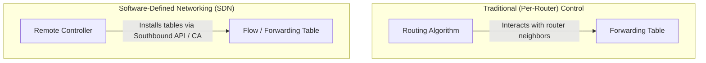

#### 1. Per-Router Control (Traditional Approach)
- A routing algorithm component runs in **each and every router**.
- Routers interact with neighboring routers via control protocols (e.g., OSPF, BGP) to calculate local forwarding tables.
- **Monolithic Architecture:** Control plane protocols and data plane forwarding hardware are tightly coupled inside a single physical router OS (e.g., Cisco IOS).

#### 2. Logically Centralized Control (Software-Defined Networking - SDN)
- A **distinct, remote controller** computes and installs forwarding/flow tables in each router.
- Routers contain a local **Control Agent (CA)** with minimal intelligence; CAs communicate with the central controller via a standardized protocol (e.g., OpenFlow).
- The controller is *logically* centralized (often physically distributed across servers for fault-tolerance and scalability).

---

## 2. Routing Algorithms

The primary goal of a routing algorithm is to find a **"good" path** (typically the **least-cost path**) through a network of routers.

### Graph Abstraction & Terminology

A computer network is modeled as a graph $G = (N, E)$:
- **Nodes ($N$):** Set of routers $= \{u, v, w, x, y, z\}$.
- **Edges ($E$):** Set of physical links $= \{(u,v), (u,x), (v,x), (v,w), (x,w), (x,y), (w,y), (w,z), (y,z)\}$.
- **Link Cost ($c_{a,b}$ or $c(a,b)$):** Cost of direct link connecting node $a$ and node $b$.
  - If $(a,b) \notin E$, then $c(a,b) = \infty$.
  - Cost metrics can reflect link length, bandwidth, delay, or financial cost, and are defined by network operators.

```
         5
     v ------ w
   / | \    / | \
  2  |  3  1  |  5
 /   2   \ /  |   \
u -- x -- y --+--- z
  1     1    2
```

---

### Classification of Routing Algorithms

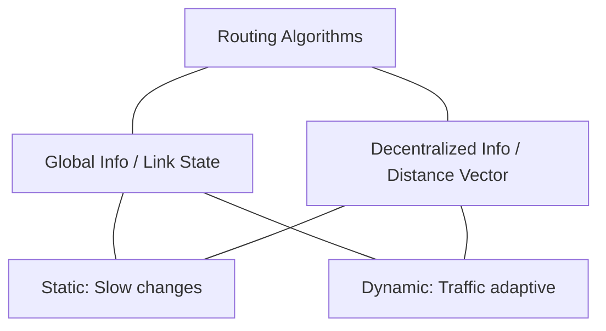

1. **Global vs. Decentralized Information:**
   - **Global ("Link State"):** All routers possess complete topology and link-cost information.
   - **Decentralized ("Distance Vector"):** Computation is iterative and distributed. Routers initially know only the costs of attached links and exchange vector estimates with direct neighbors.
2. **Static vs. Dynamic:**
   - **Static:** Routes change very slowly, usually via manual operator intervention.
   - **Dynamic:** Routes update automatically in response to topology or traffic load changes.
3. **Load-Sensitive vs. Load-Insensitive:**
   - **Load-Sensitive:** Link costs fluctuate dynamically to reflect current congestion levels.
   - **Load-Insensitive:** Link costs do not explicitly reflect traffic volume (modern Internet algorithms like OSPF/BGP are load-insensitive to prevent route oscillation).

---

### 2.1 Link-State (LS) Routing Algorithm: Dijkstra's Algorithm

Dijkstra’s algorithm is a **centralized algorithm** that computes the shortest paths from a source node $u$ to all other nodes in the network after $k$ iterations.

#### Notation
- $c(x,y)$: Direct link cost from node $x$ to $y$ ($=\infty$ if not direct neighbors).
- $D(v)$: Current estimate of the cost of the least-cost path from source $u$ to destination $v$.
- $p(v)$: Predecessor node along the current least-cost path to $v$.
- $N'$: Subset of nodes whose least-cost path from the source is definitively known.

#### Algorithm Specification

$$
\begin{aligned}
&\mathbf{1.\; Initialization:} \\
&\qquad N' = \{u\} \\
&\qquad \text{for all nodes } v: \\
&\qquad\quad \text{if } v \text{ is adjacent to } u \text{ then } D(v) = c(u,v) \text{ else } D(v) = \infty \\
\\
&\mathbf{2.\; Loop:} \\
&\qquad \text{repeat} \\
&\qquad\quad \text{find } w \notin N' \text{ such that } D(w) \text{ is a minimum} \\
&\qquad\quad \text{add } w \text{ to } N' \\
&\qquad\quad \text{update } D(v) \text{ for all } v \text{ adjacent to } w \text{ and } v \notin N': \\
&\qquad\qquad D(v) = \min\Big(D(v),\; D(w) + c(w,v)\Big) \\
&\qquad \text{until all nodes are in } N'
\end{aligned}
$$

---

#### Step-by-Step Walkthrough Example (Source = $u$)

Using the graph topology:
- $c(u,v)=2, c(u,x)=1, c(v,x)=2, c(v,w)=3, c(x,w)=3, c(x,y)=1, c(w,y)=1, c(w,z)=5, c(y,z)=2$

| Step | $N'$ | $D(v), p(v)$ | $D(w), p(w)$ | $D(x), p(x)$ | $D(y), p(y)$ | $D(z), p(z)$ |
| :---: | :---: | :---: | :---: | :---: | :---: | :---: |
| **0** | $u$ | $2, u$ | $5, u$ | **$1, u$** | $\infty$ | $\infty$ |
| **1** | $ux$ | $2, u$ | $4, x$ | --- | **$2, x$** | $\infty$ |
| **2** | $uxy$ | **$2, u$** | $3, y$ | --- | --- | $4, y$ |
| **3** | $uxyv$ | --- | **$3, y$** | --- | --- | $4, y$ |
| **4** | $uxyvw$ | --- | --- | --- | --- | **$4, y$** |
| **5** | $uxyvwz$| --- | --- | --- | --- | --- |

#### Resulting Forwarding Table at Node $u$

| Destination | Outgoing Link (Next-Hop) |
| :--- | :--- |
| **v** | $(u, v)$ |
| **x** | $(u, x)$ |
| **y** | $(u, x)$ |
| **w** | $(u, x)$ |
| **z** | $(u, x)$ |

---

#### LS Algorithm Complexity & Oscillations

- **Time Complexity:** For $n$ nodes, searching $N'$ requires $\frac{n(n+1)}{2}$ comparisons $\rightarrow \mathcal{O}(n^2)$. Using heap data structures yields $\mathcal{O}(n \log n)$.
- **Message Complexity:** Each of the $n$ routers broadcasts its link-state packet to all other $n$ routers $\rightarrow \mathcal{O}(n \cdot |E|)$ or $\mathcal{O}(n^2)$ overall message traffic.

> [!warning] Routing Oscillations in Load-Sensitive Networks
> If link costs depend on traffic load, dynamic path selection can cause route oscillations:
> 1. Traffic shifts to a low-cost path.
> 2. The low-cost path becomes congested, driving up its cost.
> 3. The algorithm recomputes and shifts all traffic to the opposite path, repeating the cycle endlessly.
> 
> **Solution:** Randomize the execution times of Link-State Advertisements (LSAs) across routers to prevent synchronization.

---

### 2.2 Distance-Vector (DV) Routing Algorithm

The Distance-Vector algorithm is **decentralized, iterative, asynchronous, and self-stopping**. It is based on dynamic programming via the **Bellman-Ford Equation**.

#### Bellman-Ford Equation
Let $d_x(y)$ be the cost of the least-cost path from node $x$ to node $y$. Then:

$$
d_x(y) = \min_v \Big\{ c(x,v) + d_v(y) \Big\}
$$

*(where the minimum is taken over all direct neighbors $v$ of node $x$)*

#### Distance-Vector Mechanics
- Each node $x$ maintains a distance vector $D_x = [D_x(y) : y \in N]$.
- From time to time, each node sends a copy of its distance vector to its immediate neighbors.
- When node $x$ receives a new vector $D_v$ from neighbor $v$, it updates its own estimate:

$$
D_x(y) \leftarrow \min_v \Big\{ c(x,v) + D_v(y) \Big\} \quad \forall y \in N
$$

- **Self-Stopping:** If a node's distance vector does not change, no messages are sent, and the algorithm sits idle until a local link cost changes or an update arrives from a neighbor.

---

#### Walkthrough Example of DV Updates

Given a 3-node triangle network: $c(x,y)=2, c(y,z)=1, c(x,z)=7$.

```text
Node x Table         Node y Table         Node z Table
   x  y  z              x  y  z              x  y  z
x  0  2  7           x  ∞  ∞  ∞           x  ∞  ∞  ∞
y  ∞  ∞  ∞           y  2  0  1           y  ∞  ∞  ∞
z  ∞  ∞  ∞           z  ∞  ∞  ∞           z  7  1  0
```
*(Nodes exchange initial vectors at $t=0$)*

$$
\Downarrow
$$

```text
Node x updates D_x(z):
D_x(z) = min{ c(x,y) + D_y(z), c(x,z) + D_z(z) } 
       = min{ 2 + 1, 7 + 0 } = 3

Final Stabilized Tables (t=2):
   x  y  z              x  y  z              x  y  z
x  0  2  3           x  0  2  3           x  0  2  3
y  2  0  1           y  2  0  1           y  2  0  1
z  3  1  0           z  3  1  0           z  3  1  0
```

---

#### Link-Cost Changes & The Count-to-Infinity Problem

> [!warning] The Asymmetry of Information Propagation
> - **"Good news travels fast":** Decreases in link costs propagate across the network rapidly in $O(1)$ iterations.
> - **"Bad news travels slow":** Increments in link costs can cause routing loops and the ==Count-to-Infinity problem==, where costs increment by 1 each iteration until they pass a threshold marking node reachability.

##### The Count-to-Infinity Scenario:
1. $c(x,y)$ jumps from $4$ to $60$, but neighbor $z$ had previously advertised a route to $x$ with cost $5$.
2. Node $y$ falsely assumes it can reach $x$ through $z$ with a new cost of $c(y,z) + D_z(x) = 1 + 5 = 6$.
3. Node $y$ informs $z$, which then recalculates its cost to $x$ via $y$ as $1 + 6 = 7$.
4. $y$ and $z$ bounce update messages back and forth, slowly incrementing the cost to $60$ over tens of iterations.

##### Mitigation: Poisoned Reverse
- If node $z$ routes through node $y$ to reach destination $x$, node $z$ lies to node $y$ by advertising $D_z(x) = \infty$.
- Node $y$ will never attempt to route to $x$ via $z$ as long as $z$ routes to $x$ through $y$.
- *Limit:* Poisoned Reverse prevents 2-node loops, but **cannot prevent loops involving 3 or more nodes**.

---

### Comparison of LS and DV Routing Algorithms

| Feature | Link-State (LS) | Distance-Vector (DV) |
| :--- | :--- | :--- |
| **Information Requirement** | Global: Complete network topology broadcast to all nodes. | Decentralized: Information exchanged with immediate neighbors only. |
| **Message Complexity** | $\mathcal{O}(n \cdot \|E\|)$ messages; flooding required. | Exchanges occur only between neighbors; convergence time varies. |
| **Speed of Convergence** | $\mathcal{O}(n^2)$ time; no routing loops once converged. | Can converge slowly; prone to routing loops and count-to-infinity. |
| **Robustness to Errors** | **High:** Router computes its own table; bad link costs affect only local broadcasts. | **Low:** Bad path costs propagate iteratively across the network (**Black-holing**). |

---

## 3. Intra-AS Routing in the Internet: OSPF

To scale routing to billions of destinations and respect administrative autonomy, the Internet organizes routers into **Autonomous Systems (AS)** (also called *domains*).

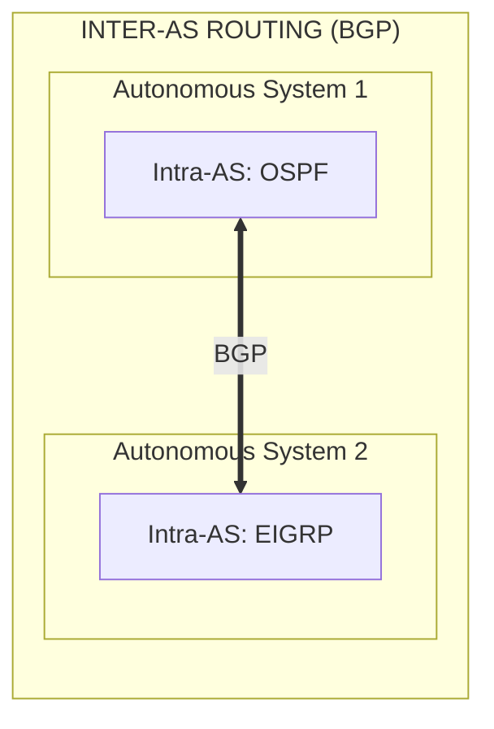

- **Intra-AS Routing:** Routing among routers within the same Autonomous System. All internal routers run the same intra-AS protocol.
- **Inter-AS Routing:** Routing among different Autonomous Systems. Gateway routers run both intra-AS and inter-AS protocols.

---

### Open Shortest Path First (OSPF)

OSPF is the dominant public intra-AS routing protocol in the IP stack.

#### Key Characteristics
- **Link-State Protocol:** Uses Link-State Advertisements (LSAs) flooded to all routers in the AS. Uses **Dijkstra’s Algorithm** locally to compute shortest-path trees.
- **Direct IP Encapsulation:** OSPF messages travel directly over IP packets using **IP Protocol 89** (bypassing TCP/UDP).
- **Security:** All OSPF messages are authenticated (e.g., via MD5 hashes) to prevent malicious route injections.
- **Equal-Cost Multi-Path (ECMP):** Allows multiple parallel links to destination nodes with equal costs to share traffic load.

---

### Hierarchical OSPF

To scale inside large networks, an OSPF AS can be divided into **Hierarchical Areas**:

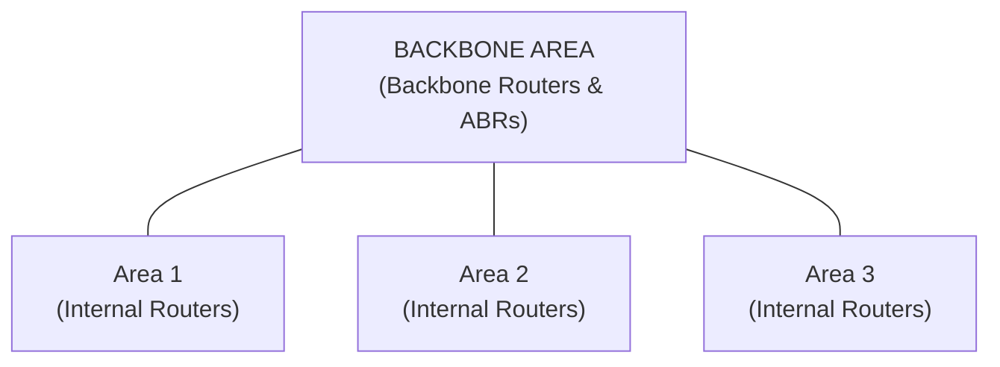

- **Local Area:** LSAs are flooded **only** within the area. Nodes hold detailed internal topology maps for their own area.
- **Area Border Router (ABR):** Summarizes distances to subnets within its local area and advertises them into the Backbone Area.
- **Backbone Area:** Central area that routes traffic between different local areas.
- **Boundary Router:** A gateway router that connects the AS to external networks running BGP.

---

## 4. Routing Among ISPs: BGP

The **Border Gateway Protocol (BGP)** (version 4, RFC 4271) is the inter-domain routing protocol—commonly referred to as the *"glue that holds the Internet together."*

### Key Functions of BGP
BGP routes packets based on **CIDRized Network Prefixes** (e.g., `138.16.68.0/22`), providing each AS a mechanism to:
1. **eBGP (External BGP):** Obtain prefix reachability information from neighboring ASes.
2. **iBGP (Internal BGP):** Propagate reachability information to all internal routers within the AS.
3. Determine "best" paths based on reachability and complex **AS business policies**.

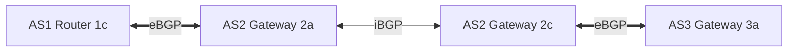

> [!info] Gateway Routers
> Gateway routers run **both** eBGP (to communicate with external ASes) and iBGP (to distribute routes to internal routers).

---

### BGP Basics & Attributes

BGP is a **Path-Vector Protocol**. When a BGP peer advertises a route over a semi-permanent TCP connection (Port 179), it includes a **Prefix + Attributes**.

#### Two Critical BGP Attributes:
1. `AS-PATH`: Contains the list of ASes through which the prefix advertisement has passed (e.g., `AS 2, AS 3`).
   - *Loop Prevention:* If a router sees its own AS number in an incoming `AS-PATH`, it **rejects** the advertisement.
2. `NEXT-HOP`: The specific IP address of the internal-AS router that starts the `AS-PATH` leading to the destination prefix.

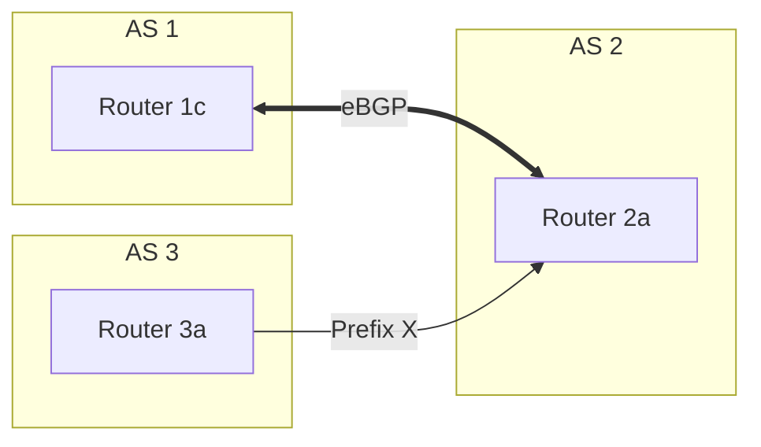

#### BGP Protocol Message Types
- `OPEN`: Opens a TCP connection to a peer and authenticates the sender.
- `UPDATE`: Advertises new reachable paths or withdraws invalid ones.
- `KEEPALIVE`: Keeps the TCP connection active in the absence of `UPDATE` messages; ACKs `OPEN` requests.
- `NOTIFICATION`: Reports errors in previous messages or closes connections.

---

### BGP Route Selection Algorithm

If a router receives multiple routes to the same destination prefix, it applies the following sequence of rules sequentially until a single best path remains:

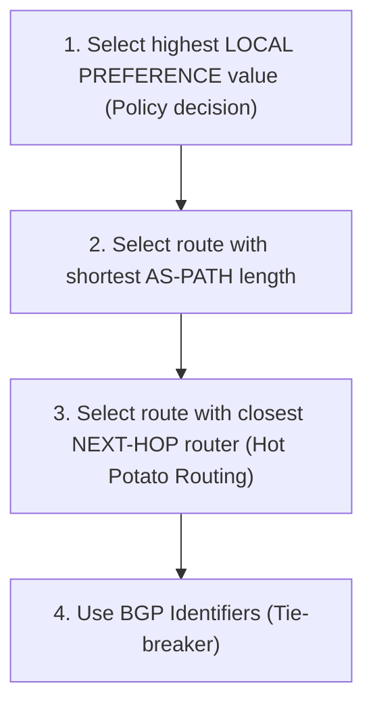

---

### Hot Potato Routing

> [!tip] Hot Potato Routing Logic
> The router chooses the local gateway that has the **least intra-domain cost** (according to the internal OSPF metric), without regard to the number of inter-domain AS hops remaining outside the local AS.
> 
> **Goal:** Dump the packet out of the local AS as quickly as possible!

```text
AS2 Gateway 2d receives traffic for Prefix X reachable via 2a or 2c.
Intra-AS OSPF cost to 2a = 201
Intra-AS OSPF cost to 2c = 112

--> Hot Potato choice = Router 2c (Least intra-AS cost, ignoring external path length).
```

---

### BGP Routing Policy & Economics

BGP route choices are governed by commercial provider-customer and peering relationships.

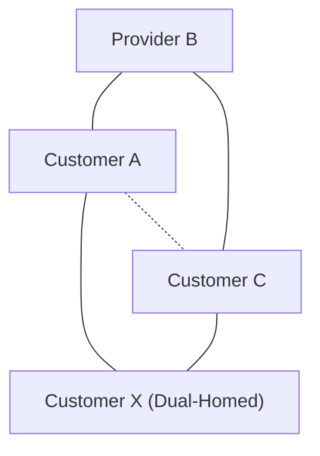

#### Common Provider Policy Rules:
1. **Transit Policy:** A provider network $B$ wants to carry transit traffic **only if** it originates from or is destined to one of its paying customers ($A$ or $X$).
2. **Peering Restrictions:** If $B$ and $C$ are non-paying peer networks, $B$ will **not** advertise paths learned from $C$ to $A$, preventing $A$ and $C$ from using $B$ as a free transit bridge.
3. **Dual-Homed Access Networks:** A multi-homed customer $X$ connected to providers $B$ and $C$ will **never** advertise routes learned from $B$ to $C$, preventing transit traffic between $B$ and $C$ from traversing $X$'s internal network.

---

### Comparison: Intra-AS vs. Inter-AS Routing

| Aspect | Intra-AS Routing (e.g., OSPF) | Inter-AS Routing (BGP) |
| :--- | :--- | :--- |
| **Primary Goal** | **Performance:** Focuses on minimizing path cost, maximizing throughput. | **Policy:** Commercial and administrative rules dictate route choices over path length. |
| **Scale** | Managed via hierarchical areas to scale internally. | Massive: Designed to handle global Internet tables ($>900,000+$ prefixes). |
| **Admin Control** | Single administrative control; policy issues are minimal. | Multi-administrative; distinct AS policies dominate. |

---

## 5. Software-Defined Networking (SDN) Control Plane

SDN moves the control plane away from embedded hardware components into a **logically centralized, programmable software controller**.

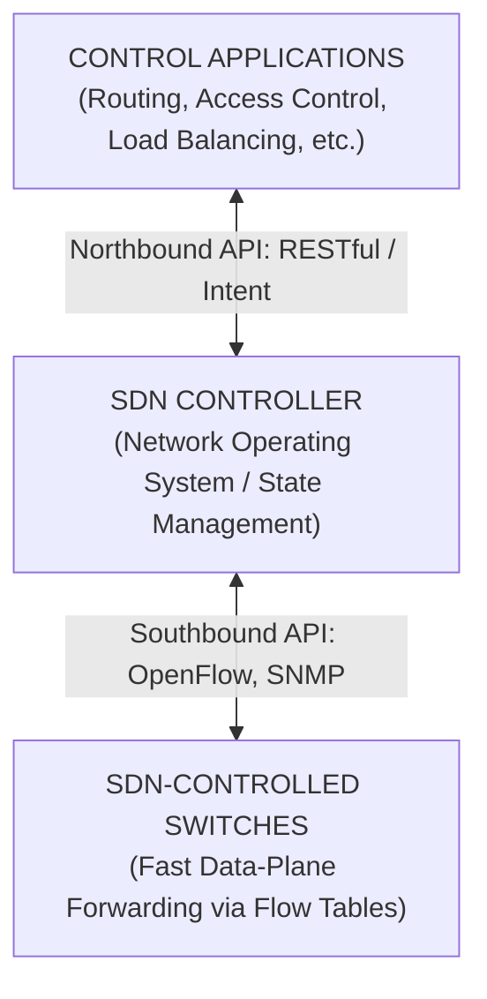

---

### Four Key Characteristics of SDN

1. **Flow-Based Forwarding:** Switches execute generalized match-plus-action rules across fields in layers 2, 3, and 4 (via OpenFlow abstraction).
2. **Separation of Data Plane and Control Plane:** Fast, simple hardware switches execute rules in flow tables, while controllers compute and distribute these tables.
3. **Control Plane External to Switches:** Operating system logic runs remotely on server clusters distinct from packet switches.
4. **Programmable Network:** Applications running above the controller can program network behavior dynamically.

---

### Components of an SDN Controller

An SDN Controller acts as a Network Operating System divided into three core layers:

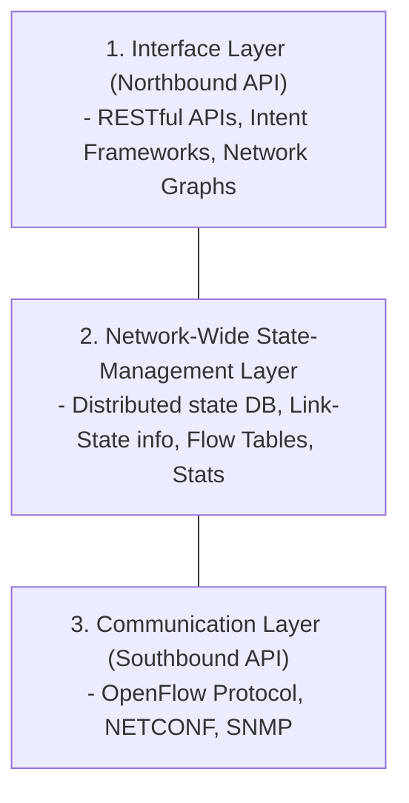

---

### The OpenFlow Protocol

OpenFlow runs between the SDN controller and controlled switches over TCP (Port 6653, optional TLS encryption).

#### 1. Controller-to-Switch Messages
- `Configuration`: Queries and sets switch configuration parameters.
- `Modify-State`: Adds, deletes, or modifies flow entries in OpenFlow tables.
- `Read-State`: Collects statistics and flow counters from switches.
- `Send-Packet`: Sends a specific packet directly out of a designated switch port.

#### 2. Switch-to-Controller (Asynchronous) Messages
- `Packet-in`: Transfers an arriving packet to the controller if it misses all flow table rules or matches a "Send-to-Controller" action.
- `Flow-Removed`: Informs the controller that a flow entry timed out or was deleted.
- `Port-Status`: Informs the controller that an interface port status changed (e.g., link down).

---

### SDN Control/Data Plane Interaction Example

**Scenario:** Switch $S_1$ experiences a link failure on its connection to $S_2$.

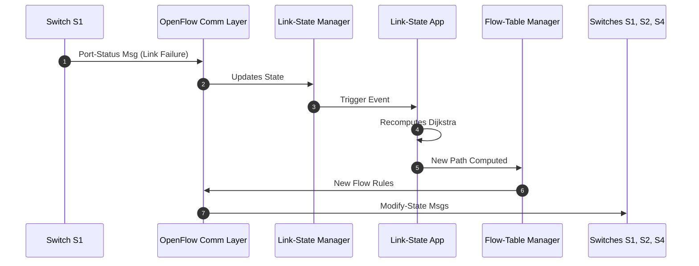

---

### Production SDN Controllers

- **OpenDaylight (ODL):** Open-source platform featuring a **Service Abstraction Layer (SAL)** connecting modules via AD-SAL (REST APIs) and MD-SAL (YANG data modeling).
- **ONOS (Open Network Operating System):** High-performance platform tailored for service providers, featuring an **Intent Framework** (declaring *what* is needed, rather than *how* to construct it) and a scale-out distributed architecture.

---

## 6. Internet Control Message Protocol (ICMP)

ICMP (RFC 792) is used by hosts and routers to communicate network-layer control/error information to each other.

- **Architecture:** ICMP sits architecturally directly above IP. ICMP messages are encapsulated as **IP payload** (IP Protocol 1).
- **Format:** Contains an 8-bit `Type`, 8-bit `Code`, checksum, plus the **IP header + first 8 bytes of the IP datagram** that caused the error.

```text
+-------------------------------------------------------------------+
| IP Header (Proto=1) | ICMP Type | ICMP Code | Original Packet Payload |
+-------------------------------------------------------------------+
```

---

### Common ICMP Message Types and Codes

| ICMP Type | Code | Description | Used By / Function |
| :---: | :---: | :--- | :--- |
| **0** | $0$ | Echo Reply | `ping` response |
| **3** | $0$ | Destination Network Unreachable | Error reporting |
| **3** | $1$ | Destination Host Unreachable | Error reporting |
| **3** | $2$ | Destination Protocol Unreachable | Transport layer mismatch |
| **3** | $3$ | Destination Port Unreachable | `traceroute` termination |
| **4** | $0$ | Source Quench | Congestion control (rarely used) |
| **8** | $0$ | Echo Request | `ping` query |
| **11** | $0$ | TTL Expired | `traceroute` path discovery |
| **12** | $0$ | Bad IP Header | Malformed IP packet |

---

### ICMP Applications: Ping and Traceroute

#### 1. Ping
- Sender sends an ICMP `Echo Request` (Type 8, Code 0).
- Receiver returns an ICMP `Echo Reply` (Type 0, Code 0).

#### 2. Traceroute Mechanics
- The source sends a sequence of UDP datagrams to an unallocated port at the destination.
- **1st Set:** $\text{TTL} = 1$. The 1st router drops the packet and returns ICMP `TTL Expired` (Type 11, Code 0).
- **2nd Set:** $\text{TTL} = 2$. The 2nd router drops the packet and returns ICMP `TTL Expired`.
- **Termination:** Datagram reaches the destination host. Because the port is unallocated, the host returns ICMP `Destination Port Unreachable` (Type 3, Code 3). The source receives this and stops sending probes.

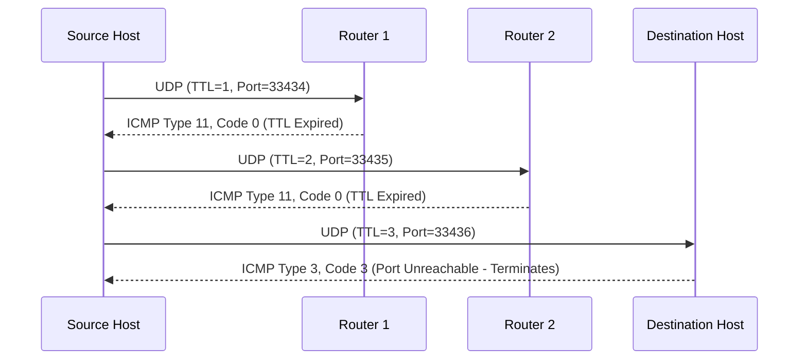

---

## 7. Network Management & Configuration

> [!info] Definition: Network Management
> *"Network management includes the deployment, integration, and coordination of the hardware, software, and human elements to monitor, test, poll, configure, analyze, evaluate, and control the network and element resources to meet real-time operational performance and Quality of Service requirements at a reasonable cost."*

---

### Key Components of Network Management

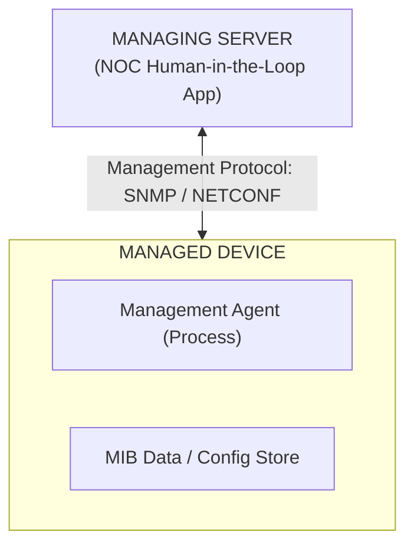

1. **Managing Server:** Central application in the Network Operations Center (NOC) controlling collection, processing, and display of management data.
2. **Managed Device:** Network equipment (routers, switches, middleboxes) containing configurable state.
3. **Device Data:**
   - *Configuration Data:* Explicitly configured parameters (e.g., interface IP addresses).
   - *Operational Data:* Learned operational state (e.g., OSPF neighbor lists).
   - *Device Statistics:* Counters and operational metrics (e.g., dropped packet counts, fan speed).
4. **Management Agent:** Software process running locally on a managed device executing managing server commands.
5. **Network Management Protocol:** Protocol running between server and agents.

---

### Three Approaches to Network Management

```text
1. CLI (Command Line Interface) ---> Individual, vendor-specific, error-prone, hard to scale.
2. SNMP / MIB                  ---> Individual device queries/monitoring via UDP data primitives.
3. NETCONF / YANG             ---> Network-wide, holistic, atomic XML transactions over SSH/TLS.
```

---

### 7.1 Simple Network Management Protocol (SNMP) and MIBs

SNMPv3 (RFC 3410) operates in a **Request-Response** mode or an asynchronous **Trap** mode. SNMP messages are typically mapped to **UDP port 161** (for requests/responses) and **UDP port 162** (for traps).

```text
   Request/Response Mode                          Trap Mode
Managing Server <== Request ==> Agent       Managing Server <== Trap Message == Agent
                 <== Response ==                                (Unsolicited Event)
```

#### SNMP Protocol Data Units (PDUs)

| PDU Type | Sender $\rightarrow$ Receiver | Function |
| :--- | :--- | :--- |
| `GetRequest` | Server $\rightarrow$ Agent | Requests values of specific MIB objects. |
| `GetNextRequest` | Server $\rightarrow$ Agent | Requests next value in MIB table sequence. |
| `GetBulkRequest` | Server $\rightarrow$ Agent | Requests a large block of data/table. |
| `SetRequest` | Server $\rightarrow$ Agent | Modifies values of MIB objects. |
| `Response` | Agent $\rightarrow$ Server | Returns requested values/confirmation. |
| `SNMPv2-Trap` | Agent $\rightarrow$ Server | Unsolicited notification of an exception event. |

#### Management Information Base (MIB)
Objects are specified using **SMI (Structure of Management Information)** data definition language:

```asn1
-- Example MIB Variable Definition (RFC 4293)
ipSystemStatsInDelivers OBJECT-TYPE
    SYNTAX      Counter32
    MAX-ACCESS  read-only
    STATUS      current
    DESCRIPTION "The total number of datagrams successfully delivered 
                 to IP user-protocols (including ICMP)."
    ::= { ipSystemStatsEntry 18 }
```

---

### 7.2 NETCONF and YANG

NETCONF (RFC 6241) and YANG (RFC 6020) provide a modern, holistic approach to network configuration management.

- **YANG:** A formal data modeling language used to define the structure, syntax, and constraints of configuration and operational state data.
- **NETCONF:** An XML-based protocol using **Remote Procedure Calls (RPC)** over secure connection-oriented channels (TLS or SSH) to retrieve, set, and lock device configurations.

---

#### NETCONF Capabilities & Operations

| Operation | Description |
| :--- | :--- |
| `<get-config>` | Retrieves all or part of a target configuration (e.g., `running` config). |
| `<get>` | Retrieves configuration state AND operational state statistics. |
| `<edit-config>` | Modifies a target configuration. Supports atomic rollbacks on errors. |
| `<lock>` / `<unlock>` | Locks a device's configuration datastore to prevent simultaneous CLI/SNMP modifications. |
| `<create-subscription>`| Establishes event notification streams sent via `<notification>` messages. |

---

#### Sample NETCONF XML Exchanges

##### 1. Requesting Configuration Changes (`<edit-config>`)

```xml
<?xml version="1.0" encoding="UTF-8"?>
<rpc message-id="101" xmlns="urn:ietf:params:xml:ns:netconf:base:1.0">
  <edit-config>
    <target>
      <running/>
    </target>
    <config>
      <top xmlns="http://example.com/schema/1.2/config">
        <interface>
          <name>Ethernet0/0</name>
          <mtu>1500</mtu>
        </interface>
      </top>
    </config>
  </edit-config>
</rpc>
```

##### 2. Device Response (`<rpc-reply>`)

```xml
<?xml version="1.0" encoding="UTF-8"?>
<rpc-reply message-id="101" xmlns="urn:ietf:params:xml:ns:netconf:base:1.0">
  <ok/>
</rpc-reply>
```

---

## 8. Summary Roadmap of Chapter 5

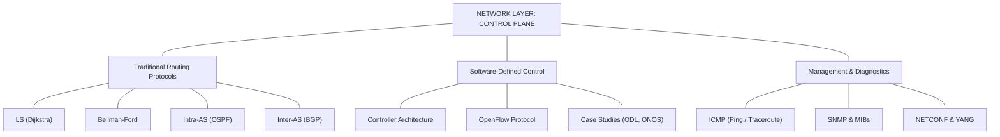