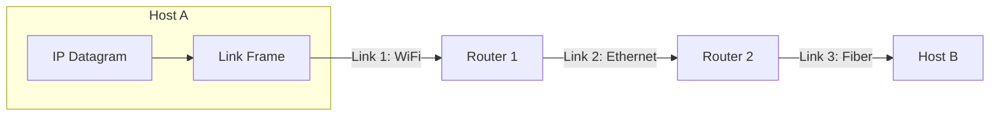
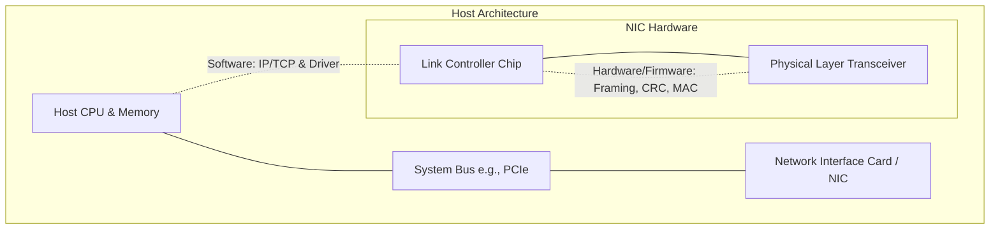
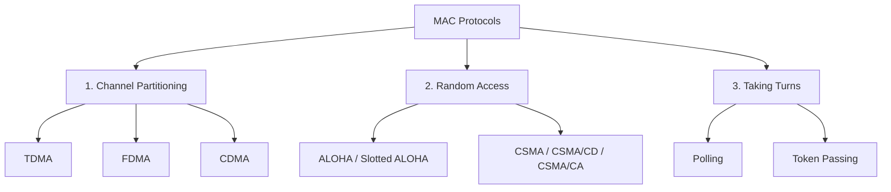
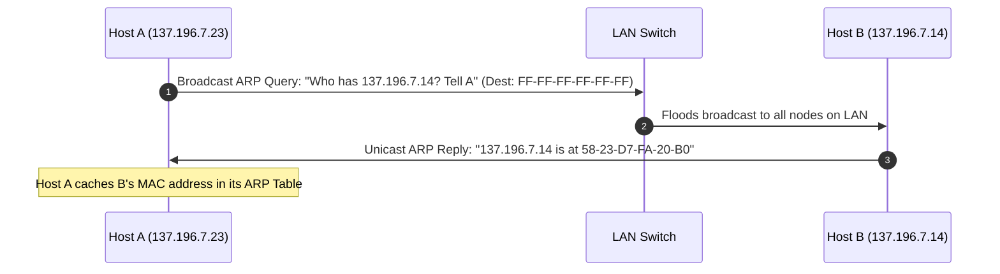

# Chapter 6: The Link Layer and LANs

> [!abstract] Overview & Scope
> This study guide covers **Chapter 6 (The Link Layer and LANs)** from *Computer Networking: A Top-Down Approach* by Kurose & Ross (8th Edition), strictly aligned with the course syllabus **up to Slide 59 (Ethernet Frame Structure & Characteristics)**.
> It integrates core concepts from the lecture slides with deep explanations, architectural nuances, and illustrative diagrams from the textbook.

---

## 1. Introduction to the Link Layer

### 1.1 Key Terminology
To understand the link layer, we must clarify the basic vocabulary:
* **Nodes**: Any device running a Layer 2 protocol (e.g., hosts, routers, switches, WiFi Access Points).
* **Links**: Communication channels that directly connect physically adjacent nodes along a path.
  * *Wired Links*: Coaxial, twisted-pair copper, fiber optics.
  * *Wireless Links*: 802.11 WiFi, cellular (4G/5G), satellite.
* **Frame (Layer-2 Packet)**: The protocol data unit (PDU) of the link layer, which encapsulates a Layer-3 datagram.

> [!info] Core Responsibility of the Link Layer
> The link layer has the responsibility of transferring a network-layer **datagram** from one node to a **physically adjacent node** over an individual communication link.



---

### 1.2 The Transportation Analogy
To intuitively grasp how the link layer interacts with the network layer, consider a tourist traveling from **IUT (Islamic University of Technology)** to **Cox's Bazar**:

| Analogy Element | Networking Equivalent | Description |
| :--- | :--- | :--- |
| **Tourist** | ==Datagram== | End-to-end entity being transported. |
| **Travel Segment** | ==Communication Link== | Direct connection between two adjacent locations. |
| **Transportation Mode** | ==Link-Layer Protocol== | E.g., Limo/Uber, Airplane, Train (WiFi, Ethernet, Frame Relay). |
| **Travel Agent** | ==Routing Algorithm== | Determines the global sequence of links/segments. |

> [!tip] Key Takeaway
> Just as a tourist uses different modes of transportation for different legs of a journey, an IP datagram may traverse **different link-layer protocols** (e.g., WiFi on the 1st hop, Ethernet on the 2nd hop, optical fiber on the backbone) along its end-to-end path.

---

### 1.3 Link Layer Services
The link layer offers a variety of services, which can differ significantly depending on the specific protocol:

1. **Framing & Link Access**:
   * Encapsulates the network-layer datagram into a frame by adding a **header** and a **trailer**.
   * Specifies rules for accessing the medium (Medium Access Control / MAC).
   * Uses **MAC addresses** in headers to identify source and destination nodes (distinct from IP addresses!).
2. **Reliable Delivery between Adjacent Nodes**:
   * Guarantees that each datagram is moved across the link without bit errors.
   * Achieved via acknowledgments (ACKs) and retransmissions.
   * **Where used?** High bit-error-rate links (e.g., wireless links) to correct errors locally rather than forcing expensive end-to-end transport layer (TCP) retransmissions.
   * **Where omitted?** Low bit-error-rate links (e.g., fiber, twisted-pair copper). Most wired link-layer protocols (like Ethernet) do **not** provide reliable delivery.
3. **Flow Control**:
   * Pacing between adjacent sending and receiving nodes so a fast sender doesn't overwhelm a slow receiver.
4. **Error Detection**:
   * Errors are caused by signal attenuation, thermal noise, and electromagnetic interference.
   * The receiver detects bit errors and either requests retransmission or drops the frame.
5. **Error Correction**:
   * The receiver not only detects bit errors but also identifies where they occurred and corrects them **without retransmission** (Forward Error Correction / FEC).
6. **Half-Duplex and Full-Duplex**:
   * **Half-Duplex**: Nodes at both ends can transmit, but **not simultaneously** (e.g., traditional coaxial Ethernet, walkie-talkies).
   * **Full-Duplex**: Nodes at both ends can transmit simultaneously (e.g., modern switched Ethernet).

---

### 1.4 Where is the Link Layer Implemented?

The link layer is implemented in **every single host, router, and switch**.



* **Hardware Component**: Implemented on a dedicated chip known as the **Network Interface Controller (NIC)** or network adapter (e.g., Intel Ethernet chip, Atheros WiFi chip). Handles framing, link access, CRC generation/checking, and physical signal transmission.
* **Software Component**: Runs on the host CPU. Handles higher-level driver functions, network layer interface, interrupt handling, and passing extracted datagrams up the protocol stack.

---

## 2. Error-Detection and -Correction Techniques

At the sending node, data $D$ (which includes the datagram and header fields) is augmented with **Error Detection and Correction (EDC)** bits.

$$ \text{Transmitted Frame} = [ D \mid EDC ] $$

At the receiver, received bits $D'$ and $EDC'$ are inspected. The receiver checks if all bits in $D'$ are valid based on $EDC'$.

> [!warning] Error Detection is NOT 100% Reliable!
> A protocol may occasionally miss errors if flipped bits happen to produce another valid checksum. However, a larger $EDC$ field yields a significantly smaller probability of undetected errors.

```
       Sender Side                              Receiver Side
  +------------------+                    +--------------------+
  | Datagram (D) | EDC|                   | Datagram (D')|EDC' |
  +--------+---------+                    +---------+----------+
           |                                        |
           v                                        v
     [ Bit-Error Prone Link ] ---------->  [ Check: Bit OK? ]
                                            /              \
                                          YES               NO
                                          /                  \
                                  Deliver Datagram     Detected Error!
```

---

### 2.1 Parity Checks

#### 1. Single-Bit Parity
Append a single parity bit to $d$ data bits.
* **Even Parity**: Set the parity bit such that the total number of $1$'s in the $d+1$ bits is **even**.
* **Odd Parity**: Set the parity bit such that the total number of $1$'s in the $d+1$ bits is **odd**.

> [!example] Single-Bit Even Parity
> Data: `0111000110101011` (contains nine `1`s).  
> Parity bit added: `1` $\rightarrow$ Total `1`s = 10 (even).

* **Detection Capability**: Detects any **odd number** of bit errors.
* **Limitation**: Fails to detect an **even number** of bit errors (e.g., 2 bit flips). Since errors often occur in **bursts**, single-bit parity has up to a 50% undetected error rate in bursty environments.

#### 2. Two-Dimensional Parity
Data bits are arranged in a matrix of $i$ rows and $j$ columns. A parity bit is calculated for each row and each column.

$$
\begin{matrix}
d_{1,1} & \dots & d_{1,j} & \mid & \text{Row 1 Parity} \\
d_{2,1} & \dots & d_{2,j} & \mid & \text{Row 2 Parity} \\
\vdots  & \ddots & \vdots  & \mid & \vdots \\
d_{i,1} & \dots & d_{i,j} & \mid & \text{Row } i \text{ Parity} \\
\hline
\text{Col 1 Parity} & \dots & \text{Col } j \text{ Parity} & \mid & \text{Corner Parity}
\end{matrix}
$$

* **Capabilities**:
  * **Detects AND Corrects** any single bit error (intersection of row parity error and column parity error pinpoint the exact bit location).
  * **Detects (but cannot correct)** any combination of two bit errors.
* **Forward Error Correction (FEC)**: The ability of a receiver to both detect and correct errors locally without asking for retransmission.

---

### 2.2 Checksumming Methods
Used primarily at the transport layer (e.g., TCP/UDP) because it is simple and fast to execute in **software**.

1. **Sender**:
   * Treats segment contents (header + payload) as a sequence of 16-bit integers.
   * Computes the 1's complement sum of these integers.
   * Places the calculated value into the checksum header field.
2. **Receiver**:
   * Computes the 1's complement sum of the received segment (including checksum).
   * If all bits are `1` ($1111111111111111_2$), no error is detected; otherwise, an error occurred.

> [!question] Why use Checksums at Transport Layer and CRC at Link Layer?
> * **Transport Layer**: Implemented in host software (OS CPU). Requires simple, fast operations like addition/checksums.
> * **Link Layer**: Implemented in dedicated hardware adapters (NICs). Hardware can perform complex polynomial binary arithmetic (CRC) at line speed.

---

### 2.3 Cyclic Redundancy Check (CRC)

CRC (or **polynomial code**) is a powerful error-detection mechanism widely used in modern networks (Ethernet, 802.11 WiFi).

#### Parameters:
* $D$: Data bits to be sent (binary number of $d$ bits).
* $G$: Pattern generator of $r+1$ bits agreed upon by sender and receiver (MSB must be `1`).
* $R$: $r$ CRC checksum bits to be computed by sender and appended to $D$.

The sender wants to choose $R$ of $r$ bits such that the combined pattern $\langle D, R \rangle$ of $d+r$ bits is **exactly divisible by $G$** using **modulo-2 arithmetic**.

$$ \langle D, R \rangle = D \cdot 2^r \text{ XOR } R $$

```
|<--------- d bits --------->|<--- r bits --->|
+----------------------------+----------------+
|          Data (D)          |    CRC (R)     |
+----------------------------+----------------+
```

#### Modulo-2 Arithmetic Rules:
* Addition and Subtraction are identical and equal to **bitwise XOR** ($\oplus$).
* No carries in addition, no borrows in subtraction.
  * $1 \oplus 1 = 0$, $0 \oplus 0 = 0$, $1 \oplus 0 = 1$, $0 \oplus 1 = 1$.

#### Formula for Calculating CRC ($R$):
$$ R = \text{remainder} \left[ \frac{D \cdot 2^r}{G} \right] $$

#### Receiver Operation:
* Divides received $\langle D', R' \rangle$ by $G$.
* **Non-zero remainder** $\rightarrow$ Error detected!
* **Zero remainder** $\rightarrow$ Data accepted.
* Detects all **burst errors** of length less than $r+1$ bits.

---

## 3. Multiple Access Links and Protocols

### 3.1 Taxonomy of MAC Links
There are two fundamental types of physical links:
1. **Point-to-Point Link**: Single sender at one end, single receiver at the other (e.g., PPP for dial-up, Ethernet switch to host).
2. **Broadcast Link (Shared Medium)**: Multiple sending and receiving nodes connected to the same shared channel.
   * Examples: Coaxial Ethernet, 802.11 WiFi, Satellite radio, Cable access (HFC).

```
   [ Point-to-Point ]                 [ Broadcast (Shared Medium) ]
  Host A <==========> Host B          Host A ----+---- Host B
                                                 |
                                               Host C
```

> [!danger] The Collision Problem
> If two or more nodes transmit simultaneously over a shared channel, their signals interfere, resulting in a **collision**. During a collision, all involved frames are corrupted, and channel bandwidth is wasted.

---

### 3.2 Desiderata of an Ideal MAC Protocol
For a broadcast channel of rate $R \text{ bps}$ shared among $M$ active nodes:
1. **High Throughput**: When only 1 node wants to send, it gets rate $R$.
2. **Fair Share**: When $M$ nodes want to send, each gets an average rate of $R/M$.
3. **Fully Decentralized**: No master node (no single point of failure), no global clock synchronization required.
4. **Simple**: Inexpensive to implement.

---

### 3.3 The Three Broad Classes of MAC Protocols



#### Class 1: Channel Partitioning Protocols
Divides channel into smaller sub-pieces (time, frequency, code) allocated exclusively to specific nodes.

* **TDMA (Time Division Multiple Access)**:
  * Access in recurring "rounds". Each node gets a fixed-length time slot (length = 1 frame transmission time).
  * **Drawback**: Unused slots go idle. If only 1 node has data, its rate is capped at $R/N$.
* **FDMA (Frequency Division Multiple Access)**:
  * Channel spectrum divided into fixed frequency bands assigned to each node.
  * **Drawback**: Unused frequency bands go idle.

#### Class 2: Random Access Protocols
Channel is **not divided**. Nodes transmit at full data rate $R$. Collisions are allowed and recovered from via random retransmission delays.

* **Slotted ALOHA**:
  * Time divided into equal slots of size $L/R$. Nodes transmit only at the beginning of a slot. Synchronized clocks required.
  * If collision occurs, node retransmits in each subsequent slot with probability $p$.
  * **Max Efficiency**: $\frac{1}{e} \approx 37\%$ (37% useful, 37% empty, 26% collisions).
* **Pure ALOHA (Unslotted)**:
  * No synchronization. When a frame arrives, transmit immediately!
  * Collision window is doubled ($[t_0 - 1, t_0 + 1]$).
  * **Max Efficiency**: $\frac{1}{2e} \approx 18\%$.

#### CSMA (Carrier Sense Multiple Access)
* **Listen Before Transmitting** ("Don't interrupt others!"):
  * If channel is sensed **idle**, transmit entire frame.
  * If channel is sensed **busy**, defer transmission.
* **Why do collisions still occur in CSMA?**
  * **Propagation Delay**: If Node A transmits at $t_0$, Node B at another end of the wire may sense the channel at $t_1 > t_0$ before A's signal arrives, sensing it idle and transmitting, leading to a collision!

```
Space-Time Diagram of CSMA Collision:

Node A                                                 Node B
  | (t0: Senses idle, starts transmitting)               |
  | \                                                    |
  |  \                                 (t1: Senses idle  |
  |   \                                 & transmits!)    |
  |    \                                     /           |
  |     \                                   /            |
  |======X=================================X=============|  <-- COLLISION!
```

#### CSMA/CD (CSMA with Collision Detection)
* **Listen While Transmitting** ("Stop talking if someone interrupts!"):
  * Collisions are detected within a short time.
  * Transmissions are **aborted immediately** upon collision detection, reducing wasted channel time.
  * Easy in wired LANs (signal energy measurement), difficult in wireless LANs.

> [!important] Binary Exponential Backoff Algorithm (Ethernet)
> After the $m$-th collision for a frame:
> 1. Choose integer $K$ at random from the set $\{0, 1, 2, \dots, 2^m - 1\}$ (capped at $m=10$, max $K=1023$).
> 2. Wait $K \cdot 512$ bit times, then return to carrier sensing.
> 3. More consecutive collisions $\rightarrow$ Exponentially larger backoff interval!

* **CSMA/CD Efficiency Formula**:
  $$ \text{Efficiency} = \frac{1}{1 + 5 \cdot \frac{t_{prop}}{t_{trans}}} $$
  * As $t_{prop} \to 0$ or $t_{trans} \to \infty$, efficiency approaches $1$ (100%).

#### Class 3: "Taking Turns" MAC Protocols
Combines high efficiency at low load (random access) with fair/high throughput at high load (channel partitioning).

1. **Polling**:
   * A **central controller / master node** invites client nodes to transmit sequentially.
   * *Drawbacks*: Polling overhead delay, latency, single point of failure (master node). E.g., Bluetooth.
2. **Token Passing**:
   * A special control frame called a **token** is passed sequentially from node to node.
   * Node holding the token can transmit up to a max amount of data before passing the token.
   * *Drawbacks*: Token overhead, latency, single point of failure (lost token). E.g., FDDI, Token Ring.

---

### 3.4 Hybrid Case Study: DOCSIS (Cable Access Networks)

DOCSIS (Data Over Cable Service Interface Specification) combines **FDM**, **TDM**, and **Random Access**:

* **FDM**: Divides cable spectrum into separate downstream (CMTS $\to$ modem) and upstream (modem $\to$ CMTS) channels.
* **TDM (Upstream)**: Upstream channel is divided into time intervals containing **minislots**.
* **Random Access**: Cable modems send **minislot-request frames** during dedicated request slots using random access (CSMA/CD-like with binary backoff). The CMTS then grants explicit minislots via downstream **MAP frames**.

---

## 4. Link-Layer Addressing and ARP

### 4.1 MAC Addresses vs. IP Addresses

| Feature | MAC Address | IP Address |
| :--- | :--- | :--- |
| **Layer** | Link Layer (Layer 2) | Network Layer (Layer 3) |
| **Length** | 48 bits (6 bytes) | 32 bits (IPv4) / 128 bits (IPv6) |
| **Format** | Hexadecimal (`1A-2F-BB-76-09-AD`) | Dotted Decimal (`137.196.7.23`) |
| **Structure** | **Flat** (Portable across subnets) | **Hierarchical** (Not portable, bound to subnet) |
| **Analogy** | Social Security Number (SSN) | Postal Address |
| **Scope** | Local LAN segment communication | End-to-end global routing |

* **Allocation**: IEEE assigns 24-bit manufacturer IDs (OUI); manufacturers assign the remaining 24 bits.
* **MAC Broadcast Address**: `FF-FF-FF-FF-FF-FF` (48 ones in binary).

---

### 4.2 ARP: Address Resolution Protocol

> [!question] The Problem
> How does Node A determine Node B's 48-bit **MAC address** when it only knows Node B's 32-bit **IP address**?

#### The Solution: ARP Protocol
ARP dynamically translates IP addresses to MAC addresses for nodes on the **same subnet**.

#### The ARP Table:
Every IP node (Host or Router) maintains an **ARP Cache** in RAM:
$$\langle \text{IP Address} \,\, \vert \,\, \text{MAC Address} \,\, \vert \,\, \text{TTL} \rangle$$
* **TTL (Time-To-Live)**: Expiration timer after which an entry is purged (typically 20 minutes).

#### ARP Workflow (Same Subnet):



> [!note] Plug-and-Play Architecture
> ARP is self-learning and automatic. No manual configuration by a network administrator is needed.

---

### 4.3 Routing a Datagram to Another Subnet (Multi-Hop Walkthrough)

Suppose **Host A** (`111.111.111.111`) wants to send a datagram to **Host B** (`222.222.222.222`) across **Router R**.

```
[ Subnet 1: 111.111.111.0/24 ]                  [ Subnet 2: 222.222.222.0/24 ]
Host A                                 Router R                                Host B
IP: 111.111.111.111          IF1: 111.111.111.110    IF2: 222.222.222.220          IP: 222.222.222.222
MAC: 74-29-9C-E8-FF-55       MAC: E6-E9-00-17-BB-4B  MAC: 1A-23-F9-CD-06-9B        MAC: 49-BD-D2-C7-56-2A
```

#### Step-by-Step Framing Process:

1. **At Host A (Creation)**:
   * IP Datagram Header: $\text{Source IP} = 111.111.111.111$, $\text{Dest IP} = 222.222.222.222$.
   * A knows B is on a different subnet, so it must send the frame to its **default gateway (Router R)**.
   * A uses ARP to get Router R's MAC address (`E6-E9-00-17-BB-4B`).
   * Encapsulating Frame:
     $$\text{Source MAC} = \text{74-29-9C-E8-FF-55 (A)}, \quad \text{Dest MAC} = \text{E6-E9-00-17-BB-4B (R's IF1)}$$

2. **At Router R (Forwarding & Re-framing)**:
   * Router R receives frame, matches MAC address, extracts IP datagram.
   * R consults its IP routing table, determines outgoing interface is IF2 (`222.222.222.220`).
   * R uses ARP on Subnet 2 to obtain Host B's MAC address (`49-BD-D2-C7-56-2A`).
   * Router R creates a **NEW link-layer frame**:
     * **IP Datagram remains UNCHANGED** ($\text{Src IP} = 111.111.111.111, \text{Dest IP} = 222.222.222.222$).
     * **New Frame Addresses**:
       $$\text{Source MAC} = \text{1A-23-F9-CD-06-9B (R's IF2)}, \quad \text{Dest MAC} = \text{49-BD-D2-C7-56-2A (B)}$$

3. **At Host B (Receipt)**:
   * Host B receives frame, verifies MAC destination, strips frame header, and passes IP datagram up to the Network Layer.

> [!important] Crucial Rule for Exams
> Across multiple router hops:
> * **IP Source & Destination Addresses NEVER change** (end-to-end).
> * **MAC Source & Destination Addresses CHANGE at EVERY HOP** (hop-by-hop).

---

## 5. Ethernet

### 5.1 Overview & Physical Topologies
Ethernet is the dominant wired LAN technology due to its simplicity, low cost, and ability to keep pace with speed demands (10 Mbps to 400 Gbps).

#### Topologies:
1. **Bus Topology (Mid 1990s)**:
   * All nodes connected to a common coaxial cable bus.
   * **Single Broadcast & Collision Domain**: All transmissions collide if simultaneous.
2. **Switched Topology (Prevails Today)**:
   * Active Layer-2 **Switch** in the center connected via point-to-point twisted-pair/fiber spokes.
   * **Separate Collision Domains**: Each link/spoke is its own collision domain; zero collisions!

---

### 5.2 Ethernet Frame Structure

The sending interface encapsulates an IP datagram inside the standard IEEE 802.3 Ethernet Frame:

```
+----------+--------------+--------------+------+---------------+-----+
| Preamble | Dest Address | Source Address| Type | Data/Payload  | CRC |
| 8 bytes  |   6 bytes    |   6 bytes    |2byte | 46-1500 bytes |4byte|
+----------+--------------+--------------+------+---------------+-----+
```

#### Field Breakdown:

1. **Preamble (8 bytes)**:
   * First 7 bytes = `10101010`, 8th byte = `10101011`.
   * **Purpose**: Used to synchronize receiver and sender clock rates ("wake up" receiving adapters).
2. **Destination MAC Address (6 bytes)**:
   * Target NIC address. If destination matches receiving NIC's address or is broadcast (`FF-FF-FF-FF-FF-FF`), accept frame; otherwise, discard silently.
3. **Source MAC Address (6 bytes)**:
   * NIC address of sender.
4. **Type (2 bytes)**:
   * Indicates the higher-layer protocol (e.g., `0800` for IPv4, `0806` for ARP). Used for **demultiplexing** at the receiver.
5. **Data / Payload (46 to 1500 bytes)**:
   * Carries the IP datagram.
   * **MTU (Maximum Transmission Unit)** = 1500 bytes.
   * **Minimum size** = 46 bytes. If the datagram is less than 46 bytes, it must be **stuffed/padded** up to 46 bytes.
6. **CRC (4 bytes)**:
   * Cyclic Redundancy Check performed at receiver. If error detected, frame is dropped.

---

### 5.3 Key Characteristics of Ethernet

* **Connectionless**: No prior handshaking between sending and receiving NICs before transmitting frames.
* **Unreliable**: Receiving NIC does **not** send Acknowledgments (ACKs) or Negative ACKs (NAKs).
  * Dropped frames are only recovered if the application uses a higher-layer reliable transport protocol (like TCP). Otherwise, data is lost!
* **MAC Protocol**: Uses **unslotted CSMA/CD with binary exponential backoff**.

---

> [!success] Syllabus Cut-off Reached
> This concludes the notes up to **Slide 59** (Ethernet frame structure & characteristics).

*Refer to the companion file `Chapter 6 - Link Layer Math & Practice Problems.md` for mathematical derivations, CRC problems, and ALOHA efficiency proofs.*
