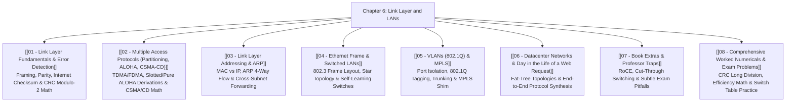

# Chapter 6: Link Layer and LANs

> [!abstract] Executive Summary & Roadmap
> The **Link Layer** manages the physical transfer of datagrams across a single communication link between adjacent network nodes. 
> 
> This vault covers error detection and correction mathematics (**CRC-32 Modulo-2 polynomial division**), Multiple Access Control (**ALOHA derivations, CSMA/CD, Binary Exponential Backoff**), **MAC addressing and ARP**, switched Ethernet networks with **self-learning filtering**, **VLANs (802.1Q)**, MPLS, Datacenter networks, and the complete end-to-end synthesis: **"A Day in the Life of a Web Request."**

---

## 🗺️ Master Visual Navigation Map

---

## 📑 Detailed Note Registry

| # | Note Document | Core Question Answered | High-Yield Topics |
| :---: | :--- | :--- | :--- |
| **01** | [[01 - Link Layer Fundamentals & Error Detection]] | *How do nodes mathematically verify that frames arrived uncorrupted?* | Link Layer Services, 2D Parity, CRC Polynomial Division ($D \cdot 2^r / G$) |
| **02** | [[02 - Multiple Access Protocols (Partitioning, ALOHA, CSMA-CD)]] | *How do multiple nodes share a single broadcast wire without chaos?* | TDMA/FDMA/CDMA, Slotted ALOHA ($1/e \approx 36.8\%$), Pure ALOHA ($1/(2e) \approx 18.4\%$), CSMA/CD $L_{min}$ derivation |
| **03** | [[03 - Link Layer Addressing & ARP]] | *How is a layer 3 IP address mapped to physical layer 2 hardware?* | 48-bit MAC Addresses, ARP Broadcast Query/Unicast Reply, Cross-Subnet Rewriting |
| **04** | [[04 - Ethernet Frame & Switched LANs]] | *How do Ethernet switches learn network topology without configuration?* | 802.3 Ethernet Header (Preamble, SFD, FCS), Self-Learning Algorithm, Filtering/Forwarding |
| **05** | [[05 - VLANs (802.1Q) & MPLS]] | *How do network engineers isolate broadcast domains and speed up routing?* | Port-based VLANs, 802.1Q 4-byte Tag Format, VLAN Trunking, MPLS Label Switching |
| **06** | [[06 - Datacenter Networks & Day in the Life of a Web Request]] | *How do all 5 layers work together when you open a browser?* | ToR Switches, Clos/Fat-Tree, DHCP $\to$ ARP $\to$ DNS $\to$ TCP Handshake $\to$ HTTP GET |
| **07** | [[07 - Book Extras & Professor Traps]] | *What edge cases appear on high-difficulty link layer questions?* | Store-and-Forward vs Cut-Through switching, CRC burst detection bounds |
| **08** | [[08 - Comprehensive Worked Numericals & Exam Problems]] | *How do you solve CRC and MAC efficiency problems step-by-step?* | Full CRC polynomial divisions, CSMA/CD backoff slot wait calculations |

---
#### Navigation
Next → [[01 - Link Layer Fundamentals & Error Detection]]
