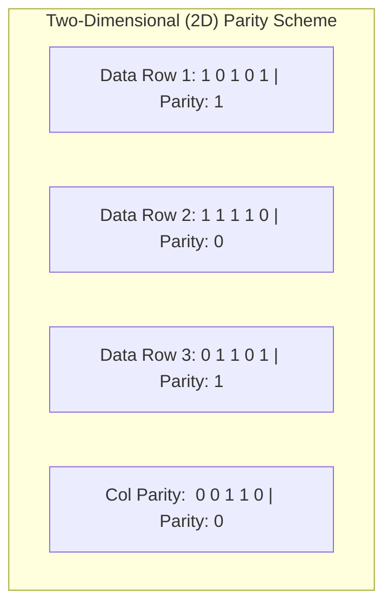

# 01 - Link Layer Fundamentals & Error Detection

> [!abstract] Key Takeaway
> The Link Layer transfers datagrams between adjacent nodes across a physical link. 
> Error detection ranges from simple **1D/2D Parity Checks** to robust **Cyclic Redundancy Checks (CRC)** based on **Modulo-2 polynomial arithmetic**, capable of detecting burst errors up to $r$ bits in hardware line rates.

---

## 1. Link Layer Services & Implementation

```
+-------------------------------------------------------------------------+
| Host Architecture:                                                      |
|   Application Layer (Browser / Web Server)                             |
|   Transport Layer (TCP / UDP)                      [ Software (OS) ]   |
|   Network Layer (IP Routing / Forwarding)                               |
+-------------------------------------------------------------------------+
|   Link Layer (NIC: Controller, PHY chip, DMA)      [ Hardware & ASIC ]  |
|   Physical Layer (Transceiver, RJ-45 / Optical)                         |
+-------------------------------------------------------------------------+
```

### Core Link-Layer Services
1. **Framing:** Encapsulates network-layer datagram into a link-layer frame with Header and Trailer (FCS).
2. **Link Access & MAC:** Coordinates broadcast media access when links are shared.
3. **Reliable Delivery:** Implements local ACKs/retransmissions across high-error-rate links (e.g., 802.11 Wi-Fi), but **omitted on fiber/copper** (where error rates are negligible) to reduce latency.
4. **Error Detection & Correction:** Checks for electromagnetic/thermal noise bit flips.

---

## 2. Parity Checking Techniques



- **Single-Bit Parity (1D):** Appends 1 bit so total number of 1s is even (even parity) or odd (odd parity). Detects **odd numbers of bit errors** (e.g., 1 bit flip), but fails completely on 2 bit flips.
- **Two-Dimensional (2D) Parity:**
  - **Single-Bit Errors:** Can **detect AND correct** (the intersecting row and column parity errors pinpoint the exact flipped bit).
  - **Two-Bit Errors:** Can **detect** the presence of error without being able to correct it.

---

## 3. Cyclic Redundancy Check (CRC) / Polynomial Codes

CRC is the industry-standard error detection technique used in Ethernet (CRC-32), Wi-Fi, and HDLC.

### Mathematical Formulation
- Let $D$ be the $d$-bit data payload.
- Let $G$ be an $(r+1)$-bit **Generator Polynomial** agreed upon in advance.
- The sender appends $r$ bits of CRC checksum ($R$) to $D$ such that the resulting $(d+r)$-bit sequence is **exactly divisible by $G$ using Modulo-2 arithmetic**:

$$\frac{D \cdot 2^r \oplus R}{G} = Q \text{ with Remainder } 0 \implies R = \text{remainder}\left( \frac{D \cdot 2^r}{G} \right)$$

> [!tip] Modulo-2 Arithmetic Rules
> - **Addition and Subtraction are IDENTICAL to bitwise XOR ($\oplus$)**.
> - There are **NO carries** and **NO borrows**.
> - $0 \oplus 0 = 0$, $1 \oplus 1 = 0$, $1 \oplus 0 = 1$, $0 \oplus 1 = 1$.

---

## 4. Step-by-Step Worked Numerical: CRC Computation

> [!example]- Complete Worked Problem: CRC Sender & Receiver Division
> **Problem:** 
> - Data payload: $D = 101110$ ($6\text{ bits}$, $d=6$).
> - Generator polynomial: $G = 1001$ ($r+1 = 4\text{ bits} \implies r = 3\text{ bits}$).
> 
> **Step 1: Shift Data by $r=3$ bits ($D \cdot 2^3$):**
> $$D \cdot 2^3 = 101110000$$
> 
> **Step 2: Modulo-2 Long Division ($D \cdot 2^r / G$):**
> ```
>             101011  (Quotient)
>        -------------
> 1001  ) 101110000
>         1001
>         ----
>          01010
>           1001
>           ----
>           001100
>             1001
>             ----
>             01010
>              1001
>              ----
>              0011  (Remainder R = 011)
> ```
> 
> **Step 3: Construct Transmitted Frame:**
> $$\text{Transmitted Frame} = D \cdot 2^r \oplus R = 101110000 \oplus 011 = \mathbf{101110011}$$
> 
> **Step 4: Receiver Verification:**
> The receiver divides $101110011$ by $G = 1001$:
> ```
>             101011
>        -------------
> 1001  ) 101110011
>         1001
>         ----
>          01010
>           1001
>           ----
>           001101
>             1001
>             ----
>             01001
>              1001
>              ----
>              0000  (Remainder = 0 -> No errors!)
> ```

---

## 5. "Why" Questions & Exam Traps

> [!question] Why does the Internet use simple 16-bit Checksums in Transport/Network layers (TCP/IP) but complex CRC-32 in the Link layer?
> **Answer:**
> - **Transport/Network Layer:** Implemented in **software (CPU)** on host operating systems. Simple 16-bit integer addition is extremely fast to compute in software.
> - **Link Layer:** Implemented in **dedicated hardware (NIC ASICs)**. Hardware shift-registers and XOR gates compute CRC-32 at 100+ Gbps line rate with near-zero latency, providing far superior error detection guarantees (detecting all bursts $\le 32$ bits).

---
#### Navigation
← Previous: [[00 - Index]] | Next: [[02 - Multiple Access Protocols (Partitioning, ALOHA, CSMA-CD)]] →
