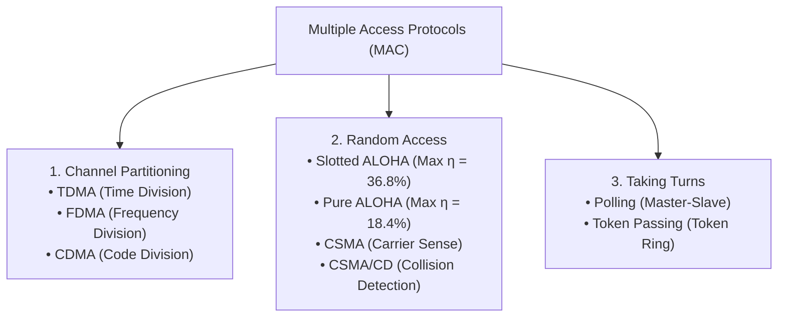
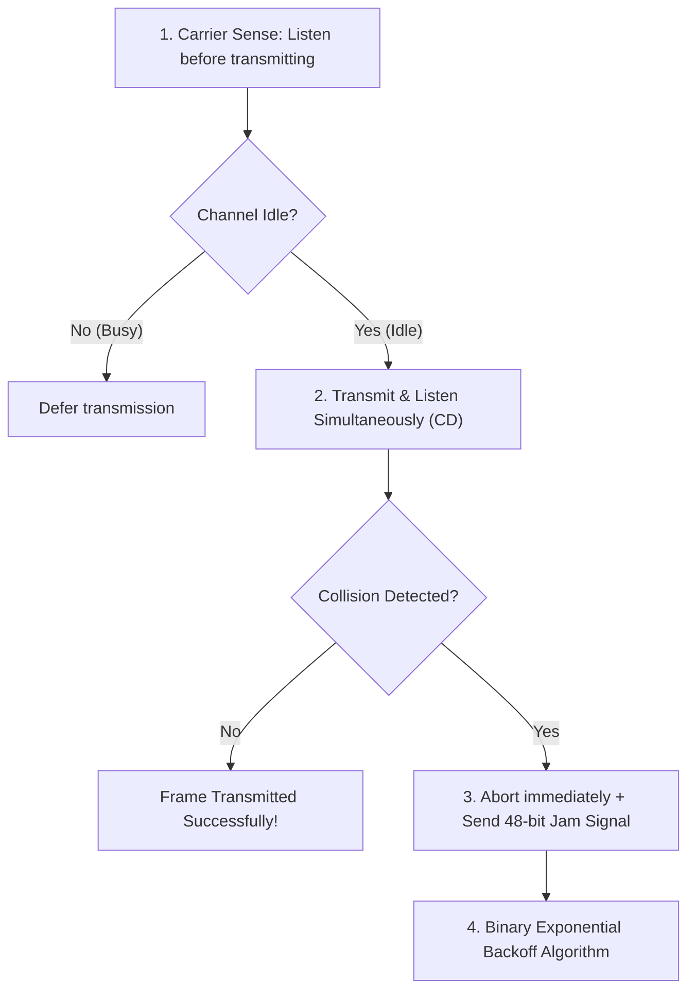

# 02 - Multiple Access Protocols (Partitioning, ALOHA, CSMA-CD)

> [!abstract] Key Takeaway
> When multiple nodes share a single broadcast channel, **Multiple Access Protocols** coordinate transmissions to prevent collisions.
> - **Channel Partitioning (TDMA/FDMA):** Collision-free but limits throughput under low load ($1/N$).
> - **Random Access (ALOHA, CSMA/CD):** Nodes transmit at full line rate $R$; uses carrier sensing and **Binary Exponential Backoff** to recover from collisions.

---

## 1. Taxonomy of MAC Protocols



---

## 2. Mathematical Derivations: ALOHA Efficiency

### A. Slotted ALOHA Derivation
- Time is partitioned into discrete slots of size $L/R$.
- $N$ active nodes, each attempting transmission with probability $p$ in each slot.

1. **Probability that a given node succeeds in a slot:**
   $$P(\text{Single Node Success}) = p (1 - p)^{N-1}$$
2. **Probability that ANY of the $N$ nodes succeeds (Efficiency $S$):**
   $$S(p) = N p (1 - p)^{N-1}$$
3. **Maximizing Efficiency:** Differentiating $S(p)$ with respect to $p$ and setting to $0$ yields optimal $p^* = \frac{1}{N}$.
4. **Asymptotic Limit as $N \to \infty$:**
   $$S_{max} = \lim_{N \to \infty} N \left(\frac{1}{N}\right) \left(1 - \frac{1}{N}\right)^{N-1} = \lim_{N \to \infty} \left(1 - \frac{1}{N}\right)^{N-1} = \frac{1}{e} \approx \mathbf{0.368 \ (36.8\%)}$$

---

### B. Pure (Unslotted) ALOHA Derivation
- Continuous time; nodes transmit immediately without waiting for slot boundaries.
- **Vulnerable Period:** A frame transmitted at time $t_0$ collides if any other node transmits in the interval $[t_0 - 1, t_0 + 1]$ (**Duration = $2 \times \text{Frame Time}$**).

```
Other node transmits here: [ Collision! ]
                           |<-- 1 Frame -->|<-- 1 Frame -->|
Frame to be sent:                 |========== Target Frame ==========|
Time:                           t0 - 1            t0              t0 + 1
```

1. **Probability of no other transmissions during $[t_0 - 1, t_0]$:** $(1 - p)^{N-1}$
2. **Probability of no other transmissions during $[t_0, t_0 + 1]$:** $(1 - p)^{N-1}$
3. **Probability of Successful Transmission:**
   $$S(p) = N p (1 - p)^{2(N-1)}$$
4. **Asymptotic Limit as $N \to \infty$ ($p^* = \frac{1}{2N}$):**
   $$S_{max} = \lim_{N \to \infty} N \left(\frac{1}{2N}\right) \left(1 - \frac{1}{2N}\right)^{2(N-1)} = \frac{1}{2e} \approx \mathbf{0.184 \ (18.4\%)}$$

---

## 3. CSMA and CSMA/CD (Carrier Sense Multiple Access / Collision Detection)



### Why collisions still occur in CSMA
Even with carrier sensing, collisions happen because of **End-to-End Propagation Delay ($d_{prop}$)**:
- Node A transmits at $t = 0$.
- Node B senses the wire at $t = 1\ \mu\text{s}$ before Node A's electrical signal physically reaches B. The wire appears idle, so B transmits $\implies$ **COLLISION!**

---

## 4. CSMA/CD Minimum Frame Size & Backoff Math

### Mathematical Derivation of Minimum Frame Size ($L_{min}$)
To detect a collision before it finishes transmitting, a node's transmission time ($t_{trans}$) must be at least **twice the maximum propagation delay ($2 \cdot t_{prop}$)**:

$$t_{trans} \ge 2 \cdot t_{prop} \implies \frac{L_{min}}{R} \ge \frac{2 \cdot d_{max}}{v} \implies L_{min} \ge \frac{2 \cdot d_{max} \cdot R}{v}$$

> [!example]- Classic Ethernet Calculation ($L_{min} = 64\text{ Bytes}$)
> - For standard 10 Mbps Ethernet ($R = 10\text{ Mbps}$, max round-trip delay $2 \cdot t_{prop} = 51.2\ \mu\text{s}$):
> $$L_{min} = 51.2 \times 10^{-6}\text{ s} \times 10 \times 10^6\text{ bps} = 512\text{ bits} = \mathbf{64\text{ Bytes}}$$
> *(Any Ethernet frame smaller than 64 bytes is padded with dummy bytes!)*

### Binary Exponential Backoff Algorithm
After experiencing the $m$-th consecutive collision for a frame:
1. The adapter chooses an integer $K$ uniformly at random from the set:
   $$K \in \{0, 1, 2, \dots, 2^{\min(m, 10)} - 1\}$$
2. The adapter waits for $K \times 512\text{ bit times}$ ($K \times 51.2\ \mu\text{s}$ on 10 Mbps Ethernet) before re-sensing the carrier.
3. If $m = 16$ collisions occur, the adapter aborts and reports an error to the network layer.

---

## 5. MAC Protocol Summary Comparison Table

| Protocol Class | Mechanism | Maximum Efficiency ($\eta$) | Key Strength | Key Weakness |
| :--- | :--- | :---: | :--- | :--- |
| **TDMA** | Fixed time slot allocation per node | $1/N$ at low load; $100\%$ at max load | Zero collisions; fair | Inefficient for bursty traffic ($N-1$ slots wasted) |
| **Pure ALOHA** | Transmit immediately without sensing | **$18.4\%$** ($1 / 2e$) | Zero synchronization; simplest | Terrible channel efficiency |
| **Slotted ALOHA** | Synchronized time slots | **$36.8\%$** ($1 / e$) | Simple; decentralized | Requires clock synchronization across all nodes |
| **CSMA/CD** | Sense before TX + Detect during TX | $\approx \frac{1}{1 + 5 d_{prop}/d_{trans}}$ ($\approx 85-95\%$) | High efficiency; aborts early on collision | Inapplicable to wireless (cannot transmit & detect collisions simultaneously) |

---
#### Navigation
← Previous: [[01 - Link Layer Fundamentals & Error Detection]] | Next: [[03 - Link Layer Addressing & ARP]] →
