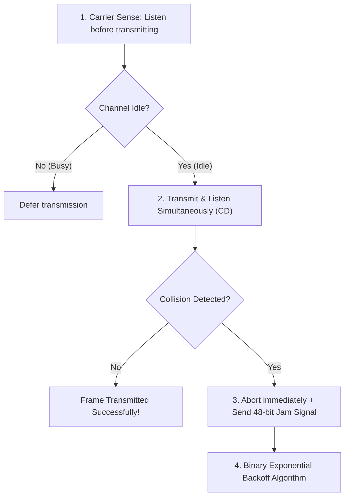

# 02 - Multiple Access Protocols (Partitioning, ALOHA, CSMA-CD)

> [!abstract] Key Takeaway
> Multiple Access Protocols coordinate transmissions when nodes share a broadcast channel:
> - **Channel Partitioning (TDMA/FDMA):** Collision-free, but limits bandwidth under low load ($1/N$).
> - **Random Access (ALOHA, CSMA/CD):** Transmit at full line rate $R$; recover from collisions via carrier sensing and **Binary Exponential Backoff**.

---

## 1. Mathematical Derivations: ALOHA Efficiency

### A. Slotted ALOHA Derivation
- Time sliced into discrete slots of size $L/R$. $N$ active nodes transmit with probability $p$.
1. **Probability of Single Node Success:** $p (1 - p)^{N-1}$.
2. **Efficiency (Any Node Success):** $S(p) = N p (1 - p)^{N-1}$.
3. **Optimal Probability:** $p^* = \frac{1}{N}$.
4. **Asymptotic Limit ($N \to \infty$):**
   $$S_{max} = \lim_{N \to \infty} N \left(\frac{1}{N}\right) \left(1 - \frac{1}{N}\right)^{N-1} = \frac{1}{e} \approx \mathbf{0.368 \ (36.8\%)}$$

---

### B. Pure (Unslotted) ALOHA Derivation
- Continuous time; **Vulnerable Period = $2 \times \text{Frame Time}$** ($[t_0 - 1, t_0 + 1]$).
1. **Probability of Success:** $S(p) = N p (1 - p)^{2(N-1)}$.
2. **Optimal Probability:** $p^* = \frac{1}{2N}$.
3. **Asymptotic Limit ($N \to \infty$):**
   $$S_{max} = \lim_{N \to \infty} N \left(\frac{1}{2N}\right) \left(1 - \frac{1}{2N}\right)^{2(N-1)} = \frac{1}{2e} \approx \mathbf{0.184 \ (18.4\%)}$$

---

## 2. CSMA and CSMA/CD Mechanics

### CSMA/CD Minimum Frame Size & Backoff Math
$$t_{trans} \ge 2 \cdot t_{prop} \implies \frac{L_{min}}{R} \ge \frac{2 \cdot d_{max}}{v} \implies L_{min} \ge \frac{2 \cdot d_{max} \cdot R}{v}$$

> [!example]- Classic Ethernet Calculation ($L_{min} = 64\text{ Bytes}$)
> For 10 Mbps Ethernet ($R = 10\text{ Mbps}$, max round-trip delay $2 \cdot t_{prop} = 51.2\ \mu\text{s}$):
> $$L_{min} = 51.2 \times 10^{-6}\text{ s} \times 10 \times 10^6\text{ bps} = 512\text{ bits} = \mathbf{64\text{ Bytes}}$$

### Binary Exponential Backoff Algorithm
After $m$-th consecutive collision for a frame:
1. Choose integer $K$ uniformly at random from $K \in \{0, 1, 2, \dots, 2^{\min(m, 10)} - 1\}$.
2. Wait $K \times 512\text{ bit times}$ ($K \times 51.2\ \mu\text{s}$ on 10 Mbps Ethernet) before re-sensing carrier.
3. If $m = 16$ collisions occur, abort and report error.

---
#### Navigation
← Previous: [[01 - Link Layer Fundamentals & Error Detection]] | Next: [[03 - Link Layer Addressing & ARP]] →
