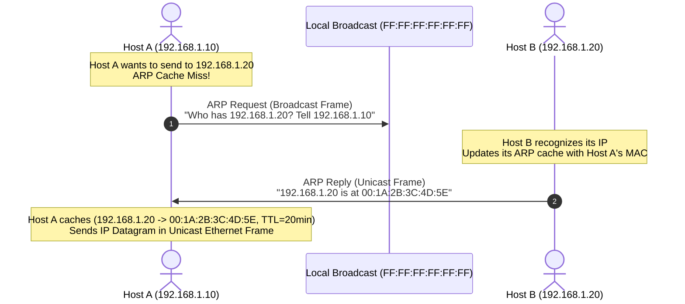

# 03 - Link Layer Addressing & ARP

> [!abstract] Key Takeaway
> - **MAC Address (48 bits):** Flat, permanent hardware address burned into the NIC (like a National ID).
> - **IP Address (32 bits):** Hierarchical, location-dependent logical address (like a postal address).
> - **ARP (Address Resolution Protocol - RFC 826):** Resolves an IP address to a MAC address within the **same subnet**.
> - **Crucial Rule:** In cross-subnet routing, **IP addresses remain constant**, while **MAC addresses are rewritten at every router hop**.

---

## 1. MAC Address Architecture

```
 48-bit MAC Address (Hexadecimal): 1A-2F-BB-76-09-AD
 |<--------- 24 bits --------->|<--------- 24 bits --------->|
 |   OUI (Vendor / Manufacturer)|   NIC Unique Serial Number  |
```
- **Broadcast MAC Address:** `FF-FF-FF-FF-FF-FF` (Processed by all adapters on the LAN).

---

## 2. ARP Protocol Mechanics (Same Subnet)



---

## 3. Cross-Subnet Packet Forwarding

```
Hop 1 (Host A to Default Gateway Router on Subnet 1):
+-----------------------------+-----------------------------+--------------------+
| Src MAC: AA-AA-AA-AA-AA-AA  | Src IP: 111.111.111.111     |                    |
| Dst MAC: 11-11-11-11-11-11  | Dst IP: 222.222.222.222     | Payload (TCP/Data) |
+-----------------------------+-----------------------------+--------------------+

Hop 2 (Router to Destination Host B on Subnet 2):
+-----------------------------+-----------------------------+--------------------+
| Src MAC: 22-22-22-22-22-22  | Src IP: 111.111.111.111     |                    |
| Dst MAC: BB-BB-BB-BB-BB-BB  | Dst IP: 222.222.222.222     | Payload (TCP/Data) |
+-----------------------------+-----------------------------+--------------------+
|<-- REWRITTEN BY ROUTER! --->|<--- UNCHANGED END-TO-END -->|
```

> [!warning] Exam Rule
> When sending to a host on a **different subnet**, Host A puts the MAC address of its **First-Hop Router (Default Gateway)** in the destination MAC field, NOT Host B's MAC.

---
#### Navigation
← Previous: [[02 - Multiple Access Protocols (Partitioning, ALOHA, CSMA-CD)]] | Next: [[04 - Ethernet Frame & Switched LANs]] →
