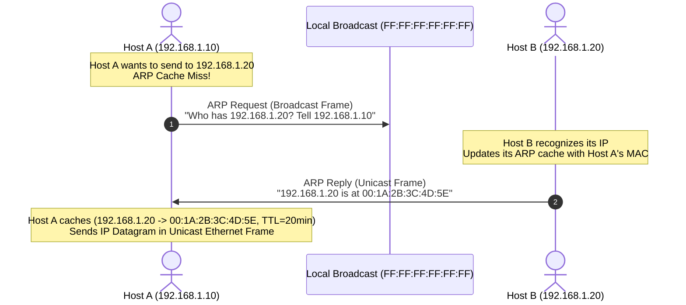
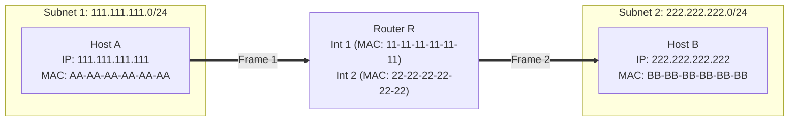

# 03 - Link Layer Addressing & ARP

> [!abstract] Key Takeaway
> - **MAC Address (48 bits):** Flat, permanent hardware address burned into the NIC ROM (like a National ID).
> - **IP Address (32 bits):** Hierarchical, location-dependent logical address (like a postal address).
> - **ARP (Address Resolution Protocol - RFC 826):** Resolves an IP address to a MAC address within the **same subnet**.
> - **Crucial Rule:** In end-to-end routing across subnets, **IP addresses remain constant**, while **MAC addresses are rewritten at every router hop**.

---

## 1. MAC Address Architecture

```
 48-bit MAC Address (Hexadecimal): 1A-2F-BB-76-09-AD
 |<--------- 24 bits --------->|<--------- 24 bits --------->|
 |   OUI (Vendor / Manufacturer)|   NIC Unique Serial Number  |
```

- **Broadcast MAC Address:** `FF-FF-FF-FF-FF-FF` (All 48 bits set to 1; processed by all adapters on the LAN).

---

## 2. ARP Protocol Mechanics (Same Subnet)



---

## 3. Cross-Subnet Packet Forwarding (Step-by-Step)



### The Header Transformation Sequence

```
Hop 1 (Host A to Router R on Subnet 1):
+-----------------------------+-----------------------------+--------------------+
| Src MAC: AA-AA-AA-AA-AA-AA  | Src IP: 111.111.111.111     |                    |
| Dst MAC: 11-11-11-11-11-11  | Dst IP: 222.222.222.222     | Payload (TCP/Data) |
+-----------------------------+-----------------------------+--------------------+
|<----- Layer 2 Header ------>|<----- Layer 3 Header ------>|

Hop 2 (Router R to Host B on Subnet 2):
+-----------------------------+-----------------------------+--------------------+
| Src MAC: 22-22-22-22-22-22  | Src IP: 111.111.111.111     |                    |
| Dst MAC: BB-BB-BB-BB-BB-BB  | Dst IP: 222.222.222.222     | Payload (TCP/Data) |
+-----------------------------+-----------------------------+--------------------+
|<-- REWRITTEN BY ROUTER! --->|<--- UNCHANGED END-TO-END -->|
```

> [!warning] Critical Exam Rule
> - When sending to a host on a **different subnet**, Host A does **NOT** put Host B's MAC address in the frame header. 
> - Host A uses ARP to query the MAC address of its **First-Hop Router (Default Gateway)** interface (`11-11-11-11-11-11`).

---

## 4. "Why" Questions & Exam Traps

> [!question] Why does ARP run directly over the Link Layer (Ethernet Type `0x0806`) rather than using IP?
> **Answer:**
> ARP is responsible for establishing the link-layer binding needed to deliver IP datagrams in the first place. If ARP required IP, it would create a circular dependency (you would need an IP packet to resolve the MAC address needed to send the IP packet).

> [!warning] Exam Trap: ARP Spoofing / Cache Poisoning
> Because standard ARP is stateless and unauthenticated, an attacker on the LAN can broadcast forged ARP replies asserting that the Default Gateway's IP belongs to the attacker's MAC address. All hosts update their ARP caches and redirect all outbound Internet traffic to the attacker (**Man-in-the-Middle Attack**).

---
#### Navigation
← Previous: [[02 - Multiple Access Protocols (Partitioning, ALOHA, CSMA-CD)]] | Next: [[04 - Ethernet Frame & Switched LANs]] →
