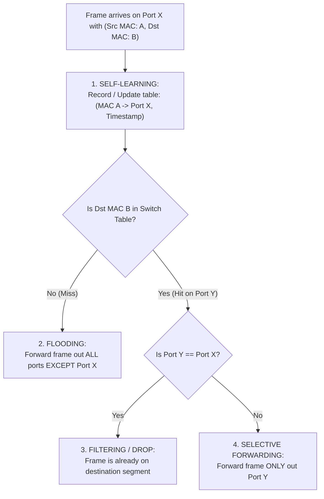

# 04 - Ethernet Frame & Switched LANs

> [!abstract] Key Takeaway
> Ethernet switches are **plug-and-play, self-learning Layer 2 devices** that automatically populate forwarding tables by inspecting the **Source MAC address** of incoming frames and forward/filter based on the **Destination MAC address**.

---

## 1. Ethernet Frame Layout (IEEE 802.3 / Ethernet II)

```
+----------+-----+-------------+-------------+--------+------------------+---------+
| Preamble | SFD |   Dest MAC  |  Source MAC |  Type  |     Payload      |   CRC   |
| (7 bytes)|(1 B)|  (6 bytes)  |  (6 bytes)  | (2 B)  | (46 - 1500 bytes)|  (4 B)  |
+----------+-----+-------------+-------------+--------+------------------+---------+
|<----- Synchronization ------>|<----------------- MAC Frame -------------------->|
```

| Field Name | Size (Bytes) | Operational Function |
| :--- | :---: | :--- |
| **Preamble** | 7 | Pattern of alternating `10101010` used to synchronize receiver clock. |
| **SFD** | 1 | Exact byte `10101011` warning that the destination address starts next. |
| **Destination MAC** | 6 | 48-bit target adapter address (unicast or broadcast `FF:FF:FF:FF:FF:FF`). |
| **Source MAC** | 6 | 48-bit sending adapter address. |
| **Type (Ethertype)** | 2 | Demultiplexing key (`0x0800` = IPv4, `0x0806` = ARP, `0x86DD` = IPv6). |
| **Payload (Data)** | 46 – 1500 | Layer 3 datagram. If payload $< 46\text{ bytes}$, padded to minimum **64 bytes**. |
| **CRC / FCS** | 4 | 32-bit Cyclic Redundancy Check trailer; corrupt frames are silently discarded. |

---

## 2. Switch Self-Learning & Forwarding Algorithm



---

## 3. Layer 2 Switches vs Layer 3 Routers Comparison

| Metric | Layer 2 Switch | Layer 3 Router |
| :--- | :--- | :--- |
| **Layer of Operation** | **Layer 2 (Data Link)** | **Layer 3 (Network)** |
| **Addressing Used** | MAC Addresses (48-bit flat) | IP Addresses (32/128-bit hierarchical) |
| **Forwarding Mechanism** | Switch Table lookup via **Exact Match** | Forwarding Table lookup via **Longest Prefix Match (LPM)** |
| **Configuration** | **Plug-and-Play** (Self-learning) | Requires routing protocols & IP configuration |
| **Loop Prevention** | **Spanning Tree Protocol (STP)** | **TTL Field** decremented at each hop |

---
#### Navigation
← Previous: [[03 - Link Layer Addressing & ARP]] | Next: [[05 - Virtual LANs (VLANs & IEEE 802.1Q)]] →
