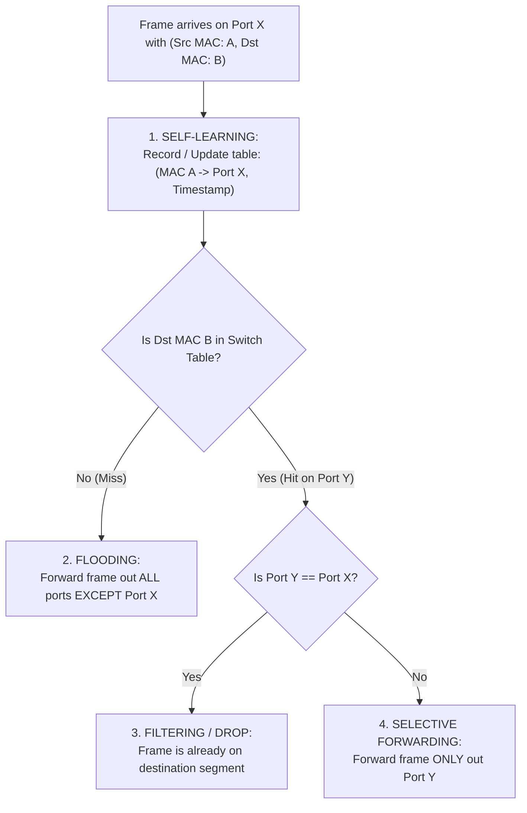

# 04 - Ethernet Frame & Switched LANs

> [!abstract] Key Takeaway
> Modern Ethernet uses a **switched star topology** where dedicated full-duplex links eliminate collisions. 
> Ethernet switches are **plug-and-play, self-learning Layer 2 devices** that automatically populate their forwarding tables by inspecting the **Source MAC address** of incoming frames and forward/filter based on the **Destination MAC address**.

---

## 1. Ethernet Frame Layout (IEEE 802.3 / Ethernet II)

```
+----------+-----+-------------+-------------+--------+------------------+---------+
| Preamble | SFD |   Dest MAC  |  Source MAC |  Type  |     Payload      |   CRC   |
| (7 bytes)|(1 B)|  (6 bytes)  |  (6 bytes)  | (2 B)  | (46 - 1500 bytes)|  (4 B)  |
+----------+-----+-------------+-------------+--------+------------------+---------+
|<----- Synchronization ------>|<----------------- MAC Frame -------------------->|
```

### Field-by-Field Technical Breakdown

| Field Name | Size (Bytes) | Operational Function |
| :--- | :---: | :--- |
| **Preamble** | 7 | Pattern of alternating `10101010` used to synchronize receiver clock circuitry. |
| **SFD (Start Frame Delimiter)** | 1 | Exact byte `10101011` warning the receiver that the next byte is the destination address. |
| **Destination MAC** | 6 | 48-bit target adapter address (unicast or broadcast `FF:FF:FF:FF:FF:FF`). |
| **Source MAC** | 6 | 48-bit sending adapter address. |
| **Type (Ethertype)** | 2 | Demultiplexing key (`0x0800` = IPv4, `0x0806` = ARP, `0x86DD` = IPv6). |
| **Payload (Data)** | 46 – 1500 | Layer 3 datagram. If payload is $< 46$ bytes, it is **padded with dummy zeros** to ensure the minimum frame size of **64 bytes**. |
| **CRC / FCS** | 4 | 32-bit Cyclic Redundancy Check trailer; corrupt frames are silently discarded. |

> [!info] Ethernet Service Properties
> - **Connectionless:** No handshake between sending and receiving NICs.
> - **Unreliable:** Receiving NIC does NOT send ACKs/NAKs. Corrupt frames are dropped; gap recovery is left to higher-layer TCP.

---

## 2. Ethernet Switch Self-Learning & Forwarding Algorithm



---

## 3. Step-by-Step Self-Learning Switch Example

```
      [ Host A ] (MAC: AA) ──► Port 1 ──┐
      [ Host B ] (MAC: BB) ──► Port 2 ──┼──► [ SWITCH ]
      [ Host C ] (MAC: CC) ──► Port 3 ──┼──► (Initially Empty Table)
      [ Host D ] (MAC: DD) ──► Port 4 ──┘
```

| Event Sequence | Frame Transmitted | Switch Action & Forwarding Decision | Switch Table State After Event |
| :---: | :--- | :--- | :--- |
| **1** | Host A sends to Host B (`Src: AA, Dst: BB`) | **Learns `AA -> Port 1`**. `BB` is unknown $\implies$ **Floods** out Ports 2, 3, 4. | `(AA, 1)` |
| **2** | Host B replies to Host A (`Src: BB, Dst: AA`) | **Learns `BB -> Port 2`**. `AA` is found on Port 1 $\implies$ **Forwards ONLY out Port 1**. | `(AA, 1)`, `(BB, 2)` |
| **3** | Host C sends to Host A (`Src: CC, Dst: AA`) | **Learns `CC -> Port 3`**. `AA` is found on Port 1 $\implies$ **Forwards ONLY out Port 1**. | `(AA, 1)`, `(BB, 2)`, `(CC, 3)` |
| **4** | Host A sends to Host B (`Src: AA, Dst: BB`) | Refreshes `AA -> Port 1`. `BB` is found on Port 2 $\implies$ **Forwards ONLY out Port 2** (Zero Flooding!). | `(AA, 1)`, `(BB, 2)`, `(CC, 3)` |

---

## 4. Layer 2 Switches vs Layer 3 Routers Comparison

| Architectural Metric | Layer 2 Switch | Layer 3 Router |
| :--- | :--- | :--- |
| **Layer of Operation** | **Layer 2 (Data Link Layer)** | **Layer 3 (Network Layer)** |
| **Addressing Used** | MAC Addresses (48-bit flat) | IP Addresses (32/128-bit hierarchical) |
| **Forwarding Mechanism** | Switch Table lookup via **Exact Match** | Forwarding Table lookup via **Longest Prefix Match (LPM)** |
| **Configuration** | **Plug-and-Play** (Zero configuration, self-learning) | Requires network configuration and routing protocols |
| **Loop Prevention** | **Spanning Tree Protocol (STP)** disables redundant links | **TTL Field** decremented at each hop |
| **Throughput / Latency** | Extremely high line-rate switching (ASICs) | High throughput, but requires IP header checksum recalculation |

---
#### Navigation
← Previous: [[03 - Link Layer Addressing & ARP]] | Next: [[05 - VLANs (802.1Q) & MPLS]] →
