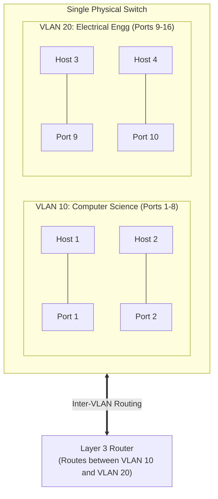

# 05 - VLANs (802.1Q) & MPLS

> [!abstract] Key Takeaway
> - **VLANs (Virtual LANs):** Logically partition a single physical switch into multiple isolated broadcast domains.
> - **IEEE 802.1Q:** Inserts a **4-byte tag** (containing a **12-bit VLAN ID**) into Ethernet frames to identify VLAN membership across inter-switch **Trunk Ports**.
> - **MPLS (Multiprotocol Label Switching):** Adds a **20-bit label (Layer 2.5 shim)** to route packets based on fixed-length labels rather than complex IP longest prefix matches.

---

## 1. VLAN Architecture & Port Isolation



### Key Motivations for VLANs
1. **Traffic Isolation & Security:** Broadcast frames generated in VLAN 10 (e.g., ARP queries) are physically blocked from leaking into VLAN 20.
2. **Efficient Resource Utilization:** Multiple departments share a single enterprise switch without requiring separate physical switches for each room.
3. **Dynamic User Management:** Moving an employee to a new department requires changing a switch port setting in software rather than rewiring physical cables.

---

## 2. VLAN Trunking & IEEE 802.1Q Frame Format

When a VLAN spans multiple physical switches across different floors, a single physical link called a **Trunk Port** carries frames for all VLANs simultaneously.

```
Standard Ethernet Frame:
+---------------+---------------+--------+------------------+---------+
|   Dest MAC    |   Source MAC  |  Type  |     Payload      |   CRC   |
|   (6 bytes)   |   (6 bytes)   | (2 B)  |                  |  (4 B)  |
+---------------+---------------+--------+------------------+---------+

802.1Q Tagged Frame (Across Trunk Link):
+---------------+---------------+--------------------+--------+------------------+---------+
|   Dest MAC    |   Source MAC  | 802.1Q Tag (4 B)   |  Type  |     Payload      |   CRC   |
|   (6 bytes)   |   (6 bytes)   | TPID | Pri | VID   | (2 B)  |                  |  (4 B)  |
+---------------+---------------+--------------------+--------+------------------+---------+
```

### 802.1Q Tag Field Breakdown (4 Bytes = 32 Bits)

| Field Name | Size | Value / Meaning |
| :--- | :---: | :--- |
| **TPID (Tag Protocol Identifier)** | 2 Bytes (16 bits) | Fixed value `0x8100` (Identifies frame as 802.1Q tagged). |
| **PCP (Priority Code Point)** | 3 Bits | IEEE 802.1p Quality of Service / Class of Service (8 priority levels). |
| **DEI (Drop Eligible Indicator)** | 1 Bit | If `1`, frame may be dropped during congestion. |
| **VID (VLAN Identifier)** | **12 Bits** | Identifies specific VLAN ($2^{12} = 4096$ possible IDs; $1 - 4094$ usable). |

---

## 3. Multiprotocol Label Switching (MPLS)

MPLS inserts a 32-bit (4-byte) **"Layer 2.5 Shim Header"** between the Layer 2 Ethernet header and Layer 3 IP header.

```
+-------------------+-----------------------------+-------------------+-----------------+
| Ethernet Header   |   MPLS Shim Header (4 B)    |    IPv4 Header    |   TCP Payload   |
|     (Layer 2)     |  [Label: 20b | Exp | S | TTL] |     (Layer 3)     |    (Layer 4)    |
+-------------------+-----------------------------+-------------------+-----------------+
```

### MPLS Shim Fields
- **Label (20 bits):** Fixed-length lookup index. Label-Switched Routers (LSRs) forward frames via fast exact-table lookups without parsing IP headers.
- **Exp / Traffic Class (3 bits):** QoS priority.
- **S (Bottom of Stack - 1 bit):** `1` if this is the final MPLS label in a stacked label hierarchy.
- **TTL (8 bits):** Decremented at each LSR hop to prevent infinite loops.

### Advantages of MPLS
1. **Traffic Engineering:** Can force traffic along non-shortest paths (e.g., routing backups over secondary links) that standard IP OSPF cannot achieve.
2. **Virtual Private Networks (VPNs):** Isolates customer corporate networks across shared ISP backbones.

---
#### Navigation
← Previous: [[04 - Ethernet Frame & Switched LANs]] | Next: [[06 - Datacenter Networks & Day in the Life of a Web Request]] →
