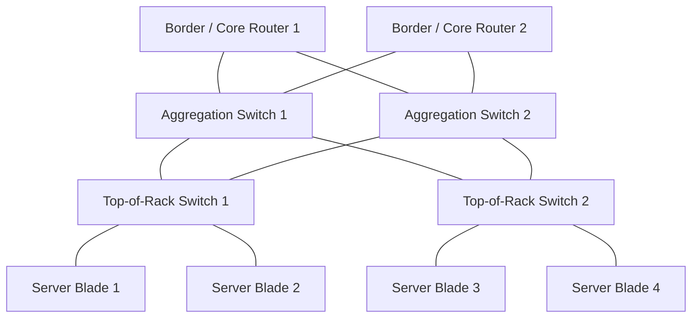
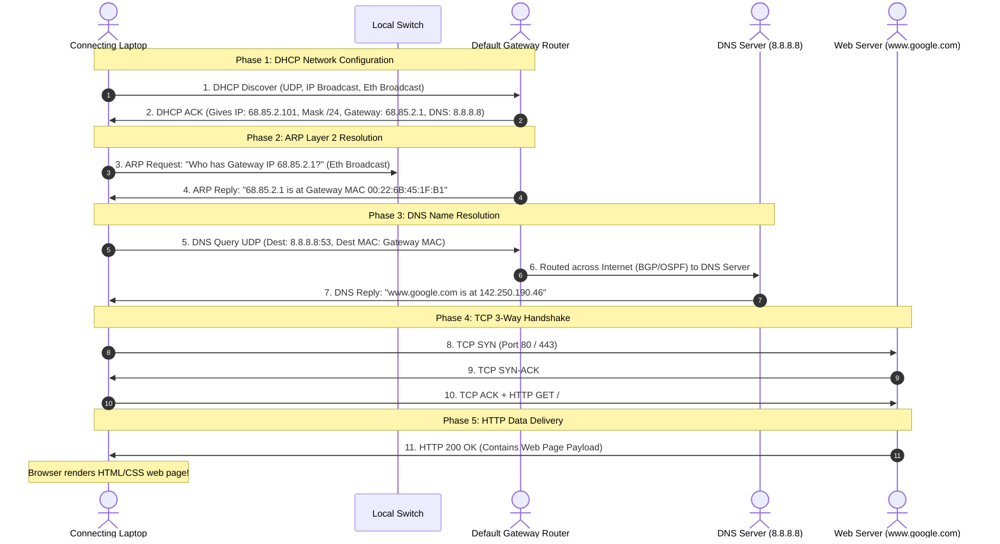

# 06 - Datacenter Networks & Day in the Life of a Web Request

> [!abstract] Key Takeaway
> - **Datacenter Networks** use multi-tier **Fat-Tree (Clos) topologies** and **Equal-Cost Multi-Path (ECMP)** to provide massive bisection bandwidth between server blades.
> - **"A Day in the Life of a Web Request"** synthesizes all 5 layers: **DHCP** (config) $\to$ **ARP** (L2 binding) $\to$ **DNS** (name resolution) $\to$ **TCP Handshake** (transport connection) $\to$ **HTTP** (application data).

---

## 1. Datacenter Network Architecture

- **Top-of-Rack (ToR) Switch:** Connects 20–40 servers within a single physical rack.
- **Fat-Tree / Clos Topology:** Multiple redundant links connect every ToR switch to all aggregation switches, providing **Equal-Cost Multi-Path (ECMP)** load balancing and preventing single points of failure.

---

## 2. Master Synthesis: "A Day in the Life of a Web Request"

---

## 3. Comprehensive Protocol Encapsulation Map

| Protocol Step | Application Layer | Transport Layer | Network Layer | Link Layer |
| :--- | :--- | :--- | :--- | :--- |
| **1. DHCP** | DHCP Message (`yiaddr`) | UDP (`68` $\to$ `67`) | IP (`0.0.0.0` $\to$ `255.255.255.255`) | Ethernet (`Src MAC` $\to$ `FF:FF:FF:FF:FF:FF`) |
| **2. ARP** | — | — | Target IP: `68.85.2.1` | Ethernet (`Type: 0x0806`, `FF:FF:FF:FF:FF:FF`) |
| **3. DNS** | DNS Query (`google.com`) | UDP (`Src Port` $\to$ `53`) | IP (`68.85.2.101` $\to$ `8.8.8.8`) | Ethernet (`Src MAC` $\to$ `Gateway MAC`) |
| **4. TCP Handshake**| — | TCP (`SYN`, `SYN-ACK`, `ACK`) | IP (`68.85.2.101` $\to$ `142.250.190.46`) | Ethernet (`Src MAC` $\to$ `Gateway MAC`) |
| **5. HTTP Transfer**| HTTP GET / HTTP 200 OK | TCP (Port `80` / `443`) | IP (`68.85.2.101` $\to$ `142.250.190.46`) | Ethernet (`Src MAC` $\to$ `Gateway MAC`) |

---
#### Navigation
← Previous: [[05 - VLANs (802.1Q) & MPLS]] | Next: [[07 - Book Extras & Professor Traps]] →
