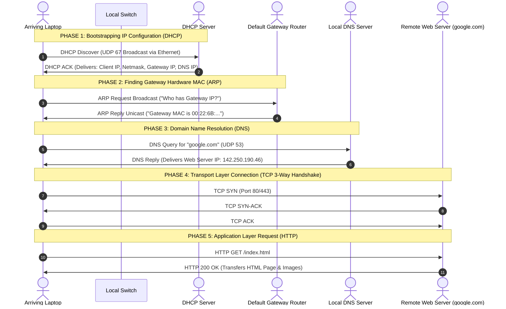

# 06 - Synthesis: A Day in the Life of a Web Request

> [!abstract] Key Takeaway
> This synthesis connects all 5 layers of the network architecture (**DHCP $\to$ ARP $\to$ DNS $\to$ TCP $\to$ HTTP**) into a single end-to-end trace from connecting a laptop to downloading a webpage.

---

## 1. The 6-Phase End-to-End Protocol Flow



---

## 2. Comprehensive Encapsulation Trace: The Initial HTTP GET

When the client browser issues `GET /index.html`, the operating system encapsulates data down through all 5 layers:

```
[ Application Layer (HTTP) ]
  GET /index.html HTTP/1.1\r\nHost: google.com\r\n\r\n
  
[ Transport Layer (TCP) ]
  +--------------------+--------------------+--------------------+
  | Src Port: 54321    | Dst Port: 80       | Seq: 1, ACK: 1     |
  +--------------------+--------------------+--------------------+

[ Network Layer (IP) ]
  +--------------------+--------------------+--------------------+
  | Src IP: 192.168.1.100 | Dst IP: 142.250.190.46 | Protocol: 6 (TCP) |
  +--------------------+--------------------+--------------------+

[ Link Layer (Ethernet) ]
  +--------------------+--------------------+--------------------+
  | Src MAC: Laptop NIC| Dst MAC: Gateway   | EtherType: 0x0800  |
  +--------------------+--------------------+--------------------+
  
[ Physical Layer ]
  Bits modulated as electrical/optical signals over the wire.
```

---
#### Navigation
← Previous: [[05 - Virtual LANs (VLANs & IEEE 802.1Q)]] | Next: [[07 - Book Extras & Professor Traps]] →
