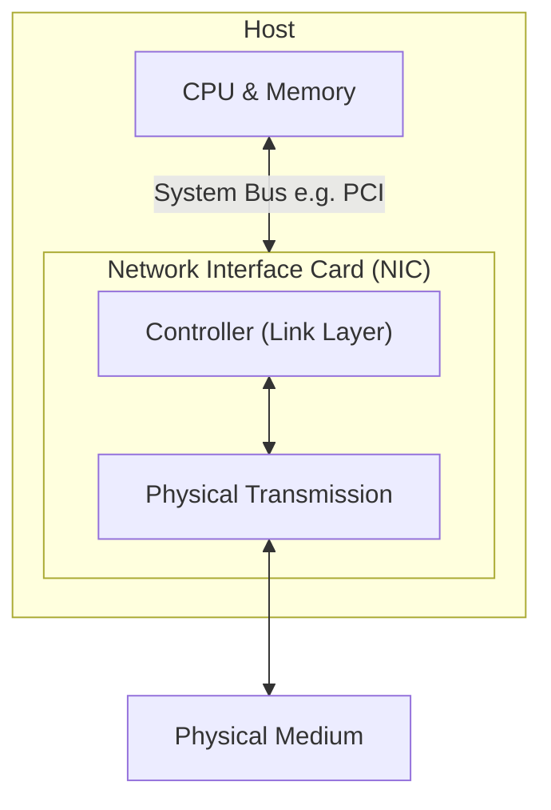
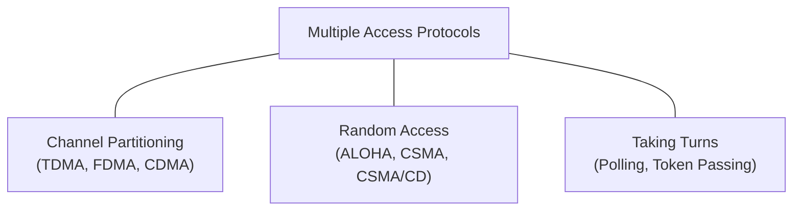
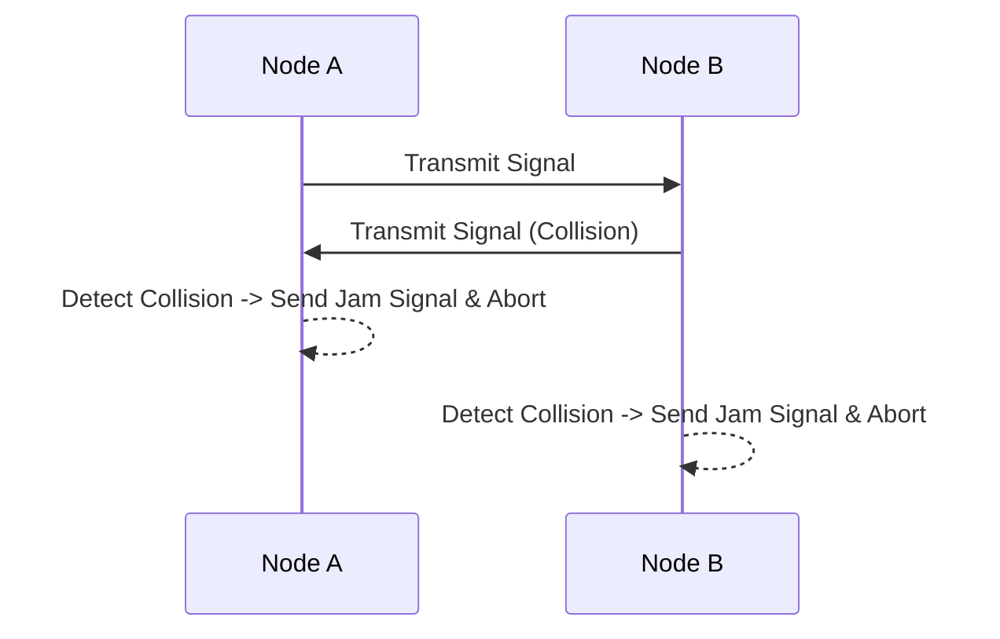
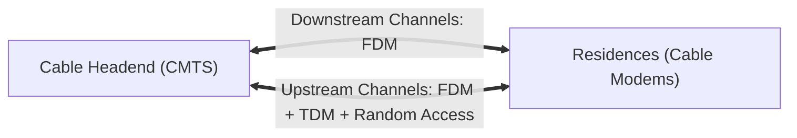
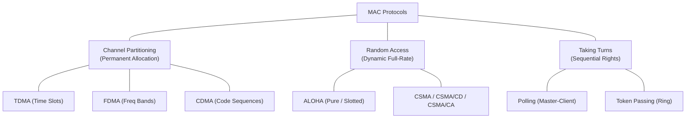
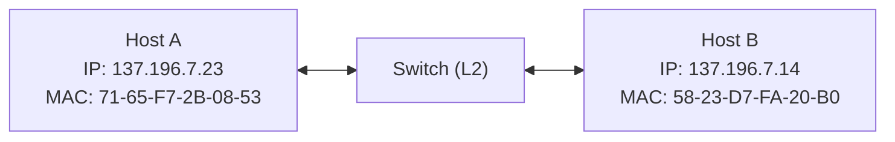
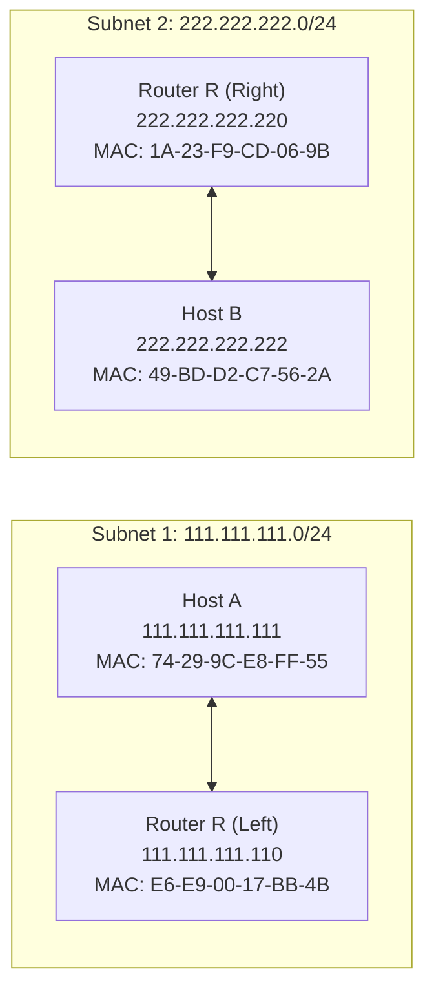
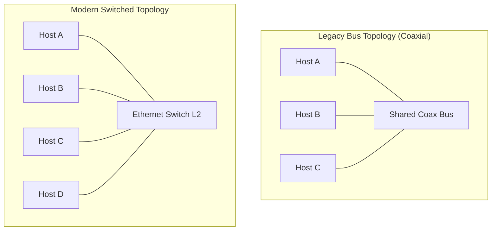

# Chapter 6: The Link Layer and LANs — Detailed Study Notes

---

## 1. Introduction to the Link Layer

### 1.1 Key Terminology
- **Nodes:** Any device running a Layer-2 (Link Layer) protocol. Includes hosts, routers, switches, and WiFi access points.
- **Links:** The communication channels connecting physically adjacent nodes along a communication path.
  - **Wired Links:** Copper cables, coaxial cables, optical fiber.
  - **Wireless Links:** WiFi, Cellular (4G/5G), Satellite.
  - **LANs:** Local Area Networks connecting local nodes.
- **Frame (Layer-2 Packet):** The protocol data unit (PDU) of the link layer. It encapsulates a Layer-3 network-layer datagram by adding a **header** and a **trailer**.

> [!abstract] Core Link Layer Responsibility
> The link layer is responsible for transferring a datagram from one node to a ==physically adjacent node== over an individual communication link.

---

### 1.2 Link Layer Context & The Transportation Analogy

Datagrams travel from a source host to a destination host across a chain of different links. Different link protocols can be used on different links along the end-to-end path (e.g., WiFi on the first link, Ethernet on intermediate links, optical fiber on backbone links). Each link-layer protocol provides a different set of services.


#### Transportation Analogy:
Imagine a trip managed by a travel agent from **Princeton (IUT)** to **Lausanne (Cox's Bazar)**:
- **Tourist** = Datagram
- **Transport Segment** = Individual Communication Link
- **Transportation Mode** (Uber, Airplane, Train) = Link-Layer Protocol
- **Travel Agent** = Routing Algorithm

---

### 1.3 Link Layer Services

1. **Framing & Link Access:**
   - Encapsulates network datagram into a Layer-2 frame, adding header and trailer fields.
   - Specifies frame layout, length, and address formats.
   - Implements **Medium Access Control (MAC)** protocols to regulate transmission onto shared media.
   - **MAC Addressing:** Identifies source and destination nodes locally on the link (distinct from network-layer IP addresses).

2. **Reliable Delivery Between Adjacent Nodes:**
   - Guarantees error-free frame transfer across an individual link using acknowledgments (ACKs) and retransmissions.
   - **Where used:** Frequently used on error-prone links such as wireless networks.
   - **Where avoided:** Seldom used on low bit-error rate (BER) wired links (fiber, coax, twisted-pair) to avoid unnecessary overhead.

   > [!question] Why both link-level and end-to-end (TCP) reliability?
   > Link-level reliability corrects bit errors locally ==on the spot==, preventing the wasteful retransmission of a packet across the entire end-to-end internet path.

3. **Flow Control:**
   - Paces the transmission rate between adjacent sending and receiving nodes so a fast sender does not overwhelm a slow receiver's buffer.

4. **Error Detection:**
   - Detects bit flips caused by signal attenuation, noise, or electromagnetic interference.
   - Sender includes Error Detection and Correction (EDC) bits in the frame trailer; receiver performs the check.
   - When an error is detected, the receiver either signals for retransmission or silently drops the frame.

5. **Error Correction:**
   - The receiver identifies **and corrects** bit error(s) directly from the received payload without requiring retransmission (known as **Forward Error Correction - FEC**).

6. **Half-Duplex and Full-Duplex Modes:**
   - **Half-Duplex:** Nodes at both ends of a link can transmit, but ==not at the same time== (e.g., traditional shared-medium Ethernet).
   - **Full-Duplex:** Nodes at both ends can transmit ==simultaneously== (e.g., modern switched Ethernet).

---

### 1.4 Host Implementation of the Link Layer

The link layer is implemented in **every single host and router** in the network.



- **Location:** Embedded on a chip within a **Network Interface Card (NIC)** or network adapter (e.g., Intel Ethernet adapter, Atheros WiFi chipset) attached to the host's system bus (e.g., PCI slot or integrated chipset).
- **Composition:** A combination of **hardware**, **software**, and **firmware**:
  - **Hardware (Controller):** Handles framing, signal processing, MAC protocol, and low-level bit operations.
  - **Software (Host CPU):** Handles higher-level functions, interrupt management, building link-layer headers, and passing IP datagrams up to Layer 3.

---

## 2. Error Detection and Correction (EDC)

### 2.1 General Error Detection Framework

At the sending node, data $D$ ($d$ data bits, which include datagram headers) is protected by appending $r$ bits of Error Detection and Correction code ($EDC$).

$$
\text{Transmitted frame} = [ D \mid EDC ]
$$

At the receiving node, $D'$ and $EDC'$ are received. The receiver evaluates $D'$ and $EDC'$ to verify integrity:

$$
\text{Check Result} = 
\begin{cases} 
\text{No Error Detected} & \implies \text{Extract } D' \text{ and pass up to Network Layer} \\
\text{Error Detected} & \implies \text{Drop frame or request retransmission}
\end{cases}
$$

> [!warning] Key Concept: Error Detection Reliability
> Error detection is **not 100% reliable**. Unseen bit flips can theoretically alter the data in a way that satisfies the EDC formula. Larger EDC fields yield significantly lower probabilities of undetected errors at the cost of higher bandwidth overhead.

---

### 2.2 Parity Checking

#### 1. Single-Bit Parity
A single parity bit is added to a block of $d$ data bits.
- **Even Parity:** Choose the parity bit such that the total number of `1`s in the $(d + 1)$ bits is **even**.
- **Odd Parity:** Choose the parity bit such that the total number of `1`s in the $(d + 1)$ bits is **odd**.

$$
\text{Data } D = \texttt{0111000110101011} \quad (\text{contains nine 1s})
$$

$$
\text{Even Parity Bit} = \mathbf{1} \implies \text{Total 1s} = 10 \quad (\text{Even})
$$

- **Detection Power:** Detects any **single-bit error** or any **odd number** of bit errors.
- **Limitation:** Fails completely if an **even number** of bit errors occur (undetected error). Since physical bit errors often occur in clusters ("burst errors"), single parity is insufficient in practice.

#### 2. Two-Dimensional Parity
Data bits are arranged in a matrix of $i$ rows and $j$ columns. A parity bit is computed for every row and every column.

$$
\begin{array}{ccccc|c}
d_{1,1} & d_{1,2} & \dots & d_{1,j} & \mathbf{\text{Row Parity}} \\
d_{2,1} & d_{2,2} & \dots & d_{2,j} & \mathbf{\text{Row Parity}} \\
\vdots & \dots & \ddots & \vdots & \mathbf{\vdots} \\
d_{i,1} & d_{i,2} & \dots & d_{i,j} & \mathbf{\text{Row Parity}} \\
\hline
\mathbf{\text{Col Parity}} & \mathbf{\text{Col Parity}} & \dots & \mathbf{\text{Col Parity}} & \mathbf{\text{Corner Parity}}
\end{array}
$$

- **Detection & Correction Capabilities:**
  - **Detects AND Corrects** any single-bit error: The intersection of the invalid row parity and invalid column parity pinpoints the exact flipped bit, allowing instant correction (**Forward Error Correction - FEC**).
  - **Detects** any double-bit error (without ability to correct).

---

### 2.3 Internet Checksum (Review)

- **Concept:** Bytes of data are grouped as a sequence of 16-bit integers and added together using 1's complement arithmetic. The final sum is inverted (1's complement) to form the checksum field.
- **Application:** Used in UDP, TCP, and IP headers.
- **Why Checksum at Transport Layer vs. CRC at Link Layer?**
  - **Transport Layer (Software):** Checksumming is simple, lightweight, and fast to execute in host CPU software.
  - **Link Layer (Hardware):** Dedicated NIC hardware handles complex polynomial math (CRC) at line rate without slowing down the system.

---

### 2.4 Cyclic Redundancy Check (CRC)

CRC codes (also known as **polynomial codes**) treat bit strings as polynomials with coefficients of `0` and `1`.

#### CRC Parameters & Setup:
1. **Data ($D$):** $d$ bits representing the data block.
2. **Generator ($G$):** A pre-agreed bit pattern of $(r + 1)$ bits, where the most significant bit (MSB) must be `1`.
3. **CRC Bits ($R$):** $r$ bits calculated by the sender and appended to $D$.

The sender constructs the combined $(d + r)$-bit pattern $\langle D, R \rangle$ such that it is **exactly divisible by $G$** using **modulo-2 arithmetic**.

#### Modulo-2 Arithmetic Rules:
- Addition and Subtraction are **identical** and equivalent to bitwise **XOR**.
- No carries in addition, no borrows in subtraction.

$$
\begin{aligned}
1011 \oplus 0101 &= 1110 \\
1001 \oplus 1101 &= 0100
\end{aligned}
$$

#### Mathematical Derivation of $R$:
We want to append $r$ CRC bits ($R$) to $D \cdot 2^r$:

$$
\langle D, R \rangle = (D \cdot 2^r) \oplus R
$$

We require that $(D \cdot 2^r \oplus R)$ is a multiple of $G$:

$$
(D \cdot 2^r) \oplus R = n \cdot G \quad (\pmod 2)
$$

Taking the XOR of $R$ on both sides:

$$
D \cdot 2^r = (n \cdot G) \oplus R
$$

This proves that **$R$ is equal to the remainder of $D \cdot 2^r$ divided by $G$**:

$$
R = \text{remainder}\left[ \frac{D \cdot 2^r}{G} \right]
$$

---

#### Step-by-Step CRC Calculation Example
- **Given Data $D$:** `101110` ($d = 6$)
- **Given Generator $G$:** `1001` ($r + 1 = 4 \implies r = 3$)
- **Shifted Data ($D \cdot 2^r$):** `101110000`

Divide $D \cdot 2^r$ (`101110000`) by $G$ (`1001`) using bitwise XOR subtraction:

$$
\begin{array}{r|l}
1001 & 101110000 \quad (\text{Quotient: } 101011) \\
     & \underline{1001} \\
     & 001010 \implies 1010 \quad (\text{Bring down next bits}) \\
     & \underline{1001} \\
     & 001100 \implies 1100 \\
     & \underline{1001} \\
     & 01010 \implies 1010 \\
     & \underline{1001} \\
     & \mathbf{0011} \quad \implies \text{Remainder } R = \mathbf{011}
\end{array}
$$

- **Bits Transmitted to Link:** $\langle D, R \rangle = \mathbf{101110011}$

#### Receiver Action:
The receiver divides the incoming 9-bit pattern `101110011` by $G$ (`1001`). 
- If **remainder $= 0$**: Accept frame.
- If **remainder $\neq 0$**: Bit error detected; drop frame.

#### Detection Power of CRC:
- Detects all **burst errors** shorter than $r + 1$ bits.
- Detects any **odd number of bit errors**.
- Widely standardized and used (e.g., CRC-32 used in Ethernet and IEEE 802.11 WiFi).

---

## 3. Multiple Access Links and Protocols

### 3.1 Types of Links
1. **Point-to-Point Links:** A dedicated direct connection between a single transmitter and a single receiver (e.g., Ethernet switch to host connection, PPP dial-up).
2. **Broadcast Links (Shared Medium):** Multiple nodes attached to a single shared physical channel.
   - **Examples:** Traditional coaxial Ethernet bus, 802.11 Wireless LAN, 4G/5G radio spectrum, Satellite links, Upstream Hybrid Fiber-Coaxial (HFC) cable networks.

---

### 3.2 The Multiple Access Problem
When two or more nodes on a broadcast channel transmit frames simultaneously, the physical signals interfere, causing a **collision**.
- **Impact:** Nodes receive garbled signals, rendering all involved frames useless and wasting channel capacity.
- **Multiple Access Protocol:** A distributed algorithm that coordinates transmission schedules across shared channels without relying on an out-of-band control channel.

---

### 3.3 Ideal Multiple Access Protocol Desiderata
For a broadcast channel with a total transmission rate of $R$ bps:
1. **Full Rate Single Node:** When only 1 node has data to transmit, it gets throughput = $R$ bps.
2. **Fair Multi-Node Sharing:** When $M$ nodes have data to transmit, each node gets an average rate of $R/M$ bps.
3. **Fully Decentralized:** No master coordinating node, no single point of failure, no central clock synchronization.
4. **Simple:** Inexpensive to implement.

---

### 3.4 MAC Protocols: Taxonomy



---

### 3.5 Class 1: Channel Partitioning Protocols

#### 1. Time Division Multiple Access (TDMA)
- Channel access occurs in repeating **rounds**.
- Time is partitioned into $N$ fixed-length time slots (each slot = 1 packet transmission time).
- Each station is assigned 1 fixed slot per round.
- **Unused slots go idle.**

$$
\text{Frame Round} = [\text{Slot 1} \mid \text{Slot 2} \mid \dots \mid \text{Slot N}]
$$

- **Pros:** Completely eliminates collisions; perfectly fair.
- **Cons:** Inefficient at low load; a single active node is constrained to a rate of $R/N$ even if all other $N-1$ nodes are idle.

#### 2. Frequency Division Multiple Access (FDMA)
- The channel spectrum ($R$ bps) is divided into $N$ smaller distinct frequency bands (each of bandwidth $R/N$).
- Each station is assigned a fixed frequency band.
- **Pros:** Eliminates collisions; fair.
- **Cons:** Inefficient at low load; unused frequency bands lie wasted, capping single-node throughput to $R/N$.

---

### 3.6 Class 2: Random Access Protocols

When a node has a frame, it transmits at the **full channel data rate $R$** without prior coordination. If a collision occurs, colliding nodes wait a random delay before retransmitting.

#### 1. Slotted ALOHA

##### Assumptions:
- All frames are of equal size ($L$ bits).
- Time is divided into equal slots of size $S = L/R$ seconds.
- Nodes start transmitting frames **only at the beginning of a time slot**.
- Nodes are clock-synchronized.
- If 2 or more nodes transmit in a slot, all nodes detect the collision within the slot.

##### Operation:
- **Fresh Frame Arrival:** Node transmits at the start of the next slot.
- **No Collision:** Success! Node can prepare the next frame.
- **Collision:** Node detects collision. Retransmits the frame in each subsequent slot with **probability $p$** until successful.

```text
Node 1:  [  1  ]          [  1  ]                     [  1  ]
Node 2:  [  2  ]          [  2  ]  [  2  ]
Node 3:  [  3  ]                   [  3  ]   [  3  ]
Slot:       C        E       C        S    E    C    S     S
          (Coll)  (Empty)  (Coll)   (Succ)    (Coll)(Succ)(Succ)
```

##### Pros & Cons:
- **Pros:** Single active node can transmit continuously at full rate $R$; highly decentralized; simple.
- **Cons:** Collisions waste slots; idle slots waste capacity; clock synchronization requirement.

##### Efficiency Derivation:
Suppose $N$ nodes have frames to send, each transmitting with probability $p$:
- Probability a given node succeeds in a slot = $p(1 - p)^{N-1}$
- Probability *any* node succeeds in a slot = $N p (1 - p)^{N-1}$
- To find maximum efficiency, find optimal $p^*$ that maximizes $N p (1 - p)^{N-1}$. Taking the limit as $N \to \infty$:

$$
\text{Max Efficiency} = \lim_{N \to \infty} N p^* (1 - p^*)^{N-1} = \frac{1}{e} \approx 0.37 \quad (37\%)
$$

> [!info] Efficiency Result
> The channel is utilized for useful work only **37%** of the time at maximum load!

---

#### 2. Pure (Unslotted) ALOHA
- **Mechanics:** No slot synchronization. When a frame arrives at a node, it is transmitted **immediately**.
- **Collision Window:** A frame transmitted at time $t_0$ collides with any other frames transmitted in the window $[t_0 - 1, t_0 + 1]$ (a duration of 2 frame transmission times).

```text
   [ Other Frame Overlaps Start ]         [ Node i Frame ]
----------------------------------+-----------------------------+----------------> Time
                                t0 - 1                        t0              t0 + 1
                                          [ Other Frame Overlaps End ]
```

##### Efficiency Derivation:
- Probability that a given node transmits successfully = $p \cdot (1 - p)^{N-1} \cdot (1 - p)^{N-1} = p (1 - p)^{2(N-1)}$
- Taking optimal limits as $N \to \infty$:

$$
\text{Max Efficiency} = \frac{1}{2e} \approx 0.18 \quad (18\%)
$$

> [!warning] Efficiency Result
> Pure ALOHA achieves only half the maximum throughput of Slotted ALOHA.

---

#### 3. Carrier Sense Multiple Access (CSMA)
- **Concept:** *"Listen before speaking."*
  - **Channel Idle:** Transmit entire frame.
  - **Channel Busy:** Defer transmission until the channel becomes idle.
- **Why CSMA Collisions Still Occur:** **Propagation Delay**.
  - When Node A begins transmitting, its signal takes time to travel down the wire to Node B.
  - If Node B senses the channel before A's signal arrives, B sees the channel as "idle" and starts transmitting, resulting in a collision.

```text
Space-Time Collision Diagram:
Spatial Layout: [ Node A ] ---------------------------- [ Node B ]
Time t0:         A starts transmitting ---------->
Time t1 (>t0):   B senses idle (A's signal hasn't arrived), B starts transmitting!
Time t1+delta:   COLLISION occurs! (Signals overlap along the line)
```

---

#### 4. CSMA/CD (CSMA with Collision Detection)
- **Concept:** *"Listen while speaking."*
- Transmissions are continuously monitored. If a collision is detected, the transmission is **aborted immediately** to minimize wasted channel time.



##### Ethernet CSMA/CD Algorithm:
1. NIC receives datagram from network layer and constructs the Ethernet frame.
2. NIC senses channel:
   - If **idle**: Start frame transmission immediately.
   - If **busy**: Wait until channel is idle, then transmit.
3. While transmitting, NIC monitors for signal interference.
4. If entire frame is sent without collision: Success!
5. If collision is detected while transmitting: **Abort frame transmission immediately** and send a **jam signal** to alert all nodes.
6. **Binary (Exponential) Backoff:**
   - After the $m$-th collision for a frame, choose an integer $K$ randomly from the set:

$$
K \in \{0, 1, 2, \dots, 2^m - 1\}
$$

   - Capped at $m = 10$ (set size up to $0 \dots 1023$).
   - Node waits $K \cdot 512$ **bit times** (where 1 bit time $= 1/R$ seconds), then re-senses the channel at Step 2.
   - More consecutive collisions $\implies$ Larger backoff range $\implies$ Longer average wait time.

##### CSMA/CD Efficiency:

$$
\text{Efficiency} = \frac{1}{1 + 5 \cdot \frac{t_{\text{prop}}}{t_{\text{trans}}}}
$$

Where:
- $t_{\text{prop}}$ = Maximum propagation delay between any two nodes in the LAN.
- $t_{\text{trans}}$ = Time required to transmit a maximum-size frame.

> [!tip] CSMA/CD Efficiency Properties
> As $t_{\text{prop}} \to 0$ or $t_{\text{trans}} \to \infty$, Efficiency $\to 1$. CSMA/CD achieves near-100% efficiency on compact physical networks.

---

### 3.7 Class 3: "Taking Turns" MAC Protocols

| Protocol Type | Mechanics | Pros | Cons / Concerns |
| :--- | :--- | :--- | :--- |
| **Polling** | A designated **Master Controller** polls client nodes round-robin, inviting them to transmit up to a max frame count. | Eliminates collisions; efficient under high load. | • Polling overhead (control messages)<br>• Latency delay<br>• **Single point of failure** (Master node) |
| **Token Passing** | A special **Token frame** is passed sequentially from node to node ($N_1 \to N_2 \dots \to N_1$). Must hold token to send. | Fully decentralized; highly efficient under high load. | • Token overhead<br>• Latency delay<br>• **Single point of failure** (Lost/corrupted token crashes network) |

---

### 3.8 Hybrid Case Study: Cable Access Network (DOCSIS)

The Data-Over-Cable Service Interface Specification (**DOCSIS**) defines cable access networks using all three MAC classes:



1. **FDM:** Divides total bandwidth into multiple distinct upstream and downstream frequency channels.
2. **TDM (Downstream & Upstream Allocation):** 
   - Downstream: CMTS transmits data directly to modems.
   - Upstream: Time is divided into **TDM minislots**. CMTS issues downstream **MAP control frames** explicitly allocating specific upstream minislots to specific modems.
3. **Random Access (Upstream Reservation):**
   - Modems contend for special **request minislots** using random access (CSMA/binary backoff) to ask CMTS for data slot allocations.

---

### 3.9 Summary Comparison of MAC Protocols



---

## 4. Link-Layer Addressing and ARP

### 4.1 MAC Addresses

Every network interface/adapter on a LAN has a unique Link-Layer address (also called a **MAC address**, **LAN address**, or **Physical address**).

- **Length:** 48 bits (6 bytes), represented in **hexadecimal notation**:

$$
\texttt{1A-2F-BB-76-09-AD}
$$

- **Structure:** **Flat Address Structure**. A MAC address remains identical no matter where the host moves (unlike hierarchical IP addresses that change based on subnet connection).
- **Allocation:** Managed globally by the IEEE. Manufacturers buy a 24-bit prefix block to guarantee global uniqueness across all NICs worldwide.

```text
+------------------------------------+------------------------------------+
|   24-bit Manufacturer Prefix (IEEE) |   24-bit Unique Adapter ID         |
+------------------------------------+------------------------------------+
```

#### Analogy:
- **MAC Address:** Like a person's **Social Security Number** (flat, permanent, unique identification).
- **IP Address:** Like a person's **Postal Address** (hierarchical, location-dependent, changes when moving).

#### MAC Broadcast Address:
A frame sent to `FF-FF-FF-FF-FF-FF` is received and processed by **all** adapters attached to the local broadcast network segment.

---

### 4.2 Address Resolution Protocol (ARP)

ARP resolves Layer-3 **IP addresses** to Layer-2 **MAC addresses** for nodes on the **same local subnet**.

#### The ARP Table:
Every IP node (Host or Router) maintains an **ARP Table** in RAM mapping IP-to-MAC associations:

$$
\langle \text{IP Address} \;;\; \text{MAC Address} \;;\; \text{TTL} \rangle
$$

- **TTL (Time to Live):** The time after which an entry is purged from the table (typically 20 minutes).

```text
Sample ARP Table in Host 137.196.7.78:
--------------------------------------------------------------
IP Address        MAC Address            TTL
137.196.7.14      58-23-D7-FA-20-B0      13:45:00
137.196.7.88      0C-C4-11-6F-E3-98      13:52:00
--------------------------------------------------------------
```

---

#### ARP Operation Example (Same Subnet):
Host A (`137.196.7.23`) wants to send a datagram to Host B (`137.196.7.14`), but B's MAC address is NOT in A's ARP table.



1. **ARP Query Broadcast:**
   - Host A constructs an **ARP Query Packet** containing B's IP address (`137.196.7.14`).
   - A encapsulates ARP query in an Ethernet frame with **Destination MAC = `FF-FF-FF-FF-FF-FF`** (Broadcast).
   - All hosts on the LAN receive the frame and pass the payload to their ARP modules.
2. **ARP Response Unicast:**
   - Host B recognizes its own IP address in the query packet.
   - Host B builds an **ARP Response Packet** containing its MAC address (`58-23-D7-FA-20-B0`).
   - B sends the response directly back to Host A via **Unicast** (**Destination MAC = `71-65-F7-2B-08-53`**).
3. **Table Update & Data Transfer:**
   - Host A receives B's reply, caches `<137.196.7.14, 58-23-D7-FA-20-B0, TTL>` in its ARP table.
   - Host A transmits the buffered IP datagram inside an Ethernet frame addressed to `58-23-D7-FA-20-B0`.

> [!tip] Plug-and-Play
> ARP operates automatically without system administrator intervention.

---

### 4.3 Routing a Datagram to Another Subnet

Walkthrough of host $A$ sending a datagram to host $B$ through router $R$ across two subnets:



#### Detailed Step-by-Step Protocol Walkthrough:

```text
Step 1: Host A Encapsulates Datagram for First Hop (Router R)
+-----------------------------------------------------------------------------------------+
| Link-Layer Frame (Subnet 1)                                                             |
|  [ MAC Src: 74-29-9C-E8-FF-55 ] [ MAC Dest: E6-E9-00-17-BB-4B ] (Router's Left MAC)      |
|  +-----------------------------------------------------------------------------------+  |
|  | IP Datagram                                                                       |  |
|  |  [ IP Src: 111.111.111.111 ] [ IP Dest: 222.222.222.222 ] (End Destination B)     |  |
|  |  [ Payload Data ... ]                                                             |  |
|  +-----------------------------------------------------------------------------------+  |
+-----------------------------------------------------------------------------------------+
```

1. **Host A Actions:**
   - $A$ recognizes that $B$ (`222.222.222.222`) is on a different subnet.
   - $A$ determines its First-Hop Gateway IP address is Router $R$ (`111.111.111.110`).
   - $A$ uses ARP on Subnet 1 to find $R$'s MAC address corresponding to `111.111.111.110` ($\rightarrow \texttt{E6-E9-00-17-BB-4B}$).
   - $A$ creates an IP datagram (`IP Src = 111.111.111.111`, `IP Dest = 222.222.222.222`).
   - $A$ encapsulates datagram in a Layer-2 frame with **Destination MAC = Router R's interface MAC (`E6-E9-00-17-BB-4B`)**.
   - $A$ transmits frame to Subnet 1 link.

2. **Router R Receives and Processes:**
   - $R$'s Subnet 1 adapter receives frame, sees MAC matches `E6-E9-00-17-BB-4B`, extracts IP datagram, and passes it up to Layer 3.
   - $R$'s IP layer inspects destination IP (`222.222.222.222`) and consults routing table $\implies$ forwards packet to outgoing interface `222.222.222.220`.

3. **Router R Encapsulates Datagram for Final Hop (Host B):**

```text
Step 3: Router R Encapsulates Datagram for Subnet 2
+-----------------------------------------------------------------------------------------+
| Link-Layer Frame (Subnet 2)                                                             |
|  [ MAC Src: 1A-23-F9-CD-06-9B ] [ MAC Dest: 49-BD-D2-C7-56-2A ] (Host B's MAC)           |
|  +-----------------------------------------------------------------------------------+  |
|  | IP Datagram (UNCHANGED!)                                                          |  |
|  |  [ IP Src: 111.111.111.111 ] [ IP Dest: 222.222.222.222 ]                         |  |
|  |  [ Payload Data ... ]                                                             |  |
|  +-----------------------------------------------------------------------------------+  |
+-----------------------------------------------------------------------------------------+
```

   - $R$ uses ARP on Subnet 2 to find Host $B$'s MAC address corresponding to `222.222.222.222` ($\rightarrow \texttt{49-BD-D2-C7-56-2A}$).
   - $R$ encapsulates the **original, unchanged IP datagram** into a new Layer-2 frame:
     - **Source MAC:** Router $R$'s outgoing interface MAC (`1A-23-F9-CD-06-9B`).
     - **Destination MAC:** Host $B$'s MAC (`49-BD-D2-C7-56-2A`).
   - $R$ transmits frame into Subnet 2.

4. **Host B Receives Frame:**
   - $B$'s adapter receives frame, verifies destination MAC matches `49-BD-D2-C7-56-2A`, decapsulates datagram, and passes it up the protocol stack to IP.

> [!important] Crucial Addressing Rule
> Throughout transit, **IP Addresses remain constant** (End-to-End source and destination), while **MAC Addresses change at every hop** (Local physical link boundaries).

---

## 5. Ethernet

### 5.1 Overview & History
- Co-invented by **Bob Metcalfe** (1973).
- Dominant wired LAN technology across enterprise networks.
- Simpler, cheaper, and faster than competing historic technologies (Token Ring, FDDI, ATM).
- **Speed Scalability:** Evolved from original 2.94 Mbps $\to$ 10 Mbps $\to$ 100 Mbps $\to$ 1 Gbps $\to$ 10 Gbps $\to$ 400 Gbps.

---

### 5.2 Ethernet Topologies



1. **Bus Topology (Popular through mid-1990s):**
   - All hosts connected via a single shared coaxial cable.
   - Nodes share a **single collision domain** governed by CSMA/CD.
2. **Switched Topology (Prevails today):**
   - Active Layer-2 **Ethernet Switch** placed at the center.
   - Each node has a dedicated point-to-point connection to a switch port.
   - Run in **full-duplex mode** $\implies$ **Zero collisions**; CSMA/CD is disabled in modern switched Ethernet environments.

---

### 5.3 Ethernet Frame Structure

A sending interface encapsulates a Layer-3 IP datagram into a standard 802.3 Ethernet Frame:

```text
+----------+--------------+--------------+------+---------------+---------+
| Preamble | Dest Address | Source Addr  | Type | Data Payload  | CRC     |
| (8 bytes)| (6 bytes)    | (6 bytes)    | (2B) | (46-1500 B)   | (4 bytes|
+----------+--------------+--------------+------+---------------+---------+
```

#### Field-by-Field Breakdown:

1. **Preamble (8 bytes):**
   - First 7 bytes contain bit pattern `10101010`.
   - 8th byte contains bit pattern `10101011` (Start Frame Delimiter).
   - **Purpose:** Synchronizes the receiver's clock rate with the sender's clock rate before content arrives.
2. **Destination Address (6 bytes):**
   - Target NIC MAC address (e.g., `AA-AA-AA-AA-AA-AA`).
   - If MAC matches receiver's NIC MAC or Broadcast address (`FF-FF-FF-FF-FF-FF`), NIC accepts frame and passes payload to network layer; otherwise discards it.
3. **Source Address (6 bytes):**
   - Sender NIC MAC address.
4. **Type Field (2 bytes):**
   - Identifies the specific higher-layer protocol encapsulated inside the data payload (e.g., IPv4 = `0x0800`, ARP = `0x0806`).
   - Used for **demultiplexing** at the receiver.
5. **Data (Payload) Field (46 to 1,500 bytes):**
   - Carries the IP datagram.
   - **Maximum Transmission Unit (MTU):** 1,500 bytes. Datagrams exceeding 1,500 bytes must be fragmented at Layer 3.
   - **Minimum Payload Size:** 46 bytes. If an IP datagram is shorter than 46 bytes, the payload is **padded ("stuffed")** with dummy bytes up to 46 bytes so that collision detection reliably functions across physical distances.
6. **CRC Field (4 bytes):**
   - Cyclic Redundancy Check trailer calculated by sender using CRC-32 standard.
   - Allows receiver to detect bit errors; if invalid, frame is dropped.

---

### 5.4 Ethernet Characteristics: Connectionless & Unreliable

- **Connectionless:** No handshaking setup performed between sending and receiving NICs before transmitting frames.
- **Unreliable:** Receiving NIC does **not** send Acknowledgments (ACKs) or Negative Acknowledgments (NAKs) to the sending NIC.
  - If a frame fails the CRC check, it is dropped silently.
  - Data in dropped frames is recovered **only if** upper layers run a reliable transfer protocol (e.g., TCP); otherwise, the data is permanently lost.
- **MAC Protocol:** Unslotted CSMA/CD with binary exponential backoff (for legacy shared media).

---

## 6. Comprehensive Summary Table

| Protocol / Concept | Layer          | Core Function                                      | Addressing / Units                | Key Algorithm / Formula                                    |
| :----------------- | :------------- | :------------------------------------------------- | :-------------------------------- | :--------------------------------------------------------- |
| **Link Layer**     | Layer 2        | Transfers datagrams across a single physical link  | Frames, MAC Addresses             | Framing, Flow Control, Error Checks                        |
| **CRC**            | Layer 2        | Detects hardware bit errors via modulo-2 math      | $r$-bit CRC trailer               | $R = \text{remainder}\left[ \frac{D \cdot 2^r}{G} \right]$ |
| **CSMA/CD**        | Layer 2        | Manages shared media access and detects collisions | Bit times, Jam Signals            | Binary Backoff: $K \in \{0 \dots 2^m - 1\}$                |
| **Slotted ALOHA**  | Layer 2        | Synchronized slot-based random channel access      | Slots of $L/R$ seconds            | Max Efficiency $= 1/e \approx 0.37$                        |
| **Pure ALOHA**     | Layer 2        | Unsynchronized immediate random channel access     | Continuous time                   | Max Efficiency $= 1/(2e) \approx 0.18$                     |
| **ARP**            | L2/L3 Straddle | Maps IP address $\to$ MAC address within subnet    | Broadcast query, Unicast response | ARP Table caching with TTL                                 |
| **Ethernet**       | Layer 2        | Standardized wired LAN framework                   | 48-bit MAC addresses              | 802.3 Framing, CSMA/CD, Connectionless                     |