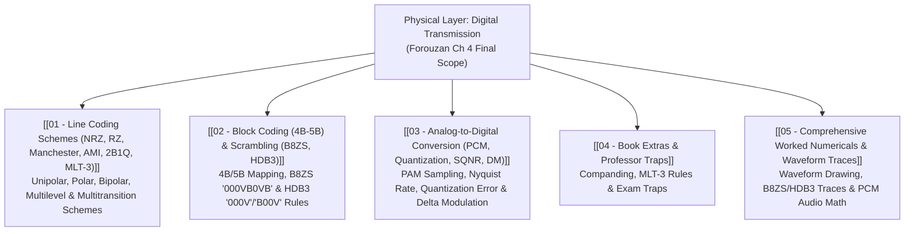

# Physical Layer: Digital Transmission

> [!abstract] Executive Summary & Roadmap (Official Scope)
> The **Physical Layer** converts binary data into physical signals for transmission across copper, fiber, or wireless media.
> 
> This vault covers **Digital-to-Digital Conversion** (Line Coding Schemes, Block Coding 4B/5B, Scrambling B8ZS and HDB3), **Analog-to-Digital Conversion** (PCM Sampling, Quantization, SQNR, Delta Modulation), and high-yield waveform tracing techniques. *(Note: Bandwidth mathematical derivations and Transmission Modes are excluded from the Final Exam syllabus).*

---

## ✅ Physical Layer Study Progress Checklist
- [ ] [[01 - Line Coding Schemes (NRZ, RZ, Manchester, AMI, 2B1Q, MLT-3)]] — All 10 Waveform Analyses
- [ ] [[02 - Block Coding (4B-5B) & Scrambling (B8ZS, HDB3)]] — 4B/5B Rules, B8ZS & HDB3 Substitution Rules
- [ ] [[03 - Analog-to-Digital Conversion (PCM, Quantization, SQNR, DM)]] — Nyquist $f_s \ge 2 f_{max}$, SQNR $6.02 n_b + 1.76$, DM
- [ ] [[04 - Book Extras & Professor Traps]] — Companding ($\mu$-law / A-law), MLT-3 Rules
- [ ] [[05 - Comprehensive Worked Numericals & Waveform Traces]] — B8ZS/HDB3 Traces, PCM Audio Math

---

## 🗺️ Master Visual Navigation Map

---

## 📑 Detailed Note Registry

| # | Note Document | Core Question Answered | High-Yield Topics |
| :---: | :--- | :--- | :--- |
| **01** | [[01 - Line Coding Schemes (NRZ, RZ, Manchester, AMI, 2B1Q, MLT-3)]] | *How do we convert binary bitstreams into physical voltage waveforms?* | NRZ-L, NRZ-I, RZ, Manchester, Differential Manchester, AMI, Pseudoternary, 2B1Q, 8B6T, 4D-PAM5, MLT-3 |
| **02** | [[02 - Block Coding (4B-5B) & Scrambling (B8ZS, HDB3)]] | *How do we eliminate long strings of zeros to preserve clock synchronization?* | 4B/5B Nibble Mapping, Scrambling Violations ($V$) and Bipolars ($B$), B8ZS Rules, HDB3 Odd/Even Rules |
| **03** | [[03 - Analog-to-Digital Conversion (PCM, Quantization, SQNR, DM)]] | *How do we digitize continuous analog voice/audio into binary bits?* | Nyquist Theorem ($f_s \ge 2 f_{max}$), Quantization Zones ($L=2^{n_b}$), $\text{SQNR}_{dB} = 6.02 n_b + 1.76$, Delta Modulation |
| **04** | [[04 - Book Extras & Professor Traps]] | *What subtle edge cases appear in physical layer questions?* | Companding ($\mu$-law / A-law), MLT-3 state machine rules, Scrambling parity traps |
| **05** | [[05 - Comprehensive Worked Numericals & Waveform Traces]] | *How do you draw line coding waveforms and trace scrambling substitutions?* | Complete line coding waveform traces, step-by-step B8ZS/HDB3 substitutions, PCM audio calculations |

---
#### Navigation
Next → [[01 - Line Coding Schemes (NRZ, RZ, Manchester, AMI, 2B1Q, MLT-3)]]
