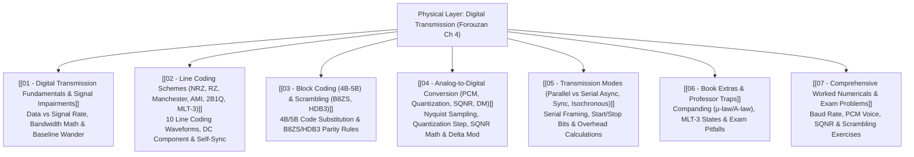

# Physical Layer: Digital Transmission

> [!abstract] Executive Summary & Roadmap
> The **Physical Layer** is responsible for moving individual bits across a physical transmission medium. 
> 
> This vault covers **Digital-to-Digital Conversion** (Line Coding schemes like NRZ, RZ, Manchester, AMI, 2B1Q, and MLT-3; Block Coding 4B/5B; Scrambling algorithms B8ZS and HDB3), **Analog-to-Digital Conversion** (Pulse Code Modulation - PCM, Nyquist sampling, Quantization error, SQNR math, and Delta Modulation), and **Transmission Modes** (Parallel vs Serial Asynchronous/Synchronous).

---

## 🗺️ Master Visual Navigation Map

---

## 📑 Detailed Note Registry

| # | Note Document | Core Question Answered | High-Yield Topics |
| :---: | :--- | :--- | :--- |
| **01** | [[01 - Digital Transmission Fundamentals & Signal Impairments]] | *What fundamental physical limits govern sending bits over copper/fiber?* | Data Rate ($N$) vs Signal Rate ($S$), $S = c \cdot N / r$, DC Component, Baseline Wander |
| **02** | [[02 - Line Coding Schemes (NRZ, RZ, Manchester, AMI, 2B1Q, MLT-3)]] | *How do different voltage waveforms represent 1s and 0s?* | NRZ-L, NRZ-I, RZ, Manchester, Diff Manchester, AMI, Pseudoternary, 2B1Q, 8B6T, MLT-3 |
| **03** | [[03 - Block Coding (4B-5B) & Scrambling (B8ZS, HDB3)]] | *How do we eliminate long runs of zeros without doubling bandwidth?* | 4B/5B Block Mapping, Scrambling Rules: B8ZS (`000VB0VB`), HDB3 (`000V` vs `B00V`) |
| **04** | [[04 - Analog-to-Digital Conversion (PCM, Quantization, SQNR, DM)]] | *How is continuous analog voice converted into clean digital bits?* | Nyquist Theorem ($f_s \ge 2 f_{max}$), Quantization Error ($e_q$), $SNR_{dB} = 6.02 n_b + 1.76$, Delta Modulation |
| **05** | [[05 - Transmission Modes (Parallel vs Serial Async, Sync, Isochronous)]] | *How are bits chronologically sequenced across physical wires?* | Parallel vs Serial, Asynchronous Framing Overhead, Synchronous Bit Streams |
| **06** | [[06 - Book Extras & Professor Traps]] | *What tricky edge cases appear on Physical Layer final exams?* | Companding ($\mu$-law / A-law), Slope Overload vs Granular Noise, Baud vs Bit rate traps |
| **07** | [[07 - Comprehensive Worked Numericals & Exam Problems]] | *How do you solve signal rate and PCM numericals with 100% accuracy?* | Bandwidth calculations, PCM bit rates, Scrambling step-by-step state traces |

---
#### Navigation
Next → [[01 - Digital Transmission Fundamentals & Signal Impairments]]
