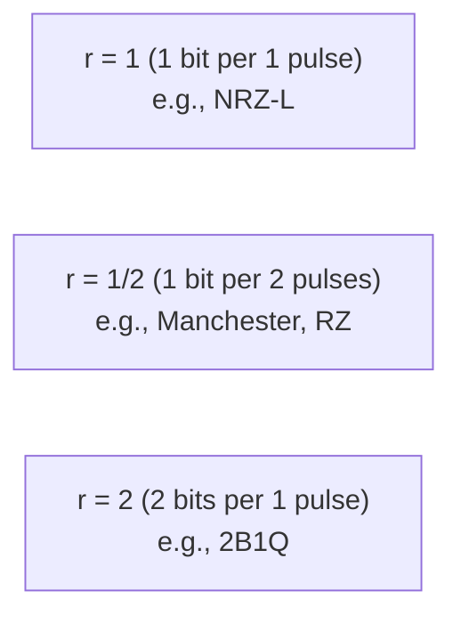
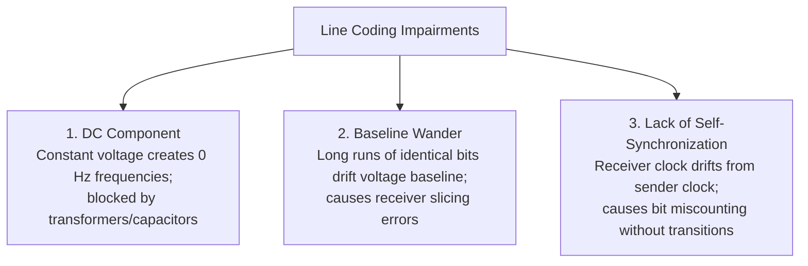

# 01 - Digital Transmission Fundamentals & Signal Impairments

> [!abstract] Key Takeaway
> - **Data Rate ($N$):** Speed of information transfer in **bits per second (bps)**.
> - **Signal Rate / Baud Rate ($S$):** Number of signal pulses transmitted per second in **baud (Bd)**.
> - **Fundamental Relation:** $S = c \times N \times \frac{1}{r}$, where $r$ is the ratio of bits per signal element.
> - A high-quality line coding scheme must minimize **DC Components**, eliminate **Baseline Wander**, and provide **Self-Synchronization**.

---

## 1. Data Elements vs Signal Elements

```
   Data Element : The fundamental unit of information = 1 bit (0 or 1).
   Signal Element: The shortest electrical/optical pulse occupying a time slot.
   Ratio (r)     : Number of data elements carried per signal element:
                   r = (Data Elements) / (Signal Elements)
```



---

## 2. Mathematical Formulas: Baud Rate & Bandwidth

### 1. Signal Rate (Baud Rate $S$)
$$S = c \times N \times \frac{1}{r} \quad (\text{baud})$$
- $N$ = Data rate in bits per second (bps).
- $c$ = Case factor ($c = 0$ best-case, $c = 1$ worst-case, **$c = \frac{1}{2}$ average-case**).
- $r$ = Bits per signal element.

### 2. Minimum Required Channel Bandwidth ($B_{min}$)
Although a digital signal has theoretical infinite bandwidth, the **minimum required bandwidth** to faithfully reproduce the fundamental frequency is:
$$B_{min} = c \times N \times \frac{1}{r} = S_{avg}$$

### 3. Maximum Data Rate for Given Bandwidth ($N_{max}$)
$$N_{max} = \frac{1}{c} \times B \times r = 2 \times B \times r \quad \left(\text{for } c = \frac{1}{2}\right)$$

---

## 3. Major Signal Impairments in Line Coding



### 1. DC Component (Direct Current)
When a signal maintains a constant non-zero voltage level for an extended period, it generates frequencies around **$0\text{ Hz}$ (DC component)**. 
- **The Problem:** Telephone lines, transformers, and AC-coupled optical receivers act as bandpass filters that block low frequencies below a certain threshold. Any signal with a DC component experiences severe attenuation and distortion.

### 2. Baseline Wander
The receiver determines whether an arriving pulse is a 1 or a 0 by comparing its voltage to a running average threshold called the **baseline**.
- **The Problem:** A long string of uninterrupted 1s or 0s pulls the baseline voltage upward or downward, causing the receiver to misinterpret subsequent bits (**slicing error**).

### 3. Self-Synchronization (Clock Recovery)
To correctly decode incoming bits, the receiver's local clock must sample the line at the exact center of each bit interval.
- **The Problem:** If the sender and receiver clocks differ by even $0.1\%$, after 1000 bits the receiver will sample an extra bit or drop a bit. A good line coding scheme guarantees **frequent signal transitions** so the receiver's Phase-Locked Loop (PLL) can continuously synchronize with the sender.

---

## 4. Step-by-Step Worked Numerical Example

> [!example]- Worked Problem: Baud Rate & Bandwidth
> **Scenario:** A computer network transmits digital data at $N = 2\text{ Mbps}$.
> 
> **Question 1:** What is the average baud rate and minimum bandwidth if the system uses **NRZ-L** ($r = 1$)?
> $$S_{avg} = c \times N \times \frac{1}{r} = \frac{1}{2} \times 2 \times 10^6 \times \frac{1}{1} = \mathbf{1\text{ Mbaud}}$$
> $$B_{min} = S_{avg} = \mathbf{1\text{ MHz}}$$
> 
> **Question 2:** What is the average baud rate and minimum bandwidth if the system uses **Manchester encoding** ($r = 1/2$)?
> $$S_{avg} = \frac{1}{2} \times 2 \times 10^6 \times \frac{1}{0.5} = \mathbf{2\text{ Mbaud}}$$
> $$B_{min} = S_{avg} = \mathbf{2\text{ MHz}}$$
> *(Manchester requires twice the bandwidth of NRZ-L to achieve self-synchronization!)*

---
#### Navigation
← Previous: [[00 - Index]] | Next: [[02 - Line Coding Schemes (NRZ, RZ, Manchester, AMI, 2B1Q, MLT-3)]] →
