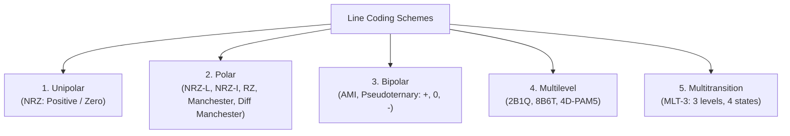

# 01 - Line Coding Schemes (NRZ, RZ, Manchester, AMI, 2B1Q, MLT-3)

> [!abstract] Key Takeaway
> **Line Coding** converts binary bitstreams into discrete voltage waveforms. 
> Good line coding schemes provide **self-synchronization**, **zero DC component**, and high **bandwidth efficiency**.

---

## 1. Line Coding Taxonomy



---

## 2. Comprehensive Comparison of All 10 Line Coding Schemes

| Line Coding Scheme | Voltage Levels | Transition Rules | Clock Synchronization | DC Component? |
| :--- | :---: | :--- | :---: | :---: |
| **Unipolar NRZ** | 2 ($+V, 0$) | `1` = High, `0` = Low | Poor (lost on consecutive 0s or 1s) | **High (Severe)** |
| **Polar NRZ-L** | 2 ($+V, -V$) | `0` = Positive ($+V$), `1` = Negative ($-V$) | Poor (lost on long runs of 0s or 1s) | Yes (if unbalanced) |
| **Polar NRZ-I** | 2 ($+V, -V$) | `1` = Transition at start; `0` = No transition | Partial (good for 1s, fails on long 0s) | Yes (if unbalanced) |
| **Polar RZ** | 3 ($+V, 0, -V$) | `1` = $+V \to 0$ halfway; `0` = $-V \to 0$ halfway | **Excellent** (guaranteed midpoint return) | Low |
| **Manchester (802.3)** | 2 ($+V, -V$) | `0` = Low-to-High ($\uparrow$); `1` = High-to-Low ($\downarrow$) | **Self-Synchronizing** (Transition in every bit) | **Zero DC** |
| **Diff. Manchester** | 2 ($+V, -V$) | Always transitions at midpoint. `0` = Transition at start; `1` = No transition at start | **Self-Synchronizing** | **Zero DC** |
| **Bipolar AMI** | 3 ($+V, 0, -V$) | `0` = Zero voltage ($0$V); `1` = Alternating $+V$ and $-V$ | Partial (fails on consecutive 0s) | **Zero DC** |
| **Pseudoternary** | 3 ($+V, 0, -V$) | `1` = Zero voltage ($0$V); `0` = Alternating $+V$ and $-V$ | Partial (fails on consecutive 1s) | **Zero DC** |
| **2B1Q** | 4 ($-3, -1, +1, +3$) | Maps 2-bit groups to 1 of 4 voltage levels | Moderate (used in DSL) | Low |
| **MLT-3** | 3 ($+V, 0, -V$) | `1` = Moves to next level in sequence $0 \to +V \to 0 \to -V \to 0$; `0` = No transition | Partial | Low |

---

## 3. Detailed Examination of Key Schemes

### A. Manchester vs Differential Manchester (Biphase Schemes)

```
Bitstream:          0       1       0       0       1
Manchester:      [ _/¯ ] [ ¯\_ ] [ _/¯ ] [ _/¯ ] [ ¯\_ ]  (Mid-bit transition: 0=Up, 1=Down)
Diff. Manchester:[ _/¯ ] [ _/¯ ] [ ¯\_ ] [ _/¯ ] [ _/¯ ]  (Transition at start for 0; no transition for 1)
```

- **Manchester (IEEE 802.3 Ethernet):** `0` = Low-to-High ($\uparrow$), `1` = High-to-Low ($\downarrow$).
- **Differential Manchester (IEEE 802.5 Token Ring):** Midpoint transition always provides clock synchronization. An initial edge at the start of the bit interval indicates `0`; lack of an initial edge indicates `1`.

---

### B. MLT-3 (Multi-Level Transmit 3)
MLT-3 transitions through 4 ordered states:
$$\mathbf{0 \ \longrightarrow \ +V \ \longrightarrow \ 0 \ \longrightarrow \ -V \ \longrightarrow \ 0}$$
- If next bit is **`1`**: Transition to the **next voltage level in the state sequence**.
- If next bit is **`0`**: **No transition** (maintain current voltage level).

---
#### Navigation
← Previous: [[00 - Index]] | Next: [[02 - Block Coding (4B-5B) & Scrambling (B8ZS, HDB3)]] →
