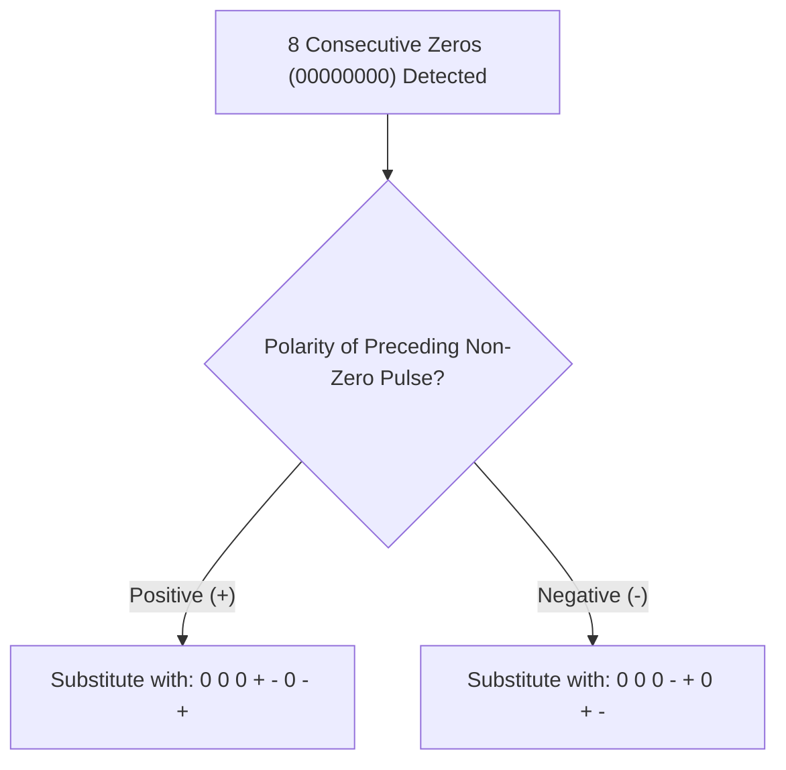

# 02 - Block Coding (4B-5B) & Scrambling (B8ZS, HDB3)

> [!abstract] Key Takeaway
> To prevent clock loss during long strings of zeros:
> - **Block Coding (4B/5B):** Maps 4-bit nibbles to 5-bit words, guaranteeing at most 3 consecutive zeros (with $25\%$ bit rate overhead).
> - **Scrambling (B8ZS & HDB3):** Modifies Bipolar AMI by substituting zero-sequences with intentional **Bipolar Violations ($V$)** at **$0\%$ extra overhead**.

---

## 1. Block Coding: 4B/5B Scheme

```
Data Stream ──► [ Division: 4-bit chunks ] ──► [ 4B/5B Substitution Table ] ──► [ NRZ-I Line Coding ] ──► Wire
```

### The Design Principle of 4B/5B
- Maps $2^4 = 16$ input 4-bit data nibbles to 16 selected 5-bit patterns ($2^5 = 32$ total combinations).
- The 16 data patterns are selected so that:
  1. No 5-bit code has more than **one leading zero**.
  2. No 5-bit code has more than **two trailing zeros**.
  3. **Guaranteed Bound:** No sequence of combined codes will EVER have more than **three consecutive zeros**!
- When paired with **NRZ-I** (which transitions on every 1), clock synchronization is guaranteed.
- **Overhead Calculation:** $\frac{5 - 4}{4} = \frac{1}{4} = \mathbf{25\%}$.

---

## 2. Scrambling: Eliminating Zeros at Zero Overhead Cost

Instead of adding extra bits like block coding, **Scrambling** modifies AMI line coding by substituting long runs of zeros with intentional **Code Violations ($V$)** and **Bipolar Pulses ($B$)**.

- **$V$ (Bipolar Violation):** A pulse with the **SAME polarity** as the preceding non-zero pulse (violating AMI alternation).
- **$B$ (Bipolar Pulse):** A pulse with **OPPOSITE polarity** to the preceding non-zero pulse (conforming to AMI alternation).

---

## 3. B8ZS (Bipolar 8-Zero Substitution - North America T1)

Whenever **8 consecutive zeros (`00000000`)** occur in the bitstream, B8ZS replaces them with:
$$\text{Substitution Pattern: } \mathbf{000VB0VB}$$



> [!example]- Worked B8ZS Trace
> **Bitstream:** `1 0 0 0 0 0 0 0 0 1` (Assume initial 1 was $+V$)
> 1. Initial 1: $+V$
> 2. Eight zeros encounter B8ZS rule $\implies$ `0 0 0 + - 0 - +`
> 3. Following 1 conforms to AMI (opposite to last non-zero pulse $+V$) $\implies -V$.
> - **Final Pulse Sequence:** `+ 0 0 0 + - 0 - + -`

---

## 4. HDB3 (High-Density Bipolar 3-Zero - Europe E1)

Whenever **4 consecutive zeros (`0000`)** occur, HDB3 substitutes them based on the **number of non-zero pulses transmitted since the last substitution**:

| Polarity of Preceding Pulse | Odd Number of Pulses Since Last Sub | Even Number of Pulses Since Last Sub |
| :---: | :---: | :---: |
| **Positive ($+$)** | `0 0 0 +` | `- 0 0 -` |
| **Negative ($-$)** | `0 0 0 -` | `+ 0 0 +` |
| **General Formula** | $\mathbf{000V}$ | $\mathbf{B00V}$ |

> [!info] Why HDB3 has two different substitution rules
> Using $B00V$ for an even pulse count ensures that the total number of non-zero pulses between two consecutive violations is always odd, maintaining **Zero DC Component** across the wire!

---
#### Navigation
← Previous: [[01 - Line Coding Schemes (NRZ, RZ, Manchester, AMI, 2B1Q, MLT-3)]] | Next: [[03 - Analog-to-Digital Conversion (PCM, Quantization, SQNR, DM)]] →
