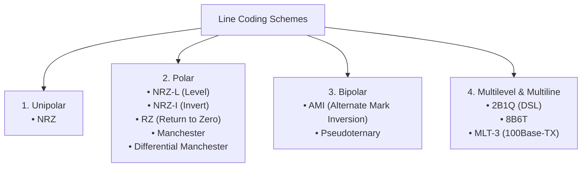

# 02 - Line Coding Schemes (NRZ, RZ, Manchester, AMI, 2B1Q, MLT-3)

> [!abstract] Key Takeaway
> **Line Coding** converts a sequence of binary digital bits into a discrete physical voltage signal. 
> Trade-offs center on balancing **bandwidth efficiency ($r = \text{bits/baud}$)**, **self-synchronization (clock recovery transitions)**, and the **elimination of DC components**.

---

## 1. Master Taxonomy of Line Coding Schemes



---

## 2. In-Depth Technical Breakdown of All 10 Schemes

### 1. Unipolar NRZ (Non-Return to Zero)
- **Rule:** Bit 1 $= +V$, Bit 0 $= 0\text{V}$.
- **Metrics:** $r = 1$, $S_{avg} = N/2$, $B_{min} = N/2$.
- **Flaw:** Massive DC component; zero self-synchronization.

---

### 2. Polar NRZ-L (NRZ-Level) vs NRZ-I (NRZ-Invert)

```
Bits:         0     1     0     0     1     1     0
NRZ-L:      +---+       +-------+                 +---+
            |   |       |       |                 |   |
         ---+   +-------+       +-----------------+   +---
NRZ-I:      +---+       +-------+     +---+       +---+
(Toggle on 1)|  |       |       |     |   |       |   |
         ---+   +-------+       +-----+   +-------+   +---
```

- **NRZ-L (Level):** Positive voltage $= 0$, Negative voltage $= 1$. Signal level depends strictly on the bit value.
- **NRZ-I (Invert):** **Transition (inversion) at the start of a bit interval represents bit 1**; **NO transition represents bit 0**.
- **Metrics:** $r = 1$, $S_{avg} = N/2$, $B_{min} = N/2$.
- **Exam Nuance:** NRZ-I provides clock synchronization for continuous streams of 1s, but fails when encountering long runs of 0s.

---

### 3. Polar RZ (Return to Zero)
- **Rule:** Uses 3 voltage levels ($+V, 0, -V$). Signal always transitions to **$0\text{V}$ in the middle of each bit interval**.
  - Bit 1: Positive to Zero ($+V \to 0\text{V}$).
  - Bit 0: Negative to Zero ($-V \to 0\text{V}$).
- **Metrics:** $r = 1/2$, $S_{avg} = N$, $B_{min} = N$.
- **Trade-off:** Guarantees perfect synchronization on every bit, but **doubles the required channel bandwidth** compared to NRZ!

---

### 4. Manchester & Differential Manchester (Polar Biphase)

```
Bits:            0         1         0         1
Manchester:   +---+     +---+     +---+     +---+
(Mid-bit)     |   |     |   |     |   |     |   |
           ---+   +-------+   +-----+   +-------+   +---
Diff Manch:   +---+     +-------+ +---+ +-------+
(0=Start Trans|   |     |       | |   | |       |
 1=No Trans) -+   +-------+   +-+-+   +-+   +---+   +---
```

- **Manchester (10Base-T Ethernet):** Inversion in the center of every bit:
  - Negative-to-Positive ($\uparrow$) $= 0$.
  - Positive-to-Negative ($\downarrow$) $= 1$.
  - **Metrics:** $r = 1/2$, $S_{avg} = N$, $B_{min} = N$, **Zero DC Component**, **Self-synchronizing**.
- **Differential Manchester (Token Ring):** Center transition always present for clock synchronization.
  - **Bit 0:** Transition at the **beginning** of the bit interval.
  - **Bit 1:** **NO transition** at the beginning of the bit interval.

---

### 5. Bipolar AMI (Alternate Mark Inversion) & Pseudoternary
- **AMI Rule:** Bit 0 $= 0\text{V}$. Bit 1 **alternates** between $+V$ and $-V$.
- **Pseudoternary Rule:** Bit 1 $= 0\text{V}$. Bit 0 alternates between $+V$ and $-V$.
- **Metrics:** $r = 1$, $S_{avg} = N/2$, $B_{min} = N/2$, **Zero DC Component**.
- **Exam Flaw:** A long string of 0s produces a flat $0\text{V}$ line, causing the receiver clock to lose synchronization (solved using **Scrambling**).

---

### 6. Multilevel 2B1Q (2 Binary, 1 Quaternary)
- Encodes a pair of 2 bits into a single 4-level voltage pulse:
  - `00` $\to -3\text{V}$, `01` $\to -1\text{V}$, `10` $\to +3\text{V}$, `11` $\to +1\text{V}$.
- **Metrics:** $r = 2$ ($2\text{ bits/pulse}$), $S_{avg} = N/4$, **$B_{min} = N/4$** (Used in DSL/ISDN).

---

### 7. Multiline Transmission (MLT-3)
Uses 3 voltage levels ($+V, 0, -V$) and transitions based on 3 rules:
1. If current bit is **0**, **no transition**.
2. If current bit is **1** and current level is non-zero, next level is **$0\text{V}$**.
3. If current bit is **1** and current level is $0\text{V}$, next level is the **opposite of the previous non-zero level**.
- **Cycle:** $+V \to 0 \to -V \to 0 \to +V \dots$ (Takes 4 ones to complete a full wave $\implies S_{avg} = N/4$).
- **Application:** Used in **100Base-TX Fast Ethernet** to transmit 100 Mbps over Category 5 UTP within a 31.25 MHz limit.

---

## 3. Master Line Coding Comparison Table

| Line Coding Scheme | Voltage Levels ($L$) | Bits / Signal Element ($r$) | Average Signal Rate ($S_{avg}$) | Minimum Bandwidth ($B_{min}$) | DC Component? | Self-Synchronization? | Primary Application |
| :--- | :---: | :---: | :---: | :---: | :---: | :---: | :--- |
| **Unipolar NRZ** | 2 | 1 | $N/2$ | $N/2$ | ❌ Yes (Severe) | ❌ No | Legacy digital circuits |
| **Polar NRZ-L** | 2 | 1 | $N/2$ | $N/2$ | ❌ Yes | ❌ No | RS-232 serial cables |
| **Polar NRZ-I** | 2 | 1 | $N/2$ | $N/2$ | ❌ Yes | ⚠️ Partial (1s only) | USB 1.1 / 2.0 (with bit stuffing) |
| **Polar RZ** | 3 | 1/2 | $N$ | $N$ | ⚠️ Reduced | ✅ Yes | Old high-sync telemetry |
| **Manchester** | 2 | 1/2 | $N$ | $N$ | ✅ **No DC (0)** | ✅ **Yes (Perfect)** | **10Base-T Ethernet** |
| **Diff Manchester** | 2 | 1/2 | $N$ | $N$ | ✅ **No DC (0)** | ✅ **Yes (Perfect)** | **Token Ring (IEEE 802.5)** |
| **Bipolar AMI** | 3 | 1 | $N/2$ | $N/2$ | ✅ **No DC (0)** | ⚠️ Fails on 0s | T1 carrier (with B8ZS) |
| **2B1Q** | 4 | 2 | $N/4$ | $N/4$ | ⚠️ Small | ⚠️ Partial | DSL / ISDN BRI |
| **MLT-3** | 3 | 1 | $N/4$ | $N/4$ | ⚠️ Small | ⚠️ Fails on 0s | **100Base-TX Fast Ethernet** |

---
#### Navigation
← Previous: [[01 - Digital Transmission Fundamentals & Signal Impairments]] | Next: [[03 - Block Coding (4B-5B) & Scrambling (B8ZS, HDB3)]] →
