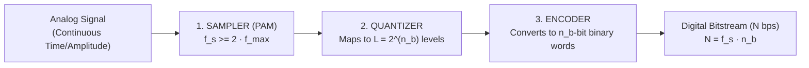
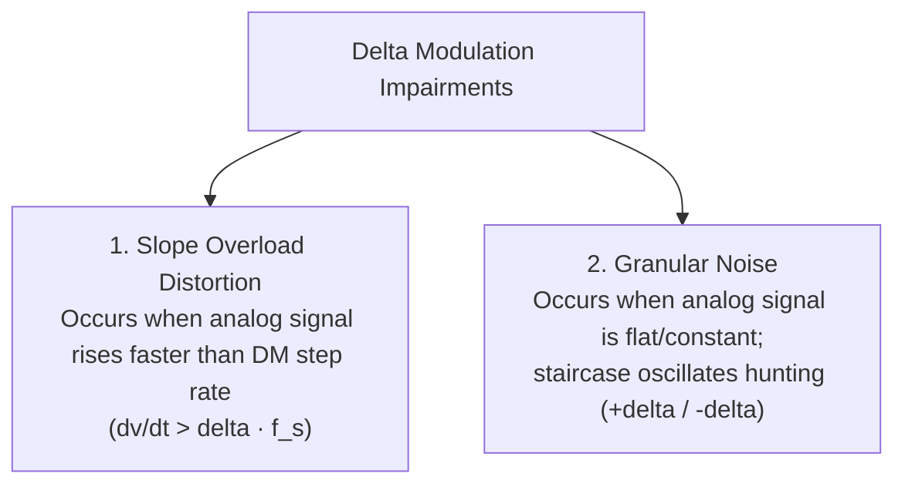

# 03 - Analog-to-Digital Conversion (PCM, Quantization, SQNR, DM)

> [!abstract] Key Takeaway
> **Pulse Code Modulation (PCM)** digitizes continuous analog waveforms in 3 steps: 
> 1. **Sampling** at the Nyquist rate ($f_s \ge 2 f_{max}$), 
> 2. **Quantization** into $L = 2^{n_b}$ discrete levels, and 
> 3. **Encoding** into binary bits.
> 
> Signal quality is bounded by **$\text{SNR}_{dB} = 6.02 n_b + 1.76\text{ dB}$**.

---

## 1. Pulse Code Modulation (PCM) Block Architecture



---

## 2. Step 1: Sampling & The Nyquist Theorem

```
Continuous Analog Wave: ~~~~~~~~~~~~~~~~~~~~~~~~~~~~~~~~~~
PAM Sampled Pulses:     |   |   |   |   |   |   |   |   |
Sampling Interval (Ts): |<-- Ts -->|  (Ts = 1 / fs)
```

> [!info] The Nyquist Sampling Theorem
> According to Nyquist, to perfectly reconstruct an analog signal with highest frequency $f_{max}$, the sampling rate $f_s$ must satisfy:
> $$f_s \ge 2 f_{max}$$
> - **Nyquist Rate:** $f_{s,\text{min}} = 2 f_{max}$.
> - If $f_s < 2 f_{max}$, high-frequency components wrap into lower frequencies, causing irreversible **Aliasing Distortion**.

---

## 3. Step 2: Quantization Mathematics & SQNR

The continuous PAM amplitude range $[V_{min}, V_{max}]$ is divided into $L = 2^{n_b}$ discrete horizontal zones.

### 1. Quantization Step Size ($\Delta$)
$$\Delta = \frac{V_{max} - V_{min}}{L} = \frac{V_{max} - V_{min}}{2^{n_b}}$$

### 2. Maximum Quantization Error ($e_q$)
$$|e_q| \le \frac{\Delta}{2}$$

### 3. Signal-to-Quantization-Noise Ratio ($\text{SQNR}_{dB}$)
For a full-scale sinusoidal input signal:
$$\text{SNR}_{dB} = 6.02 n_b + 1.76\text{ dB}$$

> [!tip] The "6 dB per Bit" Rule
> Each additional bit of quantization ($n_b \to n_b + 1$) doubles the number of voltage levels and improves signal fidelity by **$\approx 6\text{ dB}$**!

---

## 4. Step 3: Encoding & PCM Voice Math

$$\text{Bit Rate } N = f_s \times n_b = 2 f_{max} \times n_b \quad (\text{bps})$$

> [!example]- Classic Telephone Voice Digitization (DS0 Standard)
> - Human telephone voice bandwidth: $f_{max} = 4000\text{ Hz}$ ($4\text{ kHz}$).
> - **Nyquist Sampling Rate:** $f_s = 2 \times 4000 = \mathbf{8000\text{ samples/sec}}$.
> - Using $n_b = 8\text{ bits/sample}$ ($L = 256\text{ levels}$):
> - **Bit Rate ($N$):**
>   $$N = 8000\text{ samples/s} \times 8\text{ bits/sample} = \mathbf{64,000\text{ bps}} = \mathbf{64\text{ kbps}}$$
> - **$\text{SNR}_{dB}$:**
>   $$\text{SNR}_{dB} = 6.02(8) + 1.76 = \mathbf{49.92\text{ dB}}$$

---

## 5. Delta Modulation (DM) & Its Impairments

Delta Modulation is a lightweight 1-bit alternative to PCM:
- If analog signal $>$ staircase $\implies$ output **`1`** (step up by $+\delta$).
- If analog signal $<$ staircase $\implies$ output **`0`** (step down by $-\delta$).



---
#### Navigation
← Previous: [[02 - Block Coding (4B-5B) & Scrambling (B8ZS, HDB3)]] | Next: [[04 - Book Extras & Professor Traps]] →
