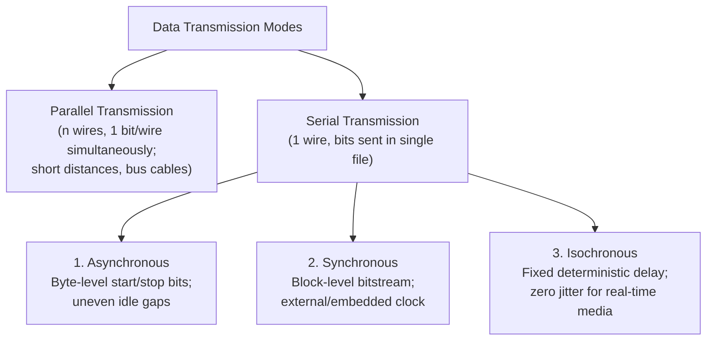

# 05 - Transmission Modes (Parallel vs Serial Async, Sync, Isochronous)

> [!abstract] Key Takeaway
> - **Parallel Transmission:** Sends $n$ bits simultaneously across $n$ parallel wires (fast, but restricted to short distances due to **clock skew**).
> - **Serial Transmission:** Sends bits sequentially over a single physical wire.
>   - **Asynchronous:** Byte-by-byte framing with **Start (0)** and **Stop (1)** bits ($20-30\%$ overhead).
>   - **Synchronous:** Continuous bitstream framed by preambles (high efficiency, $<2\%$ overhead).
>   - **Isochronous:** Fixed, uniform time intervals for real-time jitter-sensitive media.

---

## 1. Taxonomy of Transmission Modes



---

## 2. In-Depth Comparison: Parallel vs Serial

| Dimension | Parallel Transmission | Serial Transmission |
| :--- | :--- | :--- |
| **Physical Channel** | $n$ separate physical wires | $1$ communication channel (pair of wires / fiber) |
| **Transmission Mechanism** | $n$ bits sent simultaneously in 1 clock cycle | 1 bit sent per clock cycle |
| **Limiting Factor** | **Clock Skew:** High-frequency electrical pulses travel at slightly different speeds across parallel wires, arriving out of phase at the receiver. | Receiver clock synchronization |
| **Distance Limit** | Very short ($< 1\text{ meter}$, motherboard traces, internal buses) | Long distances (kilometers across global networks) |
| **Installation Cost** | High ($n \times$ copper cost and complex connector pins) | Low ($1 \times$ channel cost) |

---

## 3. Asynchronous vs Synchronous Serial Transmission

### A. Asynchronous Transmission Architecture

```
Idle Line (1) ──► [ Start Bit: 0 ] ──► [ 8 Data Bits (LSB first) ] ──► [ Parity ] ──► [ Stop Bit(s): 1 ] ──► Gap
                  (Alerts receiver)                                                   (Returns to Idle)
```

- The receiver resynchronizes its local sampling clock on the leading edge of every **Start Bit (`0`)**.
- **Overhead Calculation:**
  $$\text{Overhead \%} = \frac{\text{Start Bits} + \text{Stop Bits} + \text{Parity Bits}}{\text{Total Bits Transmitted}} \times 100\%$$

> [!example]- Worked Asynchronous Overhead Problem
> **Scenario:** An asynchronous serial port transmits 8-bit ASCII characters with 1 start bit, 1 parity bit, and 2 stop bits.
> - Data bits $= 8$.
> - Overhead bits $= 1\text{ (Start)} + 1\text{ (Parity)} + 2\text{ (Stop)} = 4\text{ bits}$.
> - Total bits transmitted per character $= 8 + 4 = 12\text{ bits}$.
> $$\text{Overhead Percentage} = \frac{4}{12} \times 100\% = \mathbf{33.33\%}$$
> *(One-third of total channel capacity is wasted on framing!)*

---

### B. Synchronous Transmission Architecture
- Data bits are aggregated into large multi-kilobyte blocks (frames) without individual character start/stop bits.
- Clock synchronization is maintained continuously via **Line Coding transitions** (e.g., Manchester/scrambling) or an 8-byte **Preamble**.
- **Overhead:** Frame header/trailer overhead is typically **$< 2\%$**, delivering maximum line rate efficiency.

---

### C. Isochronous Transmission Architecture
- In real-time broadcast audio/video, uneven delays between successive frames (**jitter**) causes audio popping and video stuttering.
- **Isochronous transmission** guarantees that data arrives at strictly fixed, uniform time intervals with **deterministic latency and zero jitter**.

---

## 4. "Why" Questions & Exam Traps

> [!question] Why have modern high-speed computer buses (such as PCIe, SATA, and USB) replaced legacy parallel buses (such as IDE and Parallel ATA) with serial links?
> **Answer:**
> - At multi-gigahertz clock frequencies, **cross-talk electromagnetic interference** and **clock skew** across parallel ribbon wires make synchronized reception impossible beyond a few centimeters.
> - Modern serial links use dedicated differential signaling over a single pair with embedded clock recovery, achieving speeds in excess of $32\text{ Gbps}$ per lane without skew!

---
#### Navigation
← Previous: [[04 - Analog-to-Digital Conversion (PCM, Quantization, SQNR, DM)]] | Next: [[06 - Book Extras & Professor Traps]] →
