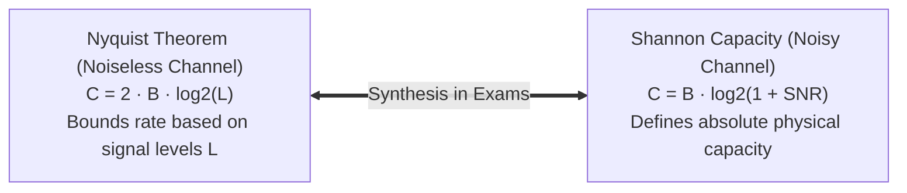

# 06 - Book Extras & Professor Traps (Physical Layer)

> [!abstract] Key Takeaway
> This document details advanced theoretical derivations from **Behrouz Forouzan (4th Edition)**, including the interplay between **Nyquist bit rate and Shannon channel capacity**, **Companding mathematical models**, and top physical layer exam pitfalls.

---

## 1. The Nyquist-Shannon Theoretical Limit Synthesis



### 1. Nyquist Bit Rate (Noiseless Channel)
$$\text{BitRate}_{max} = 2 \times B \times \log_2(L) \quad (\text{bps})$$
- Tells us how many signal levels $L$ are required to achieve a desired data rate over bandwidth $B$.

### 2. Shannon Capacity (Noisy Channel)
$$C = B \times \log_2(1 + \text{SNR}) \quad (\text{bps})$$
- Tells us the **absolute theoretical upper bound** on data transmission that cannot be exceeded by any physical encoding scheme, regardless of how many levels $L$ are used!

> [!example]- Classic Combined Exam Problem: Finding Required Levels $L$
> **Problem:** A telephone line has bandwidth $B = 3000\text{ Hz}$ and $\text{SNR}_{dB} = 31.62\text{ dB}$ ($\text{SNR} \approx 1452$). We wish to transmit at the maximum possible data rate.
> 
> **Step 1: Calculate Shannon Maximum Capacity ($C$):**
> $$C = 3000 \times \log_2(1 + 1452) \approx 3000 \times \log_2(1453) \approx 3000 \times 10.505 = \mathbf{31,515\text{ bps}}$$
> 
> **Step 2: Use Nyquist Formula to find required Signal Levels ($L$):**
> $$\text{BitRate} = 2 \times B \times \log_2(L) \implies 31,515 = 2 \times 3000 \times \log_2(L)$$
> $$\log_2(L) = \frac{31,515}{6000} \approx 5.25 \implies L = 2^{5.25} \approx \mathbf{38.1} \implies \mathbf{L = 64 \text{ levels}}$$

---

## 2. Mathematical Models of Companding

In telephone PCM, companding standardizes voice dynamic range:

```
                  Compressor (Tx) ──► Channel (PCM) ──► Expander (Rx)
Linear Input x ──► [ y = f(x) ]   ──► Quantization  ──► [ x = f^-1(y) ] ──► Output
```

1. **$\mu$-Law (North America & Japan - $\mu = 255$):**
   $$y = \frac{\ln(1 + \mu |x|)}{\ln(1 + \mu)} \cdot \text{sgn}(x)$$
2. **A-Law (Europe & International - $A = 87.6$):**
   $$y = \begin{cases} \frac{A |x|}{1 + \ln A} \cdot \text{sgn}(x) & \text{for } |x| < \frac{1}{A} \\ \frac{1 + \ln(A |x|)}{1 + \ln A} \cdot \text{sgn}(x) & \text{for } \frac{1}{A} \le |x| \le 1 \end{cases}$$

---

## 3. Top 5 Professor Traps in Physical Layer

| # | Common Student Error | Ground Truth Reality | Exam Context |
| :---: | :--- | :--- | :--- |
| **1** | Confusing **Baud Rate ($S$)** with **Bit Rate ($N$)**. | Baud is the number of **signal pulses/second**; Bit rate is the number of **bits/second**. ($N = S \times r$). | Short answer definition / calculation. |
| **2** | Forgetting to convert **$\text{SNR}_{dB}$** to linear ratio in Shannon's formula. | In $C = B \log_2(1 + \text{SNR})$, $\text{SNR}$ is a **linear power ratio**, NOT in decibels! ($\text{SNR} = 10^{\text{SNR}_{dB}/10}$). | Channel capacity calculation. |
| **3** | Misidentifying the **Manchester transition direction**. | In standard 802.3 Manchester: **Low-to-High ($\uparrow$) is `0`**, **High-to-Low ($\downarrow$) is `1`**. | Waveform decoding problem. |
| **4** | Forgetting the $+1.76\text{ dB}$ constant in the SQNR formula. | $\text{SNR}_{dB} = 6.02 n_b + 1.76\text{ dB}$ (The $1.76\text{ dB}$ comes from sinusoidal signal power: $10 \log_{10}(1.5)$). | Quantization noise proof. |
| **5** | Applying **B8ZS substitution** to 4 zeros instead of 8. | **B8ZS** substitutes **8 zeros** (`000VB0VB`); **HDB3** substitutes **4 zeros** (`000V` or `B00V`). | Scrambling trace problem. |

---
#### Navigation
← Previous: [[05 - Transmission Modes (Parallel vs Serial Async, Sync, Isochronous)]] | Next: [[07 - Comprehensive Worked Numericals & Exam Problems]] →
