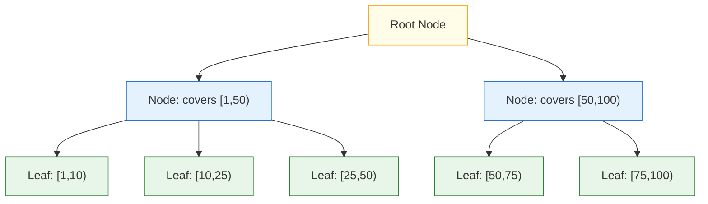
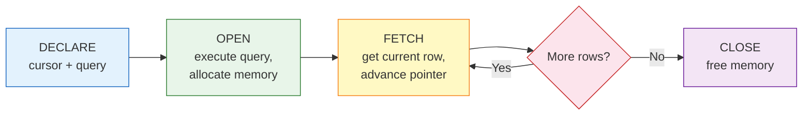
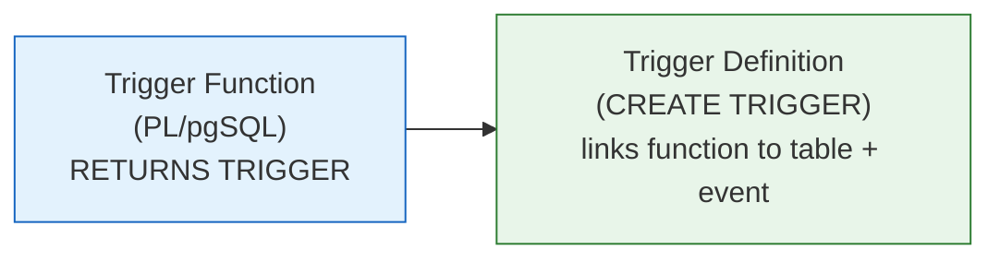
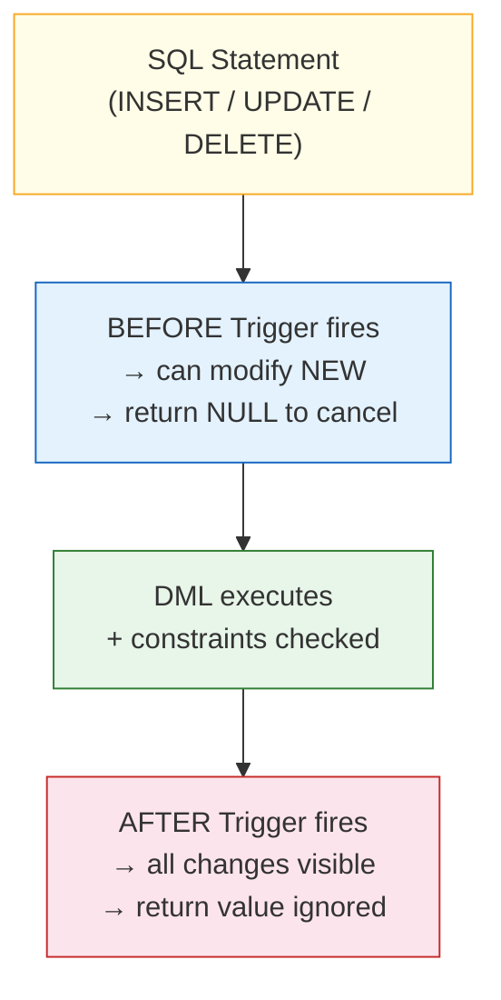

# CSE 4409 — Database Management 2

**Dr. Abu Raihan Mostofa Kamal | IUT CSE** _Notes compiled from Lecture Material v2.0 (Updated June 15, 2026)_

**Tags:** #Database #PostgreSQL #PLpgSQL #DBMS

---

## Table of Contents

- [[#Chapter 1 — Syllabus Overview]]
- [[#Chapter 2 — PostgreSQL Installation & Connection]]
- [[#Chapter 3 — PL/pgSQL Basics]]
    - [[#3.1 What is PL/pgSQL?]]
    - [[#3.2 PL/pgSQL Blocks]]
    - [[#3.3 Basic Datatypes]]
        - [[#3.3.1 Numbers]]
        - [[#3.3.2 Character Types]]
        - [[#3.3.3 Arrays]]
        - [[#3.3.4 Date & Time]]
        - [[#3.3.5 Network Address Types]]
        - [[#3.3.6 Range Types]]
        - [[#3.3.7 GiST Indexes for Range Types]]
        - [[#3.3.8 Composite Types]]
        - [[#3.3.9 Domain Types]]
- [[#Chapter 4 — Control Structures]]
    - [[#4.1 IF / ELSE]]
    - [[#4.2 CASE]]
    - [[#4.3 LOOP]]
    - [[#4.4 FOR]]
    - [[#4.5 Best Practices]]
- [[#Chapter 5 — Functions & Procedures]]
    - [[#5.1 Benefits]]
    - [[#5.2 Creating Functions]]
    - [[#5.3 Parameter Modes (IN / OUT / INOUT)]]
    - [[#5.4 %TYPE, %ROWTYPE, RECORD]]
    - [[#5.5 Returning Multiple Rows]]
- [[#Chapter 6 — Exception Handling]]
    - [[#6.1 Built-in Exceptions]]
    - [[#6.2 User-defined Exceptions]]
- [[#Chapter 7 — Cursors]]
    - [[#7.1 Implicit Cursor]]
    - [[#7.2 Explicit Cursor]]
    - [[#7.3 Cursor FOR Loop]]
- [[#Chapter 8 — Triggers]]
- [[#Chapter 9 — Dynamic SQL & Datatype Casting]]

---

## Chapter 1 — Syllabus Overview

> [!info] Topics Covered
> 
> - Database basic constructs: Table, Key, Index, View, Mapping Cardinality
> - PL/pgSQL basics: blocks, variables, datatypes, arrays, control structures, cursors, casting, dynamic SQL, built-in functions
> - Functions and Procedures
> - Exception Handling
> - Triggers

---

## Chapter 2 — Prerequisite: PostgreSQL Installation & Connection

### Installation

|OS Family|Link|
|---|---|
|Red Hat / Fedora|`postgresql.org/download/linux/redhat/`|
|Ubuntu / Debian|`postgresql.org/download/linux/ubuntu/`|

### Connecting to the Database

#### Step 1 — Connect as `postgres` (the superuser)

```bash
sudo -u postgres psql
```

Then set a password inside `psql`:

```sql
\password postgres
-- type your password (e.g. test123)
```

#### Step 2 — Create a new user + database

```sql
CREATE USER raihan WITH PASSWORD 'raihan123';
CREATE DATABASE dbiut OWNER raihan;
```

#### Step 3 — Connect as the new user

```bash
psql -U raihan -d dbiut
```

---

### Peer Authentication Error Fix

If you get:

```
FATAL: Peer authentication failed for user "armk"
```

**Option A (Temporary)** — bypass the Unix socket:

```bash
psql -h localhost -U armk -d dbarmk
```

**Option B (Permanent)** — edit `pg_hba.conf`:

1. Find the file location from inside psql:

```sql
SHOW hba_file;
```

2. Edit the file:

```bash
sudo nano /var/lib/pgsql/18/data/pg_hba.conf
```

3. Change the `local` line:

```
# Before:
local   all   all   peer

# After:
local   all   all   scram-sha-256
```

4. Restart the service:

```bash
# Find the service name:
systemctl list-units | grep postgres
# Restart:
sudo systemctl restart postgresql-18.service
```

---

### pgAdmin Setup

```bash
# Set postgres password for pgAdmin login
sudo -i -u postgres psql -c "ALTER USER postgres WITH PASSWORD 'test123';"
```

Enable IPv4 password auth in `pg_hba.conf`:

```
host   all   all   127.0.0.1/32   scram-sha-256
```

Then open pgAdmin → New Server → host: `127.0.0.1`, user: `raihan`, password: `raihan123`.

---

## Chapter 3 — PL/pgSQL Basics

### 3.1 What is PL/pgSQL?

**PL/pgSQL** = Procedural Language / PostgreSQL. It is a procedural extension on top of SQL that allows:

- Loops, conditionals, variables, control flow
- User-defined **functions**, **stored procedures**, and **triggers**

PostgreSQL also supports PL/Java, PLV8, PL/Python, PL/Perl, etc.

> [!tip] Check installed extensions
> 
> ```sql
> \dx
> ```

#### Benefits

> [!success] Benefits of PL/pgSQL
> - **Integration:** Execute SQL commands seamlessly inside procedural blocks.
> - **Performance:** Precompiled code reduces parsing overhead and eliminates extra client-server round trips.
> - **Server-side execution:** Direct database access is highly efficient.
> - **Portability:** Easy code migration across OS/platforms.
> - **Re-usability:** Functions/triggers reusable across systems and users.
> - **Centralised logic:** Business logic lives at the DB layer for consistency.
> - **Security:** Security Definer lets operations run with elevated privileges.

---

### 3.2 PL/pgSQL Blocks

PL/pgSQL is **block-structured**. Every unit of code is a block.

```
Two types:
1. Anonymous (unnamed) blocks  → DO
2. Named blocks                → Functions / Stored Procedures
```

#### Anonymous Blocks — General Structure

```sql
DO $$
[ <<label>> ]
[ DECLARE
    -- variable declarations
]
BEGIN
    -- statements
END [ label ];
$$;
```

**Example 1 — Hello World:**

```sql
DO
$$
BEGIN
    RAISE NOTICE 'Hello World From Postgre Database';
END;
$$;
```

**Example 2 — Variables + arithmetic:**

```sql
DO
$$
DECLARE
    X NUMERIC := 102.32;
    Y NUMERIC := 23.43;
BEGIN
    RAISE NOTICE 'Hello World: THE VALUE OF X IS % AND Y IS %', X, Y;
    RAISE NOTICE 'Hello World: Their sum is %', X + Y;
END;
$$;
```

> [!note] `%` in `RAISE NOTICE` is a positional placeholder — replaced left-to-right by the listed values.

---

#### Named Blocks — Functions

Named blocks are stored in the DB, can be called repeatedly, and accept parameters.

**Example — Factorial:**

```sql
CREATE OR REPLACE FUNCTION factorial(num INTEGER)
RETURNS INTEGER AS $$
DECLARE
    result INTEGER := 1;
BEGIN
    FOR i IN 1..num LOOP
        result := result * i;
    END LOOP;
    RETURN result;
END;
$$ LANGUAGE plpgsql;

-- Call it:
SELECT factorial(7);
```

**With labels (for readability):**

```sql
CREATE OR REPLACE FUNCTION factorial(num INTEGER)
RETURNS INTEGER AS $$
DECLARE
    result INTEGER := 1;
BEGIN
    <<factorial_loop>>
    FOR i IN 1..num LOOP
        result := result * i;
    END LOOP factorial_loop;
    RETURN result;
END;
$$ LANGUAGE plpgsql;
```

> [!tip] Labels `<<name>>` are purely for readability. They name a block or loop so you can reference it with `EXIT label` or `CONTINUE label`.

---

### 3.3 Basic Datatypes

#### 3.3.1 Numbers

|Name|Storage|Description|Range|
|---|---|---|---|
|`smallint`|2 bytes|Small integer|$-32768$ to $+32767$|
|`integer`|4 bytes|Standard integer|$-2147483648$ to $+2147483647$|
|`bigint`|8 bytes|Large integer|$\pm 9.2 \times 10^{18}$|
|`decimal` / `numeric`|variable|Exact precision|Up to 131072 digits before decimal|
|`real`|4 bytes|Inexact float|~6 decimal digit precision|
|`smallserial`|2 bytes|Auto-increment|1 to 32767|
|`serial`|4 bytes|Auto-increment|1 to 2147483647|

---

#### 3.3.2 Character Types

Use `VARCHAR(n)` or `TEXT`.

> [!note] `TEXT` is PostgreSQL's **native** string type (not in the SQL standard, but widely supported). Prefer it over `VARCHAR` when no length limit is needed.

---

#### 3.3.3 Arrays

**Declaration:**

```sql
DECLARE
    my_array INTEGER[];
```

**Initialisation:**

```sql
DECLARE
    my_array INTEGER[] := '{1, 2, 3}';
```

**Access by index (1-based):**

```sql
DO
$$
DECLARE
    my_array INTEGER[] := '{1, 2, 3}';
    second_element INTEGER;
BEGIN
    second_element := my_array[2];
    RAISE NOTICE 'second element from my array is: %', second_element;
END;
$$;
```

**Loop over array:**

```sql
DO
$$
DECLARE
    my_array INTEGER[] := '{1, 2, 3}';
    total INTEGER := 0;
BEGIN
    FOR i IN 1..array_length(my_array, 1) LOOP
        total := total + my_array[i];
    END LOOP;
    RAISE NOTICE 'total of the elements in my array is: %', total;
END;
$$;
```

> [!important] `array_length(arr, dim)` requires **two arguments** because PostgreSQL supports multidimensional arrays. Dimension 1 = rows, Dimension 2 = columns.

---

#### 3.3.4 Date & Time

Types available: `TIMESTAMP`, `DATE`, `TIME` — each optionally with timezone.

##### Date Arithmetic

```sql
-- Add 5 days to a literal date
SELECT '2023-10-15'::date + INTERVAL '5 days';

-- Add to current date
SELECT CURRENT_DATE + INTERVAL '5 days';
SELECT CURRENT_DATE + INTERVAL '2 months';
SELECT CURRENT_DATE + INTERVAL '1 year 3 months 10 days';
SELECT CURRENT_TIMESTAMP + INTERVAL '1 year 8 months 14 days';

-- Human-readable format
SELECT TO_CHAR(CURRENT_DATE + INTERVAL '7 days', 'Month DD YYYY');
```

##### Extracting Parts

```sql
SELECT EXTRACT(YEAR FROM CURRENT_DATE);
SELECT EXTRACT(YEAR FROM NOW());

SELECT EXTRACT(YEAR  FROM TIMESTAMP '2026-04-20');  -- 2026
SELECT EXTRACT(MONTH FROM TIMESTAMP '2026-04-20');  -- 4
```

##### AGE Function

|Syntax|Description|
|---|---|
|`AGE(timestamp)`|Subtracts timestamp from **current date**|
|`AGE(ts1, ts2)`|Subtracts `ts2` from `ts1`|

```sql
SELECT AGE('1977-11-01'::date);
SELECT AGE(TIMESTAMP '2000-01-01');
SELECT AGE('2024-01-01', '1990-05-15');
SELECT AGE(TIMESTAMP '2026-01-01', TIMESTAMP '2023-10-21');

-- Use in WHERE clause
SELECT name FROM users
WHERE AGE(birth_date) >= INTERVAL '18 years';
```

##### Type Casting Note

These two are equivalent:

```sql
SELECT TIMESTAMP '2026-01-01';
SELECT '2026-01-01'::TIMESTAMP;
```

##### Date in WHERE Clauses

```sql
-- Records from the last 7 days
SELECT * FROM users
WHERE created_at >= NOW() - INTERVAL '7 days';

-- Records from the last 1 hour
SELECT * FROM error_logs
WHERE log_time >= NOW() - INTERVAL '1 hour';
```

---

#### 3.3.5 Network Address Types

##### Background

|Concept|Meaning|
|---|---|
|**INET**|A specific IP address — _"where"_ to send data|
|**CIDR**|A block of IPs with a routing prefix — _"how big"_ the network is|

CIDR notation: `192.168.1.0/24` → first 24 bits are the network ID, last 8 bits for hosts = $2^8 = 256$ addresses. Max value for `/x` is **32**.

##### PostgreSQL Network Types

|Type|Stores|
|---|---|
|`cidr`|IPv4 and IPv6 **networks**|
|`inet`|IPv4 and IPv6 **hosts and networks**|
|`macaddr`|MAC addresses|

**Schema + Data:**

```sql
CREATE TABLE networking_sample (
    ip_cidr    cidr,
    ip_inet    inet,
    mac_macaddr macaddr
);

-- Valid insert
INSERT INTO networking_sample VALUES
    ('10.20.30.101', '10.20.30.101/24', '00-0c-29-8f-ca-0a');

-- MORE INSERTS (mixed IPv4 / IPv6)
INSERT INTO networking_sample (ip_column, cidr_column, mac_column) VALUES
    ('192.168.1.50',              '192.168.1.0/24',     '08:00:27:01:23:45'),
    ('2001:db8:85a3::8a2e:370:7334', '2001:db8:85a3::/64', '00:15:5d:01:ca:b2'),
    ('127.0.0.1',                 '127.0.0.0/8',        '00:00:00:00:00:00'),
    ('fe80::20c:29ff:fe8f:ca0a',  'fe80::/64',          '00:0c:29:8f:ca:0a'),
    ('8.8.8.8',                   '8.8.8.0/24',         '44:33:44:33:44:33');

-- INVALID: /84 exceeds max of /32
INSERT INTO networking_sample VALUES
    ('10.20.30.101', '10.20.30.101/84', '00-0c-29-8f-ca-0a');  -- ERROR

-- INVALID: 'o' instead of '0'
INSERT INTO networking_sample VALUES
    ('10.20.30.1o1', '10.20.30.101/24', '00-0c-29-8f-ca-0a');  -- ERROR

-- VALID: /32 = single host
INSERT INTO networking_sample VALUES
    ('10.20.34.161', '10.20.30.101/32', '00-0c-29-8f-ca-0a');  -- OK

-- Classify IPv4 vs IPv6
SELECT family(ip_cidr) FROM networking_sample;

-- View all
SELECT * FROM networking_sample;
```

> [!note] When inserting a CIDR with `/32`, PostgreSQL automatically annotates it as a single-host address.

> [!info]- How it works mathematically
> **The Golden Rule of the `cidr` Data Type:** Any bits to the right of the subnet mask (the host bits) **MUST be zero.** It enforces that you are storing a true network address, not a specific device's address within a larger network.
> 
> * **A normal network (Valid):** `192.168.1.0/24`. The host bits (last 8 bits) are all zeros. Valid.
> * **A host in a network (Invalid):** `192.168.1.5/24`. The host bits are `.5` (not zero). PostgreSQL throws an error (`invalid cidr value: "192.168.1.5/24" Detail: Value has bits set to right of mask`).
> * **A `/32` address (Valid):** `192.168.1.5/32`. There are exactly zero host bits, so it is impossible for any host bits to be non-zero. It satisfies the `cidr` rule perfectly.
> 
> In networking theory, a `/32` is considered a "host route" or a "network of exactly one".

##### Why NOT store IPs as TEXT?

|Problem with TEXT|Solution with INET/CIDR|
|---|---|
|Accepts invalid values like `192.168.1.300`|Strict format validation — invalid IPs are rejected immediately|
|Only `LIKE` pattern matching|Powerful subnet operators like `<<` (contained by)|
|Lexicographic sort (`"10.0.0.10"` before `"10.0.0.2"`)|Numeric sort — correct IP ordering|
|String storage is larger|Binary storage — more compact, especially for IPv6|

##### Network Address Operators

> [!example] `<<` (Contained by)
> Returns true if the network or address on the left is strictly contained within the right.
> ```sql
> SELECT inet '192.168.1.5' << cidr '192.168.1.0/24'; -- TRUE
> SELECT cidr '10.1.0.0/16' << cidr '10.0.0.0/8';     -- TRUE
> ```

> [!example] `<<=` (Contained by or equals)
> ```sql
> SELECT inet '192.168.1.5' <<= inet '192.168.1.5';   -- TRUE
> ```

> [!example] `>>` (Contains)
> Returns true if the subnet on the left strictly contains the right.
> ```sql
> SELECT cidr '10.0.0.0/8' >> inet '10.5.5.5';        -- TRUE
> ```

> [!example] `>>=` (Contains or equals)
> ```sql
> SELECT cidr '192.168.1.0/24' >>= cidr '192.168.1.0/24'; -- TRUE
> ```

> [!example] `&&` (Overlaps)
> Returns true if there is any common address space between the two.
> ```sql
> SELECT cidr '192.168.1.0/24' && cidr '192.168.1.0/25'; -- TRUE
> ```

**Practical Usage:**
```sql
SELECT * FROM access_logs
WHERE client_ip << '172.16.0.0/12';
```

**Classify family:**

```sql
SELECT ip_inet, family(ip_cidr)
FROM networking_sample;
-- family() returns 4 for IPv4, 6 for IPv6
```

---

#### 3.3.6 Range Types

> A **range type** stores a _span_ of values in a single column. Useful for scheduling, session tracking, and overlap/containment queries.

##### Boundary Notation

|Syntax|Meaning|
|---|---|
|`[a, b]`|$a \leq x \leq b$ (both inclusive)|
|`[a, b)`|$a \leq x < b$|
|`(a, b)`|$a < x < b$ (both exclusive)|
|`(a, b]`|$a < x \leq b$|

##### Built-in Range Types

|Type|Description|Example|
|---|---|---|
|`int4range`|Range of `integer`|`[1, 100)`|
|`int8range`|Range of `bigint`|`[1, 1000000000)`|
|`numrange`|Range of `numeric`|`[1.5, 9.9]`|
|`tsrange`|Timestamp range (microsecond level)|`[2026-05-04 10:00, 2026-05-04 11:00]`|
|`daterange`|Date range (day level)|`[2026-05-04, 2026-05-10]`|

##### Canonical Form (Discrete Types)

PostgreSQL **normalises** discrete ranges to the form `[a, b)` — lower inclusive, upper exclusive.

```sql
SELECT '[1, 10]'::int4range;   -- → [1,11)
SELECT '(1, 10)'::int4range;   -- → [2,10)
```

**Why do this? (The real reason)**
Because discrete bounds can be expressed in multiple ways (`[1, 10]`, `(0, 10]`, `[1, 11)`, and `(0, 11)` all represent the exact same set of integers: `1,2,3,4,5,6,7,8,9,10`), allowing multiple formats makes equality comparisons and indexing unnecessarily complicated. 
By forcing all equivalent discrete ranges into a **single, consistent canonical form** (`[inclusive, exclusive)`), PostgreSQL can perform operations like `=` (equality checks), overlaps, and B-Tree/GiST indexing much faster. It just compares the normalized bounds directly.

> [!note] Continuous types like `numrange` are **not** canonicalised:
> 
> ```sql
> SELECT '[1.0, 10.0]'::numrange;  -- stays [1.0,10.0]
> ```
> 
> Because between 10 and 11 there are infinitely many real numbers ($10.0001$, $10.5$, etc.), so `[1.0, 10.0]` and `[1.0, 11.0)` do **not** represent the same set of values. Therefore, PostgreSQL cannot normalize them.

##### Range Operators

**Equality / Comparison (`<`, `>`, `=`)**

> [!warning] How `<` and `>` work (Sorting, not Position)
> The `<` operator does **not** mean "strictly left of". It is used for B-Tree sorting (`ORDER BY`). PostgreSQL determines sorting by **comparing the lower bounds first**. It only compares upper bounds if the lower bounds are exactly the same.
> ```sql
> -- TRUE because the lower bound 1 is less than 2, even though 9 extends past 8!
> SELECT '[1, 9)'::int4range < '[2, 8)'::int4range; 
> ```

```sql
SELECT '[1, 10)'::int4range = '[1, 10)'::int4range;  -- true
SELECT '[1, 10)'::int4range = '(1, 10)'::int4range;  -- false
SELECT '[1, 5)'::int4range < '[2, 8)'::int4range;    -- true
```

**Overlap `&&`** — do two ranges share any values?

```sql
SELECT '[1, 10]'::int4range && '[10, 15]'::int4range;  -- true  (10 is shared)
SELECT '[1, 10)'::int4range && '[10, 15]'::int4range;  -- false (10 excluded on left)
```

**Containment `@>` vs "Strictly Left/Right" `<<`**

> [!tip] `<<` means something different for Ranges!
> Unlike IP addresses (where `<<` means contained by), for ranges:
> - `@>` means **contains** and `<@` means **is contained by**.
> - `<<` means **strictly left of** (no overlap, entirely before).
> - `>>` means **strictly right of** (no overlap, entirely after).
> ```sql
> SELECT '[1, 5)'::int4range << '[10, 20)'::int4range; -- true (1..4 is entirely before 10..19)
> ```

```sql
SELECT '[1, 10)'::int4range @> 5;                     -- true
SELECT '[1, 20]'::int4range @> '[5, 12]'::int4range;  -- true
SELECT '[1, 20]'::int4range <@ '[5, 12]'::int4range;  -- false
```

**Adjacency `-|-`** — Are they right next to each other with NO gap and NO overlap?

> [!warning] Adjacency can look weird for integers!
> Because discrete types are canonicalized to `[inclusive, exclusive)`, ranges that look like they have a gap might actually be perfectly adjacent!
> ```sql
> -- TRUE! [1, 5] normalizes to [1, 6). The next integer is 6, so [1,6) and [6,11) are perfectly adjacent!
> SELECT '[1, 5]'::int4range -|- '[6, 10]'::int4range; 
> ```

```sql
SELECT '[1, 5]'::int4range -|- '[5, 10]'::int4range;   -- false (5 overlaps, so not adjacent)
SELECT '[1, 5)'::int4range -|- '[5, 10]'::int4range;   -- true (perfectly adjacent at 5)
```

**Bound Extraction:**

```sql
SELECT lower('[4, 50)'::int4range);   -- 4
SELECT upper('[1, 10)'::int4range);   -- 10
SELECT upper('[1, 10]'::int4range);   -- 11  (canonical upper)
```

##### Working Example — Meeting Room Booking

**Schema:**

```sql
CREATE TABLE meeting_rooms (
    id       SERIAL PRIMARY KEY,
    name     VARCHAR(100) NOT NULL,
    capacity INTEGER NOT NULL,
    location VARCHAR(200)
);

CREATE TABLE reservations (
    id          SERIAL PRIMARY KEY,
    room_id     INTEGER REFERENCES meeting_rooms(id),
    time_slot   tsrange NOT NULL,
    reserved_by VARCHAR(100) NOT NULL,
    purpose     TEXT,
    created_at  TIMESTAMPTZ DEFAULT NOW()
);
```

**Data:**

```sql
INSERT INTO meeting_rooms (name, capacity, location) VALUES
    ('Auditorium',       300, 'Floor 1'),
    ('Board Room',        20, 'Floor 2'),
    ('DLT Room Library',  50, 'Floor 2');

INSERT INTO reservations (room_id, time_slot, reserved_by, purpose) VALUES
    (1, '[2026-01-30 09:00:00, 2026-01-30 10:30:00)', 'cse@iut.com', 'DBMS2 Project');

INSERT INTO reservations (room_id, time_slot, reserved_by, purpose) VALUES
    (1, '[2026-01-30 14:00:00, 2026-01-30 15:00:00)', 'swe@iut.com', 'Arabic Training');
```

**Queries:**

```sql
-- 1. List all rooms
SELECT id, name FROM meeting_rooms;

-- 2. Find all bookings (formatted start time)
SELECT id, room_id,
    TO_CHAR(lower(time_slot), 'YY Month YYYY HH24 MI SS') AS StartsAt,
    time_slot, purpose
FROM reservations;

-- 3. Find reservations overlapping a given time window
SELECT r.id, r.purpose, m.name AS where, r.time_slot AS when
FROM reservations r
JOIN meeting_rooms m ON r.room_id = m.id
WHERE r.time_slot && '[2026-01-30 09:15:00, 2026-01-30 11:00:00)'::tsrange;

-- 4. Find available rooms during a specific slot
SELECT m.*
FROM meeting_rooms m
WHERE NOT EXISTS (
    SELECT 1 FROM reservations r
    WHERE r.room_id = m.id
      AND r.time_slot && '[2026-01-30 11:00:00, 2026-01-30 12:00:00)'::tsrange
);

-- 5. Find all reservations for a day
SELECT r.id, r.purpose, m.name AS room_name
FROM reservations r
JOIN meeting_rooms m ON r.room_id = m.id
WHERE r.time_slot && '[2026-01-30, 2026-01-31)'::tsrange;

-- 6. Get duration of each reservation
SELECT id, reserved_by,
    upper(time_slot) - lower(time_slot) AS duration
FROM reservations;
```

---

#### 3.3.7 GiST Indexes for Range Types

A **GiST (Generalized Search Tree)** index is a balanced tree framework in PostgreSQL for complex types (geometry, ranges, full-text) where standard B-trees are unsuitable.



**Creating GiST Indexes:**

```sql
-- Step 1: Simple GiST index on time_slot
CREATE INDEX idx_reservations_time_slot
ON reservations USING GIST (time_slot);

-- Step 1.5: Install extension needed for composite index
CREATE EXTENSION IF NOT EXISTS btree_gist;
-- If this fails on Fedora/RHEL:
-- sudo dnf install postgresql18-contrib

-- Step 2: Composite GiST index (room + time)
CREATE INDEX idx_reservations_room_time
ON reservations USING GIST (room_id, time_slot);

-- Step 3: Verify it's being used
EXPLAIN ANALYZE
SELECT * FROM reservations
WHERE time_slot && '[2026-01-30 09:00:00, 2026-01-30 18:00:00)'::tsrange;
```

##### Exclusion Constraints

> [!warning] Why is this so important? (The Race Condition)
> You might wonder, "Why not just write a SELECT query in my Python/Java backend to check if the room is free, and if it is, INSERT the reservation?"
> 
> Because of **Race Conditions**. If two users try to book Room 101 for the exact same time, and they click "Book" at the exact same millisecond:
> 
> - **User A's** code checks the database: "Is it free?" -> Database says Yes.
> - **User B's** code checks the database: "Is it free?" -> Database says Yes.
> - **User A's** code inserts the reservation.
> - **User B's** code inserts the reservation.
> 
> **Result: Double booking.**
> 
> By putting the rule directly into the database using this EXCLUDE constraint, PostgreSQL acts as the ultimate gatekeeper. It locks the table for a microsecond during the insert, guaranteeing that a double-booking is mathematically impossible, no matter how many people click "Book" at the same time.

Prevent double-booking **at the table level** — the DB itself rejects conflicting inserts:

```sql
ALTER TABLE reservations
ADD CONSTRAINT no_overlapping_reservations
EXCLUDE USING GIST (
    room_id WITH =,       -- same room
    time_slot WITH &&     -- overlapping time
);
```

**Logic:** Reject a new row if an existing row has the **same `room_id` AND an overlapping `time_slot`**.

```sql
-- FAILS: room 1 conflicts with existing booking
INSERT INTO reservations (room_id, time_slot, reserved_by, purpose)
VALUES (1, '[2026-01-30 10:00:00, 2026-01-30 11:30:00)', 'cse@iut.com', 'DBMS2 Project');
-- ERROR: conflicting key value violates exclusion constraint

-- OK: room 3 has no conflict
INSERT INTO reservations (room_id, time_slot, reserved_by, purpose)
VALUES (3, '[2026-01-30 10:00:00, 2026-01-30 11:30:00)', 'cse@iut.com', 'DBMS2 Project');
```

---

#### 3.3.8 Composite Types

A **composite type** is a structured type — like a struct — that groups multiple fields into one.

> [!tip] Key Rules
> 
> - Use `ROW(...)` constructor for insertion
> - In SQL queries: `(compAttrName).fieldName` to access fields
> - In PL/pgSQL blocks: `varName.fieldName` (no outer parentheses)

**Example A — As a table attribute:**

```sql
-- Define the type
CREATE TYPE person_name AS (
    first_name  TEXT,
    middle_name TEXT,
    family_name TEXT
);

-- Use it in a table
CREATE TABLE customers (
    user_id   SERIAL PRIMARY KEY,
    full_name person_name,
    email     TEXT
);

-- Insert (recommended: ROW constructor)
INSERT INTO customers (full_name, email)
VALUES (ROW('Alice', 'Marie', 'Smith'), 'alice@example.com');

-- Insert (alternative: string literal — not recommended)
INSERT INTO customers (full_name, email)
VALUES ('("Bob", "Robert", "Jones")', 'bob@example.com');

-- Select whole composite object
SELECT full_name FROM customers;

-- Select specific sub-fields (note the parentheses)
SELECT (full_name).first_name, (full_name).family_name FROM customers;
```

**Example B — Numeric composite type:**

```sql
CREATE TYPE coordinates_3d AS (
    x NUMERIC,
    y NUMERIC,
    z NUMERIC
);

CREATE TABLE sensors (
    sensor_id INT,
    location  coordinates_3d
);

INSERT INTO sensors (sensor_id, location)
VALUES (101, ROW(12.5, 45.0, -1.25));

SELECT (location).x, (location).y FROM sensors;
```

**Example C — As a PL/pgSQL variable:**

```sql
DO $$
DECLARE
    v_user_name person_name;
    v_full_text TEXT;
BEGIN
    -- Assign using ROW constructor
    v_user_name := ROW('Leonardo', 'da', 'Vinci');

    -- Access fields (NO outer parentheses in PL/pgSQL)
    v_full_text := v_user_name.first_name || ' ' || v_user_name.family_name;
    RAISE NOTICE 'Full Name: %', v_full_text;
    RAISE NOTICE 'Middle Name: %', v_user_name.middle_name;

    -- Update a single field
    v_user_name.first_name := 'Leo';
    RAISE NOTICE 'Updated First Name: %', v_user_name.first_name;
END $$;
```

> [!warning] SQL vs PL/pgSQL field access
> 
> - **In SQL:** `(full_name).first_name` — parentheses required
> - **In PL/pgSQL block:** `v_user_name.first_name` — no parentheses

---

#### 3.3.9 Domain Types

A **domain** is a user-defined type that wraps an existing base type with extra constraints. Useful for enforcing the same rule across multiple tables without repeating it.

**Simple domain:**

```sql
CREATE DOMAIN dept TEXT CONSTRAINT dept_check
    CHECK (VALUE IN ('CSE', 'EEE', 'MPE'));

CREATE TABLE DEPTS (
    name     dept,
    location TEXT,
    budget   NUMERIC
);

INSERT INTO DEPTS VALUES ('CSE', 'AB2', 2.1);  -- OK
INSERT INTO DEPTS VALUES ('CS',  'AB2', 2.1);  -- FAILS: violates constraint

-- Reuse on another table — same constraint auto-applies
CREATE TABLE dept_achievements (
    deptname    dept,
    description TEXT,
    event_when  DATE
);

INSERT INTO dept_achievements VALUES ('MPE', 'The event A', NOW());
INSERT INTO dept_achievements VALUES ('MPE', 'The event B', NOW() - INTERVAL '10 months');
INSERT INTO dept_achievements VALUES ('ME',  'The event A', NOW());  -- FAILS
```

**Domain with multiple conditions:**

```sql
CREATE DOMAIN valid_product_code AS TEXT
CHECK (
    (VALUE LIKE 'PROD-%' AND LENGTH(VALUE) = 10)   -- Condition Group A
    OR
    (VALUE = 'INTERNAL-USE')                        -- Condition Group B
);

CREATE TABLE inventory (
    item_id      SERIAL PRIMARY KEY,
    item_name    TEXT NOT NULL,
    product_code valid_product_code NOT NULL
);

INSERT INTO inventory (item_name, product_code) VALUES ('Laptop',     'PROD-12345');   -- OK (A)
INSERT INTO inventory (item_name, product_code) VALUES ('Test Bench', 'INTERNAL-USE'); -- OK (B)
INSERT INTO inventory (item_name, product_code) VALUES ('Mouse',      'PROD-99');      -- FAILS (PROD- but length ≠ 10)
INSERT INTO inventory (item_name, product_code) VALUES ('Keyboard',   'GUEST-CODE');   -- FAILS (neither A nor B)
```

---

## Chapter 4 — Control Structures

### 4.1 IF / ELSE

```sql
-- Basic IF
DO $$
BEGIN
    IF 1 = 1 THEN
        RAISE NOTICE 'OK';
    END IF;
END;
$$;

-- IF with table query
CREATE TABLE IFTEST (ID NUMERIC);

DO $$
BEGIN
    IF (SELECT COUNT(*) FROM IFTEST) < 1 THEN
        RAISE NOTICE 'NO RECORDS ARE THERE IN THIS TABLE';
    ELSE
        RAISE NOTICE 'THERE ARE FEW RECORDS IN THIS TABLE';
    END IF;
END;
$$;
```

**Using `EXISTS`:**

```sql
DO $$
BEGIN
    IF EXISTS (SELECT * FROM IFTEST) THEN
        RAISE NOTICE 'THIS TABLE NOT EMPTY';
    ELSE
        RAISE NOTICE 'THE TABLE IS EMPTY';
    END IF;
END;
$$;
```

> [!tip] PL/pgSQL supports `EXISTS`, `IS NULL`, and `NOT` in conditions.

**Full IF / ELSIF / ELSE with variable:**

```sql
DO $$
DECLARE
    XCOUNT INTEGER := 0;
BEGIN
    SELECT COUNT(*) INTO XCOUNT FROM IFTEST;

    IF XCOUNT = 0 THEN
        RAISE NOTICE 'THIS TABLE IS EMPTY';
    ELSIF XCOUNT BETWEEN 1 AND 3 THEN
        RAISE NOTICE 'THE TABLE HAS ONLY FEW RECORDS';
    ELSE
        RAISE NOTICE 'THE TABLE HAS MORE RECORDS';
    END IF;
END;
$$;
```

---

### 4.2 CASE

Two forms of CASE:

#### Simple CASE — `CASE variable WHEN value`

```sql
DO $$
DECLARE
    XCOUNT INT := 0;
BEGIN
    SELECT COUNT(*) INTO XCOUNT FROM iftest;
    CASE XCOUNT
        WHEN 0 THEN
            RAISE NOTICE 'table is empty';
        WHEN 1 THEN
            RAISE NOTICE 'table has only one record';
        ELSE
            RAISE NOTICE 'table has a lot of records';
    END CASE;
END;
$$;
```

#### Searched CASE — `CASE WHEN boolean_expression`

Allows any Boolean expression including `BETWEEN`, `>`, `<`, `IS NULL`:

```sql
DO $$
DECLARE
    XCOUNT INT := 0;
BEGIN
    SELECT COUNT(*) INTO XCOUNT FROM iftest;
    CASE
        WHEN XCOUNT = 0 THEN
            RAISE NOTICE 'table is empty';
        WHEN XCOUNT BETWEEN 1 AND 3 THEN
            RAISE NOTICE 'table has only few records';
        ELSE
            RAISE NOTICE 'table has a lot of records';
    END CASE;
END;
$$;
```

**CASE with EXISTS:**

```sql
DO $$
BEGIN
    CASE
        WHEN EXISTS (SELECT * FROM iftest) THEN
            RAISE NOTICE 'table is not empty';
        WHEN NOT EXISTS (SELECT * FROM test) THEN
            RAISE NOTICE 'table is empty';
    END CASE;
END;
$$;
```

---

### 4.3 LOOP

A basic infinite loop that exits on a condition using `EXIT WHEN`:

```sql
DO $$
DECLARE
    v_count           INT := 0;
    v_iteration_count INT := 1;
BEGIN
    <<LoopingMark>>
    LOOP
        v_count := v_count + 1;
        EXIT WHEN v_count = 15;
        v_iteration_count := v_iteration_count + 1;
        RAISE NOTICE 'The value of counter is %', v_iteration_count;
    END LOOP LoopingMark;

    RAISE NOTICE 'After exiting the loop the value is %', v_iteration_count;
END;
$$;
```

> [!note] `<<LoopingMark>>` is a label for the loop, referenced in `END LOOP LoopingMark`. Allows `EXIT LoopingMark` to break out of a specific named loop when nesting.

---

### 4.4 FOR

#### Simple integer range (inclusive by default)

```sql
DO $$
BEGIN
    FOR i IN 1..5 LOOP
        RAISE NOTICE 'Current value: %', i;
    END LOOP;
END $$;
-- Outputs: 1, 2, 3, 4, 5
```

#### Generating mock data with `generate_series`

```sql
INSERT INTO test VALUES (generate_series(1, 3));

-- Equivalent to:
INSERT INTO test (column_name) VALUES (1), (2), (3);
```

#### FOR over a query result (implicit cursor)

```sql
DO $$
DECLARE
    v_rec RECORD;
BEGIN
    FOR v_rec IN (SELECT * FROM iftest) LOOP
        RAISE NOTICE 'Record ... %', v_rec;
    END LOOP;
END;
$$;
```

> [!tip] `FOR ... IN (query)` automatically opens an implicit cursor, fetches rows one at a time, and closes it — no manual cursor management needed.

---

### 4.5 Best Practices

|Practice|Rationale|
|---|---|
|Keep control statements simple|Avoids deep nesting; improves readability|
|Comment complex conditions|Helps other developers (and future you) understand intent|
|Test with boundary/edge inputs|Catches bugs before production|
|Use meaningful variable names|Makes code self-documenting|

---

## Chapter 5 — Functions & Procedures

### 5.1 Benefits

|Benefit|Detail|
|---|---|
|**Reduced round-trips**|One function call replaces 10 separate queries|
|**Plan caching**|PL/pgSQL caches query plans after first execution — less parsing overhead|
|**Less data transfer**|Only final result goes to client|
|**Single Source of Truth**|Logic in the DB layer is shared by web app, mobile app, BI tools — no duplication|
|**Security**|`GRANT EXECUTE` without exposing raw tables; `SECURITY DEFINER` for privilege elevation|
|**Maintainability**|One change to the function updates behaviour everywhere|

---

### 5.2 Creating Functions

#### Case 1 — Simple return

```sql
CREATE OR REPLACE FUNCTION do_multiply(a NUMERIC, b NUMERIC)
RETURNS NUMERIC
LANGUAGE plpgsql
AS $$
BEGIN
    RETURN a * b;
END;
$$;
```

#### Case 2 — Fetch DB value into a local variable

Use `SELECT col INTO var FROM table`:

```sql
CREATE OR REPLACE FUNCTION get_dbvalue(p_roomid NUMERIC)
RETURNS TEXT
LANGUAGE plpgsql
AS $$
DECLARE
    v_name TEXT;
BEGIN
    SELECT name INTO v_name
    FROM meeting_rooms
    WHERE id = p_roomid;
    RETURN v_name;
END;
$$;

-- Call standalone
SELECT get_dbvalue(3);

-- Call per-row (passes each id)
SELECT id, get_dbvalue(id) FROM meeting_rooms;
```

#### Calling a function inside another block

```sql
DO $$
DECLARE
    x TEXT;
BEGIN
    x = get_dbvalue(2);
    RAISE NOTICE 'x: %', x;
END $$;
```

---

### 5.3 Parameter Modes (IN / OUT / INOUT)

|Mode|Behaviour|
|---|---|
|`IN` (default)|Pass value into function. In PostgreSQL, `IN` parameters *are modifiable* inside the function (unlike Oracle).|
|`OUT`|Output only. Returned as part of the result. Ideal for returning **multiple values**. No `RETURN <var>` statement is needed at the end of the block.|
|`INOUT`|Both: caller passes a value, function can modify and return it.|

> [!important] Calling a function only requires passing `IN` parameters. `OUT` parameters are automatically returned.

#### Single OUT parameter

```sql
CREATE OR REPLACE FUNCTION myf1(a IN NUMERIC, OUT b NUMERIC)
LANGUAGE plpgsql
AS $$
BEGIN
    b := a * a;
END;
$$;

SELECT myf1(6);  -- returns 36
```

#### Multiple OUT parameters

```sql
CREATE OR REPLACE FUNCTION myf2(a IN NUMERIC, OUT b NUMERIC, OUT c NUMERIC)
LANGUAGE plpgsql
AS $$
BEGIN
    b := a * a;
    c := a + a;
END;
$$;

SELECT myf2(9);          -- (81, 18)
SELECT b FROM myf2(8);   -- 64
SELECT c FROM myf2(6);   -- 12
SELECT b, c FROM myf2(34);
```

#### Receiving multiple OUT values in a block

```sql
CREATE OR REPLACE FUNCTION get_my_values(
    IN  input_val   INT,
    OUT main_result INT,
    OUT p           INT,
    OUT q           INT
) AS $$
BEGIN
    main_result := input_val * 2;
    p           := input_val + 5;
    q           := input_val + 10;
END;
$$ LANGUAGE plpgsql;

-- Call and capture in a block
DO $$
DECLARE
    a INT;
    b INT;
    c INT;
BEGIN
    SELECT main_result, p, q
    INTO a, b, c
    FROM get_my_values(10);

    RAISE NOTICE 'a: %, b: %, c: %', a, b, c;
END $$;
```

> [!warning] In PostgreSQL, `IN` parameters are **modifiable** inside the function (unlike Oracle). Be careful not to accidentally overwrite them.

---

### 5.4 %TYPE, %ROWTYPE, RECORD

#### `%TYPE` — Column Cloner / Anchor

Inherits the exact data type of a specific table column. If the column type changes, the variable automatically follows.

```sql
CREATE OR REPLACE FUNCTION get_employee_salary(emp_id INT)
RETURNS NUMERIC AS $$
DECLARE
    v_salary employees.salary%TYPE;  -- automatically inherits salary's type
BEGIN
    SELECT salary INTO v_salary FROM employees WHERE id = emp_id;
    RETURN v_salary;
END;
$$ LANGUAGE plpgsql;
```

#### `%ROWTYPE` — Row Cloner / Anchor

Groups **all columns** of a table into a single structured variable. Access fields with dot notation.

```sql
CREATE OR REPLACE FUNCTION process_employee_bonus(emp_id INT)
RETURNS VOID AS $$
DECLARE
    v_emp_row employees%ROWTYPE;  -- one variable = entire row
BEGIN
    SELECT * INTO v_emp_row FROM employees WHERE id = emp_id;

    IF v_emp_row.performance_rating = 'Excellent' THEN
        UPDATE employees SET salary = salary + 5000 WHERE id = v_emp_row.id;
    END IF;

    RETURN;
END;
$$ LANGUAGE plpgsql;
```

#### `RECORD` — Generic Row Placeholder

No predefined structure. Adapts to whatever query result is assigned at runtime. Maximum flexibility for custom JOIN queries.

```sql
-- Supporting tables
CREATE TABLE DEPTS (ID INTEGER PRIMARY KEY, NAME TEXT, LOCATION TEXT, BUDGET NUMERIC);
CREATE TABLE EMPS  (EID SERIAL PRIMARY KEY, NAME TEXT, DOB DATE, DEPT INTEGER REFERENCES DEPTS(ID));

INSERT INTO DEPTS(ID, NAME, LOCATION, BUDGET)
    VALUES (4,'CSE','AB2',3.1),(2,'EEE','AB1',2.5),(3,'MPE','AB1',1.2);

INSERT INTO EMPS(NAME, DOB, DEPT) VALUES
    ('ABDUL KARIM',   CURRENT_DATE - INTERVAL '30 years', 4),
    ('ABDUL RAZZAK',  CURRENT_DATE - INTERVAL '51 years', 4),
    ('AKHTAR HOSSAIN',CURRENT_DATE - INTERVAL '41 years', 2),
    ('ABDUL HALIM',   CURRENT_DATE - INTERVAL '23 years', 3);

-- Function using RECORD
CREATE OR REPLACE FUNCTION record_demo(p_eid INT)
RETURNS VOID AS $$
DECLARE
    emp_rec RECORD;
BEGIN
    SELECT
        e.eid      EID,
        e.name     ENAME,
        e.dob      EDOB,
        d.name     DEPT,
        d.location DLOCATION
    INTO emp_rec
    FROM EMPS AS e
    INNER JOIN DEPTS AS d ON e.DEPT = d.ID
    WHERE e.eid = p_eid;

    RAISE WARNING 'Given ID is: %',         p_eid;
    RAISE WARNING 'Given ID with Name: %',  emp_rec.ename;
    RAISE WARNING 'His dob is: %',          emp_rec.edob;
    RAISE WARNING 'His Dept Location is: %', emp_rec.dlocation;
END;
$$ LANGUAGE plpgsql;
```

**Comparison Summary:**

|Feature|`%TYPE`|`%ROWTYPE`|`RECORD`|
|---|---|---|---|
|Structure|Single column|Full table row|Dynamic (set at runtime)|
|Auto-sync with table?|✅ Yes|✅ Yes|❌ No (generic)|
|Best for|Single column value|Full row from one table|Custom JOIN / mixed queries|

---

### 5.5 Returning Multiple Rows

#### Option A — `RETURN QUERY` (most common)

Best when wrapping a SELECT inside a function with optional business logic.

```sql
-- Setup
CREATE TABLE IF NOT EXISTS employees (
    emp_id     INT,
    emp_name   VARCHAR(50),
    department VARCHAR(50),
    salary     NUMERIC
);

-- Function
CREATE OR REPLACE FUNCTION get_employees_by_dept(p_department VARCHAR)
RETURNS TABLE (id INT, name VARCHAR, current_salary NUMERIC) AS $$
BEGIN
    RETURN QUERY
        SELECT emp_id, emp_name, salary
        FROM employees
        WHERE department = p_department;
END;
$$ LANGUAGE plpgsql;

-- Call like a table
SELECT * FROM get_employees_by_dept('CSE');
```

#### Option B — `RETURN NEXT` (row-by-row)

Used when building result set programmatically inside a loop.

```sql
-- Example skeleton
CREATE OR REPLACE FUNCTION get_series(n INT)
RETURNS TABLE (val INT) AS $$
BEGIN
    FOR i IN 1..n LOOP
        val := i;
        RETURN NEXT;    -- appends current row to result set
    END LOOP;
    RETURN;             -- signals end of result
END;
$$ LANGUAGE plpgsql;

SELECT * FROM get_series(5);
```

> [!note] `RETURN NEXT` / `RETURN QUERY` do **not** exit the function. They append to the result set. A bare `RETURN;` at the end signals the function is done.

---

## Chapter 6 — Exception Handling

> Without exception handling, any error aborts the entire transaction, rolls back all changes, and throws a raw error at the application. Exception handling lets you intercept errors gracefully.

**Two types:**

|Type|Mechanism|Use Case|
|---|---|---|
|Built-in|`EXCEPTION ... WHEN condition THEN`|DB constraint violations, divide-by-zero, etc.|
|User-defined|`RAISE EXCEPTION` with custom `ERRCODE`|Business logic violations|

---

### 6.1 Built-in Exceptions

Pre-defined database conditions (e.g., constraint violations).

**Common error codes:**

|Condition Name|Error Code|When it fires|
|---|---|---|
|`unique_violation`|`23505`|UNIQUE or PRIMARY KEY constraint breached|
|`foreign_key_violation`|`23503`|Foreign key constraint violated|
|`not_null_violation`|`23502`|NULL inserted into NOT NULL column|
|`division_by_zero`|`22012`|Division by zero|
|`no_data_found`|`P0002`|`SELECT INTO` returns zero rows|
|`too_many_rows`|`P0003`|`SELECT INTO` returns multiple rows|

**Setup table:**

```sql
CREATE TABLE members (
    id        SERIAL PRIMARY KEY,
    email     VARCHAR(255) UNIQUE,
    joined_at TIMESTAMP DEFAULT CURRENT_TIMESTAMP
);
```

**Function with exception handling:**

```sql
CREATE OR REPLACE FUNCTION register_member(p_email VARCHAR)
RETURNS INT AS $$
DECLARE
    v_new_id INT;
BEGIN
    INSERT INTO members (email)
    VALUES (p_email)
    RETURNING id INTO v_new_id;

    RETURN v_new_id;

EXCEPTION
    WHEN unique_violation THEN
        RAISE WARNING 'Attempted to register duplicate email: %', p_email;
        RAISE WARNING 'Please try with another email other than: %', p_email;
        RETURN -1;
END;
$$ LANGUAGE plpgsql;

-- Usage
SELECT register_member('a@iut.com');
```

**Alternative — catch by error code:**

```sql
WHEN SQLSTATE '23505' THEN
    -- same as: WHEN unique_violation THEN
```

**Advanced — `GET STACKED DIAGNOSTICS`:**

```sql
CREATE OR REPLACE FUNCTION register_memberv2(p_email VARCHAR)
RETURNS INT AS $$
DECLARE
    v_new_id     INT;
    v_err_context TEXT;
BEGIN
    INSERT INTO members (email)
    VALUES (p_email)
    RETURNING id INTO v_new_id;

    RETURN v_new_id;

EXCEPTION
    WHEN OTHERS THEN
        GET STACKED DIAGNOSTICS v_err_context = PG_EXCEPTION_CONTEXT;

        RAISE WARNING 'Error Code: %, Message: %', SQLSTATE, SQLERRM;
        RAISE WARNING 'Context: %', v_err_context;

        RETURN -1;
END;
$$ LANGUAGE plpgsql;
```

> [!tip] Special automatic variables in the `EXCEPTION` block:
> 
> - `SQLSTATE` → the error code string (e.g. `'23505'`)
> - `SQLERRM` → the human-readable error message
> - `PG_EXCEPTION_CONTEXT` → stack trace including line numbers

---

### 6.2 User-defined Exceptions

Use `RAISE EXCEPTION ... USING ERRCODE = 'Uxxxx'` for custom business logic errors. User-defined codes start with `U`.

**Example — Banking withdrawal:**

```sql
CREATE TABLE accounts (
    acc_no  SERIAL PRIMARY KEY,
    name    TEXT,
    balance NUMERIC(10, 2)
);

INSERT INTO accounts (name, balance)
    VALUES ('Mr. Abdul Karim', 4000), ('Mr. Bob', 9000);

CREATE OR REPLACE FUNCTION process_withdrawal(p_account_id INT, p_amount NUMERIC)
RETURNS VOID AS $$
DECLARE
    v_current_balance NUMERIC;
BEGIN
    -- 1. Fetch current balance
    SELECT balance INTO v_current_balance
    FROM accounts
    WHERE acc_no = p_account_id;

    -- 2. Business rule check
    IF v_current_balance < p_amount THEN
        RAISE EXCEPTION
            'Transaction failed: You DO NOT have sufficient funds. Your Balance is %',
            v_current_balance
            USING ERRCODE = 'U0101';
    END IF;

    -- 3. Proceed with withdrawal
    UPDATE accounts
    SET balance = balance - p_amount
    WHERE acc_no = p_account_id;

    RAISE NOTICE 'Withdrawal Successfully Done!';

EXCEPTION
    -- 4. Catch our custom error
    WHEN SQLSTATE 'U0101' THEN
        RAISE WARNING 'Handled User Defined Error: % %', SQLSTATE, SQLERRM;

    -- 5. Catch all other unexpected errors
    WHEN OTHERS THEN
        RAISE WARNING 'An unexpected error occurred: % (SQLSTATE: %)', SQLERRM, SQLSTATE;
END;
$$ LANGUAGE plpgsql;

-- Test
SELECT process_withdrawal(1, 100);   -- success
SELECT process_withdrawal(1, 8100);  -- triggers U0101
```

---

## Chapter 7 — Cursors

> A **cursor** is a pointer or iterator over a result set, allowing you to process rows **one at a time** rather than loading the entire dataset into memory. Ideal for massive datasets to prevent memory exhaustion.

**Two types:**

```
Cursors
├── Implicit  — managed automatically by FOR loop
└── Explicit  — manually DECLARE → OPEN → FETCH → CLOSE
```

---

### 7.1 Implicit Cursor

Created and managed automatically when a `FOR` loop iterates over a query. No manual open/close needed.

**Properties:**

- Automatic lifecycle
- Simpler code
- Forward-only, row-by-row
- Exists only for the duration of the loop

**Example:**

```sql
CREATE OR REPLACE FUNCTION print_employees(p_id INTEGER)
RETURNS VOID AS $$
DECLARE
    v_emp RECORD;
BEGIN
    FOR v_emp IN
        SELECT eid, name, dob
        FROM emps
        WHERE eid <= p_id
    LOOP
        RAISE NOTICE 'Emp ID: % Emp Name: %, Emp DOB: %',
            v_emp.eid, v_emp.name, v_emp.dob;
    END LOOP;
END $$ LANGUAGE plpgsql;

SELECT print_employees(3);
```

#### GET DIAGNOSTICS — ROW_COUNT

Get the number of rows affected by the most recent SQL statement:

```sql
UPDATE employee
SET salary = salary * 1.15
WHERE dept_id = 10;

GET DIAGNOSTICS v_count = ROW_COUNT;
RAISE NOTICE 'Rows updated: %', v_count;
```

---

### 7.2 Explicit Cursor

Must be manually managed. Gives full control over row processing and supports scrolling.

**4 Steps involved:**
1.  **DECLARE:** `cursor_name CURSOR(args) FOR SELECT...`
2.  **OPEN:** `OPEN cursor_name(args);`
3.  **FETCH:** `FETCH cursor_name INTO var1, var2;`
4.  **CLOSE:** `CLOSE cursor_name;`

**Lifecycle:**



**Example — top students by CGPA:**

```sql
-- Setup
CREATE TABLE students (
    id   SERIAL PRIMARY KEY,
    name TEXT,
    cgpa NUMERIC(4,2)
);

INSERT INTO students (name, cgpa)
VALUES ('a',3.2),('b',3.62),('c',3.85),('d',3.92),('e',3.42),('f',3.83);

-- Function with explicit cursor
CREATE OR REPLACE FUNCTION find_top_students(p_min_cgpa NUMERIC)
RETURNS VOID AS $$
DECLARE
    cur_top_stu CURSOR(min_cgpa NUMERIC) FOR
        SELECT name, cgpa
        FROM students
        WHERE cgpa >= min_cgpa
        ORDER BY cgpa DESC;

    v_name students.name%TYPE;
    v_cgpa students.cgpa%TYPE;
BEGIN
    OPEN cur_top_stu(p_min_cgpa);   -- pass argument

    LOOP
        FETCH cur_top_stu INTO v_name, v_cgpa;
        EXIT WHEN NOT FOUND;        -- no more rows
        RAISE NOTICE 'Top Student: % got cgpa of %', v_name, v_cgpa;
    END LOOP;

    CLOSE cur_top_stu;
END $$ LANGUAGE plpgsql;
```

#### Scrollable Cursors

Add `SCROLL` to allow bidirectional navigation:

```sql
CREATE TABLE citizen (
    cid    SERIAL PRIMARY KEY,
    name   TEXT,
    income NUMERIC
);

INSERT INTO citizen (name, income) VALUES
    ('a',30000),('b',10000),('c',43000),('d',70000),
    ('e',96000),('f',32000),('g',78000),('h',80000);

CREATE OR REPLACE FUNCTION navigate_citizen_data()
RETURNS VOID AS $$
DECLARE
    cur_citi SCROLL CURSOR FOR
        SELECT name, income FROM citizen ORDER BY income DESC;

    v_name   citizen.name%TYPE;
    v_income citizen.income%TYPE;
BEGIN
    OPEN cur_citi;

    FETCH LAST  FROM cur_citi INTO v_name, v_income;
    RAISE NOTICE 'Last in the List: Name is %, Income is: %', v_name, v_income;

    FETCH PRIOR FROM cur_citi INTO v_name, v_income;
    RAISE NOTICE 'One but Last: Name is %, Income is: %', v_name, v_income;

    FETCH FIRST FROM cur_citi INTO v_name, v_income;
    RAISE NOTICE 'Top of the List: Name is %, Income is: %', v_name, v_income;

    MOVE FORWARD 3 IN cur_citi;  -- skip 3 rows without fetching

    FETCH NEXT FROM cur_citi INTO v_name, v_income;
    RAISE NOTICE 'After skipping 3 rows — Name: %, Income: %', v_name, v_income;

    CLOSE cur_citi;
END $$ LANGUAGE plpgsql;

SELECT navigate_citizen_data();
```

**Navigation Commands:**

|Command|Action|
|---|---|
|`FETCH NEXT`|Move forward one row|
|`FETCH PRIOR`|Move backward one row|
|`FETCH FIRST`|Jump to first row|
|`FETCH LAST`|Jump to last row|
|`FETCH ABSOLUTE n`|Jump to row number `n`|
|`MOVE FORWARD n`|Skip `n` rows forward (no data fetch)|

---

### 7.3 Cursor FOR Loop

A `FOR` loop can iterate an **explicitly declared** cursor, but PostgreSQL still auto-manages the lifecycle (no manual OPEN/FETCH/CLOSE needed):

```sql
CREATE OR REPLACE FUNCTION check_low_stock_alerts(p_threshold INT)
RETURNS VOID AS $$
DECLARE
    cur_low_stock CURSOR FOR
        SELECT product_name, stock_quantity
        FROM products
        WHERE stock_quantity < p_threshold;

    v_product RECORD;
BEGIN
    RAISE NOTICE '--- LOW STOCK ALERT START ---';

    FOR v_product IN cur_low_stock LOOP
        RAISE NOTICE 'Item: % | Only % left in stock!',
            v_product.product_name,
            v_product.stock_quantity;
    END LOOP;

    RAISE NOTICE '--- LOW STOCK ALERT END ---';
END $$ LANGUAGE plpgsql;
```

**Refactored `find_top_students` using Cursor FOR Loop:**

```sql
CREATE OR REPLACE FUNCTION find_top_studentsv2(p_min_cgpa NUMERIC)
RETURNS VOID AS $$
DECLARE
    cur_top_stu CURSOR(min_cgpa NUMERIC) FOR
        SELECT name, cgpa
        FROM students
        WHERE cgpa >= min_cgpa
        ORDER BY cgpa DESC;

    v_student RECORD;
BEGIN
    -- FOR loop auto-handles OPEN, FETCH, and CLOSE
    FOR v_student IN cur_top_stu(p_min_cgpa) LOOP
        RAISE NOTICE 'Top Student: % got cgpa of %', v_student.name, v_student.cgpa;
    END LOOP;
END $$ LANGUAGE plpgsql;

SELECT find_top_studentsv2(3.6);
```

**Implicit vs Explicit Cursor — When to use what:**

|Feature|Implicit (FOR loop)|Explicit Cursor|
|---|---|---|
|Lifecycle management|Automatic|Manual|
|Code verbosity|Less|More|
|Forward-only?|✅ Yes|❌ No — can SCROLL|
|Parameterised query?|✅ (pass vars)|✅ (cursor params)|
|Best for|Simple row-by-row loops|Complex navigation, scrolling, large datasets|

---

## Chapter 8 — Triggers

> A **trigger** is a database object that automatically executes a function in response to a specified event (INSERT, UPDATE, DELETE, TRUNCATE) on a table or view.

### 8.1 Trigger Anatomy

A trigger has two components:



### 8.2 Trigger Timing

|Timing|When it fires|Can modify `NEW`?|
|---|---|---|
|`BEFORE`|Before the DML operation; before constraints are checked|✅ Yes|
|`AFTER`|After the DML and all constraints complete|❌ No|
|`INSTEAD OF`|Replaces the DML operation (views only)|✅ Yes|

### 8.3 Trigger Level

|Level|Fires|
|---|---|
|`FOR EACH ROW`|Once per affected row|
|`FOR EACH STATEMENT`|Once per SQL statement, regardless of row count|

### 8.4 Special Variables (auto-created in trigger function)

|Variable|Type|Description|
|---|---|---|
|`NEW`|`RECORD`|New row for INSERT/UPDATE. NULL on DELETE.|
|`OLD`|`RECORD`|Old row for UPDATE/DELETE. NULL on INSERT.|
|`TG_OP`|`TEXT`|Operation: `'INSERT'`, `'UPDATE'`, `'DELETE'`, `'TRUNCATE'`|
|`TG_TABLE_NAME`|`NAME`|Name of the table that fired the trigger|
|`TG_WHEN`|`TEXT`|`'BEFORE'`, `'AFTER'`, or `'INSTEAD OF'`|
|`TG_LEVEL`|`TEXT`|`'ROW'` or `'STATEMENT'`|
|`TG_NARGS`|`INTEGER`|Number of arguments passed in CREATE TRIGGER|
|`TG_ARGV[]`|`TEXT[]`|Arguments from CREATE TRIGGER (0-indexed)|

> [!important] Return values from trigger functions:
> 
> - **BEFORE row-level:** Return `NEW` to allow the operation (or a modified `NEW`). Return `NULL` to **cancel** the operation.
> - **AFTER row-level:** Return value is ignored — return `NULL`.

### 8.5 CREATE TRIGGER Syntax

```sql
CREATE [OR REPLACE] TRIGGER trigger_name
{ BEFORE | AFTER | INSTEAD OF }
{ INSERT | UPDATE [OF col, ...] | DELETE | TRUNCATE }
[OR { INSERT | UPDATE | DELETE }]  -- multiple events
ON table_name
[ FOR [ EACH ] { ROW | STATEMENT } ]
EXECUTE { FUNCTION | PROCEDURE } function_name(arguments);
```

### 8.6 Creating a Trigger — Step by Step

**Step 1:** Create the trigger function (returns `TRIGGER`, takes no args):

```sql
CREATE OR REPLACE FUNCTION trigger_function_name()
RETURNS TRIGGER AS $$
BEGIN
    -- logic using NEW, OLD, TG_OP etc.
    RETURN NEW;  -- for BEFORE triggers
END;
$$ LANGUAGE plpgsql;
```

**Step 2:** Bind the trigger to a table:

```sql
CREATE TRIGGER trigger_name
{ BEFORE | AFTER }
{ INSERT | UPDATE | DELETE }
ON table_name
FOR EACH ROW
EXECUTE FUNCTION trigger_function_name();
```

---

### 8.7 Examples

#### Example 1 — Audit Log on INSERT

```sql
CREATE TABLE employees (
    employee_id   SERIAL PRIMARY KEY,
    employee_name VARCHAR(100) NOT NULL,
    department    VARCHAR(100)
);

CREATE TABLE audit_log (
    log_id        SERIAL PRIMARY KEY,
    operation_type VARCHAR(10),
    employee_id   INT,
    change_time   TIMESTAMP DEFAULT CURRENT_TIMESTAMP
);

-- Trigger function
CREATE OR REPLACE FUNCTION log_changes()
RETURNS TRIGGER AS $$
BEGIN
    INSERT INTO audit_log (operation_type, employee_id)
    VALUES (TG_OP, NEW.employee_id);
    RETURN NEW;
END;
$$ LANGUAGE plpgsql;

-- Bind trigger
CREATE TRIGGER after_insert_trigger
AFTER INSERT ON employees
FOR EACH ROW
EXECUTE FUNCTION log_changes();

-- Test
INSERT INTO employees (employee_name, department) VALUES ('Alice', 'CSE');
SELECT * FROM audit_log;
```

---

#### Example 2 — BEFORE trigger: Validate Data

```sql
CREATE OR REPLACE FUNCTION validate_employee_name()
RETURNS TRIGGER AS $$
BEGIN
    IF NEW.employee_name IS NULL OR NEW.employee_name = '' THEN
        RAISE EXCEPTION 'Employee name cannot be empty';
    END IF;
    RETURN NEW;
END;
$$ LANGUAGE plpgsql;

CREATE TRIGGER before_insert_update_trigger
BEFORE INSERT OR UPDATE ON employees
FOR EACH ROW
EXECUTE FUNCTION validate_employee_name();
```

---

#### Example 3 — AFTER UPDATE: Log last name changes

```sql
CREATE TABLE employee_audits (
    id          INT GENERATED ALWAYS AS IDENTITY,
    employee_id INT NOT NULL,
    last_name   VARCHAR(40) NOT NULL,
    changed_on  TIMESTAMP NOT NULL
);

CREATE OR REPLACE FUNCTION log_last_name_changes()
RETURNS TRIGGER AS $$
BEGIN
    IF NEW.last_name <> OLD.last_name THEN
        INSERT INTO employee_audits (employee_id, last_name, changed_on)
        VALUES (OLD.id, OLD.last_name, NOW());
    END IF;
    RETURN NEW;
END;
$$ LANGUAGE plpgsql;

CREATE TRIGGER last_name_changes
BEFORE UPDATE ON employees
FOR EACH ROW
EXECUTE FUNCTION log_last_name_changes();

-- Test
INSERT INTO employees (first_name, last_name) VALUES ('Lily', 'Bush');
UPDATE employees SET last_name = 'Brown' WHERE first_name = 'Lily';

SELECT * FROM employee_audits;  -- should show old name 'Bush'
```

---

#### Example 4 — Generic Audit Trail (reusable across tables)

```sql
CREATE TABLE audit_trail_log (
    table_name  TEXT,
    operation   TEXT,
    changed_by  TEXT,
    changed_on  TIMESTAMP
);

CREATE OR REPLACE FUNCTION audit_trail()
RETURNS TRIGGER AS $$
BEGIN
    INSERT INTO audit_trail_log (table_name, operation, changed_by, changed_on)
    VALUES (TG_TABLE_NAME, TG_OP, CURRENT_USER, NOW());
    RETURN NEW;
END;
$$ LANGUAGE plpgsql;

-- Attach to multiple tables
CREATE TRIGGER trg_audit_emp
AFTER INSERT OR UPDATE OR DELETE ON employees
FOR EACH ROW EXECUTE FUNCTION audit_trail();

CREATE TRIGGER trg_audit_dept
AFTER INSERT OR UPDATE OR DELETE ON departments
FOR EACH ROW EXECUTE FUNCTION audit_trail();
```

---

#### Example 5 — BEFORE trigger: Enforce business rule (min salary)

```sql
CREATE OR REPLACE FUNCTION check_salary()
RETURNS TRIGGER AS $$
BEGIN
    IF NEW.salary < 10000 THEN
        RAISE EXCEPTION 'Salary too low! Minimum is 10000.';
    END IF;
    RETURN NEW;
END;
$$ LANGUAGE plpgsql;

CREATE TRIGGER trg_check_salary
BEFORE INSERT ON employees
FOR EACH ROW
EXECUTE FUNCTION check_salary();
```

---

### 8.8 Trigger Flow Summary



### 8.9 Best Practices

|Practice|Reason|
|---|---|
|Keep trigger logic minimal and fast|Triggers fire on every affected row — slow triggers degrade all DML|
|Prefer `AFTER` over `BEFORE` when not modifying `NEW`|Simpler semantics; all changes already visible|
|Use `AFTER` for audit logging|Ensures the original operation succeeded first|
|Use `BEFORE` for validation / data normalisation|Can cancel the operation by returning NULL|
|Triggers share the same transaction|A ROLLBACK undoes trigger changes too|

---

## Chapter 9 — Dynamic SQL & Datatype Casting

### 9.1 Datatype Casting

PostgreSQL supports two equivalent casting syntaxes:

|Style|Syntax|Example|
|---|---|---|
|SQL Standard (cast function)|`CAST(expr AS type)`|`CAST('2026-01-01' AS DATE)`|
|PostgreSQL shorthand|`expr::type`|`'2026-01-01'::DATE`|

**Examples:**

```sql
-- Cast string to date
SELECT '2026-01-01'::DATE;
SELECT CAST('2026-01-01' AS DATE);

-- Cast string to timestamp
SELECT '2026-01-01'::TIMESTAMP;
SELECT TIMESTAMP '2026-01-01';      -- SQL standard literal

-- Cast int to numeric
SELECT 42::NUMERIC;

-- Cast in a range literal
SELECT '[1, 10]'::int4range;
SELECT '[2026-01-30, 2026-01-31)'::tsrange;
```

**Implicit casting in PL/pgSQL:** If the expression type doesn't match a variable's type, PostgreSQL tries an **assignment cast** automatically. If no assignment cast exists, it converts via text representation (output function → input function).

```sql
DECLARE
    v_num NUMERIC;
BEGIN
    v_num := '3.14';    -- TEXT auto-cast to NUMERIC
    RAISE NOTICE '%', v_num;
END;
```

---

### 9.2 Dynamic SQL — `EXECUTE`

**Dynamic SQL** lets you build and run SQL queries as strings at runtime. This is useful when:

- Table names or column names are determined at runtime
- You need to run DDL inside a function
- Generating queries conditionally

> [!warning] The `EXECUTE` in PL/pgSQL is **not** the same as the SQL `EXECUTE` command. They are completely different.

#### Basic Syntax

```sql
EXECUTE query_string [ INTO target ] [ USING param1, param2, ... ];
```

> [!important] **No plan caching** — dynamic SQL is re-planned on every execution. This is the trade-off for flexibility.

#### Example 1 — Simple dynamic query

```sql
DO $$
DECLARE
    tbl_name TEXT := 'meeting_rooms';
    result   TEXT;
BEGIN
    EXECUTE 'SELECT name FROM ' || tbl_name || ' WHERE id = 1'
    INTO result;

    RAISE NOTICE 'Room name: %', result;
END;
$$;
```

#### Example 2 — Using `USING` clause (parameterised, safe from SQL injection)

```sql
DO $$
DECLARE
    checked_user TEXT := 'cse@iut.com';
    checked_date DATE := '2026-01-30';
    c            INT;
BEGIN
    EXECUTE 'SELECT COUNT(*) FROM reservations WHERE reserved_by = $1 AND created_at::date <= $2'
    INTO c
    USING checked_user, checked_date;

    RAISE NOTICE 'Count: %', c;
END;
$$;
```

> [!tip] Use `USING` for **data values**. For table/column names you must concatenate them into the string (use `quote_ident()` to safely escape identifiers):
> 
> ```sql
> EXECUTE 'SELECT * FROM ' || quote_ident(table_name);
> ```

#### Example 3 — Dynamic table creation

```sql
CREATE OR REPLACE FUNCTION create_log_table(p_table_name TEXT)
RETURNS VOID AS $$
BEGIN
    EXECUTE FORMAT(
        'CREATE TABLE IF NOT EXISTS %I (
            id         SERIAL PRIMARY KEY,
            log_entry  TEXT,
            created_at TIMESTAMPTZ DEFAULT NOW()
        )',
        p_table_name
    );
    RAISE NOTICE 'Table % created.', p_table_name;
END;
$$ LANGUAGE plpgsql;

SELECT create_log_table('my_audit_log');
```

> [!tip] `FORMAT('...%I...', identifier)` — `%I` safely quotes an identifier (like `quote_ident()`). `%L` safely quotes a literal value.

#### `FORMAT` Specifiers

|Specifier|Purpose|Example|
|---|---|---|
|`%s`|Plain string substitution|`FORMAT('%s', 'hello')` → `hello`|
|`%I`|Quote identifier (table/column name)|`FORMAT('%I', 'my table')` → `"my table"`|
|`%L`|Quote literal value|`FORMAT('%L', "O'Brien")` → `'O''Brien'`|

#### Example 4 — Dynamic column selection

```sql
CREATE OR REPLACE FUNCTION get_column_value(
    p_table  TEXT,
    p_column TEXT,
    p_id     INT
) RETURNS TEXT AS $$
DECLARE
    result TEXT;
BEGIN
    EXECUTE FORMAT('SELECT %I FROM %I WHERE id = $1', p_column, p_table)
    INTO result
    USING p_id;

    RETURN result;
END;
$$ LANGUAGE plpgsql;

SELECT get_column_value('meeting_rooms', 'name', 2);
```

---

> [!summary] Quick Reference Card
> 
> |Concept|Key Syntax|
> |---|---|
> |Anonymous block|`DO $$ BEGIN ... END; $$;`|
> |Named function|`CREATE OR REPLACE FUNCTION f() RETURNS type AS $$ ... $$ LANGUAGE plpgsql;`|
> |Variable|`DECLARE x INTEGER := 0;`|
> |INTO|`SELECT col INTO var FROM tbl;`|
> |Casting|`expr::type` or `CAST(expr AS type)`|
> |Range overlap|`r1 && r2`|
> |Range containment|`r1 @> r2` or `r1 @> element`|
> |Exception catch|`EXCEPTION WHEN condition THEN`|
> |Custom exception|`RAISE EXCEPTION '...' USING ERRCODE = 'U0101';`|
> |Trigger function|`RETURNS TRIGGER`, uses `NEW`/`OLD`/`TG_OP`|
> |Dynamic SQL|`EXECUTE 'query' INTO var USING param;`|