# 🏛️ Data Warehouse Technology — Master Exam & Intuition Guide

> [!abstract] Course & Syllabus Overview (CSE 4409: Database Systems II)
> - **Instructor**: Dr. Abu Raihan Mostofa Kamal, Professor, Department of CSE, Islamic University of Technology (IUT).
> - **Primary Slides**: `DataWarehouse.pdf` (37 Slides across 4 core modules).
> - **Reference Textbook**: Jiawei Han, Micheline Kamber, Jian Pei — *Data Mining: Concepts and Techniques* (3rd Edition, Chapter 4: Data Warehousing and Online Analytical Processing).
> - **Target Audience**: Students preparing for the Final Exam who need complete intuition, formal mathematical precision, step-by-step examples, embedded slide diagrams, and crystal-clear boundary distinctions between lecture syllabus and supplementary material.

---

## 🗺️ Visual Topic Roadmap

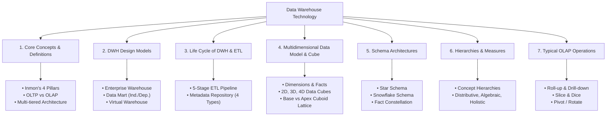

---

# 1. Data Warehouse: Core Concepts

## 1.1 What is a Data Warehouse?

In modern enterprise environments, transactional systems (like point-of-sale terminals, banking apps, and inventory trackers) generate massive streams of operational data every second. However, querying these operational databases directly for high-level business insights (e.g., *"How have sales of 4K TVs in East Coast branches changed year-over-year compared to marketing spend?"*) severely degrades transactional throughput.

A **Data Warehouse (DWH)** is a separate, specialized data repository designed specifically for reporting, complex analytical querying, and strategic decision-making.

> [!quote] Formal Definition (William H. Inmon — "Father of Data Warehousing")
> *"A data warehouse is a **subject-oriented**, **integrated**, **time-variant**, and **nonvolatile** collection of data in support of management's decision making process."*

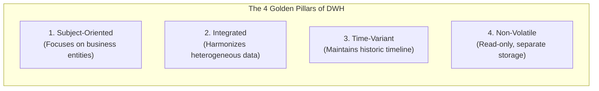

---

## 1.2 Deep-Dive into the 4 Defining Features (Inmon's Pillars)

### 1. Subject-Oriented
- **Operational Databases (OLTP)** are designed around operational workflows, applications, and transactions (e.g., executing a checkout, processing a salary slip, reserving a seat).
- **Data Warehouses (OLAP)** are organized around key **business subjects** (e.g., `Customer`, `Product`, `Supplier`, `Sales`, `Revenue`).
- **Focus**: It strips away transient, microscopic operational details that do not aid decision-making and provides a concise, consolidated view of specific business themes.

> [!example] Intuition
> In an operational retail DB, a transaction record stores the cashier ID, register terminal ID, credit card authorization code, and receipt print flag. 
> In a **Data Warehouse**, we discard the cashier ID and receipt flag; we retain only the subject entities: `Customer Demographics`, `Item Category`, `Store Branch`, `Quarterly Revenue`, and `Discount Applied`.

---

### 2. Integrated
- Real-world enterprises gather data from dozens of disparate, heterogeneous operational platforms: relational databases (PostgreSQL, Oracle), legacy flat files, mainframe logs, CRM APIs, and spreadsheets.
- The Data Warehouse integrates these disparate sources by resolving all inconsistencies in:
  1. **Naming Conventions**: Converting `cust_id`, `client_no`, and `AccountNum` into a unified `customer_id`.
  2. **Encoding Structures**: Harmonizing gender codes (`M/F`, `1/0`, `Male/Female`) into a standardized enum.
  3. **Attribute Measurement Units**: Converting currencies (USD, EUR, BDT) to a base currency, and measurements (inches vs. centimeters, gallons vs. liters) to a standard metric.
  4. **Physical Data Layout**: Standardizing date formats (`YYYY-MM-DD` vs `DD/MM/YYYY`).

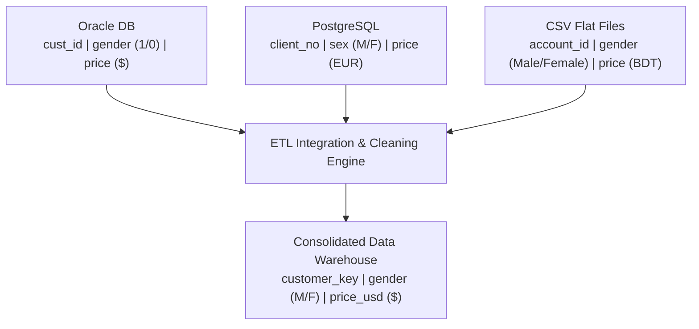

---

### 3. Time-Variant
- Operational databases reflect only the **current snapshot** of data (e.g., your current home address or current account balance). When an address updates, the old address is overwritten.
- A Data Warehouse retains data over an extended **historic horizon** (typically 5 to 10+ years).
- **Key Structure**: Every record in a data warehouse explicitly or implicitly contains a **time element** (e.g., `day_key`, `month_key`, `fiscal_quarter`, `timestamp`) as part of its primary/composite key.
- This allows analysts to evaluate trends, spot cyclical patterns, and perform predictive modeling over time.

---

### 4. Non-Volatile
- A Data Warehouse is a **physically separate store** of data, transformed and loaded from operational environments.
- Because it is decoupled from transaction-processing systems:
  - **No In-Place Updates or Deletions**: Data is never updated or deleted by normal users in real-time.
  - **No Transaction Overhead**: Mechanisms like row-level locking, deadlock detection, rollback logs, and ACID concurrency control are unnecessary for analytical users.
  - **Two Primary Data Operations**:
    1. **Initial Data Loading & Periodic Batch Refresh**.
    2. **Analytical Read Access (Data Retrieval & Querying)**.

---

## 1.3 Operational Databases (OLTP) vs. Data Warehouses (OLAP)

Operational systems and Analytical systems serve entirely different masters within an organization:

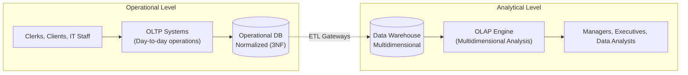

### 📊 Master Comparison Matrix (Exam Essential)

| Feature / Dimension | Operational Database (**OLTP**) | Data Warehouse (**OLAP**) |
| :--- | :--- | :--- |
| **Primary System Role** | Day-to-day business operations & transaction execution | Data analysis, reporting, and strategic decision support |
| **Target Users** | Clerks, customers, DBAs, frontline staff | Knowledge workers, business analysts, managers, executives |
| **System Orientation** | **Customer-oriented** & **Application-oriented** | **Market-oriented** & **Subject-oriented** |
| **Data Scope & Nature** | Current snapshot, real-time, highly granular, operational | Historic (5–10+ yrs), summarized, consolidated, multi-source |
| **Database Design** | **ER Model**, highly normalized ($3\text{NF}/\text{BCNF}$) | **Multidimensional Model** (Star, Snowflake, Constellation) |
| **Access Pattern** | Frequent short atomic reads & writes, updates, deletes | Read-mostly, complex analytical scans, periodic batch loads |
| **Unit of Work** | Short, simple transaction (e.g., transfer \$50, update 1 row) | Complex analytical query touching millions of records |
| **Records Touched** | Tens to hundreds of records per query | Millions of records per query |
| **Concurrency & ACID** | Mandatory high concurrency, row locking, strict ACID | No real-time locking; concurrency focused on query throughput |
| **Primary Metric** | High transaction throughput ($\text{TPS}$), minimal latency | Fast query response time, aggregation performance |
| **Data Volume** | Megabytes to Gigabytes | Gigabytes to Terabytes / Petabytes |

---

## 1.4 Why Do We Need a Separate Data Warehouse?

A common question is: *"Why can't we run our analytical queries directly on our operational database?"*

The slides highlight **three fundamental reasons**:

1. **Performance Isolation (Preventing System Crash/Slowdown)**:
   - Operational databases are tuned for high-speed indexing, fast single-row lookups, and rapid inserts.
   - Running a multi-table aggregate query across millions of historical rows locks tables, exhausts RAM/CPU, and throttles day-to-day transactions.
2. **Incompatible Modes of Operation**:
   - OLTP requires strict concurrency control, locking mechanisms, and crash recovery.
   - OLAP requires high-throughput sequential scans, parallel aggregation, and columnar reads. Running OLAP on OLTP degrades operational performance.
3. **Historic Data Retention & Heterogeneous Consolidation**:
   - Operational databases routinely purge or archive old records to maintain low latency.
   - Decision support requires 5–10 years of consistent historic trends merged across disparate enterprise software platforms.

---

## 1.5 Multi-Tiered Data Warehouse Architecture

Data warehouses adopt a **three-tier architecture** that cleanly separates source integration, analytical calculation, and presentation:

![[dwh_multitier_architecture.png|650]]

### 1. Bottom Tier: Warehouse Database Server
- **Core Engine**: Almost always a high-performance **Relational Database Management System (RDBMS)**.
- **Data Ingestion**: Back-end tools and utilities extract data from operational databases and external feeds via communication **Gateways** (standard interfaces: `JDBC`, `ODBC`).
- **Components at Bottom Tier**:
  - Central Data Warehouse repository.
  - Departmental **Data Marts**.
  - **Metadata Repository** (the central blueprint).

### 2. Middle Tier: OLAP Server
- Sits between the physical database and the end-user applications to provide multidimensional data abstraction.
- Implemented using:
  - **ROLAP (Relational OLAP)**: An extended relational engine that translates multidimensional operations into optimized SQL queries on relational tables.
  - **MOLAP (Multidimensional OLAP)**: A proprietary engine that stores data directly in multidimensional array storage structures for fast indexing.
  - **HOLAP (Hybrid OLAP)**: Combines ROLAP scalability for detailed data with MOLAP speed for precomputed aggregates.

### 3. Top Tier: Front-End Client Layer
- The user-facing presentation tier consisting of:
  - **Query & Reporting Tools**: Standard enterprise dashboards and SQL interfaces.
  - **Analysis Tools (OLAP Browsers)**: Interactive slice-and-dice visualization interfaces.
  - **Data Mining Tools**: Predictive modeling, trend discovery, clustering, and classification engines.

---

# 2. Data Warehouse: Design Models

Enterprise data warehouses are organized according to architectural scope into **three primary design models**:

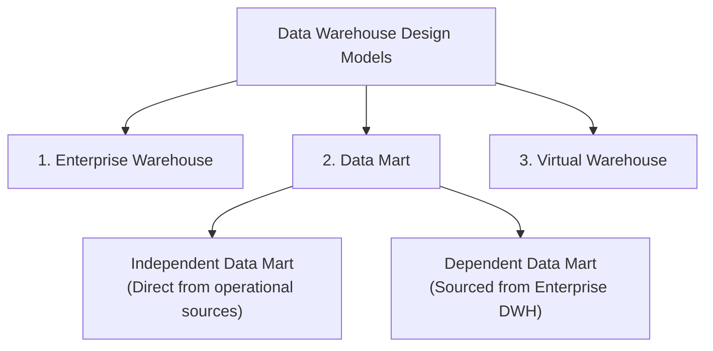

## 2.1 Enterprise Warehouse
- **Scope**: Collects all information across the **entire organization** (corporate-wide scope).
- **Content**: Holds comprehensive detailed data alongside summarized multidimensional aggregates.
- **Data Volume**: Typically ranges from hundreds of Gigabytes to Terabytes and Petabytes.
- **Infrastructure**: Requires enterprise-grade computer superservers, high-end mainframes, or massively parallel processing (MPP) architectures.
- **Design Cycle**: Requires extensive business process modeling across all departments; takes months to years to design and deploy.

---

## 2.2 Data Mart
- **Scope**: Confined to a **specific department, subject area, or user group** (e.g., Marketing Data Mart, Financial Analysis Mart, Supply Chain Mart).
- **Infrastructure**: Implemented on lower-cost departmental servers (UNIX or Windows).
- **Design Cycle**: Rapid deployment cycle, measured in weeks to a few months.
- **Two Structural Types**:
  1. **Independent Data Mart**: Sourced directly from operational systems or external data providers without an overarching enterprise warehouse.
  2. **Dependent Data Mart**: Sourced directly from a centralized Enterprise Data Warehouse (top-down architecture).

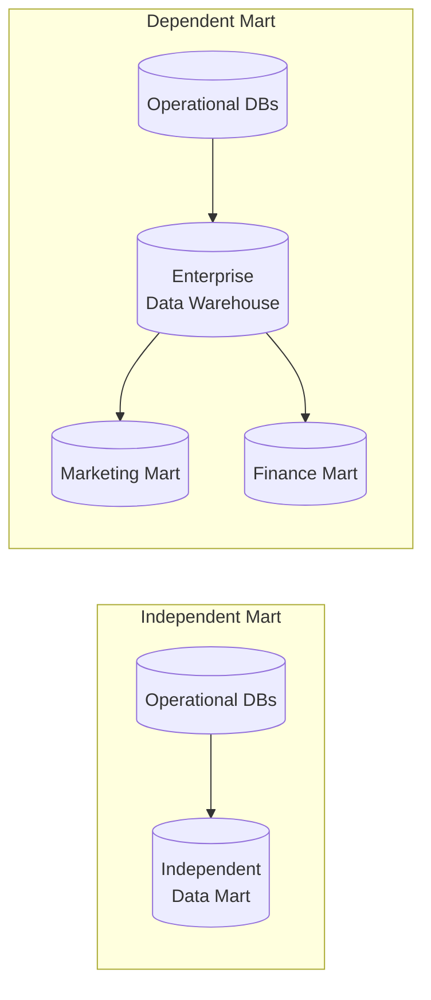

---

## 2.3 Virtual Warehouse
- **Scope & Implementation**: A set of views (often **Materialized Views**) constructed directly over operational relational databases.
- **Physical Footprint**: Does **not** require separate physical storage servers for data storage.
- **Pros & Cons**:
  - *Advantage*: Very fast and inexpensive to set up.
  - *Disadvantage*: Directly consumes CPU/RAM from operational databases; query capability is limited and large scans degrade operational performance.

---

### 📊 Comparison of Warehouse Design Models

| Characteristic | Enterprise Warehouse | Data Mart | Virtual Warehouse |
| :--- | :--- | :--- | :--- |
| **Scope** | Corporate-wide (all subjects) | Departmental (single subject) | Selected views on operational DB |
| **Data Type** | Raw, detailed, and aggregated | Summarized, department-specific | Virtual / Materialized views |
| **Build Time** | Months to Years | Weeks to Months | Days to Weeks |
| **Cost / Hardware** | High (superservers, MPP) | Low to Medium (departmental server) | Minimal (uses existing DB) |
| **Implementation** | Complex top-down planning | Agile, bottom-up or dependent | Direct SQL View definitions |

---

# 3. Life Cycle of a Data Warehouse & The ETL Pipeline

Building and maintaining a data warehouse is an ongoing lifecycle driven by the **ETL (Extract-Transform-Load)** back-end pipeline.

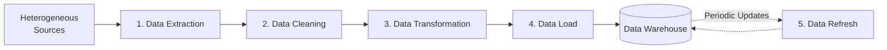

## 3.1 The 5 Sequential Steps of the DWH Life Cycle

### 1. Data Extraction
- Collects raw data from multiple, heterogeneous, distributed operational databases, flat files, XML/JSON feeds, and external web sources.

### 2. Data Cleaning
- Identifies anomalies, missing values, duplicates, and invalid characters.
- Rectifies errors (e.g., standardizing corrupted postal codes, replacing null fields with default fallbacks, eliminating duplicate customer entries).

### 3. Data Transformation
- Converts extracted data from legacy or host operational formats into uniform warehouse schemas.
- Handles schema remapping, aggregation, code standardization, and calculation of derived attributes.

### 4. Data Load
- Sorts, consolidates, and merges incoming data.
- Computes materialized aggregate views, validates referential integrity constraints, and constructs database **indexes** (e.g., bitmap and join indexes) and physical partitions.

### 5. Data Refresh
- Periodically propagates incremental updates and newly committed transactions from the source systems to the warehouse repository to keep data current.

---

## 3.2 The Metadata Repository

> [!important] Definition of Metadata
> **Metadata is "data about data"**. It resides in the bottom tier of the warehouse architecture and serves as the directory, guide, and blueprint for the entire warehouse.

Metadata tracks what data exists, where it originated, how it was transformed, who owns it, and how it is structured.

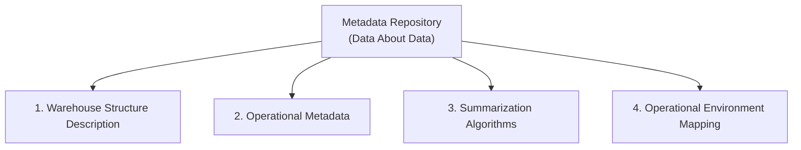

### The 4 Information Categories in a Metadata Repository (Slide 15)

1. **Description of Warehouse Structure**:
   - Complete architectural blueprints: warehouse schemas, materialized views, dimension definitions, concept hierarchies, derived data formulas, and data mart contents/locations.
2. **Operational Metadata**:
   - **Data Lineage**: Detailed history of migrated data, including original source timestamps and the sequence of transformation rules applied.
   - **Data Currency**: Status flags showing whether records are active, archived, or purged.
   - **Monitoring Statistics**: Query execution logs, usage patterns, error reports, and audit trails.
3. **Summarization Algorithms**:
   - Mathematical definitions for dimensions and measures, aggregation logic, granularity levels, data partitioning schemes, and predefined query/report templates.
4. **Mapping from Operational Environment to Data Warehouse**:
   - Physical source database schemas, gateway connections, extraction rules, cleaning routines, transformation defaults, refresh/purge schedules, and security profiles (user privileges, access control lists).

---

# 4. Data Cube & Multidimensional Data Model

Traditional operational databases represent data in 2-dimensional relational tables (rows and columns). Data warehouses represent data in **multidimensional space**, mathematically formalized as a **Data Cube**.

## 4.1 Fundamentals: Dimensions vs. Facts

A multidimensional model is defined by two foundational concepts:

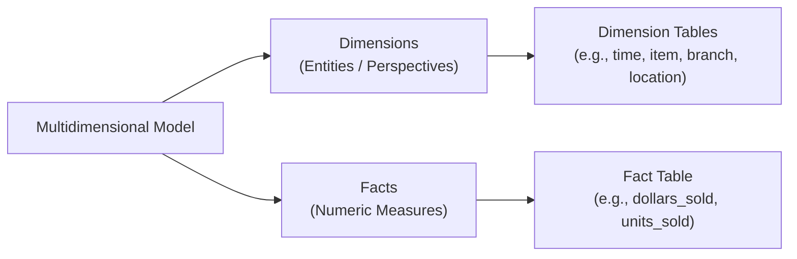

### 1. Dimensions
- The perspectives, entities, or categories with respect to which an organization wants to measure and analyze its records.
- *Examples*: `Time`, `Item`, `Branch`, `Location`, `Supplier`.
- Each dimension is associated with a **Dimension Table** containing descriptive attributes (e.g., `item_name`, `brand`, `category`, `supplier_type`).

### 2. Facts
- The central numerical measurements, metrics, or values generated by business events.
- *Examples*: `dollars_sold`, `units_sold`, `cost_price`, `units_rejected`.
- Facts reside in a central **Fact Table**, which contains numerical values alongside foreign keys referencing every associated dimension table.

---

## 4.2 Progressive Dimension Construction: From 2-D to 4-D

Let's trace how multidimensional data expands, as presented in the course slides:

### Step 1: A Simple 2-D Data Cube (Slide 19)
Consider measuring `dollars_sold` across two dimensions: **Item** and **Time (Quarter)**:

![[dwh_2d_datacube_table.png|600]]

- **Dimension 1**: `time` $\in \{\text{Q1}, \text{Q2}, \text{Q3}, \text{Q4}\}$
- **Dimension 2**: `item` $\in \{\text{Home Entertainment}, \text{Computer}, \text{Phone}, \text{Security}\}$
- **Fact / Measure**: `dollars_sold` (in thousands) inside each cell.

---

### Step 2: Adding a 3rd Dimension (Location) (Slides 20–22)
We add a third dimension: **Location** $\in \{\text{Vancouver}, \text{Toronto}, \text{New York}, \text{Chicago}\}$.

In tabular form, the data looks like a 3-dimensional spreadsheet:

![[dwh_3d_table_representation.png|600]]

Conceptually, this forms a **3-Dimensional Geometric Cube**:

![[dwh_3d_cube_model.png|600]]

- A single point in this 3-D space is identified by a tuple: 
  $$\langle \text{time} = \text{"Q1"}, \text{item} = \text{"computer"}, \text{location} = \text{"Vancouver"} \rangle \implies \text{dollars\_sold} = 605\text{K}$$

---

### Step 3: Expanding to 4 Dimensions (Supplier) (Slide 23)
When we add a 4th dimension—**Supplier**—visualizing 4 geometric dimensions directly in physical 3D space is difficult. 

In data warehousing, a **4-D data cube is visualized as a sequence/series of 3-D cubes**, where each 3-D cube represents data for a specific supplier:

![[dwh_4d_cube_series.png|600]]

> [!tip] Mathematical Generalization
> While humans visualize geometric cubes in 3 dimensions, in data warehousing literature, an **$n$-dimensional data cube** is an abstract mathematical lattice spanning $n$ dimensions:
> $$\text{Cube Space} = D_1 \times D_2 \times \dots \times D_n \to M$$
> where $D_i$ are dimensions and $M$ is the measured fact.

---

# 5. Cuboids & The Lattice of Cuboids

A data cube does not just store data at the most detailed level; it represents data at **all possible degrees of summarization**.

> [!important] Definition of a Cuboid
> In data warehousing, a **cuboid** is an individual multidimensional table or view that represents data aggregated over a **specific subset of dimensions**.
> In relational SQL terms, each cuboid corresponds directly to a specific `GROUP BY` clause.

Given a set of $n$ dimensions, we can generate a separate cuboid for every possible mathematical subset of the $n$ dimensions. The total collection of all possible cuboids forms a **Lattice of Cuboids**.

$$\text{Total Number of Cuboids in an } n\text{-Dimensional Cube} = \sum_{k=0}^n \binom{n}{k} = 2^n$$

For a 4-dimensional system (`time`, `item`, `location`, `supplier`), there are:
$$2^4 = 16 \text{ distinct cuboids}$$

---

## 5.1 The 4-D Lattice of Cuboids Structure

![[dwh_lattice_of_cuboids.png|650]]

The lattice forms a hierarchy spanning 5 distinct dimensionality levels ($0\text{-D}$ to $4\text{-D}$):
1. **0-D Cuboid (1 cuboid)**: `all`
2. **1-D Cuboids (4 cuboids)**: `time`, `item`, `location`, `supplier`
3. **2-D Cuboids (6 cuboids)**: `(time, item)`, `(time, location)`, `(time, supplier)`, `(item, location)`, `(item, supplier)`, `(location, supplier)`
4. **3-D Cuboids (4 cuboids)**: `(time, item, location)`, `(time, item, supplier)`, `(time, location, supplier)`, `(item, location, supplier)`
5. **4-D Cuboid (1 cuboid)**: `(time, item, location, supplier)`

---

## 5.2 Base Cuboid vs. Apex Cuboid (Slide 26)

Two cuboids sit at the absolute extremes of the lattice:

### 1. Base Cuboid ($n$-D Cuboid)
- **Definition**: The cuboid at the very bottom of the lattice that holds the **lowest level of summarization** (the most granular, detailed data).
- **SQL Analogy**: Corresponds to grouping by or filtering across **all $n$ dimensions**:
  ```sql
  SELECT time_key, item_key, location_key, supplier_key, SUM(dollars_sold)
  FROM sales_fact
  GROUP BY time_key, item_key, location_key, supplier_key;
  ```

### 2. Apex Cuboid (0-D Cuboid, denoted as `all`)
- **Definition**: The cuboid at the top of the lattice that holds the **highest level of summarization**. It represents the grand total across the entire enterprise.
- **SQL Analogy**: Aggregates the entire table with **no dimensions** in the `WHERE` or `GROUP BY` clause:
  ```sql
  SELECT SUM(dollars_sold) FROM sales_fact;
  ```

---

# 6. Data Warehouse Schema Models

While OLTP databases rely on Entity-Relationship (ER) models with high normalization ($3\text{NF}$), data warehouses require concise, subject-oriented schemas optimized for complex star joins and OLAP queries.

There are **three industry-standard multidimensional schema models**:

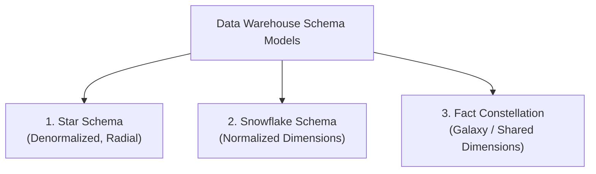

---

## 6.1 The Star Schema Model (Slides 28–29)

> [!important] Core Concept
> The **Star Schema** is the most common and popular modeling paradigm in data warehousing. It consists of a **single central Fact Table** connected radially to multiple **Dimension Tables** (resembling a star).

![[dwh_star_schema.png|650]]

### Structural Characteristics:
1. **Central Fact Table (`sales`)**:
   - Contains composite foreign keys referencing each dimension: `time_key`, `item_key`, `branch_key`, `location_key`.
   - Contains numerical facts/measures: `dollars_sold`, `units_sold`.
   - Contains **no redundancy** in the fact records.
2. **Attendant Dimension Tables (`time`, `item`, `branch`, `location`)**:
   - Exactly **one table per dimension**.
   - Tables are **denormalized** (they contain repetitive textual data like city names, state names, categories).
3. **Trade-offs**:
   - *Advantages*: Highly intuitive for business analysts; simple queries; requires fewer SQL joins for fast query performance.
   - *Disadvantage*: Denormalized dimension tables introduce data redundancy (e.g., repeating state names across multiple city rows).

---

## 6.2 The Snowflake Schema Model (Slides 30–31)

> [!important] Core Concept
> The **Snowflake Schema** is a variant of the star schema where **dimension tables are normalized**, splitting the dimension hierarchies into additional sub-dimension tables.

![[dwh_snowflake_schema.png|650]]

### Structural Characteristics:
1. **Central Fact Table**: Remains identical to the star schema.
2. **Normalized Dimension Tables**:
   - The `item` dimension table splits into `item` and a normalized `supplier` table.
   - The `location` dimension table splits into `location`, `city`, `state_or_province`, and `country` tables.
3. **Trade-offs**:
   - *Advantage*: Reduces data redundancy in dimension tables by applying normalization.
   - *Disadvantages*:
     - The space savings achieved by normalizing dimension tables is **negligible** compared to the massive size of the central fact table.
     - **Performance Degradation**: Requires significantly more table joins to execute queries, reducing browsing speed and system responsiveness.

> [!important] 🎯 Key Final Exam Takeaway (Slide 31)
> **Question**: *Why is the Star Schema preferred over the Snowflake Schema in real-world DWH design despite having some redundancy?*
> **Answer**: In a data warehouse, over 95% of total storage is consumed by the **Fact Table**. The storage savings from normalizing dimension tables in a snowflake schema is negligible. However, snowflake normalization introduces multiple additional `JOIN` operations for every analytical query, which severely degrades query throughput. Therefore, the **Star Schema is favored for query performance**.

---

## 6.3 Fact Constellation Schema (Galaxy Schema) (Slide 32)

> [!important] Core Concept
> Sophisticated enterprise applications require multiple subject areas. A **Fact Constellation Schema** (also called a **Galaxy Schema**) contains **multiple fact tables that share dimension tables**.

![[dwh_fact_constellation.png|650]]

### Structural Characteristics:
- Contains two or more central fact tables: e.g., `sales` Fact Table and `shipping` Fact Table.
- The two fact tables share common dimensions (conformed dimensions): `time`, `item`, and `location`.
- The `shipping` fact table also has its own dedicated dimension: `shipper`.
- Used in enterprise-wide data warehouses where different business processes intersect.

---

### 📊 Master Comparison Matrix: Data Warehouse Schemas

| Feature | Star Schema | Snowflake Schema | Fact Constellation (Galaxy) |
| :--- | :--- | :--- | :--- |
| **Fact Tables** | Exactly 1 | Exactly 1 | 2 or More |
| **Dimension Tables** | 1 per dimension (Denormalized) | Decomposed / Normalized hierarchies | Shared across multiple fact tables |
| **Normalization Level** | Denormalized dimensions | Normalized dimensions ($3\text{NF}$) | Mixed (mostly denormalized) |
| **Join Complexity** | Low (Single-level star joins) | High (Multi-level snowflake joins) | Variable (depends on query scope) |
| **Query Performance** | **Fastest** (Optimized for OLAP) | Slower (Join overhead) | Fast for shared enterprise queries |
| **Maintenance & Design** | Simple | Complex maintenance | Enterprise-level design |

---

# 7. Concept Hierarchies & Categorization of Measures

*(Detailed reference topics from Han & Kamber Chapter 4, explicitly referenced on Slide 33)*

## 7.1 The Role of Concept Hierarchies

> [!important] Definition
> A **Concept Hierarchy** defines a sequence of mappings from a set of low-level, concrete concepts to higher-level, more abstract concepts.

Concept hierarchies allow users to view data at multiple levels of granularity and form the mathematical backbone of the **Roll-up** and **Drill-down** operations.

![[dwh_concept_hierarchy_location.png|600]]

### Structural Types of Concept Hierarchies:

![[dwh_concept_hierarchy_structures.png|600]]

1. **Total Order (Strict Tree Hierarchy)**:
   - All attributes form a linear chain of progression:
     $$\text{street} < \text{city} < \text{province\_or\_state} < \text{country} < \text{all}$$
2. **Partial Order (Lattice Hierarchy)**:
   - Attributes branch into alternative aggregation paths.
   - *Example (Time dimension)*: A day can aggregate either into a week or into a month:
     $$\text{day} < \{\text{month} < \text{quarter}; \text{week}\} < \text{year} < \text{all}$$
3. **Schema Hierarchy vs. Set Grouping Hierarchy**:
   - *Schema Hierarchy*: Based on explicit columns within dimension tables (e.g., `city -> state -> country`).
   - *Set Grouping Hierarchy*: Groups continuous ranges of numerical values into semantic categories (e.g., mapping continuous `price` values into intervals: `[0, $200) -> "Budget"`, `[$200, $800) -> "Mid-range"`, `[$800, $2000] -> "High-end"`).

---

## 7.2 Categorization & Computation of Measures

A data cube measure is a numeric function evaluated at each multidimensional point. Based on how aggregate functions compute these measures across partitions, they are classified into **three categories**:

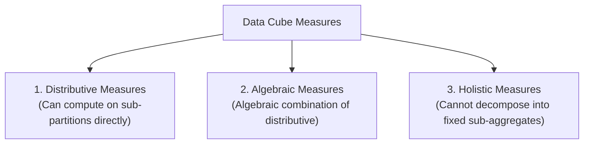

### 1. Distributive Measures
- An aggregate function is **distributive** if it can be computed in a distributed manner across $n$ partitions without losing precision.
- If data $S$ is partitioned into $\{S_1, S_2, \dots, S_n\}$, then:
  $$f(S) = f\Big(f(S_1), f(S_2), \dots, f(S_n)\Big)$$
- *Examples*: `COUNT()`, `SUM()`, `MIN()`, `MAX()`.
  $$\text{SUM}(S) = \sum_{i=1}^n \text{SUM}(S_i), \quad \text{MAX}(S) = \max\Big(\text{MAX}(S_1), \dots, \text{MAX}(S_n)\Big)$$

### 2. Algebraic Measures
- An aggregate function is **algebraic** if it can be computed by applying an algebraic function to a **small, fixed-size vector of distributive measures**.
- *Examples*: `AVG()`, `standard_deviation()`, `variance()`, $B\text{-top-}k$.
  - For Average:
    $$\text{AVG}(S) = \frac{\text{SUM}(S)}{\text{COUNT}(S)} = \frac{\sum_{i=1}^n \text{SUM}(S_i)}{\sum_{i=1}^n \text{COUNT}(S_i)}$$
  - Only two distributive values $(\text{SUM}, \text{COUNT})$ need to be maintained per partition.

### 3. Holistic Measures
- An aggregate function is **holistic** if there is no constant bound on the storage size needed to represent sub-aggregates. To compute the measure for partition unions, the entire raw dataset must be accessed.
- *Examples*: `MEDIAN()`, `MODE()`, `RANK()`.
- *Why?* The median of two subsets does not equal the median of their individual medians:
  $$\text{MEDIAN}(S) \neq \text{MEDIAN}\Big(\text{MEDIAN}(S_1), \text{MEDIAN}(S_2)\Big)$$

---

# 8. Typical OLAP Operations

OLAP systems provide interactive, multidimensional query operations allowing decision-makers to navigate data cubes dynamically:

![[dwh_olap_operations.png|650]]

---

## 8.1 Detailed Breakdown of the 5 Core OLAP Operations

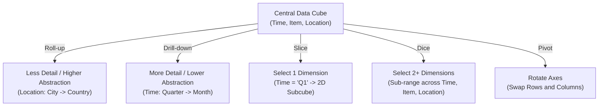

### 1. Roll-up (Drill-Up / Generalization)
- **Concept**: Performs aggregation on a data cube to view data at a **higher, less detailed level of abstraction**.
- **Mechanisms**:
  1. *Climbing up a concept hierarchy for a dimension*: e.g., aggregating `location` from `city` (`Vancouver, Toronto`) up to `country` (`Canada`).
  2. *Dimension reduction*: Dropping one or more dimensions entirely from the cube view.

### 2. Drill-down (Specialization / Roll-Down)
- **Concept**: The exact reverse of roll-up. Navigates from less detailed data to **more detailed, granular data**.
- **Mechanisms**:
  1. *Stepping down a concept hierarchy for a dimension*: e.g., breaking `time` from `quarter` down into individual `months` (`Q1` $\to$ `Jan, Feb, Mar`).
  2. *Introducing additional dimensions*: Adding a new dimension (e.g., adding `customer_group` to an existing 3D cube).

### 3. Slice
- **Concept**: Performs a selection on **exactly ONE dimension** of the cube, resulting in a $(n-1)$-dimensional subcube.
- **Example**: Slicing the 3-D sales cube for $\text{time} = \text{"Q1"}$ produces a 2-D cross-section showing `Item` vs `Location` for Quarter 1 only.

### 4. Dice
- **Concept**: Defines a subcube by performing a selection condition on **TWO OR MORE dimensions** simultaneously.
- **Example**: Selecting:
  - $\text{location} \in \{\text{"Vancouver"}, \text{"Toronto"}\}$ **AND**
  - $\text{time} \in \{\text{"Q1"}, \text{"Q2"}\}$ **AND**
  - $\text{item} \in \{\text{"Home Entertainment"}, \text{"Computer"}\}$.
  - *Result*: A smaller 3-D subcube containing only those specific ranges.

### 5. Pivot (Rotate)
- **Concept**: A visualization operation that **rotates the data axes** in view to provide an alternative data presentation or 2D spreadsheet layout.
- **Example**: Swapping the X-axis (`Item`) and Y-axis (`Quarter`), or rotating a 3-D cube to bring `Location` to the front face.

---

# 9. Supplementary Material (Outside Course Slides)

> [!error] Supplementary Context (Outside Slides)
> **Note on Syllabus Boundary**: The following topics are **NOT** explicitly printed on the lecture slides. They are provided here as concise reference material from database literature to deepen your conceptual understanding of how data warehouse engines work internally.

> [!error]- 📌 Topic S1: OLAP Storage Architectures (ROLAP vs. MOLAP vs. HOLAP)
> - **ROLAP (Relational OLAP)**:
>   - Data is stored in standard relational tables (Star/Snowflake).
>   - Fast execution relies on specialized relational indexing: **Bitmap Indexing** (creating bit-vectors for low-cardinality attributes like gender or region) and **Join Indexing** (pre-computing join relationships between fact and dimension keys).
> - **MOLAP (Multidimensional OLAP)**:
>   - Data is stored directly in native $n$-dimensional arrays (dense/sparse arrays).
>   - Provides $O(1)$ direct array index lookups, but incurs storage overhead for sparse data spaces.
> - **HOLAP (Hybrid OLAP)**:
>   - Stores large, high-volume granular fact records in relational tables (ROLAP) and stores precomputed high-level aggregate cuboids in multidimensional array cubes (MOLAP).

> [!error]- 📌 Topic S2: SQL Extensions for OLAP (`CUBE`, `ROLLUP`, `GROUPING SETS`)
> Standard SQL:1999 introduced OLAP extensions to compute multiple cuboids in a single SQL scan:
> 
> ```sql
> -- 1. GROUP BY ROLLUP (Hierarchical Aggregation: n+1 groupings)
> SELECT year, quarter, month, SUM(sales_amount)
> FROM sales_fact
> GROUP BY ROLLUP (year, quarter, month);
> -- Computes: (year, quarter, month), (year, quarter), (year), and () [grand total]
> 
> -- 2. GROUP BY CUBE (Full Lattice Aggregation: 2^n groupings)
> SELECT item, location, SUM(sales_amount)
> FROM sales_fact
> GROUP BY CUBE (item, location);
> -- Computes: (item, location), (item), (location), and () [apex cuboid]
> 
> -- 3. GROUPING SETS (Selective Cuboid Computation)
> SELECT item, location, SUM(sales_amount)
> FROM sales_fact
> GROUP BY GROUPING SETS ((item), (location));
> ```

> [!error]- 📌 Topic S3: Modern Paradigm Evolution (Data Warehouse vs. Data Lake vs. Lakehouse)
> - **Data Warehouse**: Structured relational data, **Schema-on-Write** (strictly cleaned before loading), optimized for BI reporting and SQL analytics.
> - **Data Lake**: Unstructured/semi-structured raw data (JSON, audio, logs), **Schema-on-Read** (cleaned when queried), optimized for big data machine learning.
> - **Data Lakehouse**: Modern hybrid combining the low-cost object storage of Data Lakes with the ACID transactions, schema enforcement, and indexing performance of Data Warehouses.

---

# 10. Master Exam Quick-Review & Self-Test Checklist

> [!tip]- 🎯 High-Yield Exam Review Checklist
> - [ ] State **W. H. Inmon's definition** of a data warehouse and explain all 4 pillars (**Subject-oriented, Integrated, Time-variant, Nonvolatile**).
> - [ ] List at least 6 distinct differences between **OLTP** and **OLAP** systems.
> - [ ] Name and describe the 3 tiers of the **Multitiered Data Warehouse Architecture**.
> - [ ] Distinguish between **Enterprise Warehouses**, **Independent vs. Dependent Data Marts**, and **Virtual Warehouses**.
> - [ ] Explain the 5 sequential stages of the **ETL process** (Extract, Clean, Transform, Load, Refresh).
> - [ ] List the 4 major types of information stored in a **Metadata Repository**.
> - [ ] Define **Dimensions**, **Facts**, **Dimension Tables**, and **Fact Tables**.
> - [ ] Define a **Cuboid** and calculate the total number of cuboids in an $n$-dimensional cube ($2^n$).
> - [ ] Differentiate between the **Base Cuboid** ($n$-D) and the **Apex Cuboid** ($0\text{-D}$, `all`).
> - [ ] Draw and explain the **Star Schema**, **Snowflake Schema**, and **Fact Constellation Schema**.
> - [ ] Justify why the **Star Schema is preferred over Snowflake Schema** in practical data warehouse design.
> - [ ] Classify measures into **Distributive**, **Algebraic**, and **Holistic** with mathematical examples.
> - [ ] Define and differentiate all 5 OLAP operations: **Roll-up, Drill-down, Slice, Dice, and Pivot**.
