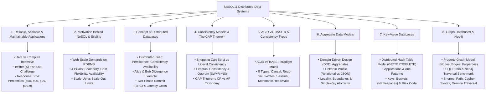
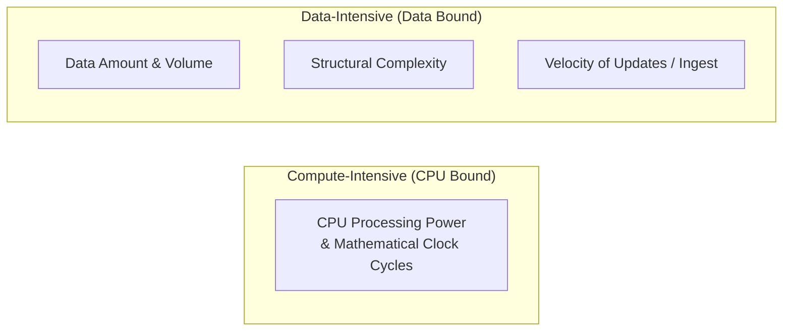
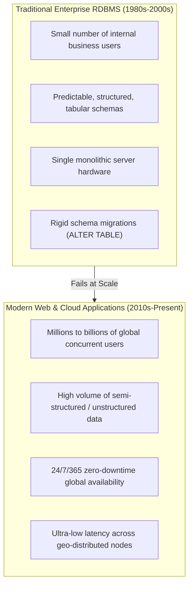
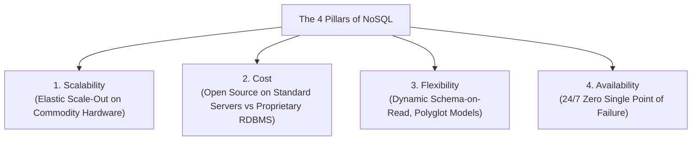
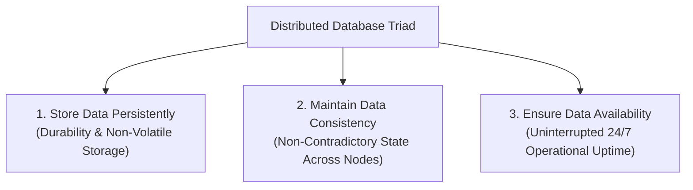
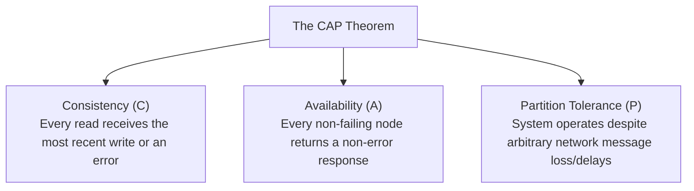
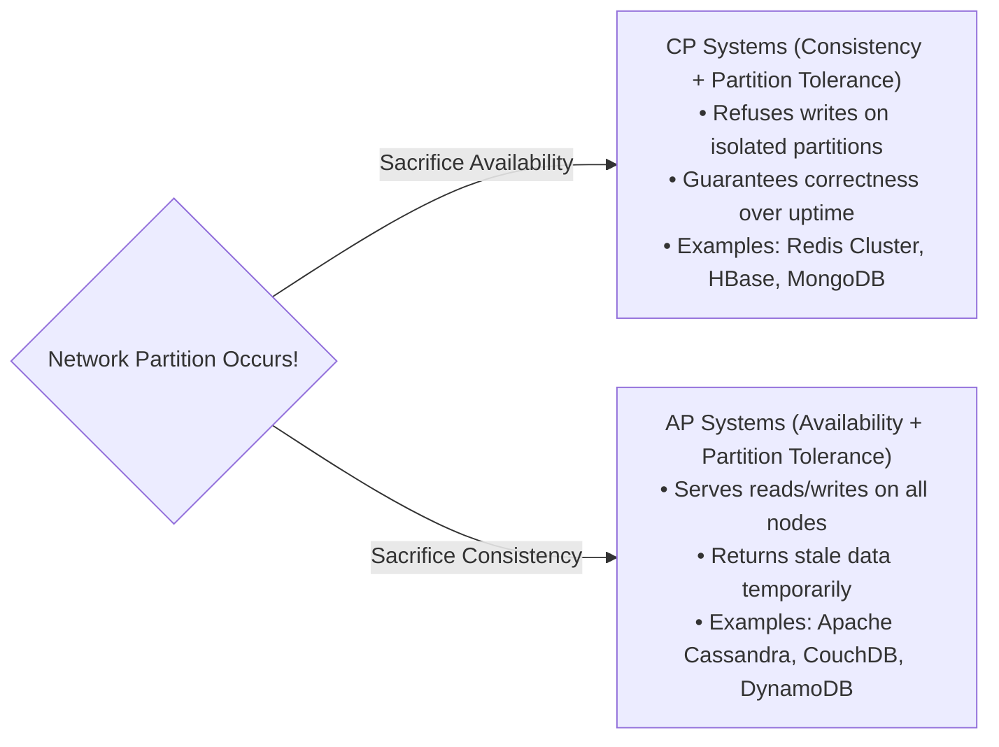
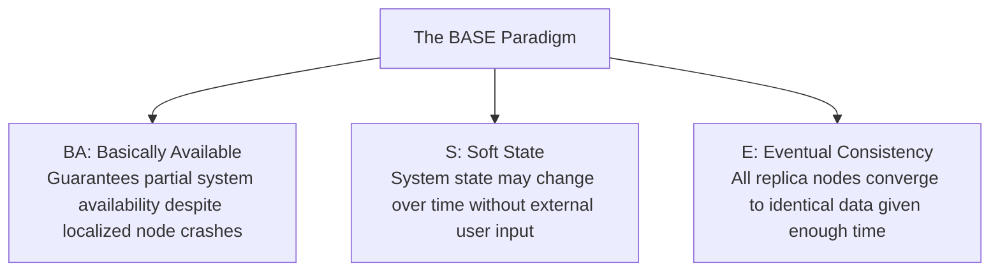
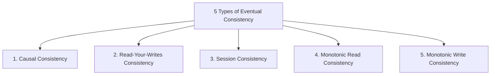
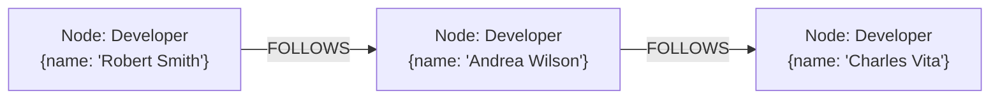

# 🌐 NoSQL & Distributed Data Systems — Master Exam & Intuition Guide

> [!abstract] Course & Syllabus Overview (CSE 4409: Database Systems II)
> - **Instructor**: Dr. Abu Raihan Mostofa Kamal, Professor, Department of CSE, Islamic University of Technology (IUT).
> - **Primary Slides**: `DSNoSQL.pdf` (88 Slides across 8 core modules).
> - **Reference Literature**:
>   1. Martin Kleppmann — *Designing Data-Intensive Applications* (O'Reilly, Chapters 1 & 2: Reliable, Scalable, Maintainable Applications & Data Models).
>   2. Dan Sullivan — *NoSQL for Mere Mortals* (Addison-Wesley, Chapters 1, 2, 4 & 7: Architecture, Key-Value & Graph Databases).
>   3. Pramod J. Sadalage & Martin Fowler — *NoSQL Distilled: A Brief Guide to the Emerging World of Polyglot Persistence* (Domain Aggregates & Consistency Models).
>   4. Ian Robinson, Jim Webber & Emil Eifrem — *Neo4j in Action* / *Graph Databases* (O'Reilly).
> - **Target Audience**: Students preparing for the Final Exam who need complete intuition, step-by-step mathematical proofs (Quorums, CAP), comprehensive case studies (Twitter, Amazon, LinkedIn), embedded slide diagrams, and clear boundaries distinguishing lecture syllabus from supplementary deep-dives.

---

## 🗺️ Visual Topic Roadmap



---

# 1. Reliable, Scalable, and Maintainable Applications

## 1.1 Data-Intensive vs. Compute-Intensive Systems

Historically, computing systems were primarily **compute-intensive** (CPU-bound) — performance was bottlenecked by raw mathematical crunching power (e.g., matrix factorization, weather simulation, cryptographic factoring).

In modern software engineering, the vast majority of applications are **data-intensive** (I/O and memory-bound). System performance and architectural complexity are dominated by:
1. **Data Volume**: The sheer quantity of terabytes or petabytes to store and scan.
2. **Data Complexity**: Highly interconnected, semi-structured, or multi-dimensional records.
3. **Speed of Change**: High-velocity real-time read and write ingest rates.



### The 5 Standard Building Blocks of Modern Data Systems
To meet these data-intensive requirements, engineers compose systems from specialized functional components:
1. **Databases**: Primary data storage allowing applications to find data reliably later.
2. **Caches**: In-memory stores that remember the results of expensive queries/operations to accelerate read throughput (e.g., Redis, Memcached).
3. **Search Indexes**: Auxiliary structures that allow keyword querying and complex multi-attribute filtering (e.g., Elasticsearch, Apache Lucene).
4. **Stream Processing (Message Brokers)**: Systems for sending messages asynchronously to decouple background workers (e.g., Apache Kafka, RabbitMQ).
5. **Batch Processing**: Engines for periodically crunching large volumes of accumulated historical data (e.g., Apache Hadoop MapReduce, Apache Spark).

---

## 1.2 Evolution: From Database Applications to "Data Systems"

In the early 1990s, enterprise applications were purely **single-database query driven** (e.g., an internal Payroll Management System running on a single Oracle or DB2 instance).

Today, applications must provide an interconnected array of diverse capabilities within a single user-facing platform (e.g., HR core records + real-time SMS dispatch + GPS geospatial fleet tracking + live telemetry monitoring).

Because **no single tool fits all requirements**, the industry shifted from thinking about isolated "database applications" to composing comprehensive **Data Systems**.

> [!tip] Blurring Boundaries in Modern Data Systems
> Many modern data technologies blur classic classification lines:
> - **Redis**: An in-memory key-value data store frequently used as a lightweight asynchronous **message queue**.
> - **Apache Kafka**: A distributed publish-subscribe message broker that provides **database-like durability, partitioning, and permanent event storage**.

---

## 1.3 Scalability & Measuring System Load

> [!quote] Formal Definition: Scalability
> **Scalability** is the term used to describe a system’s ability to cope with increased load without suffering unacceptable degradation in performance.

Scalability is not a one-dimensional boolean flag (*"Is your system scalable? Yes/No"*). Instead, it is a systematic engineering process of answering two fundamental questions:
1. *If the system grows along a specific operational dimension, what architectural options exist to cope with the growth?*
2. *How many additional hardware or computing resources must be provisioned to maintain target performance as load expands?*

### Load Parameters
To reason about system capacity, we describe the system's workload using specific metrics called **Load Parameters**:
- **Requests per second (RPS / QPS)** to a web API gateway.
- **Read-to-Write Ratio** in the database engine.
- **Simultaneously active users** in a chat or collaboration room.
- **Cache Hit Rate vs. Miss Rate**.
- **Data Fan-Out**: The distribution of dependent entities connected to a single operational node (e.g., follower counts per user).

---

## 1.4 Case Study: Twitter (X) Home Timeline & The Fan-Out Challenge

A classic real-world engineering case study examined in the lecture slides (based on Twitter's published engineering data) illustrates how load characteristics dictate system architecture.

### The Workload Profile
Twitter has two primary operations:
1. **Post Tweet**: A user publishes a new tweet to their followers ($\approx 4,600 \text{ req/sec}$ average, $> 12,000 \text{ req/sec}$ at peak).
2. **Home Timeline**: A user views the chronological feed of tweets posted by everyone they follow ($\approx 300,000 \text{ req/sec}$).

> [!important] The Core Scaling Bottleneck: Fan-Out
> Handling $12,000$ writes/sec is trivial for modern databases. The true architectural challenge is **Fan-Out**:
> - Each user follows dozens or hundreds of people.
> - Each user is followed by anywhere from $10$ to $30,000,000+$ people.

---

### Option 1: On-Request Relational Query (Data Loading On Request)

When a user posts a tweet, the application executes a fast, simple `INSERT` into a global `tweets` table. 

However, when a user refreshes their **Home Timeline**, the system must dynamically execute a 3-table `JOIN` across `tweets`, `users`, and `follows`, sorting the aggregated feed by timestamp:

```sql
SELECT tweets.*, users.* 
FROM tweets
JOIN users ON tweets.sender_id = users.id
JOIN follows ON follows.followee_id = users.id
WHERE follows.follower_id = :current_user
ORDER BY tweets.timestamp DESC
LIMIT 20;
```

![[nosql_twitter_approach1_relational_joins.png|650]]

- **Write Cost**: Minimal ($O(1)$ single-row insertion).
- **Read Cost**: **Catastrophic at scale**. Executing $300,000$ heavy multi-table `JOIN` queries per second across millions of rows causes severe database lock contention and massive disk I/O bottlenecks.

---

### Option 2: Fan-Out Pre-Loading & In-Memory Caching (Data Pre-Loading)

Each user is assigned an individual in-memory **Home Timeline Cache** (e.g., a Redis list storing the latest tweet IDs).

When a user posts a tweet:
1. The system looks up all followers of that user.
2. The system immediately pushes (fans out) the new tweet ID into the timeline cache of **every single follower**.

![[nosql_twitter_approach2_timeline_cache.png|650]]

- **Read Cost**: Cheap and ultra-fast ($O(1)$ read from the user's dedicated Redis timeline cache; easily handles $300,000 \text{ reads/sec}$).
- **Write Cost**: Highly variable due to follower count distribution.
  - On average ($75$ followers/user), $4,600 \text{ tweets/sec} \times 75 = 345,000 \text{ cache writes/sec}$.
  - For celebrity accounts (e.g., $30,000,000$ followers), a single tweet triggers **$30$ million write operations** to timeline caches!

---

### Comparison & The Real-World Hybrid Architecture

| Architectural Dimension | Option 1: On-Request Relational Join | Option 2: Pre-Loading (Fan-Out Cache) |
| :--- | :--- | :--- |
| **Write (Post Tweet) Complexity** | $O(1)$ — single row insert into `tweets` table. | $O(\text{followers})$ — must write to every follower's cache. |
| **Read (Timeline) Complexity** | $O(N \log N)$ — multi-table join and sorting. | $O(1)$ — immediate key-value cache lookup. |
| **System Bottleneck** | Read capacity crushed by $300\text{k req/s}$ joins. | Write capacity crushed by celebrity fan-out ($30\text{M}$ writes). |
| **Suitability** | Low-follower users / infrequent timelines. | High-read-volume, standard user accounts. |

> [!tip] The Hybrid Solution
> In production, Twitter transitioned to a **hybrid approach**:
> 1. **Standard Users ($< 10,000$ followers)**: Use **Option 2** (Fan-out on write). Their tweets are pushed into followers' caches immediately.
> 2. **Celebrities / Ultra-High Follower Accounts ($> 1,000,000$ followers)**: Excluded from write fan-out! When a user opens their timeline, the system reads their pre-computed cache (Option 2) and merges in the celebrity tweets on-demand via a fast indexed query (Option 1).

---

## 1.5 System Performance: Throughput vs. Response Time

When system load increases, we measure performance along two paradigms depending on the system type:
1. **Batch Systems (e.g., Hadoop, Spark)**: We evaluate **Throughput** — the number of records processed per second, or total time to complete a fixed batch job.
2. **Online Interactive Systems (e.g., Web APIs, Microservices)**: We evaluate **Response Time** (or Latency) — the elapsed time between a client sending a request and receiving the completed response.

---

## 1.6 Latency Distributions & Percentiles ($p_{50}, p_{95}, p_{99}, p_{99.9}$)

Reporting only the **average (mean) response time** of an online service is dangerously misleading:
- Averages hide outliers, spikes, and tail degradation.
- If $99$ users experience a $50\text{ ms}$ response time and $1$ user experiences a $10,000\text{ ms}$ hang, the average is $149.5\text{ ms}$, masking the fact that a user suffered a $10$-second freeze.

### Why Percentiles Matter
To accurately understand user experience, systems evaluate **Percentiles**:
- **Median ($50^{\text{th}}$ Percentile / $p_{50}$)**: The exact middle value. Half of all requests complete faster than $p_{50}$, and half take longer. It represents typical user experience.
- **High Percentiles ($p_{95}, p_{99}, p_{99.9}$)**: Known as **Tail Latencies**. They measure the worst-case delays experienced by the slowest $5\%$, $1\%$, and $0.1\%$ of requests.

![[nosql_response_time_percentiles_tail_latency.png|650]]

> [!example] Why Amazon Focuses on the $99.9^{\text{th}}$ Percentile ($p_{99.9}$)
> Amazon defines internal service-level agreements (SLAs) strictly in terms of $p_{99.9}$ (affecting only $1$ in $1,000$ requests).
> 
> **Business Rationale**: The customers whose requests take the longest are typically those who have the largest purchase histories, the fullest shopping carts, and the most complex account records — that is, they are **Amazon's most valuable and profitable customers**. Slowing down their checkout directly causes lost enterprise revenue!

---

# 2. Motivation Behind NoSQL

## 2.1 The Shifting Web Landscape & Limitations of Relational Databases

Relational Database Management Systems (RDBMSs) have dominated enterprise computing for over four decades (since the 1980s). They successfully codified tabular business records and paper forms, enforcing strict relational integrity through normalization and SQL.

However, the rapid explosion of global web applications, social media platforms, cloud architectures, and IoT devices revealed severe limitations in traditional RDBMSs:



---

## 2.2 The 4 Driving Pillars of NoSQL

Modern web applications require four fundamental operational characteristics that traditional relational databases could not efficiently provide:



### 1. Scalability
The ability to gracefully handle elastic, fluctuating workloads by expanding capacity horizontally without downtime.

### 2. Cost Control
Proprietary enterprise relational database licenses (Oracle, Microsoft SQL Server, IBM DB2) are priced per CPU core and scale exponentially into millions of dollars. NoSQL systems are largely open-source and run on clusters of standard, low-cost commodity hardware.

### 3. Schema Flexibility
Relational databases require a strict, pre-defined schema (*Schema-on-Write*). Modifying tables (`ALTER TABLE`) on live databases containing hundreds of millions of records requires table locks, migration scripts, and planned downtime. NoSQL systems allow dynamic schemas (*Schema-on-Read*), enabling agile rapid software iteration.

### 4. Continuous 24/7 Availability
Web applications cannot afford downtime. If an e-commerce platform or social network goes offline for maintenance or due to a hardware crash, revenue and customer trust are instantly lost. NoSQL databases are natively built for fault-tolerant distributed redundancy.

---

## 2.3 Vertical Scaling (Scale-Up) vs. Horizontal Scaling (Scale-Out)

When database workload increases, system architects have two primary scaling strategies:

![[nosql_scale_up_vs_scale_out.png|650]]

### 1. Scale-Up (Vertical Scaling)
- **Concept**: Upgrading an existing single database server with more powerful CPUs, larger RAM sticks, faster NVMe drives, or wider network interfaces, or replacing it with an expensive high-end mainframe.
- **Disadvantages**:
  - **Hard Hardware Ceiling**: You eventually reach the maximum physical limits of CPU sockets and motherboard RAM capacity.
  - **Exponential Cost Curve**: High-end enterprise servers cost orders of magnitude more than standard nodes.
  - **Single Point of Failure (SPOF)**: If the master vertical server suffers hardware failure, the entire database goes down.

### 2. Scale-Out (Horizontal Scaling)
- **Concept**: Adding multiple standard, cost-effective server machines (nodes) to form a cooperative distributed cluster.
- **Advantages**:
  - **Linear Expansion**: To double throughput, simply add more commodity nodes.
  - **Elastic Provisioning**: Bring additional nodes online during traffic spikes (e.g., Black Friday), and shut them down when traffic normalizes.
  - **Fault Tolerance**: If one node crashes, the remaining nodes in the cluster continue serving traffic seamlessly.

---

## 2.4 Why Relational Databases Struggle with Horizontal Scaling

While vertical scaling is the natural domain of relational databases, **horizontal scaling (Scale-Out) in RDBMS is notoriously difficult**:
1. **Distributed ACID Coordination**: Ensuring strict ACID transactions across multiple independent physical servers requires distributed lock managers and protocols like Two-Phase Commit (2PC), which suffer from extreme network latency overhead.
2. **Distributed JOINs**: Joining tables partitioned across different physical machines requires transferring massive amounts of relational data across the network, crippling query performance.
3. **Cross-Node Foreign Key Constraints**: Validating referential integrity across sharded tables introduces severe inter-node dependencies.

NoSQL databases were intentionally designed from the ground up to **distribute data across clusters with minimal administrator intervention**, often by relaxing relational constraints and strict transactional locks.

---

# 3. Concept of Distributed Databases

## 3.1 What is a Distributed Database?

> [!quote] Definition: Distributed Database
> A **Distributed Database** is a collection of multiple, logically interrelated databases distributed over a network of autonomous physical computers (nodes), presenting itself to applications as a single, unified database management system.

![[nosql_distributed_db_objectives.png|650]]

---

## 3.2 The Core Distributed Database Triad

A distributed database management system must satisfy three fundamental operational objectives:



### 1. Store Data Persistently
Data must be written to non-volatile storage media and replicated across multiple nodes so that no committed transaction is lost during power outages, process crashes, or disk failures.

### 2. Maintain Data Consistency
Data copies distributed across multiple servers must not contradict business logic or present conflicting values to concurrent users.

### 3. Ensure Data Availability
Authorized clients must be able to read and write data whenever requested, even when individual servers, network switches, or entire data centers experience failures.

---

## 3.3 Data Consistency Challenge: Concurrent Updates Divergence (Alice & Bob Case Study)

In a distributed environment, maintaining consistent data across concurrent operations without heavy locking is a significant challenge.

Consider a small financial business managed by two partners, **Alice** and **Bob**:
- Alice connects to the system and initiates a write transaction to update a customer’s outstanding balance and deduct from the total fund available.
- Simultaneously, Bob connects to query the customer’s financial standing and total available funds.

![[nosql_consistency_alice_bob_conflict.png|550]]

- If Alice's update completes on the primary server but has not yet replicated to the backup node that Bob queries, **Bob reads stale, contradictory financial figures**.
- If hardware or network failures interrupt replication midway, the two database nodes permanently diverge, violating data consistency.

---

## 3.4 Two-Phase Commit (2PC) Protocol & Primary-Backup Replication

To guarantee strict consistency across multiple database servers, traditional distributed relational systems rely on synchronous consensus protocols such as the **Two-Phase Commit (2PC)** protocol.

![[nosql_two_phase_commit_protocol.png|550]]

### Step-by-Step 2PC Replication Flow:
1. **Step 1 (Client Write)**: Alice sends a write request to the Primary DB Server.
2. **Step 2 (Prepare / Replicate)**: The Primary DB Server forwards the write to the Backup Server.
3. **Step 3 (Acknowledge Copy)**: The Backup Server executes the update locally, writes to its transaction log, and sends an acknowledgment message back to the Primary.
4. **Step 4 (Finish & Return)**: Only after receiving acknowledgments from all backup nodes does the Primary mark the transaction committed and return success to Alice.

---

## 3.5 Write Latency & Synchronous Replication Overhead

While Two-Phase Commit guarantees that primary and backup servers remain perfectly synchronized (preventing data loss during failover), it introduces a **severe latency penalty**:

![[nosql_write_latency_single_vs_two_servers.png|550]]

- **Single Server Write**: Requires only local memory/disk I/O operations (represented by the small gray slice on the left clock).
- **Two-Server Synchronous Write**: Must wait for network serialization, round-trip transmission latency, remote disk write, and return acknowledgment before completing (represented by the large gray slice on the right clock).
- **Blocking Coordinator Vulnerability**: If the backup server or network connection hangs during Phase 1, the primary database server must block and hold locks, causing transactions to stall system-wide.

> [!error] Out-of-Syllabus Extension / Distributed Systems Nuance
> In formal distributed systems theory, Two-Phase Commit (2PC) is classified as a **blocking atomic commitment protocol**. If the transaction coordinator crashes after participants vote "PREPARE" but before issuing "COMMIT/ABORT", participant nodes are left in an indeterminate state, holding shared locks indefinitely until the coordinator recovers. This fundamental limitation led modern distributed systems to adopt non-blocking consensus algorithms like **Raft** and **Paxos**.

---

# 4. Consistency Models & The CAP Theorem

## 4.1 Real-World Dilemma: E-Commerce Shopping Cart Consistency

To understand why modern web systems relaxed strict relational consistency, consider an e-commerce shopping cart system operating across distributed data centers.

### The Problem Scenario
A shopper clicks *"Add to Cart"*. If the database insists on **Strict Consistency (Traditional DBMS)**:
- The write must synchronously replicate across all backup server nodes before returning a response.
- If one backup server or inter-data-center link experiences a latency spike, the user's browser freezes. A sluggish UI causes the customer to abandon their cart and switch to a competitor.

![[nosql_strict_consistency_traditional_dbms.png|550]]

### The NoSQL Trend: Liberal (Eventual) Consistency
In modern NoSQL architectures, the system writes the update to the nearest local server node and **immediately returns success to the shopper**:

![[nosql_liberal_consistency_nosql_trend.png|550]]

- **Asynchronous Propagation**: While the customer continues browsing and adding items, Server 1 asynchronously replicates the updated cart state to Server 2 in the background.
- **Tolerating Transient Inconsistency**: For a brief window of a few milliseconds, Server 2 holds a stale cart count ($2$ items instead of $3$).
- **Business Rationale**: The probability that another user concurrently queries that specific customer's cart from Server 2 is negligible. By tolerating temporary divergence, the platform delivers instantaneous sub-millisecond response times.

---

## 4.2 Concept of Eventual Consistency

> [!quote] Formal Definition: Eventual Consistency
> **Eventual Consistency** is a consistency model used in distributed computing where, in the absence of new update operations, all replicas of a data item will eventually converge and return the same value when queried.

- If updates cease, all distributed nodes gradually synchronize to a consistent state.
- During active write periods, different clients querying different replica nodes may temporarily receive different values.

---

## 4.3 Quorum Consensus Mechanisms ($N, W, R$)

To control the balance between read latency, write latency, and consistency guarantees in an eventually consistent distributed system, NoSQL engines employ **Quorum Consensus**.

![[nosql_quorum_read_write_consensus.png|600]]

### Mathematical Quorum Parameters:
- $N$ = **Replication Factor** (Total number of server nodes storing a copy of the data item).
- $W$ = **Write Quorum** (The minimum number of replica nodes that must successfully write and acknowledge an update before the write is considered complete).
- $R$ = **Read Quorum** (The minimum number of replica nodes that must respond to a read query before returning the result to the client).

### The Strict Consistency Condition (Pigeonhole Principle):
$$W + R > N$$

> [!tip] Mathematical Proof of Quorum Overlap
> If $W + R > N$, by the **Pigeonhole Principle**, the set of nodes written to and the set of nodes read from MUST share at least one overlapping node:
> $$\text{Overlapping Nodes} = (W + R) - N \ge 1$$
> Because at least one node in the read quorum witnessed the latest write, the client is guaranteed to read the most up-to-date value (resolved via timestamps or vector clocks).

### Workload Optimization Strategies:
1. **Read-Heavy Workloads (e.g., E-Commerce Catalog)**:
   - Configure small $R = 1$ and large $W = N$.
   - Reads return instantly from any single node; writes take longer.
2. **Write-Heavy Workloads (e.g., IoT Telemetry / Sensor Ingest)**:
   - Configure small $W = 1$ and large $R = N$.
   - Writes complete instantaneously; reads perform multi-node reconciliation.
3. **Balanced Quorum (e.g., $N=5, W=3, R=3$)**:
   - $W + R = 6 > 5$. Tolerates up to $2$ concurrent node failures while guaranteeing strong consistency.

---

## 4.4 The CAP Theorem (Brewer's Theorem)

Formulated by computer scientist Dr. Eric Brewer in 2000 (and formally proven by Seth Gilbert and Nancy Lynch in 2002), the **CAP Theorem** defines the fundamental trade-offs of distributed data systems.



### The 3 CAP Guarantees:
1. **Consistency (C)**: In a consistent system, all nodes see the exact same data at the same time. After a write completes, all subsequent reads on any node must return that newly written value (*Linearizability*).
2. **Availability (A)**: Every non-failing node must return a successful (non-error) response to every received request, even if it cannot guarantee the data is the most recent.
3. **Partition Tolerance (P)**: The system continues to operate despite arbitrary communication failures, packet loss, or network partitions separating nodes into isolated groups.

---

## 4.5 The Inevitability of Network Partitions & The CP vs. AP Choice

In physical distributed networks, **network partitions are unavoidable** (due to severed fiber cables, router crashes, network switch misconfigurations, or GC pauses).

Therefore, **a distributed system MUST provide Partition Tolerance ($P$)**. The real-world CAP theorem effectively forces a binary architectural trade-off:

$$\text{During a Network Partition} \implies \text{Choose between } \mathbf{CP} \text{ or } \mathbf{AP}$$



### 1. CP Systems (Consistency + Partition Tolerance)
- **Strategy**: Prioritize absolute data correctness.
- **Behavior during Partition**: If a node cannot communicate with the majority quorum, it **rejects client requests** or throws an error.
- **Examples**: **HBase**, **Redis Cluster**, **MongoDB** (with primary write concern).
- **Domain**: Financial ledgers, billing, inventory reservation.

### 2. AP Systems (Availability + Partition Tolerance)
- **Strategy**: Prioritize continuous 24/7 uptime and responsiveness.
- **Behavior during Partition**: Nodes continue accepting reads and writes independently on both sides of the partition, returning potentially stale data. Updates synchronize via **eventual consistency** once network connectivity is restored.
- **Examples**: **Apache Cassandra**, **Apache CouchDB**, **Amazon DynamoDB**.
- **Domain**: Social media feeds, product reviews, shopping carts.

> [!error] Out-of-Syllabus Extension / The PACELC Theorem
> In 2012, Daniel Abadi extended CAP into the **PACELC Theorem**:
> *If there is a **P**artition, trade off **A**vailability vs **C**onsistency; **E**lse (under normal operations), trade off **L**atency vs **C**onsistency.*
> For example, systems like MongoDB choose **PC/EC** (consistent under normal operations and partitions), while Cassandra chooses **PA/EL** (available during partitions and low-latency under normal operation).

---

# 5. ACID vs. BASE & Types of Eventual Consistency

## 5.1 The ACID Paradigm (Relational DBMS)

Relational databases guarantee transactional safety through the **ACID** properties:
- **A — Atomicity**: An operation is an indivisible unit of work. Either all sub-operations succeed, or the entire transaction is rolled back with zero effect.
- **C — Consistency**: A transaction transitions the database from one valid state to another valid state, strictly preserving all schema constraints, foreign keys, and unique indices.
- **I — Isolation**: The execution of concurrent transactions produces the same state as if they were executed serially (preventing dirty reads, non-repeatable reads, and phantom reads).
- **D — Durability**: Once a transaction commits, its modifications are permanently recorded in non-volatile storage and will not be lost even during system crashes.

---

## 5.2 The BASE Paradigm (NoSQL Distributed Systems)

To achieve horizontal scalability and high availability, NoSQL databases adopt the **BASE** philosophy:



### 1. BA — Basically Available
The system guarantees availability from a macroscopic perspective: localized failures degrade performance or affect only a subset of users, rather than causing a total system-wide crash.
- *Example from Slides*: If a NoSQL database cluster runs across $10$ servers without replication and $1$ server crashes, **$90\%$ of user queries continue to succeed**, while only $10\%$ fail.

### 2. S — Soft State
In classic computer science, "soft state" refers to state that expires unless refreshed. In NoSQL operations, it signifies that **the stored data state is dynamic and may change over time without external user interaction**, as background replication threads synchronize and reconcile replicas.

### 3. E — Eventually Consistent
The system does not enforce strict synchronous consistency at every microsecond. Instead, data replicas reconcile asynchronously, guaranteeing that all nodes will eventually reflect the latest updates once write activity pauses.

---

## 5.3 Master Comparison Table: ACID vs. BASE

| Dimension | ACID (Relational DBMS) | BASE (NoSQL Distributed Systems) |
| :--- | :--- | :--- |
| **Guiding Philosophy** | Pessimistic, strict consistency & data correctness | Optimistic, high availability & elastic horizontal scale |
| **Consistency Model** | **Strict Consistency** (Immediate linearizability) | **Eventual Consistency** (Replicas converge over time) |
| **Availability Focus** | Sacrifices availability during network partitions / locks | **High Availability** (Always accepts reads/writes) |
| **Transactions** | Complex multi-table distributed transactions (2PC) | Single-key / Single-aggregate atomic updates |
| **Hardware Architecture** | Monolithic vertical scaling (Scale-Up) | Commodity distributed clusters (Scale-Out) |
| **Schema Paradigm** | Rigid Schema-on-Write (Tables, Foreign Keys) | Flexible Schema-on-Read (JSON, Key-Value, Graphs) |
| **Best For** | Banking, financial ledgers, transactional ERPs | Web analytics, social networks, large-scale caching |

---

## 5.4 The 5 Specialized Types of Eventual Consistency

Eventual consistency is not a monolithic concept; modern distributed NoSQL systems implement five distinct consistency guarantees depending on application requirements:



---

### 1. Causal Consistency
- **Definition**: Guarantees that operations that are **causally related** must be observed by all distributed nodes in the exact same sequential order. Operations with no causal link (concurrent operations) may be seen in different orders.
- **Example from Slides**:
  - Alice updates a customer’s outstanding balance to $\$1,000$.
  - One minute later, Bob reads that $\$1,000$ and updates the balance to $\$2,000$.
  - Because Bob's update was causally triggered by Alice's write, **all copies in the cluster are guaranteed to apply the $\$1,000$ update before applying the $\$2,000$ update**. No node will ever apply $\$2,000$ first and then overwrite it with $\$1,000$.

---

### 2. Read-Your-Writes Consistency
- **Definition**: Guarantees that once a client has submitted an update, all subsequent read requests by **that same client** will always return the updated value (or a newer value), never an older value.
- **Example from Slides**:
  - Alice updates a customer balance to $\$1,500$ on Node 1.
  - While background replication slowly propagates the update to Nodes 2, 3, 4, and 5, Alice refreshes her page and queries the database.
  - The database routing layer routes Alice's query to a node that has her write (or waits for sync), guaranteeing Alice immediately sees $\$1,500$. Other users might temporarily see the old value, but Alice never experiences regression.

---

### 3. Session Consistency
- **Definition**: Scopes **Read-Your-Writes Consistency** strictly to the duration of an active **user session** or database connection.
- **Behavior**: As long as the user's browser session is active, they are guaranteed to observe their own writes. If the session terminates, times out, or reconnects from a different device, the guarantee resets to baseline eventual consistency.

---

### 4. Monotonic Read Consistency
- **Definition**: Guarantees that if a client reads a particular data value $v$ at time $t_1$, that client will **never observe an older value $v' < v$ on any subsequent query** at time $t_2 > t_1$.
- **Intuition (Preventing Time Travel)**:
  - You refresh your social media feed on Server A and see a new comment posted 2 minutes ago.
  - You refresh again; your request hits Server B which is lagging behind in replication.
  - Without monotonic reads, the comment would disappear! **Monotonic Read Consistency prevents this "time-travel" anomaly**.

---

### 5. Monotonic Write Consistency
- **Definition**: Guarantees that multiple write operations submitted by the **same client process** are serialized and executed across all distributed replicas in the exact order they were submitted.
- **Intuition**: If an application executes `Write(A)` followed by `Write(B)`, no database node will ever apply `Write(B)` before `Write(A)`.

---

# 6. Aggregate Data Models

## 6.1 Domain-Driven Design (DDD) & The Aggregate Paradigm

The concept of an **Aggregate** originates from Eric Evans' classic book *Domain-Driven Design (DDD)*.

> [!quote] Formal Definition: Aggregate
> An **Aggregate** is a collection of related data objects and entities that are treated and manipulated as a single, cohesive logical unit for data storage, retrieval, and transactional updates.

### Core Principles of Aggregate Orientation:
1. **Application-Centric**: Aggregation is not an inherent logical property of raw data; it is determined by **how applications access and interact with data**.
2. **Polyglot Persistence Foundation**: Three major NoSQL database categories share aggregate orientation:
   - **Key-Value Stores** (The aggregate is an opaque value blob mapped to a key).
   - **Document Stores** (The aggregate is a structured JSON, BSON, or XML document).
   - **Column-Family Stores** (The aggregate is a row containing dynamic column sets).
3. **Motto**: *"What you want must match with what you store."*

---

## 6.2 Relational Normalization vs. Aggregate Data Locality

To understand the power of aggregate orientation, consider modeling a complex user profile (e.g., a LinkedIn resume).

### Approach 1: Normalized Relational Model (RDBMS)
In a relational database, strict normalization requires decomposing the profile across multiple separate tables with Foreign Key linkages:
- `users` table
- `regions` table
- `industries` table
- `positions` table
- `education` table
- `contact_info` table

![[nosql_linkedin_relational_tables_schema.png|700]]

- **The Impedance Mismatch**: To display Bill Gates' resume page, the application must construct and execute a heavy multi-table `JOIN` across 6 distinct relational tables.

---

### Approach 2 & 3: Structured / JSON Document Model (Aggregate Store)

Instead of scattering profile attributes across disjoint tables, the **Document Data Model** represents the entire resume as a single, hierarchical **JSON Document Tree**:

![[nosql_json_document_tree_locality.png|450]]

```json
{
  "user_id": 251,
  "first_name": "Bill",
  "last_name": "Gates",
  "summary": "Co-chair of the Bill & Melinda Gates Foundation... Active blogger.",
  "region_id": "us:91",
  "industry_id": 131,
  "photo_url": "/p/7/000/253/05b/308dd6e.jpg",
  "positions": [
    {
      "job_title": "Co-chair",
      "organization": "Bill & Melinda Gates Foundation"
    },
    {
      "job_title": "Co-founder, Chairman",
      "organization": "Microsoft"
    }
  ],
  "education": [
    {
      "school_name": "Harvard University",
      "start": 1973,
      "end": 1975
    },
    {
      "school_name": "Lakeside School, Seattle",
      "start": null,
      "end": null
    }
  ],
  "contact_info": {
    "blog": "http://thegatesnotes.com",
    "twitter": "http://twitter.com/BillGates"
  }
}
```

### Why JSON / Aggregate Representation Excels:
1. **Superior Data Locality**: All relevant data for a profile resides contiguously on disk in a single record.
2. **Single-Lookup Retrieval**: One simple query (`db.users.find({user_id: 251})`) retrieves the entire resume instantly without performing any `JOIN` operations.
3. **Format Advantages**: Human-readable, compact data size, rapid parsing speed, native support for nested arrays and arbitrary data structures.

---

## 6.3 Aggregate Boundary & Single-Record Atomicity

> [!important] The Aggregate Boundary
> The **Aggregate Boundary** is the logical perimeter that encapsulates all internal entities belonging to the aggregate, isolating them from the rest of the database.

### Role in Transactional Atomicity:
- **Atomic Scope**: The aggregate boundary enforces **Atomicity** at the aggregate level. Any modification to any field within the JSON document (e.g., adding a new job position and updating contact email) happens all-or-nothing in a single operation.
- **Eliminating Multi-Table Distributed Transactions**: Because transactional atomicity is guaranteed within the document boundary, the database does not need complex Two-Phase Commit locks across tables or nodes.

---

## 6.4 Strengths, Weaknesses & Trade-offs of Aggregates

| Dimension | Strengths of Aggregates | Weaknesses & Limitations |
| :--- | :--- | :--- |
| **Performance** | High spatial data locality; lightning-fast single-key reads. | Secondary access paths are expensive (scanning all documents). |
| **Scalability** | Easy horizontal sharding; documents distribute across nodes naturally. | Inefficient for many-to-many cross-document relationships. |
| **Transactions** | Single-aggregate atomicity without distributed lock overhead. | **No multi-aggregate ACID transactions** (cross-document consistency sacrificed). |
| **Application Fit** | Excellent for self-contained domain objects (Orders, Resumes, Carts). | Requires extra schema management and validation in application code. |

---

# 7. Key-Value Databases

## 7.1 Key-Value Architecture: The Distributed Hash Table

> [!quote] Definition: Key-Value Database
> A **Key-Value Database** is the simplest category of NoSQL data stores, modeling data entirely on a collection of unique **Keys** paired with arbitrary **Values** (conceptually identical to a distributed Hash Table or Map).

![[nosql_key_value_pair_structure.png|500]]

### The 3 Core Operations:
1. `GET(key)`: Retrieves the value associated with the specified key.
2. `PUT(key, value)`: Stores the value under the specified key (overwrites any existing value).
3. `DELETE(key)`: Removes the key-value pair from the store.

### Key Characteristics:
- **Primary-Key Only Access**: All reads, writes, and deletions must specify the exact primary key.
- **Opaque Values**: The database engine treats the value payload as a black-box blob (strings, JSON, serialized binary objects, images, BLOBs). The engine performs no schema or data type checks on values.

---

## 7.2 Representative Key-Value Systems

![[nosql_key_value_database_examples.png|600]]

Major industry key-value engines include:
- **Riak KV**: Erlang-based, highly distributed, Masterless AP database built on Dynamo principles.
- **Redis**: Blazing-fast in-memory key-value store with rich data structures (Strings, Hashes, Lists, Sets, Bitmaps).
- **Memcached / MemcachedDB**: High-performance distributed memory object caching system.
- **Amazon DynamoDB**: AWS managed distributed key-value and document cloud database.
- **Oracle Berkeley DB**: High-performance embedded key-value engine.
- **Project Voldemort**: Open-source distributed key-value storage engine developed by LinkedIn.

---

## 7.3 Ideal Use Cases for Key-Value Stores

1. **Web Session Management**:
   - Every active browser session is assigned a unique `session_id`.
   - The entire session state (user authentication, active permissions, CSRF tokens) is stored via a single `PUT` and retrieved via a single `GET`.
2. **User Profiles and Preferences**:
   - Key: `user:1001:preferences`
   - Value: Language, UI theme, time zone, notification settings.
3. **E-Commerce Shopping Carts**:
   - Fast retrieval of user cart items during high-traffic checkout events.

---

## 7.4 Anti-Patterns: When NOT to Use Key-Value Stores

Key-value stores are ill-suited for:
1. **Relationships Among Data**: Storing or querying complex foreign-key relationships between different entities.
2. **Multi-Operation Transactions**: Performing atomic updates across multiple distinct keys (since key-value stores do not support multi-key ACID rollbacks).
3. **Query by Data Content (Secondary Indexing)**: Searching for keys based on a value attribute (e.g., *"Find all users whose age is > 30"*) requires a catastrophic full-database scan.
4. **Set-Oriented Operations**: Manipulating or aggregating multiple keys simultaneously.

---

## 7.5 Key Schema Design & Entity Collisions

Because key-value stores lack tables, developers must encode relational metadata directly into the **Key Naming Convention**.

### The Entity Collision Problem:
If you use simple numeric IDs like `1.name`, a collision occurs:
- `1.name` = Customer Name ("Jane Washington")
- `1.name` = Company Branch Name ("Downtown Branch")
Writing the branch name will **silently overwrite** the customer name!

### The Solution: Prefixed Structured Keys
Prefix keys with the entity type to establish unique logical namespaces:
- `cust:1:name` $\rightarrow$ "Jane Washington"
- `brn:1:name` $\rightarrow$ "Downtown Branch"

---

## 7.6 Buckets & Namespaces (Riak KV Implementation)

To organize data cleanly, key-value databases provide logical partition containers called **Buckets** (namespaces):

![[nosql_key_value_buckets_namespaces.png|600]]

### Riak KV Python Example (From Slides):
```python
# Connect to the bucket within a bucket type
bucket = client.bucket_type('animals').bucket('dogs')

# Create a new key-value object under the key 'rufus'
obj = RiakObject(client, bucket, 'rufus')
obj.content_type = 'text/plain'
obj.data = 'WOOF!'

# Store persistently in the database
obj.store()
```

---

## 7.7 Mapping Key-Value Conventions to Relational Tables

There is a direct conceptual mapping between structured key-value keys and relational database structures:

![[nosql_kv_to_relational_schema_mapping.png|600]]

$$\underbrace{\mathbf{cust}}_{\text{Table Name}} \quad \underbrace{\mathbf{123}}_{\text{Primary Key ID}} \quad . \quad \underbrace{\mathbf{address}}_{\text{Column Attribute}}$$

| Key-Value Component | Relational Database Equivalent |
| :--- | :--- |
| **Prefix / Bucket** (`cust`) | **Table Name** (`Customer`) |
| **Entity Identifier** (`123`) | **Primary Key** (`customer_id = 123`) |
| **Attribute Suffix** (`address`) | **Column Name** (`address`) |
| **Payload Value** (`123 Elm St`) | **Cell Value** |

---

# 8. Graph Databases & Neo4j

## 8.1 The Graph Data Model: Nodes, Relationships, and Properties

> [!quote] Definition: Graph Database
> A **Graph Database** is a specialized NoSQL database that applies mathematical **Graph Theory** to store, represent, and query deeply interconnected data using **Nodes** (entities), **Relationships** (directed, labeled edges), and **Properties** (key-value attributes on nodes and edges).



### Core Components of the Property Graph Model:
1. **Nodes (Vertices)**: Represent business entities (e.g., a Person, Company, Product, City). Nodes can have one or more **Labels** (e.g., `:Developer`, `:City`).
2. **Relationships (Edges)**: Directed, named connections between two nodes (e.g., `-[FOLLOWS]->`, `-[PURCHASED]->`, `-[FLIES_TO]->`). Relationships always have a start node, an end node, and a type.
3. **Properties**: Key-value pairs attached to both nodes and relationships (e.g., a node property `name: 'Robert'`, or an edge property `travel_time: '1 hr'`).

> [!important] Index-Free Adjacency (Why Graphs are Fast)
> In a native graph database, each node directly maintains physical memory/disk pointers to its adjacent neighbor nodes. Traversing a graph is simply **pointer chasing** ($O(1)$ per edge hop), completely independent of the total size of the entire graph!

---

## 8.2 Relational Database Weakness: SQL Strain on Connected Data

Relational databases were designed for tabular ledgers, not rich networks. Attempting to query connected data in an RDBMS causes severe performance bottlenecks known as **SQL Strain**:

![[nosql_relational_ecommerce_join_strain.png|600]]

### The 3 Causes of SQL Strain:
1. **Large Number of JOINs**: Answering simple connected questions (e.g., *"Which customers bought products that were also purchased by Alice?"*) requires joining `User`, `Order`, `LineItem`, and `Product` tables multiple times.
2. **Exponential Join Complexity**: In RDBMS, multi-table joins require building massive in-memory Cartesian products and hash index scans ($O(k^d)$ where $k$ is average degree and $d$ is traversal depth).
3. **Numerous Self-JOINs / Recursive Queries**: Traversing organizational hierarchies or social networks requires complex recursive CTE queries that easily lock database tables.
4. **Rigid Schema Migrations**: Adding new relationship types in RDBMS requires creating new join tables and running heavy `ALTER TABLE` migrations. In a graph database, new edge types are created instantly without altering existing data.

---

## 8.3 Performance Benchmark: Friends-of-Friends Traversal (Neo4j in Action)

A landmark benchmark from the book *Neo4j in Action* evaluated the traversal speed of a social network dataset containing **$1,000,000$ people**, each having approximately **$50$ friends**, finding friends-of-friends connections from depth 2 to depth 5:

![[nosql_neo4j_vs_relational_depth_benchmark.png|750]]

### 📊 Master Traversal Benchmark Matrix

| Traversal Depth | RDBMS Execution Time (s) | Neo4j Execution Time (s) | Records Returned | Performance Ratio |
| :---: | :---: | :---: | :---: | :---: |
| **Depth 2** | $0.016\text{ s}$ | $0.010\text{ s}$ | $\approx 2,500$ | Comparable |
| **Depth 3** | $30.267\text{ s}$ | $0.168\text{ s}$ | $\approx 110,000$ | **Neo4j is $180\times$ faster** |
| **Depth 4** | $1,543.505\text{ s}$ ($25.7\text{ min}$) | $1.359\text{ s}$ | $\approx 600,000$ | **Neo4j is $1,135\times$ faster** |
| **Depth 5** | **Unfinished / Out of Memory** | $2.132\text{ s}$ | $\approx 800,000$ | **RDBMS Crashes / Neo4j succeeds in 2s** |

---

## 8.4 Motivating Use Cases: Flight Routing & Social Networks

### 1. Shortest Path Problem (Flight Route Optimization)
- **Objective**: Find the fastest flight route from Seattle to Boston.
- **Graph Representation**: Cities are nodes; flights are edges with properties (`flying_time`, `distance`).

![[nosql_graph_shortest_path_routing.png|600]]

- **The Relational Difficulty**: In an RDBMS, flight routes are flattened into a rigid table:

![[nosql_graph_flight_routes_relational_table.png|550]]

Finding the optimal multi-hop flight requires complex recursive SQL with multiple self-joins. In a graph database, Dijkstra's algorithm or A* shortest-path traversers find the solution in sub-milliseconds.

---

### 2. Social Network Modeling
Social networks contain diverse, heterogeneous relationships connecting people, media, and documents:

![[nosql_social_network_graph_relationships.png|600]]

- Nodes: `User`, `CEO`, `Jane`, `Joe`, `Jim`, `John`, `Jose`, `Video`, `Document`.
- Typed Edges: `Connect`, `Follow`, `Watch`, `Create`, `Like`.
- Graph databases allow instant discovery of influence clusters, real-time recommendation engines, and fraud rings.

---

## 8.5 Neo4j Architecture & Features

![[nosql_graph_database_ecosystem_examples.png|600]]

**Neo4j** is the world’s leading open-source, Java-based graph database.

### Core Features:
1. **Property Graph Data Model**: Highly intuitive and flexible entity-relationship representation.
2. **Native Graph Processing & Storage**: Optimized disk layouts for index-free adjacency traversal.
3. **Full ACID Transactional Compliance**: Guarantees strict transactional integrity, atomicity, and rollback support.
4. **Cypher Graph Query Language**: Declarative, ASCII-art inspired query syntax.
5. **High-Performance Native APIs**: Low-latency direct programmatic interaction.
6. **Multi-Language Driver Support**: Native drivers for Java, Python, JavaScript, Go, and C#.

---

## 8.6 Cypher Query Language Basics

**Cypher** uses intuitive ASCII-art patterns where `(parentheses)` represent nodes and `-[brackets]->` represent relationships.

### 1. Creating Vertices (Nodes):
```cypher
CREATE (robert:Developer { name: 'Robert Smith' })
CREATE (andrea:Developer { name: 'Andrea Wilson' })
CREATE (charles:Developer { name: 'Charles Vita' })
```
- `robert:Developer`: Creates a node with variable `robert` and label `Developer`.
- `{ name: 'Robert Smith' }`: Attaches key-value properties to the node.

### 2. Creating Edges (Relationships):
```cypher
CREATE (robert)-[r1:FOLLOWS]->(andrea)
CREATE (andrea)-[r2:FOLLOWS]->(charles)
```
- Creates directed relationships of type `FOLLOWS` between the developers.

### 3. Querying Patterns (Matching):
```cypher
MATCH (d1:Developer)-[:FOLLOWS]->(d2:Developer)
WHERE d1.name = 'Robert Smith'
RETURN d2.name;
```

---

## 8.7 Gremlin Query Language (Apache TinkerPop)

> [!quote] Definition: Gremlin
> **Gremlin** is a functional graph traversal language developed as part of the **Apache TinkerPop** framework, used to query and modify graph data through step-by-step navigational pipelines.

- **Traversal Capabilities**: Provides native support for both **Depth-First Search (DFS)** and **Breadth-First Search (BFS)** across graphs.
- **Pipeline Syntax**: Gremlin queries chain functional traversal steps:
  ```groovy
  // Gremlin pipeline: Find names of all developers followed by Robert
  g.V().has('name', 'Robert Smith').out('FOLLOWS').values('name')
  ```

---

# 9. Master Exam Summary, Comparison Matrices & Review Cheatsheet

## 9.1 Core Formulas & Rules

1. **Quorum Strict Consistency Condition**:
   $$W + R > N$$
   *(Ensures read quorum and write quorum overlap by at least 1 node via Pigeonhole Principle).*

2. **The CAP Theorem Rule**:
   $$\text{Network Partition }(P) \implies \text{Must Choose between Consistency }(C) \text{ or Availability }(A)$$

3. **Graph Traversal Complexity vs. Relational JOINs**:
   - **RDBMS Multi-Table JOIN**: $O(k^d)$ where $k = \text{degree}, d = \text{depth}$ (Exponential growth).
   - **Native Graph (Index-Free Adjacency)**: $O(d)$ (Linear in depth, constant per hop).

---

## 9.2 The 4 NoSQL Categories Master Summary

| NoSQL Category | Primary Data Structure | Data Model Focus | Representative Databases | Optimal Use Case |
| :--- | :--- | :--- | :--- | :--- |
| **Key-Value** | Distributed Hash Table | Aggregate-Oriented | **Riak KV, Redis, DynamoDB** | Web sessions, user carts, cache |
| **Document** | Hierarchical Tree (JSON/BSON) | Aggregate-Oriented | **MongoDB, CouchDB, RethinkDB** | Content management, user profiles |
| **Column-Family** | Multi-dimensional sparse map | Aggregate-Oriented | **Apache Cassandra, HBase** | Time-series, telemetry, analytics |
| **Graph** | Nodes, Directed Edges, Properties | **Relationship-Oriented** | **Neo4j, OrientDB, ArangoDB** | Social graphs, fraud detection, routing |

---

## 9.3 Quick-Fire Exam Review Flashcards

> [!faq]- Q1: What is the Twitter Fan-Out problem and how does Twitter solve it?
> **Answer**: Fan-out refers to delivering a tweet to millions of followers. Handling 12k writes/sec is easy, but delivering a celebrity tweet to 30M followers requires 30M timeline cache writes (Option 2), while executing on-request 3-table joins for 300k timeline reads/sec crushes relational databases (Option 1). Twitter solves this via a **hybrid approach**: fan-out pre-loading (Option 2) for standard users, and on-demand indexed joining (Option 1) for celebrity accounts ($> 1\text{M}$ followers).

> [!faq]- Q2: Why is $W + R > N$ required for strong consistency in Quorum systems?
> **Answer**: By the **Pigeonhole Principle**, if the sum of written nodes ($W$) and read nodes ($R$) exceeds the total replication factor ($N$), the set of nodes read must contain at least $(W + R) - N \ge 1$ node that received the latest write, guaranteeing that the read query observes the latest data.

> [!faq]- Q3: Contrast ACID and BASE paradigms with clear examples.
> **Answer**: 
> - **ACID**: Focuses on immediate strict consistency, atomicity, and serializability (used in relational databases like PostgreSQL for banking transactions).
> - **BASE** (*Basically Available, Soft State, Eventual Consistency*): Focuses on horizontal scalability and high availability, allowing transient replica inconsistency that reconciles asynchronously (used in NoSQL systems like Cassandra for social feeds and shopping carts).

> [!faq]- Q4: Name and define the 5 types of Eventual Consistency.
> **Answer**:
> 1. **Causal Consistency**: Causally linked operations are applied in the same causal order across all replicas.
> 2. **Read-Your-Writes Consistency**: A client always observes their own previous updates.
> 3. **Session Consistency**: Read-your-writes guaranteed during an active user session.
> 4. **Monotonic Read Consistency**: A user never observes older data on successive reads after seeing a newer value.
> 5. **Monotonic Write Consistency**: Writes from the same client process are executed in the exact order submitted.

> [!faq]- Q5: What is "SQL Strain" and why does Neo4j dramatically outperform RDBMS for deep traversals?
> **Answer**: **SQL Strain** refers to the severe performance degradation in relational databases when querying connected data due to multi-table Cartesian joins, recursive self-joins, and rigid schemas. Neo4j outperforms RDBMS because it uses **Index-Free Adjacency** (nodes store direct memory/disk pointers to neighbor nodes). Traversal is $O(1)$ per hop pointer chasing, making a 5-degree social search execute in $\approx 2\text{ seconds}$ in Neo4j, while crashing RDBMS with out-of-memory.
