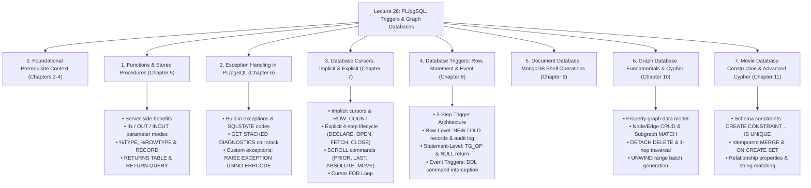
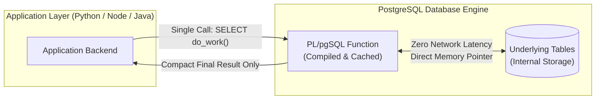
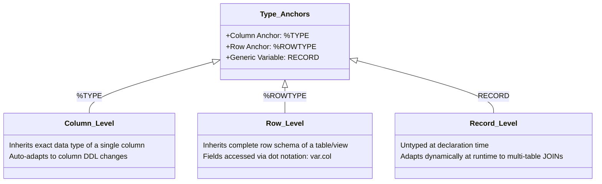
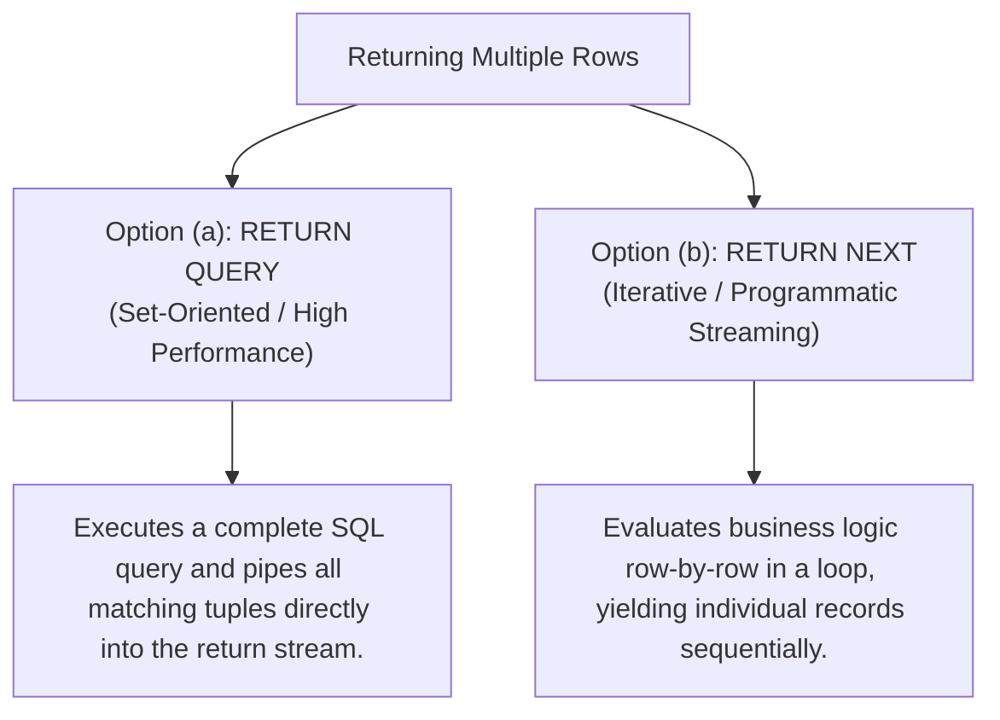
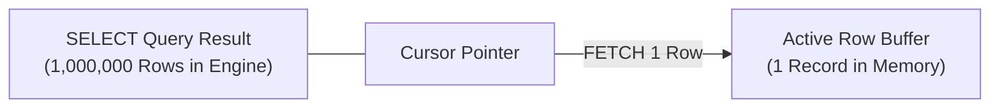
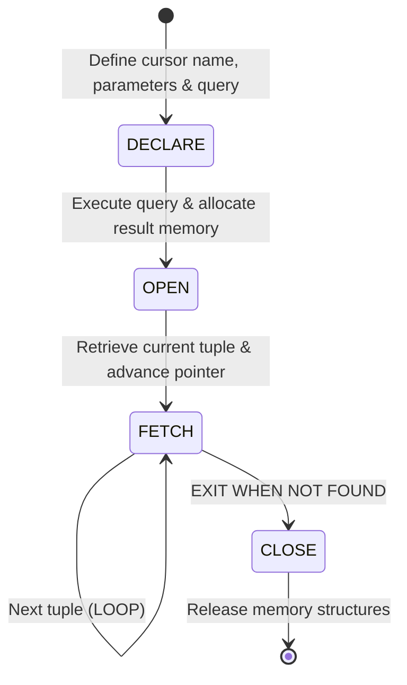
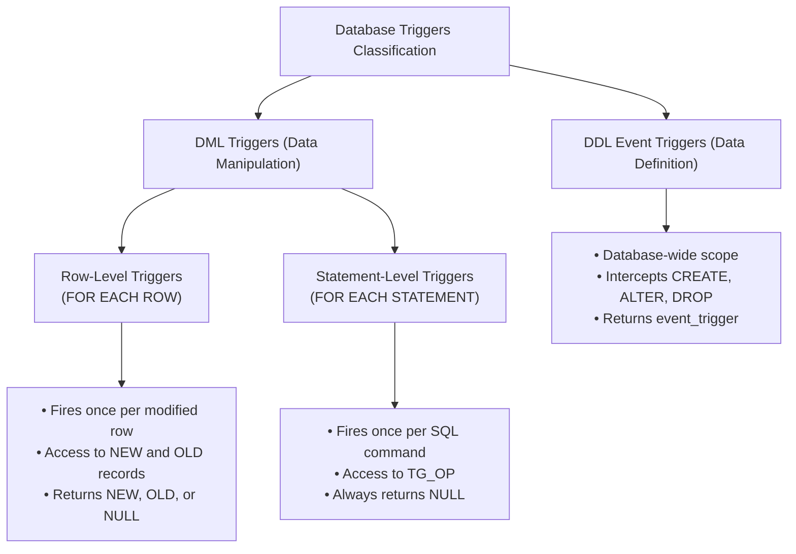
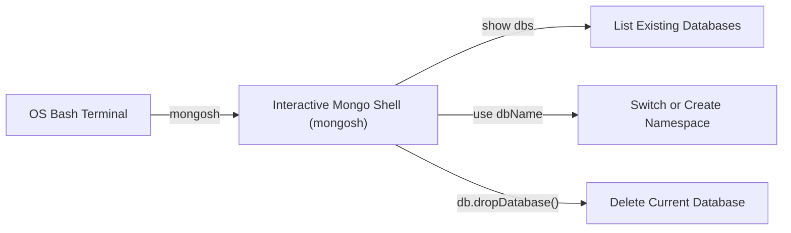
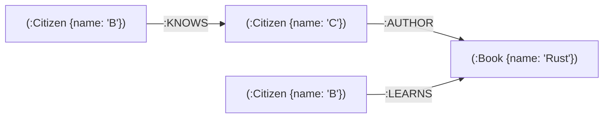

# ⚡ PL/pgSQL, Triggers & Graph Databases — Master Exam & Intuition Guide

> [!abstract] Course & Syllabus Overview (CSE 4409: Database Systems II)
> - **Instructor**: Dr. Abu Raihan Mostofa Kamal, Professor, Department of CSE, Islamic University of Technology (IUT).
> - **Primary Slides**: `Lecture26.pdf` (Version 2.0, 76 pages).
> - **Target Audience**: Students preparing for the Final Exam who need complete intuition, step-by-step code breakdowns, syntax breakdowns, slide screenshots, and clear visual demarcations distinguishing the lecture slides from supplementary deep-dives.

---

## 🗺️ Visual Topic Roadmap



---

# 0. Foundational Prerequisite Context (Chapters 2–4 Summary)

> [!error] Prerequisite Context (Chapters 2–4 Summary)
> **Note**: This section summarizes the foundational concepts from Chapters 2, 3, and 4 of `Lecture26.pdf` (PL/pgSQL Block Structure, Data Types, and Control Statements) to provide complete context for understanding Functions, Cursors, and Triggers.

### 0.1 Anatomy of a PL/pgSQL Block
PL/pgSQL is a block-structured procedural extension to SQL. Code is structured into blocks:
- **Anonymous Blocks (`DO $$ ... $$`)**: Executed immediately on the fly; neither stored in the catalog nor accepting parameters.
- **Named Blocks (Functions / Procedures)**: Stored permanently in the database catalog, accepting arguments and returning results.

```sql
DO $$
DECLARE
    -- Variable declarations (Memory allocation)
    v_counter INT := 0;
    v_message TEXT := 'Initial State';
BEGIN
    -- Procedural Execution & SQL Statements
    v_counter := v_counter + 1;
    RAISE NOTICE 'Counter Value: %, Message: %', v_counter, v_message;
EXCEPTION
    -- Error Handling Section
    WHEN OTHERS THEN
        RAISE WARNING 'An unexpected error occurred!';
END $$;
```

### 0.2 Specialized PostgreSQL Data Types
PostgreSQL provides advanced native data types beyond standard primitives:
1. **Arrays**: 1-based indexing, dynamic sizing (e.g., `INT[]`, `TEXT[]`, accessed as `my_array[1]`).
2. **Date/Time & Intervals**: Arithmetic supported directly (e.g., `CURRENT_DATE - INTERVAL '30 years'`, `AGE(dob)`).
3. **Network Addresses**: `INET` (host IP address) and `CIDR` (network specification with subnet mask, queried using subnet operators like `<<`).
4. **Range Types**: Represents continuous spans (`int4range`, `numrange`, `tsrange`). Checked for overlaps using the overlap operator `&&`.
5. **Generalized Search Tree (GiST) Index**: A balanced tree structure designed for complex data types like geometric points, polygons, and range intervals where standard B-Trees fail.

![[lecture26_gist_index_overview.png|550]]

6. **Composite Types (`CREATE TYPE`) & Domain Types (`CREATE DOMAIN`)**: Custom structured record types and constrained primitive aliases.

### 0.3 Control Structures Overview
- **Branching**: `IF ... ELSIF ... ELSE ... END IF;` and `CASE ... WHEN ... THEN ... ELSE ... END CASE;`.
- **Loops**:
  - Unbounded loop with exit condition: `LOOP ... EXIT WHEN condition; ... END LOOP;`.
  - Bounded numeric loop: `FOR i IN 1..10 LOOP ... END LOOP;` (inclusive of upper bound).
  - Mock data generator: `generate_series(start, stop, step)` for bulk tuple generation.

---

# 1. Chapter 5: Functions and Procedures

## 1.1 Architectural Benefits of Database Functions & Procedures

In modern multi-tier architectures, business logic can reside either in application servers (Node.js, Python, Java) or directly on the database engine. Storing reusable procedural logic directly in PostgreSQL provides four major benefits:



1. **Performance**:
   - **Reduced Network Round-Trips**: Instead of sending 10 sequential SQL queries back and forth over TCP/IP, a single function invocation executes all operations locally in database memory.
   - **Execution Plan Caching**: PL/pgSQL compiles and parses query plans on the first execution, caching them for subsequent calls to eliminate re-parsing overhead.
   - **Reduced Wire Traffic**: Intermediate tabular data is processed in the database buffer pool; only the final aggregated scalar or result set is transmitted back to the client.
2. **Encapsulation & Modularity (Single Source of Truth)**:
   - In distributed ecosystems with heterogeneous clients (Web backend in Node.js, Data pipeline in Python, Mobile API in Go, BI reporting tools), placing critical calculations (e.g., tax, discounts, interest rates) inside database functions guarantees uniform business logic.
3. **Security & Fine-Grained Access Control**:
   - Database administrators can `GRANT EXECUTE` on a function to low-privileged application users without granting direct `SELECT`, `INSERT`, or `UPDATE` permissions on the underlying base tables.
   - **`SECURITY DEFINER`**: Allows a function to execute with the elevated privileges of the user who *created* it rather than the user who *called* it (safe privilege escalation).
   - **SQL Injection Defense**: Dynamic queries parameterized through PL/pgSQL variables are pre-compiled and immune to string-concatenation injection vulnerabilities.
4. **Maintainability in Large Enterprise Systems**:
   - Centralizes database-bound business rules, simplifying schema migrations and audits.

---

## 1.2 Function Declaration Syntax & Execution Patterns

### Core Syntax Blueprint
```sql
CREATE OR REPLACE FUNCTION function_name(parameter_list)
RETURNS return_datatype
LANGUAGE plpgsql
AS $$
DECLARE
    -- Local variables
BEGIN
    -- Business logic
    RETURN result_expression;
END;
$$;
```

### Case 1: Simple Function with Explicit Return Expression
A purely mathematical or transformation function that accepts inputs and returns a scalar:

```sql
CREATE OR REPLACE FUNCTION do_multiply(a numeric, b numeric)
RETURNS numeric
LANGUAGE plpgsql
AS $$
BEGIN
    RETURN a * b;
END;
$$;
```

### Case 2: Extracting Table Data into Local Variables (`SELECT ... INTO`)
To query data from persistent tables inside a procedural block, PL/pgSQL uses the `SELECT ... INTO` clause to assign table column values directly into declared local variables:

```sql
CREATE OR REPLACE FUNCTION get_dbvalue(p_roomid numeric)
RETURNS text
LANGUAGE plpgsql
AS $$
DECLARE
    v_name text;
BEGIN
    -- Query the table and store the single returned column into v_name
    SELECT name INTO v_name
    FROM meeting_rooms
    WHERE id = p_roomid;

    RETURN v_name;
END;
$$;
```

### The 3 Invocation Patterns for Database Functions
PostgreSQL functions can be invoked in three distinct operational contexts:

```sql
-- Pattern 1: Standalone execution (returns a single scalar value)
SELECT get_dbvalue(3);

-- Pattern 2: Projected column-by-column across an existing table query
SELECT id, get_dbvalue(id) AS room_name
FROM meeting_rooms;

-- Pattern 3: Captured inside another procedural block into a local variable
DO $$
DECLARE
    x text;
BEGIN
    x := get_dbvalue(2);
    RAISE NOTICE 'Retrieved Room Name: %', x;
END $$;
```

---

## 1.3 Parameter Modes: `IN`, `OUT`, and `INOUT`

The parameter mode dictates how data flows between the caller and the function body:

| Parameter Mode | Default? | Purpose & Data Flow | Key Characteristics |
| :--- | :---: | :--- | :--- |
| `IN` | **Yes** | Passes input data from the caller into the function. | In PostgreSQL, `IN` parameters are locally mutable within the function body (unlike Oracle). |
| `OUT` | No | Returns output data from the function back to the caller. | Removes the need for explicit `RETURNS type` and `RETURN expr` statements. |
| `INOUT` | No | Accepts an input value, modifies it inside the function, and returns the modified result. | Acts as both an input variable and a return channel. |

### Using `OUT` Parameters for Multiple Return Values
When `OUT` parameters are defined, they become part of the function signature. The function automatically wraps them into a record upon exit:

```sql
-- Example 1: Single OUT Parameter
CREATE OR REPLACE FUNCTION myf1(a IN numeric, OUT b numeric)
LANGUAGE plpgsql
AS $$
BEGIN
    b := a * a; -- Directly assign value to OUT parameter (no RETURN expr required)
END;
$$;

-- Invocation: Calling only requires supplying the IN parameter
SELECT myf1(6); -- Returns 36
```

```sql
-- Example 2: Multiple OUT Parameters
CREATE OR REPLACE FUNCTION myf2(a IN numeric, OUT b numeric, OUT c numeric)
LANGUAGE plpgsql
AS $$
BEGIN
    b := a * a;
    c := a + a;
END;
$$;

-- Calling Multiple OUT Parameters:
SELECT myf2(9);          -- Returns a composite record: (81, 18)
SELECT b FROM myf2(8);   -- Selects only OUT parameter 'b': 64
SELECT c FROM myf2(6);   -- Selects only OUT parameter 'c': 12
SELECT b, c FROM myf2(34);-- Unpacks columns: b = 1156, c = 68
```

### Receiving Multiple Returns inside a Procedural Block
When calling a function with multiple `OUT` parameters from inside another PL/pgSQL block, use `SELECT ... INTO` to unpack the result fields into distinct local variables:

```sql
CREATE OR REPLACE FUNCTION get_my_values(
    IN input_val INT,
    OUT main_result INT,
    OUT p INT,
    OUT q INT
) AS $$
BEGIN
    main_result := input_val * 2;
    p := input_val + 5;
    q := input_val + 10;
END;
$$ LANGUAGE plpgsql;

-- Unpacking the returned record inside an anonymous block
DO $$
DECLARE
    a INT;
    b INT;
    c INT;
BEGIN
    SELECT main_result, p, q
    INTO a, b, c
    FROM get_my_values(10);

    RAISE NOTICE 'Unpacked values -> a: %, b: %, c: %', a, b, c;
END $$;
```

---

## 1.4 Dynamic Anchoring & Record Types: `%TYPE`, `%ROWTYPE`, and `RECORD`

When manipulating database tables in PL/pgSQL, hardcoding data types (e.g., `VARCHAR(50)`) makes stored logic brittle. Schema alterations (like widening a column to `VARCHAR(100)`) would immediately break or truncate stored procedures. PostgreSQL provides dynamic type anchors to eliminate this coupling.



### 1. `%TYPE` (The Column Cloner / Anchor)
- **Concept**: Inherits the exact data type of a specified table column or existing variable.
- **Benefit**: If the table column definition is altered via DDL (`ALTER TABLE`), the function automatically inherits the new data type without manual code refactoring.

```sql
CREATE OR REPLACE FUNCTION get_employee_salary(emp_id INT)
RETURNS NUMERIC AS $$
DECLARE
    -- Dynamically inherits whatever type 'employees.salary' is defined as
    v_salary employees.salary%TYPE;
BEGIN
    SELECT salary INTO v_salary 
    FROM employees 
    WHERE id = emp_id;

    RETURN v_salary;
END;
$$ LANGUAGE plpgsql;
```

### 2. `%ROWTYPE` (The Row Cloner / Anchor)
- **Concept**: Creates a structured record variable containing every column of a specific table or view.
- **Benefit**: Keeps code concise and clean. You don't need to declare 15 distinct variables for a 15-column table. Fields are accessed using dot notation (`variable.column_name`).

```sql
CREATE OR REPLACE FUNCTION process_employee_bonus(emp_id INT)
RETURNS VOID AS $$
DECLARE
    -- Holds an entire row structured identically to the 'employees' table
    v_emp_row employees%ROWTYPE;
BEGIN
    SELECT * INTO v_emp_row 
    FROM employees 
    WHERE id = emp_id;

    IF v_emp_row.performance_rating = 'Excellent' THEN
        UPDATE employees 
        SET salary = salary + 5000 
        WHERE id = v_emp_row.id;
    END IF;

    RETURN;
END;
$$ LANGUAGE plpgsql;
```

### 3. `RECORD` (The Generic Dynamic Placeholder)
- **Concept**: A `RECORD` variable is completely untyped when declared. It does not have a predefined structural schema.
- **Benefit**: Unmatched runtime flexibility. It dynamically morphs its internal schema to match whatever arbitrary projection, aggregation, or multi-table `JOIN` result is assigned into it.

```sql
-- Comprehensive Demonstration: Complex Multi-Table JOIN with RECORD
-- 1. Setup Base Tables
CREATE TABLE IF NOT EXISTS DEPTS (
    ID INTEGER PRIMARY KEY,
    NAME TEXT,
    LOCATION TEXT,
    BUDGET NUMERIC
);

CREATE TABLE IF NOT EXISTS EMPS (
    EID SERIAL PRIMARY KEY,
    NAME TEXT,
    DOB DATE,
    DEPT INTEGER REFERENCES DEPTS(ID)
);

-- 2. Populate Sample Records
INSERT INTO DEPTS (ID, NAME, LOCATION, BUDGET) VALUES
    (4, 'CSE', 'AB2', 3.1),
    (2, 'EEE', 'AB1', 2.5),
    (3, 'MPE', 'AB1', 1.2);

INSERT INTO EMPS (NAME, DOB, DEPT) VALUES
    ('ABDUL KARIM', CURRENT_DATE - INTERVAL '30 years', 4),
    ('ABDUL RAZZAK', CURRENT_DATE - INTERVAL '51 years', 4),
    ('AKHTAR HOSSAIN', CURRENT_DATE - INTERVAL '41 years', 2),
    ('ABDUL HALIM', CURRENT_DATE - INTERVAL '23 years', 3);

-- 3. Function querying multiple joined tables into a generic RECORD
CREATE OR REPLACE FUNCTION record_demo(p_eid INT)
RETURNS VOID AS $$
DECLARE
    emp_rec RECORD; -- Generic placeholder
BEGIN
    SELECT
        e.eid AS EID,
        e.name AS ENAME,
        e.dob AS EDOB,
        d.name AS DEPT,
        d.location AS DLOCATION
    INTO emp_rec
    FROM EMPS AS e
    INNER JOIN DEPTS AS d ON e.DEPT = d.ID
    WHERE e.eid = p_eid;

    RAISE WARNING 'Given Employee ID: %', p_eid;
    RAISE WARNING 'Employee Name: %', emp_rec.ename;
    RAISE WARNING 'Date of Birth: %', emp_rec.edob;
    RAISE WARNING 'Department Location: %', emp_rec.dlocation;
END;
$$ LANGUAGE plpgsql;

-- Invocation
SELECT record_demo(1);
```

---

## 1.5 Returning Multiple Rows: `RETURNS TABLE` & `RETURN QUERY`

In production, functions often need to return tabular result sets (multiple rows and columns) rather than single scalar values. There are two primary paradigms:



### Implementation via `RETURNS TABLE (...)` and `RETURN QUERY`
This is the cleanest and most efficient approach for wrapping queries.

```sql
-- Create Table
CREATE TABLE IF NOT EXISTS employees (
    emp_id INT,
    emp_name VARCHAR(50),
    department VARCHAR(50),
    salary NUMERIC
);

-- Define Set-Returning Function
CREATE OR REPLACE FUNCTION get_employees_by_dept(p_department VARCHAR)
RETURNS TABLE (
    id INT, 
    name VARCHAR, 
    current_salary NUMERIC
) AS $$
BEGIN
    -- RETURN QUERY executes the query and directly appends all matching rows to the result set
    RETURN QUERY
    SELECT emp_id, emp_name, salary
    FROM employees
    WHERE department = p_department;
END;
$$ LANGUAGE plpgsql;

-- Calling the Set-Returning Function:
-- Treat the function exactly like a persistent Table or View!
SELECT * FROM get_employees_by_dept('CSE');
```

---

# 2. Chapter 6: Exception Handling in PL/pgSQL

## 2.1 Transaction Semantics & The Need for Exception Trapping

In relational database systems, transactions operate under strict ACID guarantees. If a runtime error occurs during function execution (e.g., duplicate unique key, division by zero, foreign key mismatch):
1. PostgreSQL immediately **aborts the entire transaction**.
2. All preceding database modifications are completely **rolled back**.
3. A raw, unformatted error string is returned to the client application.

**Exception handling** allows developers to intercept errors at the database level, preventing transaction rollback, executing remediation logic, logging errors into audit tables, or returning user-friendly status flags.

```sql
BEGIN
    -- Protected statements
EXCEPTION
    WHEN error_condition_1 THEN
        -- Recovery / remediation logic
    WHEN error_condition_2 THEN
        -- Alternative logic
    WHEN OTHERS THEN
        -- Catch-all handler
END;
```

---

## 2.2 Handling Built-in Exceptions

### Scenario: Graceful User Registration
When registering a new member, attempting to insert an existing email address triggers a unique constraint violation. Instead of crashing, the function traps the error and returns `-1`.

```sql
-- 1. Table with Unique Constraint
CREATE TABLE IF NOT EXISTS members (
    id SERIAL PRIMARY KEY,
    email VARCHAR(255) UNIQUE,
    joined_at TIMESTAMP DEFAULT CURRENT_TIMESTAMP
);

-- 2. Function with Exception Block
CREATE OR REPLACE FUNCTION register_member(p_email VARCHAR)
RETURNS INT AS $$
DECLARE
    v_new_id INT;
BEGIN
    INSERT INTO members (email)
    VALUES (p_email)
    RETURNING id INTO v_new_id;

    RETURN v_new_id;
EXCEPTION
    -- Intercept duplicate key violations on unique constraints
    WHEN unique_violation THEN
        RAISE WARNING 'Attempted to register duplicate email: %', p_email;
        RAISE WARNING 'Please try with another email other than: %', p_email;
        RETURN -1;
END;
$$ LANGUAGE plpgsql;
```

### Advanced Diagnostics: `GET STACKED DIAGNOSTICS`
When handling generic exceptions (`WHEN OTHERS`), PostgreSQL exposes automatic error variables:
- **`SQLSTATE`**: The 5-character alphanumeric error code.
- **`SQLERRM`**: The human-readable error description string.
- **`GET STACKED DIAGNOSTICS ... = PG_EXCEPTION_CONTEXT`**: Retrieves the full call stack trace, including exact line numbers inside the stored procedure where the error originated.

```sql
CREATE OR REPLACE FUNCTION register_memberv2(p_email VARCHAR)
RETURNS INT AS $$
DECLARE
    v_new_id INT;
    v_err_context TEXT;
BEGIN
    INSERT INTO members (email)
    VALUES (p_email)
    RETURNING id INTO v_new_id;

    RETURN v_new_id;
EXCEPTION
    WHEN OTHERS THEN
        -- Extract complete stack trace context
        GET STACKED DIAGNOSTICS v_err_context = PG_EXCEPTION_CONTEXT;

        -- Log deep error metadata
        RAISE WARNING 'Error Code (SQLSTATE): %, Message: %', SQLSTATE, SQLERRM;
        RAISE WARNING 'Execution Context / Line Number: %', v_err_context;
        RETURN -1;
END;
$$ LANGUAGE plpgsql;
```

### Core Built-in Exception Codes Reference Table

| Condition Name | SQLSTATE Error Code | Root Cause / Triggering Event |
| :--- | :---: | :--- |
| `unique_violation` | **`23505`** | Breaching a `UNIQUE` or `PRIMARY KEY` constraint. |
| `foreign_key_violation` | **`23503`** | Inserting a child row referencing a non-existent parent, or deleting a referenced parent. |
| `not_null_violation` | **`23502`** | Attempting to insert a `NULL` into a column declared `NOT NULL`. |
| `division_by_zero` | **`22012`** | Arithmetic division by integer or float zero (`x / 0`). |
| `no_data_found` | **`P0002`** | A `SELECT INTO` query returned zero rows. |
| `too_many_rows` | **`P0003`** | A `SELECT INTO` query returned multiple rows into a scalar target. |

> [!tip] Direct SQLSTATE Trapping
> Instead of writing `WHEN unique_violation THEN`, you can explicitly write `WHEN SQLSTATE '23505' THEN`. Both are semantically identical.

---

## 2.3 User-Defined Exceptions & Custom Error Codes

In enterprise applications, operations frequently violate domain-specific business rules rather than database integrity constraints (e.g., an account balance cannot go below zero during withdrawal). Developers can trigger custom exceptions using `RAISE EXCEPTION ... USING ERRCODE = '...'`.

### Banking Withdrawal Case Study

```sql
-- 1. Setup Accounts Table
CREATE TABLE IF NOT EXISTS accounts (
    acc_no SERIAL PRIMARY KEY,
    name TEXT,
    balance NUMERIC(10, 2)
);

INSERT INTO accounts (name, balance) VALUES
    ('Mr. Abdul Karim', 4000.00),
    ('Mr. Bob', 9000.00);

-- 2. Stored Procedure with Custom Business Rule Enforcement
CREATE OR REPLACE FUNCTION process_withdrawal(p_account_id INT, p_amount NUMERIC)
RETURNS VOID AS $$
DECLARE
    v_current_balance NUMERIC;
BEGIN
    -- Step 1: Fetch current balance
    SELECT balance INTO v_current_balance
    FROM accounts
    WHERE acc_no = p_account_id;

    -- Step 2: Validate business invariant
    IF v_current_balance < p_amount THEN
        -- Raise user-defined exception with a custom 5-character SQLSTATE code
        -- Convention: Codes starting with 'U' denote user-defined exceptions
        RAISE EXCEPTION 'Transaction failed: Insufficient funds. Current balance: %', v_current_balance
            USING ERRCODE = 'U0101';
    END IF;

    -- Step 3: Execute balance debit
    UPDATE accounts
    SET balance = balance - p_amount
    WHERE acc_no = p_account_id;

    RAISE NOTICE 'Withdrawal successfully processed!';
EXCEPTION
    -- Step 4: Intercept user-defined error code
    WHEN SQLSTATE 'U0101' THEN
        RAISE WARNING 'Handled Business Error [%]: %', SQLSTATE, SQLERRM;

    -- Step 5: Catch unexpected systemic errors
    WHEN OTHERS THEN
        RAISE WARNING 'Unexpected system error: % (SQLSTATE: %)', SQLERRM, SQLSTATE;
END;
$$ LANGUAGE plpgsql;
```

```sql
-- Test Execution:
SELECT process_withdrawal(1, 100);  -- Success: Deducts 100
SELECT process_withdrawal(1, 8100); -- Triggers Handled Business Error [U0101]
```

---

# 3. Chapter 7: Database Cursors for Selected Records

## 3.1 Cursor Concepts & Architecture

When a query produces a result set of millions of rows, executing `SELECT * INTO` would load the entire massive payload into the database process's private memory, causing memory bloat and buffer pool thrashing.

A **Cursor** provides a stateful pointer into the result set of an active query, enabling client applications and procedural blocks to **fetch and process records row-by-row (streaming)** with fixed, minimal memory consumption.



There are two primary classifications of cursors:
1. **Implicit Cursors**: Managed automatically by PostgreSQL.
2. **Explicit Cursors**: Controlled manually by the programmer with custom navigation commands.

---

## 3.2 Implicit Cursors

An **Implicit Cursor** is automatically declared, opened, fetched, and closed by PostgreSQL whenever a `FOR ... IN SELECT` query executes inside PL/pgSQL.

```sql
CREATE OR REPLACE FUNCTION print_employees(p_id integer)
RETURNS void AS $$
DECLARE
    v_emp RECORD; -- Variable holding implicitly fetched tuples
BEGIN
    -- The FOR loop implicitly manages the cursor lifecycle
    FOR v_emp IN
        SELECT eid, name, dob
        FROM emps
        WHERE eid <= p_id
    LOOP
        RAISE NOTICE 'Emp ID: %, Name: %, DOB: %', v_emp.eid, v_emp.name, v_emp.dob;
    END LOOP;
END $$ LANGUAGE plpgsql;

-- Invocation
SELECT print_employees(3);
```

### Inspecting DML Cardinality: `GET DIAGNOSTICS ... ROW_COUNT`
To determine how many rows were updated, inserted, or deleted by the immediately preceding SQL statement, PL/pgSQL provides the `ROW_COUNT` diagnostic inspection:

```sql
DO $$
DECLARE
    v_count INT;
BEGIN
    UPDATE emps
    SET name = UPPER(name)
    WHERE dept = 4;

    -- Inspect number of affected rows
    GET DIAGNOSTICS v_count = ROW_COUNT;
    RAISE NOTICE 'Total rows updated: %', v_count;
END $$;
```

---

## 3.3 Explicit Cursors & The 4-Stage Lifecycle

An **Explicit Cursor** gives the developer granular, programmatic control over when the query is executed, how individual rows are retrieved into variables, and when resources are released.



### Parameterized Explicit Cursor Walkthrough

```sql
-- 1. Setup Students Table
CREATE TABLE IF NOT EXISTS students (
    id SERIAL PRIMARY KEY,
    name TEXT,
    cgpa NUMERIC(4, 2)
);

INSERT INTO students (name, cgpa) VALUES
    ('Alice', 3.20), ('Bob', 3.62), ('Charlie', 3.85),
    ('David', 3.92), ('Emma', 3.42), ('Frank', 3.83);

-- 2. Explicit Cursor Function
CREATE OR REPLACE FUNCTION find_top_students(p_min_cgpa numeric)
RETURNS void AS $$
DECLARE
    -- Step 1: DECLARE the parameterized explicit cursor
    cur_top_stu CURSOR(min_cgpa numeric) FOR
        SELECT name, cgpa 
        FROM students 
        WHERE cgpa >= min_cgpa 
        ORDER BY cgpa DESC;

    -- Local variables to receive fetched row values
    v_name students.name%TYPE;
    v_cgpa students.cgpa%TYPE;
BEGIN
    -- Step 2: OPEN cursor and pass dynamic threshold parameter
    OPEN cur_top_stu(p_min_cgpa);

    LOOP
        -- Step 3: FETCH current row into variables
        FETCH cur_top_stu INTO v_name, v_cgpa;

        -- Check loop termination flag
        EXIT WHEN NOT FOUND;

        RAISE NOTICE 'Top Student: % | CGPA: %', v_name, v_cgpa;
    END LOOP;

    -- Step 4: CLOSE cursor to free memory resources
    CLOSE cur_top_stu;
END $$ LANGUAGE plpgsql;

-- Invocation
SELECT find_top_students(3.60);
```

---

## 3.4 Scrollable Cursors (`SCROLL CURSOR`) & Navigation Commands

By default, cursors are **forward-only** (you can only fetch the next row sequentially). Declaring a cursor with the `SCROLL` keyword enables non-linear, multi-directional navigation across the result set.

### Key Navigation Commands Reference

| Command | Action & Pointer Movement | Memory Cost |
| :--- | :--- | :--- |
| `FETCH FIRST` | Instantly rewinds the pointer and retrieves the very first row. | Fetches data into variables. |
| `FETCH LAST` | Instantly jumps to the end and retrieves the final row. | Fetches data into variables. |
| `FETCH PRIOR` (or `BACKWARD`) | Moves the pointer backward by one row and retrieves that row. | Fetches data into variables. |
| `FETCH ABSOLUTE n` | Directly jumps to row index $n$ (1-indexed) and retrieves it. | Fetches data into variables. |
| `FETCH NEXT` | Advances the pointer forward by one row and retrieves it. | Fetches data into variables. |
| `MOVE FORWARD n` | Skips forward $n$ rows **without loading data** into variables. | **High Performance** (zero variable copying). |

### Scrollable Cursor Walkthrough

```sql
-- 1. Setup Citizen Table
CREATE TABLE IF NOT EXISTS citizen (
    cid SERIAL PRIMARY KEY,
    name TEXT,
    income NUMERIC
);

INSERT INTO citizen (name, income) VALUES
    ('a', 30000), ('b', 10000), ('c', 43000), ('d', 70000),
    ('e', 96000), ('f', 32000), ('g', 78000), ('h', 80000);

-- 2. Scrollable Navigation Function
CREATE OR REPLACE FUNCTION navigate_citizen_data()
RETURNS void AS $$
DECLARE
    -- Step 1: Explicitly declare with SCROLL
    cur_citi SCROLL CURSOR FOR
        SELECT name, income 
        FROM citizen 
        ORDER BY income DESC;

    v_name citizen.name%TYPE;
    v_income citizen.income%TYPE;
BEGIN
    -- Step 2: Open cursor
    OPEN cur_citi;

    -- Jump to very last row (Lowest income)
    FETCH LAST FROM cur_citi INTO v_name, v_income;
    RAISE NOTICE 'Last in List -> Name: %, Income: %', v_name, v_income;

    -- Move backward one row (Second to last)
    FETCH PRIOR FROM cur_citi INTO v_name, v_income;
    RAISE NOTICE 'Second to Last -> Name: %, Income: %', v_name, v_income;

    -- Jump back to the top (Highest income)
    FETCH FIRST FROM cur_citi INTO v_name, v_income;
    RAISE NOTICE 'Top of List -> Name: %, Income: %', v_name, v_income;

    -- Skip forward 3 rows without fetching data
    MOVE FORWARD 3 IN cur_citi;

    -- Fetch the row at current position after skipping
    FETCH NEXT FROM cur_citi INTO v_name, v_income;
    RAISE NOTICE 'After Skipping 3 Rows -> Name: %, Income: %', v_name, v_income;

    -- Step 8: Close cursor
    CLOSE cur_citi;
END $$ LANGUAGE plpgsql;

-- Invocation
SELECT navigate_citizen_data();
```

---

## 3.5 Cursor FOR Loops (The Best Practice)

A **Cursor FOR Loop** combines the flexibility of an explicit parameterized cursor with the automated lifecycle management of a `FOR` loop. PL/pgSQL automatically handles `OPEN`, `FETCH`, checking for termination, and guaranteed `CLOSE` even if exceptions occur.

```sql
CREATE OR REPLACE FUNCTION find_top_studentsv2(p_min_cgpa numeric)
RETURNS void AS $$
DECLARE
    -- 1. Declare explicit parameterized cursor
    cur_top_stu CURSOR(min_cgpa numeric) FOR
        SELECT name, cgpa 
        FROM students 
        WHERE cgpa >= min_cgpa 
        ORDER BY cgpa DESC;

    -- 2. Declare a single RECORD loop variable
    v_student RECORD;
BEGIN
    -- 3. FOR loop automatically OPENS, FETCHES, and CLOSES the cursor safely
    FOR v_student IN cur_top_stu(p_min_cgpa) LOOP
        -- Clean dot notation access
        RAISE NOTICE 'Top Student: % got CGPA of %', v_student.name, v_student.cgpa;
    END LOOP;
END $$ LANGUAGE plpgsql;

-- Invocation
SELECT find_top_studentsv2(3.60);
```

---

# 4. Chapter 8: Database Triggers

## 4.1 Trigger Mechanics & Classification

A **Trigger** is a specialized stored procedure that executes automatically in response to specific events occurring inside the database.



### The 3-Step Trigger Implementation Pipeline
1. **Step 1**: Create the underlying base tables and audit log tables.
2. **Step 2**: Create the Trigger Function with return type `RETURNS TRIGGER` (or `RETURNS event_trigger`).
3. **Step 3**: Attach the trigger to the table using the `CREATE TRIGGER` statement.

---

## 4.2 Row-Level Triggers (`FOR EACH ROW`)

### Key Properties:
- **Firing Frequency**: Fires once for *every individual row* inserted, updated, or deleted.
- **Special Record Variables**:
  - `NEW`: Holds the state of the newly inserted or updated record (`NULL` during `DELETE`).
  - `OLD`: Holds the state of the record before update or deletion (`NULL` during `INSERT`).
- **Return Requirement**: Must return `NEW` (for `INSERT`/`UPDATE`) or `OLD` (for `DELETE`). Returning `NULL` cancels/suppresses the operation for that row.

### Comprehensive Salary Change Audit Case Study

```sql
-- Step 1: Base Table & Audit Log Table
CREATE TABLE IF NOT EXISTS employees (
    id SERIAL PRIMARY KEY,
    name TEXT NOT NULL,
    salary NUMERIC(10, 2)
);

CREATE TABLE IF NOT EXISTS salary_audit (
    id SERIAL PRIMARY KEY,
    employee_id INT,
    old_salary NUMERIC(10, 2),
    new_salary NUMERIC(10, 2),
    changed_at TIMESTAMP DEFAULT NOW(),
    changed_by TEXT DEFAULT CURRENT_USER
);

-- Step 2: Trigger Function
CREATE OR REPLACE FUNCTION log_salary_change()
RETURNS TRIGGER AS $$
BEGIN
    -- Only log if the salary value actually changed (avoids no-op logging)
    IF NEW.salary IS DISTINCT FROM OLD.salary THEN
        INSERT INTO salary_audit (employee_id, old_salary, new_salary)
        VALUES (OLD.id, OLD.salary, NEW.salary);
    END IF;

    RETURN NEW; -- Required for row-level BEFORE/AFTER triggers
END;
$$ LANGUAGE plpgsql;

-- Step 3: Attach Trigger to Table
CREATE TRIGGER trg_salary_audit
AFTER UPDATE ON employees
FOR EACH ROW -- Makes it a Row-Level trigger
EXECUTE FUNCTION log_salary_change();
```

```sql
-- Step 4: Verification & Testing
INSERT INTO employees (name, salary) VALUES
    ('Mahmud', 65000),
    ('Hasan', 25000),
    ('A Karim', 85000);

-- Trigger firing updates:
UPDATE employees SET salary = 82000 WHERE id = 1; -- Logged (Salary changed from 65k to 82k)
UPDATE employees SET salary = 85000 WHERE id = 3; -- Not logged (Salary unchanged, same value)

-- Inspect Audit Trail
SELECT * FROM salary_audit;
```

---

## 4.3 Statement-Level Triggers (`FOR EACH STATEMENT`)

### Key Properties:
- **Firing Frequency**: Fires **exactly once** per SQL command, regardless of whether 0 rows, 1 row, or 10,000 rows were modified.
- **Variable Access**: Does **NOT** have access to individual `OLD` or `NEW` record rows.
- **Return Requirement**: Always returns `NULL`.
- **Special System Variable `TG_OP`**: Contains the DML operation type that fired the trigger (`'INSERT'`, `'UPDATE'`, or `'DELETE'`).

### Bulk Operation Audit Walkthrough

```sql
-- 1. Base Table and Bulk Audit Table
CREATE TABLE IF NOT EXISTS products (
    id SERIAL PRIMARY KEY,
    name VARCHAR(100),
    price NUMERIC
);

INSERT INTO products (name, price) VALUES
    ('Pen', 0.50),
    ('Notebook', 4.50),
    ('Eraser', 0.25);

CREATE TABLE IF NOT EXISTS bulk_audit_log (
    log_id SERIAL PRIMARY KEY,
    action_type TEXT,
    executed_at TIMESTAMP DEFAULT CURRENT_TIMESTAMP
);

-- 2. Statement Trigger Function
CREATE OR REPLACE FUNCTION log_bulk_operation()
RETURNS TRIGGER AS $$
BEGIN
    -- Record the bulk DML action type (INSERT / UPDATE / DELETE)
    INSERT INTO bulk_audit_log (action_type)
    VALUES (TG_OP);

    RETURN NULL; -- Statement-level triggers always return NULL
END;
$$ LANGUAGE plpgsql;

-- 3. Attach Statement Trigger
CREATE TRIGGER trg_statement_bulk_log
AFTER UPDATE OR DELETE ON products
FOR EACH STATEMENT -- Declares it as Statement-Level
EXECUTE FUNCTION log_bulk_operation();

-- 4. Test Execution
UPDATE products SET price = price + 0.70; -- Updates all 3 rows, but fires trigger exactly ONCE

-- Check log
SELECT * FROM bulk_audit_log;
```

```sql
-- Drop Syntax:
DROP TRIGGER trg_statement_bulk_log ON products;
DROP FUNCTION log_bulk_operation();
```

---

## 4.4 Event Triggers (`event_trigger`)

While standard DML triggers intercept row mutations, **Event Triggers** are database-wide and fire in response to **Data Definition Language (DDL)** commands such as `CREATE TABLE`, `ALTER TABLE`, `DROP TABLE`, or `DROP INDEX`.

### System Metadata Functions & Variables:
- **Return Type**: Must return `event_trigger`.
- **`pg_event_trigger_ddl_commands()`**: Built-in system function returning metadata records for every schema object affected by the DDL statement (`object_type`, `schema_name`, `object_identity`).
- **`TG_EVENT`**: Name of the event (`ddl_command_end`, `sql_drop`).
- **`TG_TAG`**: The SQL command tag (`CREATE TABLE`, `ALTER TABLE`, `DROP INDEX`).

### Enterprise DDL Audit Logging Walkthrough

```sql
-- 1. DDL Audit Log Table
CREATE TABLE IF NOT EXISTS ddl_audit_log (
    id SERIAL PRIMARY KEY,
    event_type TEXT,
    command_tag TEXT,
    object_type TEXT,
    schema_name TEXT,
    object_name TEXT,
    executed_by TEXT DEFAULT CURRENT_USER,
    executed_at TIMESTAMP DEFAULT NOW()
);

-- 2. Event Trigger Function
CREATE OR REPLACE FUNCTION log_ddl_event()
RETURNS event_trigger AS $$
DECLARE
    obj RECORD;
BEGIN
    -- Loop over all schema objects modified by the completed DDL statement
    FOR obj IN SELECT * FROM pg_event_trigger_ddl_commands()
    LOOP
        INSERT INTO ddl_audit_log (
            event_type,
            command_tag,
            object_type,
            schema_name,
            object_name
        ) VALUES (
            TG_EVENT,
            TG_TAG,
            obj.object_type,
            obj.schema_name,
            obj.object_identity
        );
    END LOOP;
END;
$$ LANGUAGE plpgsql SECURITY DEFINER;

-- 3. Create Event Trigger on DDL Command Completion
CREATE EVENT TRIGGER trg_log_ddl
ON ddl_command_end
EXECUTE FUNCTION log_ddl_event();
```

```sql
-- Drop Syntax for Event Trigger:
DROP EVENT TRIGGER trg_log_ddl;
```

---

# 5. Chapter 9: Document Database — MongoDB Shell Operations

Chapter 9 introduces core interactive operations in document-oriented databases using the official MongoDB shell (`mongosh`).



### Core MongoDB Management Commands

```bash
# 1. Connect to MongoDB from Bash Shell
mongosh

# 2. List all existing databases in the cluster
show dbs

# 3. Switch to a database (creates it automatically upon first document write)
use myDatabase

# 4. Drop / Delete the currently selected database (interactive)
db.dropDatabase();

# 5. Drop a database directly from OS bash CLI without interactive shell:
mongosh myData --eval "db.dropDatabase()"
```

---

# 6. Chapter 10: Graph Database Basic Operations (Neo4j & Cypher)

## 6.1 The Labeled Property Graph (LPG) Model

In a **Property Graph**:
1. **Nodes (Vertices)**: Represent entities (e.g., `:Citizen`, `:Book`, `:Person`).
2. **Labels**: Categorize nodes into types/classes (e.g., `(c:Citizen)`).
3. **Relationships (Edges)**: Directed, named connections linking two nodes (e.g., `-[:KNOWS]->`, `-[:AUTHOR]->`, `-[:LEARNS]->`).
4. **Properties**: Key-value pairs stored directly on nodes or relationships (e.g., `{name: 'Alice'}`, `{roles: ['Neo']}`).



---

## 6.2 Constructing Graphs with Cypher

### Bulk Graph Creation Script (From Lecture Slide)

```cypher
// Clear existing database to start fresh
MATCH (n:Citizen)
DETACH DELETE n;

// Create Citizen nodes, Book nodes, and their interconnecting relationships
CREATE
    (a:Citizen {name: 'A'}),
    (b:Citizen {name: 'B'}),
    (c:Citizen {name: 'C'}),
    (d:Citizen {name: 'D'}),
    (e:Citizen {name: 'E'}),
    (f:Citizen {name: 'F'}),
    (g:Citizen {name: 'G'}),
    (h:Citizen {name: 'H'}),
    (i:Citizen {name: 'I'}),
    (bk1:Book {name: 'Rust'}),
    (bk2:Book {name: 'GO'}),
    (c)-[:AUTHOR]->(bk1),
    (e)-[:AUTHOR]->(bk2),
    (b)-[:KNOWS]->(c),
    (c)-[:KNOWS]->(a),
    (c)-[:KNOWS]->(d),
    (d)-[:KNOWS]->(e),
    (e)-[:KNOWS]->(f),
    (d)-[:KNOWS]->(h),
    (h)-[:KNOWS]->(i),
    (c)-[:KNOWS]->(g),
    (g)-[:KNOWS]->(i);

// Adding a new relationship to existing nodes
MATCH (b:Citizen {name: 'B'}), (bk1:Book {name: 'Rust'})
CREATE (b)-[:LEARNS]->(bk1);
```

### Visualizing the Lecture Social Network Graph

![[lecture26_social_network_graph.png|600]]

---

## 6.3 Querying Patterns & Subgraphs

### 1. Filtering by Specific Relationship Types
```cypher
// Match only KNOWS relationships between Citizen nodes
MATCH (p:Citizen)-[r:KNOWS]->(q:Citizen)
RETURN p, r, q;
```

### 2. Wildcard / Open Pattern Matching (Entire Connected Graph)
```cypher
// Any relationship type between Citizen and any target node type
MATCH (p:Citizen)-[r]->(q)
RETURN p, r, q;
```

### 3. Extracting Specific Subgraphs
```cypher
// Subgraph containing all nodes pointing to Book nodes
MATCH (p)-[r]->(q:Book)
RETURN p, r, q;
```

### 4. 1-Hop Neighbor Queries
```cypher
// Find only direct neighbor nodes of Citizen 'C'
MATCH (c:Citizen {name: 'C'})-[r]->(neighbor)
RETURN neighbor;

// Return the complete 1-hop subgraph (source node, edge, and target)
MATCH (c:Citizen {name: 'C'})-[r]->(neighbor)
RETURN c, r, neighbor;
```

### 5. Traversing Isolated Nodes: `OPTIONAL MATCH` & Negative Filters
```cypher
// Show all nodes and their relationships (including nodes with 0 relationships)
MATCH (n)
OPTIONAL MATCH (n)-[r]-()
RETURN n, r;

// Find only orphaned / isolated nodes that have no relationships whatsoever
MATCH (n)
WHERE NOT (n)--()
RETURN n;
```

---

## 6.4 Graph Iteration & Batch Generation (`UNWIND` + `range`)

To generate multiple nodes algorithmically without writing repetitive statements, Cypher provides `UNWIND range(...)`:

```cypher
// 1. Create 10 nodes with property 'name' from 1 to 10 in a loop
UNWIND range(1, 10) AS i
CREATE (n:Node {name: i});

// 2. Match specific generated nodes and wire relationships
MATCH (node1:Node {name: 1}), (node3:Node {name: 3}), (node8:Node {name: 8})
CREATE (node1)-[:CONNECTED_TO]->(node3),
       (node3)-[:CONNECTED_TO]->(node8);
```

---

## 6.5 Safe Deletion Protocols & Relationship Mutations

### Deleting Nodes with Active Relationships: `DETACH DELETE`
In graph databases, attempting to delete a node that still has attached incoming or outgoing edges violates referential integrity and throws an error.

```cypher
// Approach 1: Delete relationships first, then delete nodes
MATCH ()-[r:KNOWS]->() DELETE r;
MATCH (c:Citizen) DELETE c;

// Approach 2: Cascade-delete nodes and all attached relationships simultaneously
MATCH (n)
WHERE n:Citizen OR n:Book
DETACH DELETE n;

// Nuclear Option: Delete every single node and edge in the entire database
MATCH (n)
DETACH DELETE n;
```

### Modifying Graph Edges: Recreate vs `MATCH & CREATE`
When adding a new relationship (e.g., `DONTLIKE`) between existing nodes:
- **Option 1 (Full Rebuild)**: Delete the graph and recreate all nodes and edges from scratch.
- **Option 2 (In-Place Mutation — Recommended)**: Match existing nodes and append the edge:

```cypher
MATCH (b:Person {name: 'Bob'}), (c:Person {name: 'Charlie'})
CREATE (b)-[:DONTLIKE]->(c);

// Display multi-relationship paths
MATCH (p:Person)-[r:KNOWS|DONTLIKE]->(q:Person)
RETURN p, r, q;
```

---

# 7. Chapter 11: Movie Database Construction (Advanced Neo4j Walkthrough)

Chapter 11 provides a production-grade blueprint for building, constraining, querying, and deleting a real-world graph database.

## 7.1 Enforcing Data Integrity: Schema Constraints

Unlike relational databases where constraints are table-wide DDL, Neo4j allows defining constraints per node label:

```cypher
CREATE CONSTRAINT movie_title IF NOT EXISTS FOR (m:Movie) REQUIRE m.title IS UNIQUE;
CREATE CONSTRAINT person_name IF NOT EXISTS FOR (p:Person) REQUIRE p.name IS UNIQUE;
```

### Syntax Anatomy Breakdown:
1. `CREATE CONSTRAINT`: Command keyword to register a new database invariant.
2. `movie_title IF NOT EXISTS`: Assigns a descriptive identifier and prevents errors on idempotent re-runs.
3. `FOR (m:Movie)`: Scopes the rule specifically to nodes carrying the `:Movie` label (`m` is the iteration variable).
4. `REQUIRE m.title IS UNIQUE`: Enforces uniqueness across the `title` property. Any query attempting to create a duplicate title will be rejected.

---

## 7.2 Idempotent Creation with `MERGE` and `ON CREATE SET`

The `MERGE` clause combines `MATCH` and `CREATE`. It searches for an existing pattern; if found, it binds to it; if not found, it creates it.

```cypher
// 1. Create Keanu Reeves Node (Idempotent)
MERGE (Keanu:Person {name: 'Keanu Reeves'})
ON CREATE SET Keanu.born = 1964;

// 2. Create The Matrix Movie Node (Idempotent)
MERGE (TheMatrix:Movie {title: 'The Matrix'})
ON CREATE SET 
    TheMatrix.released = 1999, 
    TheMatrix.tagline = 'Welcome to the Real World';

// 3. Create Relationship with Array Property
MERGE (Keanu)-[:ACTED_IN {roles: ['Neo']}]->(TheMatrix);
```

### Visualizing the Node-Relationship Graph

![[lecture26_movie_keanu_matrix_relationship.png|500]]

```cypher
// Query to visualize:
MATCH (p:Person)-[r:ACTED_IN]->(q:Movie)
RETURN p, r, q;
```

---

## 7.3 Clean Deletion Protocol

To remove nodes and relationships cleanly without `DETACH DELETE`, match the specific relationship and delete edges and nodes together:

```cypher
MATCH (p:Person {name: 'Keanu Reeves'})-[r:ACTED_IN]->(m:Movie {title: 'The Matrix'})
DELETE r, p, m;
```

---

## 7.4 Advanced Practical Query Scenarios

### Query 1: Case-Insensitive Prefix Matching (`LIKE 'L%'` Equivalent)
```cypher
// Find all persons whose name begins with 'l' or 'L'
MATCH (n:Person)
WHERE toLower(n.name) STARTS WITH 'l'
RETURN n;
```

### Query 2: Compound Filtering across Connected Nodes
```cypher
// Find pairs where actor is Tom Hanks and the movie was released before year 2000
MATCH (p:Person)-[r:ACTED_IN]->(m:Movie)
WHERE p.name = 'Tom Hanks' AND m.released < 2000
RETURN p, r, m;
```

### Query 3: Filtering on Relationship Array Properties
```cypher
// Find person-movie pairs where the character role played was 'Trinity'
MATCH (p:Person)-[r:ACTED_IN]->(m:Movie)
WHERE toLower(r.roles[0]) = toLower('Trinity')
RETURN p, r, m;
```

### Query 4: Actor Relationships vs All Relationships for a Movie
```cypher
// Option A: Match ONLY acting relationships
MATCH (p:Person)-[r:ACTED_IN]->(m:Movie)
WHERE m.title = 'The Matrix Reloaded'
RETURN p, r, m;

// Option B: Match ALL relationship types (DIRECTED, PRODUCED, WROTE, ACTED_IN)
MATCH (p:Person)-[r]->(m:Movie)
WHERE m.title = 'The Matrix Reloaded'
RETURN p, r, m;
```

### Query 5: Complete Filmography Lookup for a Specific Actor
```cypher
// Find all movies where Tom Cruise was an actor
MATCH (p:Person)-[r:ACTED_IN]->(m:Movie)
WHERE p.name = 'Tom Cruise'
RETURN p, r, m;
```

---

## 🏁 Exam Summary & Rapid-Review Cheatsheet

| Topic | Key Keywords & Constructs | Critical Exam Nuances |
| :--- | :--- | :--- |
| **Functions** | `CREATE FUNCTION`, `IN`, `OUT`, `INOUT`, `RETURNS TABLE`, `RETURN QUERY` | `OUT` parameters omit `RETURNS` and `RETURN` clauses. `RETURNS TABLE` is queried like a view. |
| **Data Types** | `%TYPE`, `%ROWTYPE`, `RECORD` | `%TYPE` synchronizes with column DDL; `%ROWTYPE` encapsulates a table row; `RECORD` dynamically adapts to complex JOIN projections at runtime. |
| **Exceptions** | `EXCEPTION WHEN ... THEN`, `SQLSTATE`, `SQLERRM`, `GET STACKED DIAGNOSTICS` | `23505` is `unique_violation`. User-defined exceptions start with `U` and are thrown via `RAISE EXCEPTION ... USING ERRCODE`. |
| **Cursors** | `DECLARE`, `OPEN`, `FETCH`, `CLOSE`, `SCROLL`, `MOVE FORWARD` | Explicit cursors prevent RAM exhaustion. `MOVE` skips records without variable loading. Cursor `FOR` loops auto-manage open/close. |
| **Triggers** | `RETURNS TRIGGER`, `FOR EACH ROW`, `FOR EACH STATEMENT`, `event_trigger` | Row triggers access `NEW`/`OLD` and return `NEW`. Statement triggers return `NULL` and use `TG_OP`. Event triggers intercept DDL. |
| **Cypher** | `CREATE`, `MATCH`, `MERGE`, `DETACH DELETE`, `UNWIND range()`, `WHERE` | `MERGE` is idempotent. Cannot delete nodes with relationships without `DETACH DELETE`. `toLower()` + `STARTS WITH` replaces SQL `LIKE`. |
