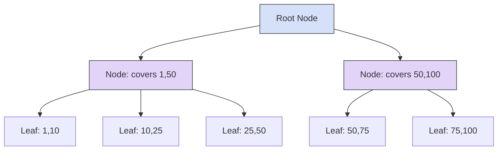

***
# CSE:4409 Database Management 2 (V 2.0)
**Instructor:** Dr. Abu Raihan Mostofa Kamal  
**Tags:** #Database #PostgreSQL #PLpgSQL #DBMS 

---

## Chapter 3: Prerequisite - Database Installation & Connection

### 3.1 Installation & Configuration
*   **Linux Installation:** PostgreSQL can be downloaded for Redhat or Ubuntu systems from the official PostgreSQL website.
*   **Authentication configuration:** By default, PostgreSQL uses `peer` authentication. To connect via password (`scram-sha-256`), you must configure the `pg_hba.conf` file.

> [!info] Configuring `pg_hba.conf`
> Find the file using the database terminal: `SHOW hba_file;`
> Edit the file (`sudo nano /var/lib/pgsql/18/data/pg_hba.conf`) and change `peer` to `scram-sha-256`:
> ```text
> # TYPE  DATABASE  USER  ADDRESS       METHOD
> local   all       all                 scram-sha-256
> host    all       all   127.0.0.1/32  scram-sha-256
> ```
> Restart the server: `sudo systemctl restart postgresql-18.service`

### 3.2 Connecting and Managing Users
1. **Connect as `postgres` (OS user):** `sudo -u postgres psql`
2. **Set a password for `postgres`:** `\password postgres`
3. **Create new user and database:**
   ```sql
   CREATE USER raihan WITH PASSWORD 'raihan123';
   CREATE DATABASE dbiut OWNER raihan;
   ```
4. **Connect as new user:** `psql -U raihan -d dbiut` (Use `-h localhost` to bypass local Unix sockets if `peer` authentication fails).

---

## Chapter 4: PL/pgSQL Basics

### 4.1 What is PL/pgSQL?
PL/pgSQL is a procedural extension for PostgreSQL that combines SQL with procedural logic (loops, conditions, variables). Used to create:
*   User-defined functions
*   Stored procedures
*   Triggers

> [!success] Benefits of PL/pgSQL
> - **Integration:** Execute SQL commands seamlessly.
> - **Performance:** Precompiled code reduces parsing overhead and eliminates extra client-server round trips.
> - **Server-side execution:** Direct database access is highly efficient.
> - **Portability:** Easy code migration across environments.

### 4.2 PL/pgSQL Blocks
PL/pgSQL is a block-structured language. There are two types of blocks:

**1. Anonymous Blocks (`DO`)**
Used for testing; executed only once dynamically.
```plpgsql
DO $$ 
<<label>>
DECLARE
    -- Variables here
    X NUMERIC := 102.32;
BEGIN
    RAISE NOTICE 'Hello World: Value of X is %', X;
END; 
$$;
```

**2. Named Blocks (Functions)**
Stored in the database and can take parameters.
```plpgsql
CREATE OR REPLACE FUNCTION factorial(num INTEGER) 
RETURNS INTEGER AS $$
DECLARE
    result INTEGER := 1;
BEGIN
    FOR i IN 1..num LOOP
        result := result * i;
    END LOOP;
    RETURN result;
END;
$$ LANGUAGE plpgsql;
```

### 4.3 Basic Datatypes
#### 1. Numeric and Character
*   **Numeric:** `smallint` (2 bytes), `integer` (4 bytes), `bigint` (8 bytes), `decimal/numeric` (exact precision), `real` (inexact), `serial` (autoincrement).
*   **Character:** `varchar(n)`, `text` (PostgreSQL's native string type).

#### 2. Arrays
Arrays allow working with lists of data. Access elements via `[]` brackets.
```plpgsql
DECLARE
    my_array INTEGER[] := '{1, 2, 3}';
BEGIN
    -- Loop using array_length (requires 2 arguments: array, dimension)
    FOR i IN 1..array_length(my_array, 1) LOOP
        RAISE NOTICE 'Element: %', my_array[i];
    END LOOP;
END;
```

#### 3. Date/Time Types & Arithmetic
*   **Types:** `timestamp`, `date`, `time` (with/without timezone).
*   **Arithmetic:** Perform calculations dynamically.
    *   `SELECT CURRENT_DATE + interval '5 days';`
    *   `SELECT TO_CHAR(CURRENT_DATE + INTERVAL '7 days','Month DD YYYY');`
*   **Extraction & Age:**
    *   `SELECT EXTRACT(YEAR FROM CURRENT_DATE);`
    *   `SELECT AGE(timestamp1, timestamp2);`

#### 4. Network Address
*   `inet`: Interface address (e.g., `192.168.1.15`). Handles single hosts and networks.
*   `cidr`: Block of IP addresses/routing prefix (e.g., `192.168.1.0/24`). Maximum value for `/x` is `32`.
> [!note] Why use Network Address instead of TEXT?
> 1. **Built-in Validation:** Rejects invalid IPs like `"192.168.1.300"`.
> 2. **Specialized Search Operators:** Efficient subnet logic using `<<` (is contained by). e.g., `WHERE client_ip << '172.16.0.0/12'`
> 3. **Sorting:** Sorts numerically rather than character-by-character.

#### 5. Range Type
Represents a span of values. Useful for scheduling, overlaps, and containment queries.
*   **Syntax:** `[ ]` for inclusive, `( )` for exclusive.
*   **Canonical Form:** PostgreSQL stores discrete ranges (like `int4range`) in a standard format: `[Lower Bound Inclusive, Upper Bound Exclusive)`. 
    *   *Example:* $[1, 10]$ becomes $[1, 11)$. Mathematically, there is no integer between 10 and 11.
    *   *Continuous Types:* For `numrange`, $[1.0, 10.0]$ remains $[1.0, 10.0]$ because there are infinite decimal values.

**Range Operators:**
*   `=`, `<` (Comparison)
*   `&&` (Overlapping element: Do ranges share any values?)
*   `@>` (Containment: Does range A contain element/range B?)
*   `<@` (Is contained in)
*   `-|-` (Adjacency: Are they next to each other without overlapping?)
*   **Bound Extraction Functions:** `lower()`, `upper()`.

> [!example] Exclusion Constraint for Overlapping (Double Booking)
> ```sql
> ALTER TABLE reservations 
> ADD CONSTRAINT no_overlapping_reservations
> EXCLUDE USING GIST (
>     room_id WITH =,
>     time_slot WITH &&
> );
> ```

**GiST Indexes (Generalized Search Tree):**
Balanced, tree-structured framework designed for complex datatypes like ranges. Requires the `btree_gist` extension.



#### 6. Composite Data Type
Represents the structure of a row/record.
*   **Insertion:** Use the type-agnostic `ROW()` constructor.
*   **Access:** Use dot notation `(compAttributeName).elementName`. Drop the brackets when inside a PL/pgSQL block.

```plpgsql
CREATE TYPE person_name AS (first_name TEXT, last_name TEXT);
-- Inside PL/pgSQL:
v_user_name person_name := ROW('Leonardo', 'Vinci');
RAISE NOTICE 'First Name: %', v_user_name.first_name; -- No brackets needed here
```

#### 7. Domain Type
User-defined type based on an existing type, with enforced constraints. Allows sharing standard rules across multiple tables.
```sql
CREATE DOMAIN valid_product_code AS TEXT
CHECK (
    (VALUE LIKE 'PROD-%' AND LENGTH(VALUE) = 10) 
    OR 
    (VALUE = 'INTERNAL-USE')
);
```

---

## Chapter 5: Control Structure

### 5.1 IF/ELSE Statement
Supports `EXISTS`, `IS NULL`, and `NOT` operators.
```plpgsql
IF XCOUNT = 0 THEN
    RAISE NOTICE 'TABLE IS EMPTY';
ELSIF XCOUNT BETWEEN 1 AND 3 THEN
    RAISE NOTICE 'TABLE HAS FEW RECORDS';
ELSE
    RAISE NOTICE 'TABLE HAS MORE RECORDS';
END IF;
```

### 5.2 CASE Statement
**1. Simple CASE:** Matches a variable against values.
**2. Searched CASE:** Evaluates boolean expressions.
```plpgsql
CASE
    WHEN XCOUNT = 0 THEN RAISE NOTICE 'Empty';
    WHEN XCOUNT BETWEEN 1 AND 3 THEN RAISE NOTICE 'Few';
    ELSE RAISE NOTICE 'Many';
END CASE;
```

### 5.3 LOOP & FOR Statements
*   **Unconditional LOOP:** Use `EXIT WHEN` to break. Can be labeled `<<LoopingMark>>`.
*   **Simple FOR Loop:** `FOR i IN 1..5 LOOP` (Inclusive bounds).
*   **Query FOR Loop:** Automatically opens an implicit cursor for a query.
    ```plpgsql
    FOR v_rec IN (SELECT * FROM iftest) LOOP
        RAISE NOTICE 'Record: %', v_rec;
    END LOOP;
    ```
> [!tip] Best Practices
> Keep statements simple, use comments for complex logic, test thoroughly, and use meaningful variable names.

---

## Chapter 6: Functions and Procedures

### 6.1 Benefits
1.  **Reduced network round-trips:** One call instead of 10 wire queries.
2.  **Execution plan caching:** Pre-compiled parameterized logic.
3.  **Encapsulation:** "Single Source of Truth" across all apps/clients.
4.  **Security:** `SECURITY DEFINER` lets operations run with elevated privileges without exposing underlying raw data.

### 6.2 Parameter Modes
*   **`IN`** (Default): Pass value into function. In PostgreSQL, `IN` parameters *are modifiable* inside the function (unlike Oracle).
*   **`OUT`**: Part of argument list but returned as part of the result. Ideal for returning **multiple values**. No `RETURN <var>` statement is needed at the end of the block.
*   **`INOUT`**: Combination of both.

### 6.3 Dynamic & Structured Datatypes
*   **`%TYPE` (Column Cloner):** Inherits the exact datatype of a specific table column. Dynamically adapts if table changes.
    `v_salary employees.salary%TYPE;`
*   **`%ROWTYPE` (Row Cloner):** Groups all columns of a table into a single structured variable. Accessed via dot notation.
    `v_emp_row employees%ROWTYPE;`
*   **`RECORD`:** A generic placeholder. Adapts its structure dynamically at runtime to whatever row/query result is assigned to it. Highly flexible.

### 6.4 Returning Multiple Rows
**Option A: `RETURN QUERY` (Best Practice)**
Cleanest approach. Returns all matching rows at once. Requires `RETURNS TABLE(...)` in definition.
```plpgsql
CREATE OR REPLACE FUNCTION get_employees_by_dept(p_dept VARCHAR)
RETURNS TABLE (id INT, name VARCHAR) AS $$
BEGIN
    RETURN QUERY SELECT emp_id, emp_name FROM employees WHERE department = p_dept;
END;
$$ LANGUAGE plpgsql;
```
*Call like a table:* `SELECT * FROM get_employees_by_dept('CSE');`

**Option B: `RETURN NEXT`**
Used when you need to loop through data and programmatically build the result set row-by-row.

---

## Chapter 7: Exception Handling in PL/pgSQL
Prevents transactions from aborting completely when errors occur, allowing graceful rollbacks or custom error messages.

### 7.1 Built-in Exceptions
Pre-defined database conditions (e.g., constraint violations).
> **Common Error Codes:**
> *   `unique_violation` (23505)
> *   `foreign_key_violation` (23503)
> *   `not_null_violation` (23502)
> *   `division_by_zero` (22012)
> *   `no_data_found` (P0002)

```plpgsql
EXCEPTION
    WHEN unique_violation THEN
        RAISE WARNING 'Duplicate email: %', p_email;
        RETURN -1;
    WHEN OTHERS THEN
        -- GET STACKED DIAGNOSTICS provides deep debugging details
        GET STACKED DIAGNOSTICS v_err_context = PG_EXCEPTION_CONTEXT;
        RAISE WARNING 'Error: %, %', SQLSTATE, SQLERRM;
```

### 7.2 User-defined Exceptions
Violation of custom business logic (e.g., Insufficient banking funds). Thrown using `RAISE EXCEPTION`.
```plpgsql
IF v_balance < p_amount THEN
    RAISE EXCEPTION 'Insufficient funds: %', v_balance
    USING ERRCODE = 'U0101'; -- 'U' signifies User-defined
END IF;
```

---

## Chapter 8: Cursor to Handle Selected Records
Cursors allow retrieving and processing a result set one row at a time. Ideal for massive datasets to prevent memory exhaustion.

### 8.1 Implicit Cursors
Automatically created/managed by PostgreSQL (e.g., inside a `FOR loop`).
*   **Properties:** Automatic lifecycle, easy to use, exists only for loop duration, moves strictly forward.
*   **Diagnostics:** You can obtain processed row counts.
    ```plpgsql
    GET DIAGNOSTICS v_count = ROW_COUNT;
    ```

### 8.2 Explicit Cursors
Manually controlled. Gives total control and accepts dynamic parameters.
**4 Steps involved:**
1.  **DECLARE:** `cur_name CURSOR(args) FOR SELECT...`
2.  **OPEN:** `OPEN cur_name(args);`
3.  **FETCH:** `FETCH cur_name INTO var1, var2;`
4.  **CLOSE:** `CLOSE cur_name;`

```plpgsql
DECLARE
    cur_top_stu CURSOR(min_cgpa numeric) FOR 
        SELECT name, cgpa FROM students WHERE cgpa >= min_cgpa;
BEGIN
    OPEN cur_top_stu(3.6);
    LOOP
        FETCH cur_top_stu INTO v_name, v_cgpa;
        EXIT WHEN NOT FOUND;
        RAISE NOTICE 'Student: %', v_name;
    END LOOP;
    CLOSE cur_top_stu;
END;
```

### 8.3 Scrollable Cursors
Explicit cursors declared with `SCROLL` allow jumping around the result set without re-querying.
*   `FETCH LAST` / `FETCH FIRST`
*   `FETCH PRIOR` (Move backward one row)
*   `FETCH NEXT` (Move forward one row)
*   `FETCH ABSOLUTE n` (Jump to specific row)
*   `MOVE FORWARD n` (Moves pointer without loading data into memory)

### 8.4 Cursor FOR Loop
Eliminates the need to write manual `OPEN`, `FETCH`, and `CLOSE`. PostgreSQL manages the explicit cursor lifecycle automatically.
```plpgsql
DECLARE
    cur_low_stock CURSOR FOR SELECT name, qty FROM products WHERE qty < 10;
    v_prod RECORD;
BEGIN
    FOR v_prod IN cur_low_stock LOOP
        RAISE NOTICE 'Item % has % left', v_prod.name, v_prod.qty;
    END LOOP;
END;
```