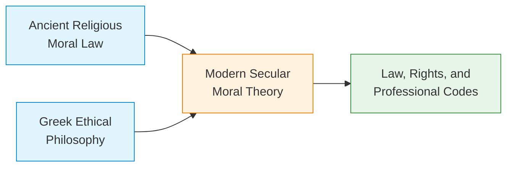
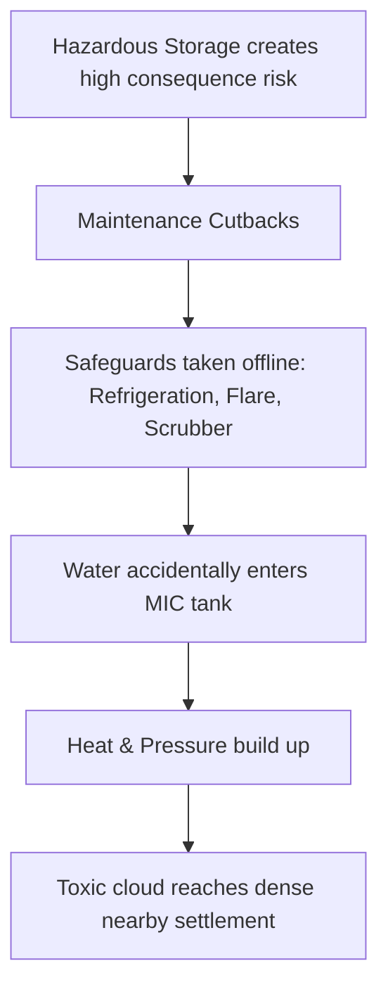

---

## 🎯 Part 1: Foundations of Ethical Theories

To solve engineering problems, we use engineering theories (like physics or statics) to organize evidence and provide a disciplined method for judgment. **Moral theories function exactly the same way.**

> 💡 **What is a Moral Theory?**
> A framework that defines what counts morally, identifies morally relevant facts, makes hidden assumptions visible, and provides a shared language to analyze disagreement instead of just shrugging it off.

### A Brief History of Western Ethical Thought
Ethical thinking in engineering relies on universal principles that can be applied in secular settings, drawing from several historical streams:

* **Takeaway:** Ethical conduct is fundamentally grounded in a concern for other people—it is not *just* about blindly following law, religion, custom, or company policy.

---

## 🔍 Part 2: The Four Ethical Lenses

In engineering ethics, we don't just pick one theory; we use multiple theories as a **checklist for analysis** to view a problem from different angles. Frequently, different theories yield the same solution. 

| Ethical Lens | Core Question | Main Concern | Key Philosophers |
| :--- | :--- | :--- | :--- |
| **1. Utilitarianism** | What produces the *best overall consequences* for everyone affected? | Overall societal welfare | John Stuart Mill |
| **2. Duty Ethics** | What *obligations* must be honored even when the payoff is inconvenient? | Universal obligations | Immanuel Kant |
| **3. Rights Ethics** | Whose *rights* are at stake, and what would violate them? | Moral claims of persons | John Locke |
| **4. Virtue Ethics** | What kind of *professional character* does this action express? | Character and habits | (Origins in Greek/Eastern Phil.) |

### 1. Utilitarianism & Cost-Benefit Analysis (CBA)
Utilitarianism holds that actions are good if they maximize human well-being for **society as a whole** (not for private gain).
* **Act Utilitarianism:** Focuses on individual actions—break a rule if it leads to the most good in that specific case.
* **Rule Utilitarianism:** Adhering to moral rules (e.g., "do not steal") will ultimately lead to the most good overall.

> ⚠️ **The Danger of Utilitarianism:** Total benefit can hide a concentrated burden. Ask: *Whose welfare is being discounted?*

**Cost-Benefit Analysis (CBA)** is an engineering tool based on utilitarianism. 
* **What it does:** Clarifies cost, feasibility, and trade-offs.
* **What it hides:** Dignity, fairness, unequal burdens, and ecological damage.
* **Decision Rule:** CBA *informs* judgment, it does not replace it. First identify ethically acceptable options, *then* compare costs.

**Example (WIPP / Dam Projects):** A dam provides broad benefits (water, power) but concentrated costs (displacing local residents). Utilitarianism often favors the project; Rights ethics often opposes it.

### 2. Duty and Rights Ethics: Respect for Persons
These are two sides of the same coin. They hold that individuals must be respected, and good consequences for society do *not* justify exposing particular people to serious harm without consent.
* **Duties:** Be honest, avoid preventable harm, treat others fairly, respect autonomy.
* **Rights:** Life, safety, liberty, property, privacy, informed choice.

**The Conflict:** What happens when rights collide? A public project may protect the right to public health and flood control, but threaten the right to homes and local ecosystems. Rights language clarifies what is at stake, but does not automatically prioritize one over the other.

### 3. Virtue Ethics: The Character of Practice
Focuses on who we should be. Actions are right if they support good character traits (virtues) and wrong if they support bad ones (vices).
* **Helpful Virtues:** Honesty, competence, responsibility, fairness, trustworthiness.
* **Vices:** Dishonesty, avoidable ignorance, incompetence.
* 🛑 **Words to Inspect:** Be careful with words like *"Honor," "Loyalty," "Pride,"* or *"Team Spirit."* These can become dangerous when used to excuse silence or cover-ups. 

---

## 🏢 Part 3: Corporate Morality

**Can a corporation be a moral agent?** 
A corporation is not a person in the ordinary sense, but corporate action heavily impacts people. 
* **The 3 Levels:** People make decisions $\rightarrow$ Organizations create systems $\rightarrow$ Communities experience consequences.
* **Accountability:** In ethics, corporations are treated as accountable pseudo-moral agents. Responsibility should never disappear behind an organization chart or the excuse: *"The system made us do it."*

---

## 🛠️ Part 4: Resolving Ethical Dilemmas (The 5-Step Method)

When analyzing an ethical problem, do not just average the theories mechanically. Defend your judgment using the evidence each lens reveals.

1. **State** the ethical problem clearly.
2. **Analyze** it using all four theories (Lenses).
3. **Compare** the agreements and tensions between the theories.
4. **Give serious weight** to fundamental rights and duties. (Generally, rights/duties take precedence over utilitarian considerations if a fundamental human right, like life, is threatened).
5. **Form** a balanced judgment.

---

## 🌍 Part 5: Ethics is Not Geography (Global Traditions)

Personal and business ethics should not change based on geography ("When in Rome..." does *not* apply to core morality). While foundations differ, **engineering practice converges** around honesty, competence, safety, and fairness globally.

*   🧧 **Chinese (Confucian):** Pre-theoretical, focuses on ideal character traits (virtues). Emphasizes the interdependence between the individual and the community.
*   🕉️ **Indian (Vedic/Bhagavad-Gita):** Highly practical orientation toward a good life. Emphasizes self-control, truth, compassion, and restraint in professional service.
*   ☪️ **Muslim (Qur'anic):** Virtue-oriented (humility, honesty, trustworthiness). Strongly prohibits false claims/slander, aligning with engineering codes requiring truthful data reporting.
*   ☸️ **Buddhist:** Focuses on avoiding destruction of life and cultivating limits, learning, and diligence. Highly aligned with modern environmental engineering ethics and sustainable development.

---

## ⚖️ Part 6: Case Studies

### Case 1: The Bhopal Disaster (1984)
*In Bhopal, India, a methyl isocyanate (MIC) gas leak from a Union Carbide plant killed >2,000 and injured >200,000. It is a prime example of "Technical failure becoming moral failure."*

**The Chain of Failure:**

**Bhopal Through the 4 Lenses:**
*   **Utilitarianism:** Economic benefit to the state cannot justify catastrophic chemical risk without reliable safeguards.
*   **Duty & Rights:** The public had a right against preventable danger; the company had a duty to maintain warnings and emergency plans.
*   **Virtue Ethics:** Diligence and competence are violated when broken safety systems become the "normal" standard.
*   **Corporate Morality:** Responsibility spreads across design, management, training, and knowledge transfer. Blame was shared by Union Carbide (negligence/cost-cutting) and the local government (poor zoning).

### Case 2: The Aberdeen Three
*Three civilian engineer-managers at a US Army chemical weapons pilot plant were criminally convicted for violating RCRA (Resource Conservation and Recovery Act) by storing toxic chemicals in open, leaking, unlabelled containers.*

*   **The Lesson:** "Authority creates accountability." Engineering responsibility includes maintenance, supervision, and control of dangerous conditions.
*   **Virtue Ethics Application:** Competence requires more than saying *"This is how we have always done it."*

### Case 3: A Computing Version of the Problem
*A city deploys an automated system to prioritize public benefit applications. Messy data $\rightarrow$ Automated Score $\rightarrow$ Uneven harm.*
*   **Utilitarian view:** The system lowers costs and speeds up decisions (net benefit is real).
*   **Rights view:** Harm is unevenly distributed to vulnerable populations, and the public cannot understand the "black box" to contest it (violates rights to fairness and informed choice).

---

## 🤝 Part 7: Teamwork & Professional Success

Ethics applies directly to group work and lab projects. 

| ❌ Failures that hurt the team (Vices) | ✅ Virtues that support the team |
| :--- | :--- |
| Missing assigned work | Reliability |
| Hiding delays or errors | Openness & Honesty |
| Withholding information | Fairness |
| "Ballhogging" (Taking over so others cannot contribute) | Shared responsibility & Support for others' learning |

> **Reflection:** In a software project, saying *"I will just do it myself"* isn't just an efficiency issue—it becomes an **ethical problem** because it robs team members of their right to learn and violates the shared duty of teamwork.