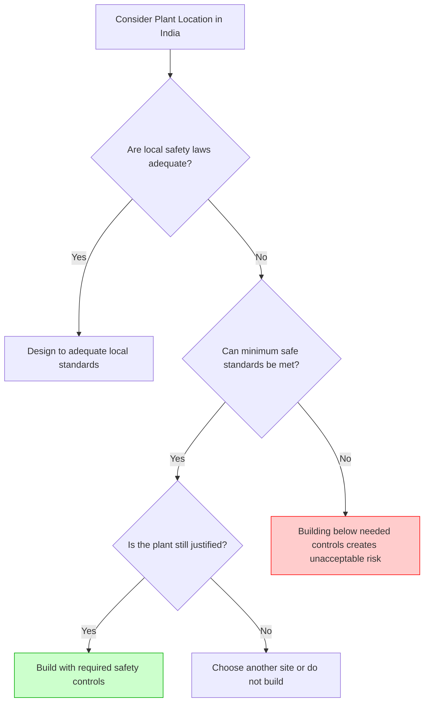

 

> 💡 **Core Philosophy:** Engineering is used to formulas (define variables $\rightarrow$ apply model $\rightarrow$ calculate answer). However, ethical problem-solving is **disciplined judgment, not formula calculation.** Ethical problems often involve incomplete facts, disputed concepts, and conflicting duties. Problem-solving tools don't produce automatic answers, but they make judgments clearer, more honest, and easier to defend.

---

## 1️⃣ Start by Sorting the Issue (Analysis of Issues)
A crucial first step in solving any ethical problem is separating it into three distinct categories. Often, disputes that look "moral" are actually just disagreements over facts or definitions. **Sort before you judge!**

| Issue Type | Main Question | How it is clarified / resolved |
| :--- | :--- | :--- |
| 📊 **Factual** | What is actually known? | Evidence, measurement, records, research. |
| 🧠 **Conceptual** | What does this term or category mean here? | Definitions, boundaries, comparisons. |
| ⚖️ **Moral** | Which ethical principle applies? | Duties, rights, honesty, safety, fairness. |

> 🚨 **CASE STUDY: Paradyne Computers**
> Paradyne bid to supply computers to the Social Security Administration (SSA). The SSA required "existing systems only." Paradyne bid a system not yet running and used a relabeled competitor's equipment for the demo.
> *   **Factual Issue:** The SSA request required existing systems; Paradyne's system was not operating. 
> *   **Conceptual Issue:** Does presenting a planned system as an "off-the-shelf" system count as *deception*?
> *   **Moral Issue:** If the action is deceptive, ordinary business pressure does not make it ethical. (Lying is wrong).

---

## 2️⃣ The Line-Drawing Technique
**When to use:** Used when the moral principle is clear, but the boundary is gray (e.g., "Is this a gift or a bribe?"). 

**How it works:**
1.  Set **NP (Negative Paradigm)**: A clearly unacceptable, immoral case.
2.  Set **PP (Positive Paradigm)**: A clearly acceptable, moral case.
3.  Establish obvious, fair comparison cases along the continuum.
4.  Place the current problem (**P**) honestly on the line to see which paradigm it is closest to.

### 📉 Visualizing Line Drawing: Waste in the Lake
**Problem:** A company wants to dump waste into a lake (town's water supply) at 5 ppm. The EPA limit is 10 ppm. No health problems are expected at 5 ppm.

*   **NP (Negative Paradigm):** Toxic levels of waste dumped into the lake.
*   **PP (Positive Paradigm):** Water supply should be completely clean and safe.

```text
       NP                                                                   PP
 (Toxic Levels)                                                       (Clean, Safe)
       |---------------|---------------|---------------|---------------|
       ^               ^               ^               ^               ^
   Sick for        Rare 1-hour     Taxpayers      P: 5 ppm         Plant cuts 
   one week          illness          pay         (no harm)         to 1 ppm
```
*Conclusion:* While the 5 ppm discharge (**P**) is on the right (acceptable) side, it is still not perfectly at the Positive Paradigm. The company should investigate better alternatives (like treating the waste).

### ⚠️ Pitfalls of Line Drawing
A good line drawing does not hide missing facts; it exposes them. However, it can be abused by:
*   Choosing biased paradigms.
*   Placing examples dishonestly to justify a bad decision.
*   Treating the diagram as absolute mathematical "proof."

---

## 3️⃣ The Flow Charting Technique
**When to use:** Used when an ethical problem depends on a sequence of decisions. It helps make consequences visible and exposes critical decision points. 

> 🚨 **CASE STUDY: Bhopal Disaster**
> In Bhopal, India, a toxic chemical (MIC) leak at a Union Carbide plant killed thousands. The disaster wasn't just "one unlucky night"—it was a chain of choices regarding location, standards, and maintenance.

### 🔀 Decision Flow: Plant Location & Standards

*Takeaway:* Weaker local rules do not remove the engineer’s absolute duty to design for safety. Flow charting makes it explicitly clear when a project must be stopped.

---

## 4️⃣ Resolving Conflict Problems
What happens when two moral values pull against each other (e.g., Loyalty to Employer vs. Public Safety)? 

1.  🟢 **Easy Priority:** One value clearly outweighs the other. *(e.g., Public safety normally outranks employer convenience/profit).*
2.  🟡 **Creative Middle:** Redesign the situation so fewer values are sacrificed. *(e.g., Instead of dumping waste or shutting down the factory entirely, pretreat the waste).*
3.  🔴 **Hard Choice:** If no middle path works, you must make the best defensible choice with the information available. 

> 🚀 **CASE STUDY: The Space Shuttle Challenger**
> Engineering manager Bob Lund faced intense pressure to launch. 
> *   *Values at stake:* Cold-weather sealing concern (lives of astronauts) vs. Schedule pressure & future contracts (jobs of his employees).
> *   *The Conflict:* Jobs, contracts, and schedules cannot be balanced against preventable risk to human life as if they were equal units. The hard choice Lund made (to launch) resulted in disaster. 

---

## 5️⃣ Bribery vs. Acceptance of Gifts
Gifts, favors, and bribes sit on a gray professional boundary where **Line Drawing** is highly useful. 

*   **What is a Bribe?** A benefit offered to someone in a position of trust to influence a dishonest action or professional judgment.
*   **Why is Bribery Wrong?** It distorts fair competition, favors those with money/access, and turns professional judgment into a commodity.

**Navigating the Boundary:**
1.  **Company Policy:** Always follow company rules on gifts, meals, and vendor contact.
2.  **Ask for Approval:** If rules are unclear, ask a supervisor before accepting.
3.  **The Public Test (New York Times Test):** If you would struggle to defend the action publicly on the front page of a newspaper, *do not do it.* 
4.  **Appearance Matters:** Even if your judgment wasn't actually bought, the *appearance* of impropriety destroys trust.

> 🚨 **CASE STUDY: Spiro Agnew & Kickbacks**
> In Maryland, engineering firms paid kickbacks (5% of contract value) to secure government contracts. Vice President Spiro Agnew was forced to resign after receiving over $100,000 in kickbacks. *Lesson:* A kickback system destroys meritocracy; access and wealth replace engineering competence.

---

## 6️⃣ Managing the Unknown (Experimental Engineering)
Design decisions frequently happen *before* science has settled every risk question.

> 📱 **CASE STUDY: Cell Phones and Cancer**
> Early studies in the 1990s worried about low-frequency magnetic fields and RF radiation from cell phones. While studies do not show clear harm, long-term effects are difficult to measure.
> *   **The Engineering Duty:** Engineers must be informed about potential risks and seek to reduce them where reasonable (e.g., redesigning to emit less radiation), even before every scientific question is 100% settled. 

---

## 7️⃣ Academic Integrity & Professional Success
The tools used for engineering ethics apply directly to being a student and searching for a job.
*   **Job Search:** If a company pays for an interview trip, you must act honestly. Are you seriously considering the job, or just using the trip for a free vacation to Hawaii? 
*   **Assignments:** Cheating is not just a "school rule" issue. According to *Virtue Ethics*, cheating trains dishonesty into your professional work habits and destroys the trust required for teamwork. 

---
### 📝 **Summary Checklist for Ethical Problem Solving**
*   [ ] Separate the issues: Factual, Conceptual, Moral.
*   [ ] Use **Line Drawing** for gray boundaries.
*   [ ] Use **Flow Charting** for sequential decisions and consequences.
*   [ ] Seek a **Creative Middle** when values conflict.
*   [ ] Evaluate gifts based on value, timing, intent, and public appearance.