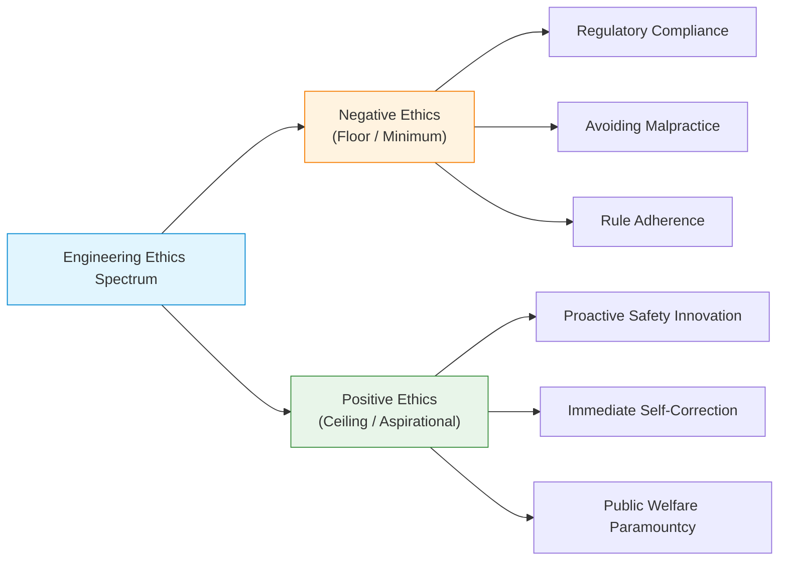
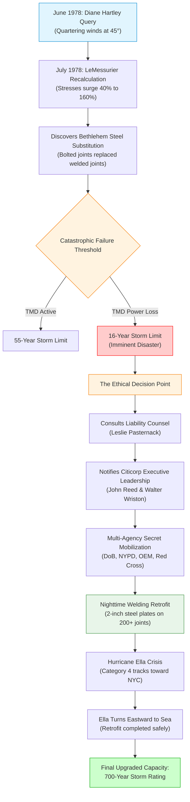
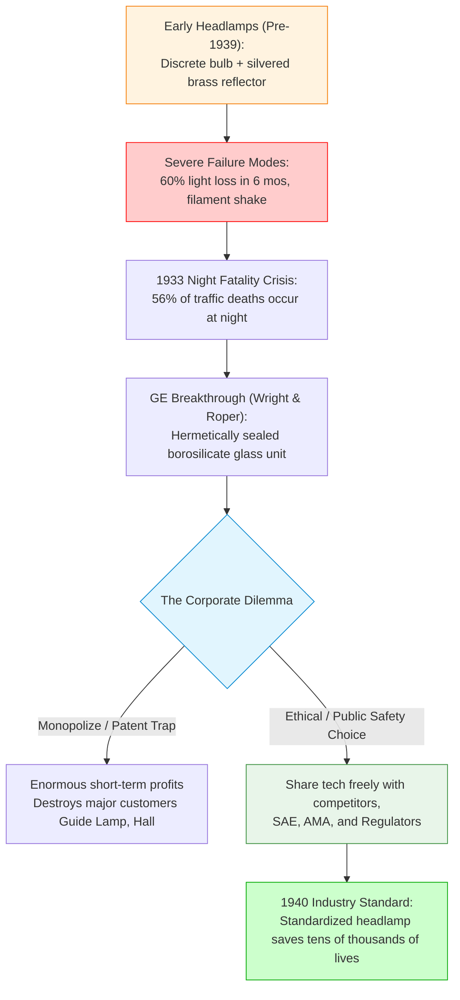
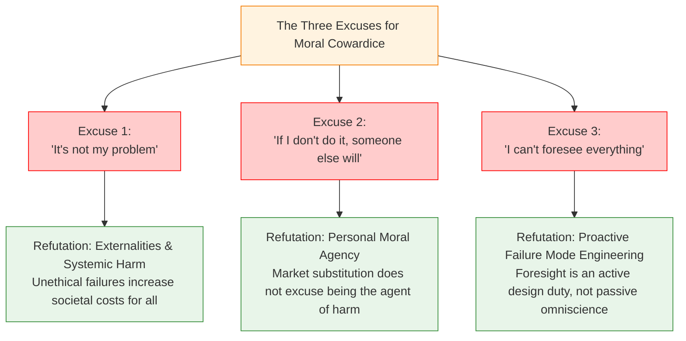

# Chapter 8: Doing the Right Thing

> [!abstract] Chapter Orientation & Exam Scope
> This chapter shifts the focus of engineering ethics from **preventative/negative ethics** (avoiding professional misconduct, bribery, or code violations) to **aspirational/positive ethics** (actively doing what is right, exhibiting moral courage, and upholding public safety even at tremendous personal, financial, and reputational risk). 
> 
> **Core Case Studies**:
> 1. **The Citicorp Center Crisis (1978)**: Structural engineer William J. LeMessurier, the quartering wind oversight, the bolted joint substitution, and the heroic midnight retrofit.
> 2. **The GE Sealed-Beam Headlamp (1930s)**: Daniel K. Wright, Val Roper, and General Electric sharing life-saving lighting technology freely with competitors.
> 3. **GM Daytime Running Lamps (DRLs, 2001)**: Voluntary deployment of proven safety systems ahead of federal regulation.
> 4. **NHTSA vs. IIHS Crash Testing**: The regulatory divergence demonstrating that **legal compliance is a floor, not a ceiling**.
> 5. **The Three Excuses for Inaction**: Refuting rationalizations for moral cowardice in engineering practice.
> 
> **Cross-Vault Connections**:
> - Relates to [[Chapter 1 - Introduction to Engineering Ethics|Engineering as a Social Experiment]] and the [[Open-Book-Exam-Cheat-Sheet#The Four Ethical Lenses|NSPE Canon 1 Paramountcy Clause]].
> - Informs disaster analysis in [[Chapter 5 -  Risk, Safety, and Accidents#Typology of Accidents|Accident Typology]] and problem-solving via [[Chapter 4 - Ethical Problem-Solving Techniques#Line Drawing|Line-Drawing]].
> - Previews algorithmic safety thresholds in [[Lecture 9 - Types of Biases in Data-driven Technology]] and [[Lecture 10 - Content Moderation & AI Recommender Systems]].

---

## 1. Negative Ethics vs. Positive Ethics

In conventional engineering curricula, ethics is frequently taught through negative examples: catastrophic failures, forensic investigations, and regulatory sanctions (e.g., the Challenger O-ring explosion, the Ford Pinto fuel tank fires, or the Hyatt Regency walkway collapse). While analyzing failures is vital, professional ethics encompasses two complementary dimensions:

1. **Negative Ethics (Preventative Ethics)**:
   - Formulated primarily as rules of avoidance ("Thou shalt not").
   - Examples: Do not take bribes, do not falsify test data, do not conceal conflicts of interest, do not violate environmental discharge permits.
   - Compliance with negative ethics prevents criminal indictment and disciplinary revocation of licensure, but it represents only the bare minimum of professional responsibility.

2. **Positive Ethics (Aspirational Ethics & Moral Courage)**:
   - Formulated as proactive commitments to enhance human well-being, protect vulnerable populations, and correct unforeseen technical errors immediately upon discovery.
   - Involves personal accountability, moral imagination, and the willingness to accept financial or career sacrifice to protect the public.
   - Core Maxim: *Engineering integrity is defined not by the absence of mistakes, but by how one responds when a critical mistake is discovered.*



---

## 2. The Citicorp Center Crisis (1978): The Gold Standard of Professional Integrity

The crisis of the Citicorp Center in Manhattan represents the most famous and instructive case of aspirational engineering ethics in modern history. It illustrates how a prominent engineer, confronted with a catastrophic structural defect in his own design, chose total accountability and public safety over personal reputation, financial survival, and legal self-protection.

### 2.1 The Architectural and Structural Challenge
In the early 1970s, First National City Bank (later Citicorp / Citigroup) planned a towering corporate headquarters in Midtown Manhattan, occupying an entire city block bounded by Lexington Avenue, Third Avenue, 53rd Street, and 54th Street.

- **Lead Architect**: Hugh Stubbins Jr.
- **Lead Structural Engineer**: William J. LeMessurier (founder of LeMessurier Associates, Cambridge, MA).
- **The St. Peter’s Lutheran Church Obstacle**: The northwest corner of the designated block was occupied by St. Peter’s Church, a historic Gothic stone structure built in 1905. The church agreed to sell its property under one non-negotiable condition: the church would be demolished and rebuilt as a completely freestanding structure on the exact same corner, with **no structural columns passing through the church building** and no columns touching the church’s air space.

```
       Citicorp Block Plan (Top-Down Schematic)
       54th Street
+---------------------------------------------+
| [Northwest Corner]        [North Face]      |
|  St. Peter's Church        Stilt Column #1  |
|  (Freestanding)                             |
|                                             |
| [West Face]                                 | [East Face]
|  Stilt Column #4                            |  Stilt Column #2
|                                             |
|                                             |
|                           [South Face]      |
| [Southwest Corner]         Stilt Column #3  | [Southeast Corner]
+---------------------------------------------+
       53rd Street
```

### 2.2 The Innovative Structural Solution
To accommodate the church without touching it, LeMessurier devised a daring, brilliant structural design:
1. **Central Stilt Columns**: Instead of supporting the 59-story, 915-foot skyscraper at its four corners, LeMessurier placed four massive, nine-story (114-foot) high steel columns at the **center of each of the four sides of the building**.
2. **Cantilevered Corners**: The four corners of the building cantilevered outward 72 feet over the ground, suspended in mid-air directly above St. Peter’s Church.
3. **Chevron Bracing**: To transfer the colossal gravity and wind loads from the perimeter down to the four central stilt columns, LeMessurier designed an external skeleton of massive steel diagonal wind braces arranged in inverted "chevrons" (eight tiers of eight-story V-shaped braces).
4. **Tuned Mass Damper (TMD)**: Because the lightweight steel structure was unusually flexible, LeMessurier installed a 400-ton concrete block on the 63rd floor floating on an oil film with nitrogen-gas hydraulic pistons. The TMD was engineered to sway out of phase with the wind, reducing building acceleration and preventing tenant motion sickness.

When completed in 1977, the Citicorp Center was acclaimed worldwide as an architectural and engineering triumph.

### 2.3 The Flaw Emerges: The Undergraduate Query
In June 1978, while LeMessurier was serving as a visiting lecturer at Harvard, he received a phone call from an undergraduate civil engineering student at Princeton University: **Diane Hartley**. 

Hartley was completing her senior thesis on the Citicorp Center under the supervision of renowned engineering historian Prof. David Billington. Hartley’s calculations indicated that the building might be dangerously vulnerable to **quartering winds** (diagonal winds blowing at a 45-degree angle against the corners).

- **The Building Code Assumption**: The New York City Building Code (and standard engineering practice of the era) required structural engineers to calculate wind loads acting perpendicular (head-on / face-on) to the flat facades of a building. For traditional buildings with corner columns, head-on winds produced the worst-case structural stress; quartering winds were assumed to exert lower loads shared across adjacent walls.
- **The Unique Citicorp Geometry**: Because Citicorp’s columns were at the *centers* of the facades, a 45-degree quartering wind struck the cantilevered corners directly, simultaneously loading the chevron braces on *two* adjacent faces.
- **Initial Rebuff**: Joel S. Weinstein, an associate in LeMessurier’s Cambridge office, took Hartley's call and initially dismissed her concerns, assuring her the building was completely safe.

### 2.4 The Recalculation & The Construction Substitution
A month later, while preparing a textbook lecture on structural design, LeMessurier decided to review Hartley's quartering wind question. He pulled out the wind tunnel data conducted by Alan Davenport at the University of Western Ontario and performed rigorous recalculations.

The mathematical results were alarming:
- Quartering winds increased tension and compression stresses in the chevron braces by **40%**.
- At critical joints linking the chevron members, the stress surge under quartering winds reached **160%**!

Even so, LeMessurier believed his original design could tolerate this surge because he had specified **full-penetration welded joints**, which possessed enormous structural reserves matching the full strength of the heavy steel beams.

Then came the catastrophic discovery:
- LeMessurier contacted his New York project office and the structural steel fabricators (**Bethlehem Steel**).
- He learned that during construction in 1975, Bethlehem Steel had requested replacing the specified full-penetration welded joints with **bolted joints** (using high-strength A325 structural bolts) to save approximately **$250,000** in fabrication costs and accelerate the erection schedule.
- A junior project engineer in LeMessurier's New York office had routinely approved the change-order without consulting LeMessurier and without recalculating joint strength under diagonal wind loads.

### 2.5 The Mathematical Threat
LeMessurier combined the structural bolt capacities with New York City historical weather and wind-speed recurrence models:
1. **With Tuned Mass Damper Operating**: If the electric TMD remained powered and fully functional, a storm capable of snapping the bolted joints and triggering progressive collapse of the 59-story tower occurred once every **55 years**.
2. **With Tuned Mass Damper Failed**: During a severe hurricane or thunderstorm, high winds routinely knock out the electrical power grid. If the power failed, or if the TMD’s hydraulic pumps seized, the failure threshold dropped to a storm with a return period of once every **16 years**!

A storm strong enough to topple the Citicorp Center struck New York City on average every 16 years. Hurricane season had just begun in the Atlantic. If the building collapsed, it would trigger a domino-like destruction of surrounding Midtown Manhattan buildings, killing up to **200,000 people**.



### 2.6 LeMessurier’s Moral Decision and the Mobilization
LeMessurier was in a remote house in Maine when the reality struck him. He realized that if he kept silent, no one might ever discover the flaw unless a storm blew the building down. If he came forward:
- He faced catastrophic professional ruin, personal bankruptcy, criminal manslaughter charges if repairs were botched, and total ostracization.
- He contemplated suicide, but immediately realized that his death would take the secret to the grave, leaving 200,000 New Yorkers at the mercy of the next storm.

He resolved to take decisive, transparent action:
1. **Legal & Insurance Consultation**: LeMessurier met his liability insurance attorney, **Leslie Pasternack**, and explained the situation with complete candor. The insurer realized LeMessurier's honesty and dedication to safety were the only way to minimize life loss and legal liability.
2. **Confronting Citicorp Leadership**: LeMessurier met with Citicorp Executive Vice President **John S. Reed** and Citicorp Chairman **Walter Wriston**. He did not equivocate, downplay the risk, or blame his subordinates or Bethlehem Steel. He stated plainly: *"The building is in mortal danger. We must fix it."*
3. **Leadership Synergy**: Walter Wriston demonstrated extraordinary corporate statesmanship. Instead of calling his litigators to sue LeMessurier, Wriston said: *"Let's fix the problem first; we can argue about the money later."* Wriston assigned two senior Citicorp vice presidents to assist LeMessurier full-time.
4. **Inter-Agency Coordination**:
   - The team brought in **Irving E. Minkin**, acting commissioner of the New York City Department of Buildings, who approved an emergency repair permit without bureaucratic delay.
   - The team coordinated secretly with the NYC Office of Emergency Management, the NYPD, and the American Red Cross.
   - An evacuation plan was drafted for a **156-block radius** around Citicorp Center, with 2,000 Red Cross volunteers placed on unannounced standby.

### 2.7 The Midnight Retrofit and Hurricane Ella
Beginning in August 1978, a small army of certified welders worked seven days a week, exclusively from **8:00 PM to 6:00 AM**, tearing open architectural finishes and welding heavy, two-inch-thick steel plates over all **200+ bolted chevron joints**.

- **Emergency Backup**: Two auxiliary emergency generators were hoisted to the 63rd floor to ensure the Tuned Mass Damper would never lose power if the city grid failed.
- **Meteorological Monitoring**: LeMessurier engaged specialized meteorologists to provide real-time hourly tracking of wind speeds and Atlantic tropical storms.
- **The Hurricane Ella Threat**: On September 1, 1978, **Hurricane Ella**, a massive Category 4 hurricane with 140 mph winds, surged up the Atlantic seaboard directly toward New York City. The retrofitting was barely halfway complete. Emergency officials prepared to execute the mass evacuation of Midtown Manhattan. At the final hour, Hurricane Ella stalled, turned sharply eastward, and moved harmlessly into the open Atlantic ocean.
- **The Press Blackout**: The entire secret operation was aided by an unprecedented historical coincidence: a major citywide newspaper strike shut down the *New York Times*, the *Daily News*, and the *New York Post* from August 9 to November 5, 1978. Citicorp issued a terse, low-key press release describing the work as "routine reinforcement for heavy winds," successfully preventing citywide panic.

### 2.8 Resolution, Legacy, and Financial Settlement
The retrofit was completed in October 1978. The newly reinforced joints brought the building’s structural threshold to withstanding a **700-year storm**, rendering it one of the safest skyscrapers on the planet.

- **Financial Resolution**: The emergency repairs cost over **$8 million** (equivalent to >$35 million today). Citicorp subsequently brought a legal claim against LeMessurier Associates and Stubbins. The insurer settled the claim for **$2 million**—the exact upper limit of LeMessurier’s professional malpractice coverage. Citicorp absorbed the remaining $6 million without malice.
- **Professional Standing**: Instead of being destroyed, LeMessurier’s reputation rose to legendary status in civil and structural engineering. The engineering community recognized his actions as the quintessential model of **professional ethics and accountability**.

> [!info]- 🏛️ Deep-Dive: Fleddermann Line-Drawing Analysis of Citicorp (Problem 8.7)
> In *Engineering Ethics*, Charles B. Fleddermann applies the **Line-Drawing Technique** to evaluate LeMessurier’s decision space among hypothetical alternative actions.
> 
> | Feature / Metric | Negative Paradigm (NP: Concealment) | Alternative A (Secret Repair) | Alternative B (Private Bank Notice) | Alternative C (Actual Choice: Coordinated Action) | Alternative D (Resign / Flee) | Positive Paradigm (PP: Full Public Disclosure) |
> | :--- | :---: | :---: | :---: | :---: | :---: | :---: |
> | **Protection of Human Life** | ❌ None (Gamble) | ⚠️ Partial (Uncoordinated) | ⚠️ Dependent on Bank | ✅ Maximized (Agencies on Standby) | ❌ Zero | ✅ High (Evacuation) |
> | **Engineering Transparency** | ❌ Total Deceit | ❌ Covert | ⚠️ Partial | ✅ Full to Stakeholders & Regulators | ❌ Dereliction | ✅ Total Public Broadcast |
> | **Mitigation of Public Panic** | ✅ No panic (until collapse) | ✅ No panic | ✅ No panic | ✅ High (Managed communications) | ✅ No panic | ❌ Severe citywide mass hysteria |
> | **Adherence to Building Codes** | ❌ Illegal Concealment | ❌ Uninspected | ⚠️ Non-regulatory | ✅ City Building Dept. Approved | ❌ Abandoned | ✅ Public Regulatory Review |
> | **Professional Moral Agency** | ❌ Cowardice | ⚠️ Compromised | ⚠️ Outsourced | ✅ Exemplary Moral Courage | ❌ Total Abdication | ✅ Transparent Integrity |
> 
> **Ethical Evaluation**:
> - **Negative Paradigm (NP)**: Say nothing; pray no 16-year storm hits NYC during career. Blatant criminal negligence.
> - **Alternative A**: Repair quietly at night using firm funds; tell no one. Highly dangerous: if a storm hit during repair, no evacuation plan existed.
> - **Alternative B**: Inform Citicorp privately and let the bank decide. Abdicates professional responsibility to commercial actors.
> - **Alternative D**: Resign from practice and leave the state. Total abandonment of professional duty.
> - **Positive Paradigm (PP)**: Immediate press conference and demands for mass evacuation of 200,000 residents before repairs. This would have caused catastrophic citywide stampedes, economic collapse, and massive civilian injury without increasing structural repair speed.
> - **Conclusion**: **Alternative C** represents the classic **"Creative Middle Way"**: it prioritized the paramountcy of human life by coordinating with all legal and emergency authorities and drafting evacuation plans, while responsibly managing public communications to prevent lethal mass hysteria.

---

## 3. Automotive Safety Innovations: Leadership Beyond the Law

Engineering ethics requires recognizing that **regulations and building codes lag behind technological and empirical knowledge**. When an engineer or company discovers a life-saving safety innovation, ethical responsibility frequently requires sharing that innovation or deploying it voluntarily, rather than withholding it for commercial advantage or waiting for coercive legal mandates.

### 3.1 The GE Sealed-Beam Headlamp (1930s)
In the 1930s, the automotive industry faced a horrific public health epidemic:
- In 1933, US traffic accidents claimed over **31,000 lives** and caused over 1 million injuries.
- While nighttime driving accounted for only **20%** of total vehicle miles traveled, it accounted for **56% of all fatal accidents**!

#### Technical Flaws of Early Headlamps
Prior to 1939, automotive headlights were assembled from discrete parts manufactured by separate companies:
1. **Tarnishing Reflectors**: Reflectors were made of polished silvered brass. Road moisture and air rapidly oxidized the silver; within 6 months, light output degraded by **60%**, blinding drivers with scattered glare while illuminating only a few yards of roadway.
2. **Vibration Misalignment**: Filaments had to be positioned within fractions of a millimeter of the parabolic optical focal point. Road vibrations rattled filaments out of focus.
3. **Thermal Cracking**: Soft glass bulbs cracked under thermal expansion at the electrical lead-in wires when high-wattage filaments generated intense heat.

Proposed regulatory solutions—such as illuminating every highway in America with overhead lamps, or imposing a nationwide 30 mph night speed limit—were economically or practically impossible.

#### The Technical Breakthrough
General Electric lighting engineers developed a revolutionary integrated unit:
- **Daniel K. Wright (1935)**: Adapted projector lamp techniques using hard **borosilicate glass** (which had low thermal expansion) and fused lead-in wires directly into the glass base, creating an airtight, hermetically sealed envelope.
- **Corning Glass Works**: Developed precision aluminized parabolic glass reflectors that never oxidized or lost reflectivity.
- **Val Roper (1937, GE Automotive Lighting Lab)**: Formulated the modern two-beam optical design: a high "driving beam" for open roads, and an asymmetric low "passing beam" that illuminated the right shoulder while angling away from oncoming drivers’ retinas.
- **The Sealed Beam**: Bulb, filament, aluminized reflector, and lens were permanently fused into a single hermetic glass unit. It never lost focus, never tarnished, and retained 90%+ brightness until the filament burned out.



#### The Ethical Dilemma and the Choice
GE did not manufacture automotive headlamp housings; it manufactured bulbs and sold them to independent headlamp assembly companies: **Guide Lamp**, **C.M. Hall Company**, and **Corcoran Brown Company**.

The sealed-beam headlamp made these assembly companies obsolete overnight. Furthermore, GE held fundamental patents that would allow it to corner the entire global automotive lighting market and extract monopoly rents.

Instead, GE management and engineers made an extraordinary ethical choice:
1. **Open Collaboration**: GE invited executives and engineers from Guide Lamp, Hall, Ford, Chrysler, and General Motors to GE's Nela Park laboratories in Cleveland, Ohio, and gave open, unconstrained demonstrations.
2. **Technology Sharing**: GE partnered with the **Society of Automotive Engineers (SAE)** and the **Automobile Manufacturers Association (AMA)** to form an industry-wide steering committee.
3. **Royalty-Free Licensing**: GE shared its technical manufacturing processes freely with competitors and assisted rival glass fabricators (such as Westinghouse and Tung-Sol) in tooling their plants.
4. **Regulatory Standardization**: GE and the AMA lobbied state motor vehicle commissioners to adopt the sealed-beam design as a standardized, interchangeable requirement across all 1940 model year cars in North America.

GE deliberately sacrificed exclusive monopoly profits to establish an industry-wide safety standard that saved tens of thousands of lives.

---

### 3.2 General Motors Daytime Running Lamps (DRLs, 2001)
In the 1990s, automotive safety researchers established that vehicles operating with low-intensity forward lighting during daylight hours—**Daytime Running Lamps (DRLs)**—were substantially more conspicuous to oncoming drivers and pedestrians.

- **Statistical Impact**: Rigorous studies compiled by NHTSA and European transport ministries proved that DRLs reduced pedestrian fatalities by **28%** and reduced daytime multi-vehicle collisions by **5%**.
- **The Economic Feasibility**: Implementing DRLs required only minor wiring modifications to run high-beam filaments at reduced voltage or activate turn indicators, costing between **$20 and $40 per vehicle**.
- **The Regulatory Failure**: While Scandinavian nations and Canada mandated DRLs by law in 1989–1990, the United States National Highway Traffic Safety Administration (NHTSA) stalled, bogged down by jurisdictional lobbying and minor complaints regarding glare.
- **Voluntary Corporate Action**: In 2001, General Motors petitioned NHTSA to mandate DRLs for all US vehicles. When NHTSA failed to act, **GM did not wait for legislation**. GM voluntarily made DRLs standard factory equipment on **100% of its passenger cars and light trucks** manufactured for the North American market.

GM recognized that engineering responsibility does not require the coercion of a federal mandate; when an engineering measure demonstrably prevents death at negligible cost, proactive deployment is a moral duty.

---

### 3.3 Automotive Crash Testing: NHTSA vs. IIHS (The Regulatory Discrepancy)
The divergence between governmental crash test mandates and independent scientific testing provides the definitive empirical proof that **legal compliance is a floor, not a ceiling**.

| Feature / Dimension | National Highway Traffic Safety Administration (NHTSA) | Insurance Institute for Highway Safety (IIHS) |
| :--- | :--- | :--- |
| **Organization Type** | US Federal Regulatory Agency (Department of Transportation) | Independent, Non-Profit Scientific Research Institute (Funded by Auto Insurers) |
| **Inaugural Year** | 1979 (New Car Assessment Program - NCAP) | 1995 (Frontal Offset Testing Program) |
| **Crash Test Protocol** | **35 mph (56 km/h) Full-Width Frontal Impact** directly into a rigid, non-deformable concrete wall. | **40 mph (64 km/h) 40% Offset Frontal Impact** into a deformable aluminum honeycomb barrier. |
| **Physics & Real-World Fidelity** | Distributes impact energy evenly across both longitudinal front frame rails. Extremely rare in real-world driving. | Concentrates colossal kinetic energy onto **one-half (40%) of the front structure**, bypassing the main frame rail and attacking the passenger cabin / A-pillar directly. Matches real-world vehicle-to-vehicle overlap crashes. |
| **Legal Authority** | Enforces legally binding **Federal Motor Vehicle Safety Standards (FMVSS)**. Non-compliance results in federal vehicle recalls and criminal stop-sale orders. | Possesses **zero legal regulatory authority**. Publishes public consumer safety ratings ("Good", "Acceptable", "Marginal", "Poor"). |
| **The Resulting Discrepancy** | Throughout the late 1990s, numerous production vehicles earned perfect **5-Star NHTSA safety ratings**. | When subjected to IIHS 40% offset tests, many 5-star NHTSA vehicles suffered catastrophic cabin collapse, A-pillar buckle, and steering column intrusion, receiving **"Poor"** safety ratings! |

```
NHTSA Full-Frontal (100% Width)        IIHS Offset Frontal (40% Overlap)
+-------------------------------+      +-------------------------------+
|         Engine Bay            |      |  Crushed  |   Uncrushed Bay   |
+-------------------------------+      +-----------+-------------------+
=================================      ============                     
  [Rigid Non-Deformable Barrier]         [Deformable Honeycomb Barrier]
(Energy absorbed by BOTH rails)        (Colossal energy bypasses frame rail,
                                        crushes A-pillar into driver's legs)
```

> [!warning] Core Exam Takeaway: Legal Compliance vs. Ethical Responsibility
> An automotive engineer who designs a vehicle chassis solely to pass the federal FMVSS full-width test, knowing that the vehicle will crumple and crush occupants' legs in a realistic 40% offset crash, has achieved **legal compliance** but has committed an **ethical failure**. 
> 
> Regulations represent the bare minimum threshold below which an actor is legally penalized. Ethical engineering practice demands designing against known, empirical failure modes, regardless of whether the regulatory agency has codified them into law.

---

## 4. The Three Excuses for Inaction (Impediments to Ethical Action)

When engineers confront unethical organizational directives, defective designs, or emerging hazards, psychological rationalizations often impede moral action. In *Engineering Ethics*, Charles B. Fleddermann identifies and dismantles the **Three Common Excuses for Inaction**:



### 4.1 Excuse 1: "It’s Not My Problem"
- **The Rationalization**: *"I am just a software developer / junior structural drafter / QA tester. My job description is limited to writing this function or checking this weld. The wider implications, environmental emissions, or corporate marketing claims are management's problem, not mine."*
- **The Philosophical & Practical Refutation**:
  1. **Negative Externalities**: In economics and engineering, failures do not vanish; their costs are externalized onto society. When a defective medical device (e.g., [[Chapter 7 - Ethical Issues in Engineering Practice#Therac-25 Case Study|Therac-25]]) or bridge collapses, the financial costs (lawsuits, hospital care, emergency repairs) raise taxes and insurance premiums for every citizen.
  2. **The Social Contract of Engineering**: Engineers hold a state-granted monopoly over technical design in exchange for pledging to hold public welfare paramount ([[Chapter 2 -  Professionalism and Codes of Ethics#Codes of Ethics|NSPE Canon 1]]). Claiming that a foreseeable structural hazard is "not my problem" repudiates the foundational professional identity of an engineer.
  3. **Diffused Culpability**: If every specialist in an organization disclaims responsibility for the whole, catastrophic systemic failures become inevitable (as seen in [[Chapter 5 -  Risk, Safety, and Accidents#ValuJet Flight 592|ValuJet 592]]).

### 4.2 Excuse 2: "If I Don’t Do It, Somebody Else Will"
- **The Rationalization**: *"If our company refuses to manufacture this deceptive surveillance tool, predatory algorithmic feed, or weapon component, a competitor across town or overseas will build it anyway. Therefore, my refusal accomplishes nothing except sacrificing my company's revenue and my personal job."*
- **The Philosophical & Practical Refutation**:
  1. **Personal Moral Agency**: Ethics is concerned with the accountability of the individual moral actor. The fact that another person might commit theft or murder does not morally permit you to become a thief or murderer. Market competition does not confer moral absolution.
  2. **Professional Integrity**: When qualified professionals universally refuse to work on dangerous or unethical systems, unscrupulous actors cannot easily find the specialized expertise required to execute them.
  3. **The Reputational Boomerang**: A company or engineer that gains notoriety for deploying harmful products incurs long-term destruction of credibility, severe regulatory penalties, and civil liabilities that vastly outweigh short-term competitive profits.

### 4.3 Excuse 3: "I Can’t Foresee Everything"
- **The Rationalization**: *"Modern engineering systems are too complex. We cannot anticipate every bizarre edge case, software bug, or weather anomaly. Since we cannot be omniscient, we should not be held morally liable when unforeseen disasters strike."*
- **The Philosophical & Practical Refutation**:
  1. **Foresight as an Active Discipline**: While omniscience is impossible, systematic risk assessment is the essence of professional engineering. Engineers are required to conduct rigorous Failure Mode and Effects Analysis (FMEA), fault tree analyses, and worst-case boundary testing.
  2. **Five Proactive Engineering Duties**:
     - *Design for Failure Modes*: Anticipate how the system behaves when components fail (fail-safe vs. fail-deadly).
     - *Consult with Regulators and Independent Experts*: Actively invite external critique (as LeMessurier did with Alan Davenport and Diane Hartley).
     - *Treat Ethics as a Structural Constraint*: Moral safety is not an afterthought added to an existing design; it is a foundational boundary condition.
     - *Acknowledge When Not to Build*: If a system cannot be made safe under foreseeable operational environments, the ethical decision is to halt development.
     - *Immediate Self-Correction*: When unforeseen hazards inevitably do emerge post-deployment, immediately sound the alarm, disclose the defect, and rectify it—the hallmark of William LeMessurier.

---

## 5. Summary & Key Synthesis for Exams

> [!faq]- 📝 Exam Quick-Reference: Key Concepts of Chapter 8
> 1. **Citicorp Crisis**:
>    - *Actors*: William LeMessurier, Hugh Stubbins, Diane Hartley, Walter Wriston.
>    - *Flaws*: Quartering winds (40%–160% stress increase); bolted joint substitution (saved $250k).
>    - *Risk*: 16-year storm threshold with power failure to TMD; 200,000 potential deaths.
>    - *Resolution*: Nighttime welding retrofit of 200+ joints; 700-year storm safety rating; $2M insurance settlement.
> 2. **Automotive Case Studies**:
>    - *GE Sealed-Beam*: Daniel Wright & Val Roper; shared life-saving patents with competitors and SAE to eliminate 56% nighttime fatality crisis.
>    - *GM DRLs*: 28% pedestrian fatality reduction; deployed fleet-wide voluntarily without federal mandate.
>    - *NHTSA vs. IIHS*: 35 mph full-frontal (NHTSA) vs. 40 mph offset deformable (IIHS); establishes that legal compliance is merely a floor.
> 3. **The Three Excuses**:
>    - *"Not my problem"* $\rightarrow$ Refuted by externalities and professional social contract.
>    - *"Someone else will do it"* $\rightarrow$ Refuted by personal moral agency; market forces do not excuse harm.
>    - *"Can't foresee everything"* $\rightarrow$ Refuted by proactive failure mode engineering and immediate duty to correct.

---

## 6. Comprehensive Review Questions

> [!example]- Question 1: Citicorp Line-Drawing and Creative Middle Way [10 Marks]
> **Scenario**: A senior aerospace engineer discovers that a newly deployed satellite propulsion valve has a 1-in-20 chance of bursting during deep-space cryogenic chill-down, an edge case not tested during ground qualification. The launch vehicle was certified compliant with all FAA and NASA standard test protocols.
> 
> **Task**:
> (a) Contrast the engineer’s potential response paths using Fleddermann’s Line-Drawing model between the Negative Paradigm (silence) and the Positive Paradigm (immediate public ground-stop).  
> (b) Explain how LeMessurier’s Citicorp actions illustrate the "Creative Middle Way" and how this applies to the aerospace scenario.
> 
> **Model Answer**:
> *(a) Line-Drawing Framework*:
> - *Negative Paradigm (NP)*: Stay silent, rely on NASA/FAA legal compliance as a shield, and hope the satellite survives chill-down. Flaws: Abrogates NSPE Canon 1; trades public investment against personal reputation.
> - *Positive Paradigm (PP)*: Call an immediate press conference and declare the rocket defective before analyzing mitigation options. Flaws: Causes immediate program panic, stock collapse, and diplomatic friction without offering a technical solution.
> - *Test Problem (P)*: Immediately halt the countdown internally, verify thermal models with cryogenic experts, notify program management and NASA mission control with full transparency, and explore software thermal pre-conditioning workarounds.
> 
> *(b) The Creative Middle Way*:
> LeMessurier did not run to the press to induce citywide panic, nor did he bury the defect. He informed client leadership, consulted insurance counsel, mobilized city building officials, prepared emergency evacuation plans, and executed a midnight retrofit. In the aerospace scenario, the Creative Middle Way requires:
> 1. Formally notifying flight operations and client leadership.
> 2. Presenting verified recalculations rather than vague suspicions.
> 3. Collaborating on immediate workarounds (e.g., modifying software chill-down duty cycles) before launch commit.

> [!example]- Question 2: The Regulatory Floor in Autonomous Software [8 Marks]
> **Prompt**: "If an autonomous vehicle software system complies with all existing state and federal motor vehicle safety regulations, the engineering team has discharged its full ethical duty." Critically evaluate this statement using the NHTSA vs. IIHS crash test case and the GM Daytime Running Lamps case.
> 
> **Model Answer**:
> The statement is ethically false. Legal regulations constitute an absolute **floor**, not an ethical **ceiling**.
> 1. *Evidence from Crash Testing*: In the late 1990s, vehicles earning top 5-star ratings under NHTSA's FMVSS full-width frontal crash test scored "Poor" when subjected to IIHS's realistic 40% offset frontal test, suffering catastrophic cabin deformation. An autonomous vehicle system designed solely to pass simplistic state driving license tests while failing in edge-case pedestrian occlusion scenarios is morally defective, even if strictly legal.
> 2. *Evidence from GM DRLs*: GM petitioned NHTSA to mandate Daytime Running Lamps in 2001 after data proved a 28% reduction in pedestrian fatalities. When NHTSA stalled, GM voluntarily equipped its entire fleet with DRLs. 
> 3. *Ethical Duty*: Under NSPE Canon 1, engineers must hold paramount the safety, health, and welfare of the public. When empirical engineering data demonstrates an accessible, life-saving technical measure, waiting for regulatory coercion is a failure of positive ethics.
