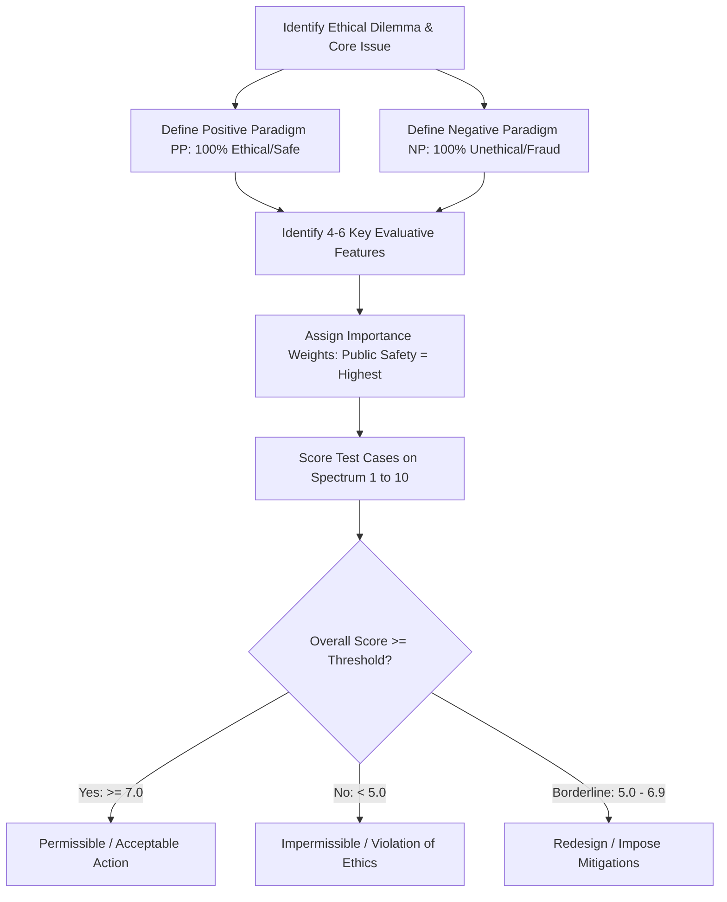
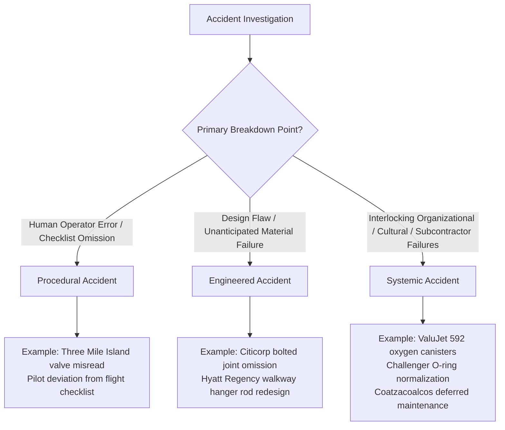
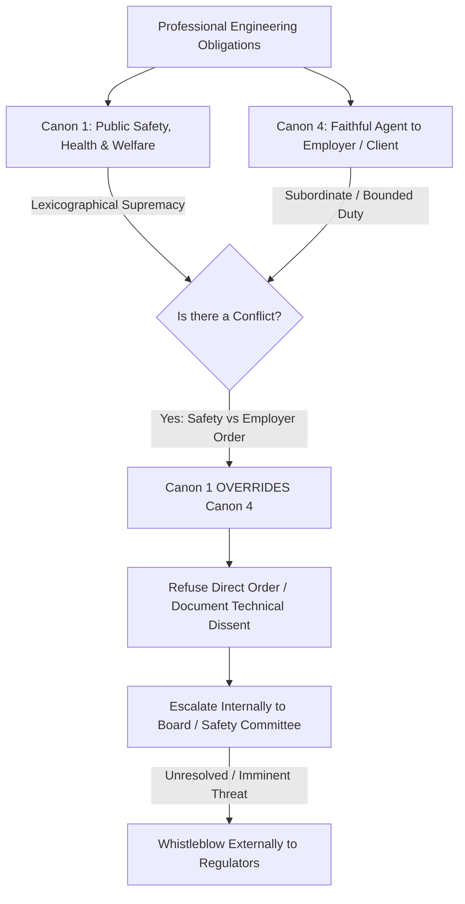

# HUM 4441: Engineering Ethics — Master Open-Book Exam Cheat Sheet

> [!important] Exam Quick Facts & Rules
> - **Format**: Open-book examination. Allowed: *"A single book and a single stapled document."*
> - **Structure**: 4 Compulsory Questions $\times$ 30 Marks = **120 Marks** total (2 Hours / 120 Minutes $\rightarrow$ **1 Mark per Minute**).
> - **Program Outcomes**: **PO6 (The Engineer and Society)** = ~65% (78 marks); **PO8 (Ethics & Integrity)** = ~35% (42 marks).
> - **Course Outcomes**: CO1 (Safety Design & Problem Solving, 43%), CO2 (Professional Responsibility, 24%), CO5 (Code Hierarchy & Distributed Responsibility, 16%), CO3 (Issue Sorting, 8%), CO4 (Distributive Justice & Rights, 8%).
> - **Pacing Rule**: Never spend more minutes on a sub-question than its mark allocation. Use standardized scaffolds to write directly to rubrics.

---

## 1. Master Case Study Matrix (20 Canonical Cases)

A high-density reference table covering all 20 historical and modern engineering ethics cases required for the HUM 4441 examination.

| # | Case Name & Era | Primary Actors & System | Technical Dilemma / Flaw | Ethical / Legal Violation | Official Resolution | Core Engineering Takeaway |
| :---: | :--- | :--- | :--- | :--- | :--- | :--- |
| **1** | **Citicorp Center** (1978) [[Chapter 8 - Doing the Right Thing]] | William LeMessurier (PE), Diane Hartley, Walter Wriston, Leslie Robertson | Diagonal wind chevrons on center stilts; contractor substituted welded joints with bolted joints without recalculating quartering (diagonal) winds; stress increased by 40% (members) and 160% (joints); 16-year storm threshold without TMD; Hurricane Ella approaching NYC. | Press blackout during repairs concealed catastrophic collapse hazard from 200,000 residents; initial failure to calculate quartering winds; ethical leadership in taking ownership. | LeMessurier confessed to Citibank, insurers, NYC building dept; 2-inch steel plates welded over 200+ bolted joints at night; paid $2M insurance liability cap; building survived. | Construction substitutions (bolted vs welded) are design changes requiring full re-analysis. Public safety trumps professional reputation. |
| **2** | **GE Sealed-Beam Headlamp** (1930s) [[Chapter 8 - Doing the Right Thing]] | Daniel Wright (GE), Val Roper, Corning Glass, Guide Lamp, C.M. Hall, Corcoran Brown, SAE | Early unsealed headlamps tarnished, fogged, and rusted within months, dropping lighting efficiency by 50%+ and causing severe night highway fatalities. | Positive ethics & supererogation. GE resisted monopolizing its patented sealed-beam design for corporate profit; openly shared tooling and cross-licensed to competitors. | SAE adopted nationwide standard sealed-beam headlamp in 1940; highway night fatalities plummeted across the United States. | Life-safety technology transcends commercial monopoly; true engineering leadership standardizes public protections industry-wide. |
| **3** | **GM Daytime Running Lamps (DRLs)** (2001) [[Chapter 8 - Doing the Right Thing]] | General Motors (GM), NHTSA, Association of International Automobile Manufacturers | GM petitioned NHTSA to mandate DRLs across all US vehicles, citing 5-10% crash reductions in northern latitudes (Canada, Scandinavia). | Rent-seeking disguised as safety advocacy. GM had already installed DRL production lines; lower US latitudes suffered headlight glare and reduced motorcycle conspicuity. | NHTSA denied GM's mandate petition in 2001, permitting DRLs as optional equipment only due to questionable net benefits. | Distinguish genuine universal safety mandates from corporate commercial advantage; safety claims must be empirically proven in context. |
| **4** | **Automotive Crash Testing (NHTSA vs. IIHS)** [[Chapter 8 - Doing the Right Thing]] | NHTSA (FMVSS 208 full-frontal rigid barrier at 35 mph), IIHS (Insurance Institute for Highway Safety, 40% moderate offset deformable barrier at 40 mph) | Automakers designed cars to pass the legal minimum NHTSA full-frontal test by channeling loads through both longitudinal frame rails. Real crashes are offset, bypassing frame rails and crushing the cabin. | "Compliance as the ethical floor." Automakers treated regulatory minimums as design ceilings, selling 5-star NHTSA cars that catastrophically collapsed in 40% offset crashes. | IIHS published offset crash test videos, shaming manufacturers; automakers re-engineered cabins with high-strength safety cages and offset cross-members. | Legal compliance is the bare floor of engineering ethics, never the ceiling. Engineers must design for real physical crash dynamics, not test artifacts. |
| **5** | **COMPAS Recidivism Algorithm** (2016) [[Lecture 9 - Types of Biases in Data-driven Technology]] | Northpointe (Equivant), ProPublica (Julia Angwin, Jeff Larson), Wisconsin Courts (*State v. Loomis*) | 137-item questionnaire predicting 2-year recidivism. Black defendants suffered double the False Positive Rate (44.9% vs 23.5%), while White defendants had double False Negative Rate (47.7% vs 28.0%). | Violates error rate parity. Trade Secret defense concealed proprietary scoring algorithm from criminal defendants facing sentencing, violating procedural due process. | Courts allowed advisory use only with warning caveats; Kleinberg's Impossibility Theorem proved calibration and error rate parity are mutually exclusive when base rates differ. | Machine learning outputs reflect base rate disparities in training data; proprietary opacity ("black box") in judicial sentencing violates fundamental rights. |
| **6** | **Amazon AI Recruitment Tool** (2014–2018) [[Lecture 9 - Types of Biases in Data-driven Technology]] | Amazon Machine Learning Team, HR Recruitment division | Resume scoring tool (1 to 5 stars) trained on 10 years of historical resumes submitted to Amazon (overwhelmingly male software engineers). | Historical & Representation bias. Model actively penalized resumes containing the word "women's" and downgraded graduates of all-women's colleges; picked up gendered proxy verbs. | Amazon abandoned and disbanded the project in 2018; tool was never deployed as the sole hiring decider. | Algorithms automate and amplify past societal discrimination. Scrubbing explicit protected attributes fails when correlated proxy features remain. |
| **7** | **Gender Shades** (2018) [[Lecture 9 - Types of Biases in Data-driven Technology]] | Joy Buolamwini (MIT Media Lab), Timnit Gebru (Stanford), IBM, Microsoft, Face++ | Commercial facial analysis APIs achieved 99%+ accuracy on lighter males, but error rates reached 34.7% for darker females on the Pilot Parliaments Benchmark (PPB). | Intersectional erasure, representation bias, and evaluation bias. Training datasets were >75% lighter-skinned and >60% male; aggregated benchmark metrics masked subgroup failures. | IBM and Microsoft retrained models on diverse datasets, drastically reducing error disparities; later suspended facial recognition sales to law enforcement. | Aggregate accuracy metrics conceal catastrophic subgroup failure modes; AI audits must evaluate intersectional demographic performance. |
| **8** | **Obermeyer Healthcare Risk Tool** (2019) [[Lecture 9 - Types of Biases in Data-driven Technology]] | Ziad Obermeyer et al., commercial healthcare insurer algorithm affecting ~200 million US patients | Algorithm used past healthcare *costs* (expenditure) as a proxy for healthcare *need* to enroll patients in specialized high-risk management programs. | Measurement bias. Less money is spent on Black patients due to systemic barriers; equal expenditure Black patients were substantially sicker than White patients, denying care to Black patients. | Switching target variable from cost to actual health metrics (chronic conditions, lab results) increased Black patient enrollment from 17.7% to 46.5%. | Flawed proxy metrics embed structural inequities into algorithms; engineers must ensure proxy variables genuinely reflect latent health/safety constructs. |
| **9** | **YouTube Inciting Violence / Myanmar Rohingya** (2012–2018) [[Lecture 10 - Content Moderation & AI Recommender Systems]] | Google/YouTube (*Innocence of Muslims*), Meta/Facebook (Myanmar military propaganda), Cindy Lee Garcia, UN Human Rights Council | Outrage-maximizing recommender systems amplified inflammatory, dehumanizing hate speech 6.5x faster than truth, driving communal riots and ethnic cleansing. | Algorithmic amplification of lethal violence; causal distance defense ("we are neutral platforms"); failure to invest in local language moderation (e.g. Burmese). | Google temporarily geo-blocked video; UN declared Facebook played a "determining role" in Rohingya genocide; platforms faced international regulatory crackdowns. | Algorithmic curation is active editorial distribution, not neutral conduit; platforms have a moral duty of care when recommender systems foreseeably amplify violence. |
| **10** | **Social Media Adolescent Mental Health** (2010–Present) [[Lecture 10 - Content Moderation & AI Recommender Systems]] | Meta (Instagram), Frances Haugen (whistleblower), Jonathan Haidt, US Senate Commerce Committee | Algorithms optimized for engagement directed vulnerable teenagers into self-harm, eating disorder, and depression rabbit holes; teenage depression/hospitalization surged after 2010. | Corporate concealment. Meta's internal research revealed 32% of teen girls felt Instagram made body issues worse; prioritized user retention and ad revenue over child welfare. | Frances Haugen leaked internal files to SEC/Congress (2021); ongoing state AG lawsuits; introduction of parental supervision and screen-time warning features. | Kant's Formula of Humanity forbids treating children as mere instruments of ad engagement; platforms owe heightened fiduciary duty to protect developing minds. |
| **11** | **Therac-25 Radiation Overdoses** (1985–1987) [[Chapter 7 - Ethical Issues in Engineering Practice]] | AECL (Atomic Energy of Canada Limited), software developer, hospital operators, Ray Cox (victim) | Medical linear accelerator replaced physical hardware interlocks with software control. Software had a race condition during rapid editing; cryptic "Malfunction 54". | AECL dismissed hospital reports, insisted machine was impossible to overdose, blamed operators; delivered 25,000 rad overdoses (100x lethal dose) killing/injuring 6 patients. | FDA recalled machine; AECL forced to install physical microswitch interlocks, software checksums, and independent safety audits. | Never rely solely on software for life-critical safety; physical hardware interlocks are mandatory; investigate cryptic error codes with extreme urgency. |
| **12** | **Space Shuttle Challenger** (1986) [[Chapter 1 - Introduction to Engineering Ethics]] | Roger Boisjoly, Arnie Thompson (Thiokol), Bob Lund (VP Engg), Jerald Mason (Thiokol GM), Larry Mulloy (NASA) | O-ring rubber lost resiliency at sub-freezing launch temperatures ($36^\circ\text{F}$ ambient, $18^\circ\text{F}$ joint), causing primary and secondary seal blowby. | Reversed burden of proof ("prove it will fail" vs "prove it is safe"); Mason ordered Lund: *"Take off your engineering hat and put on your management hat"*; NASA schedule pressure. | Challenger disintegrated 73 seconds post-launch; 7 astronauts killed; Feynman ice-water demonstration; redesign of solid rocket booster joints. | Engineers must never subordinate professional safety judgment to management schedule pressure; lack of failure data does not prove safety. |
| **13** | **Ford Pinto Fuel Tank Hazards** (1971–1978) [[Chapter 1 - Introduction to Engineering Ethics]] | Ford Motor Company, Lee Iacocca, Harley Copp (whistleblower), NHTSA | Subcompact car fuel tank positioned behind rear axle without protective bladder; differential flange bolts punctured tank in $\ge 20$ mph rear collisions, sparking fires. | Monetized cost-benefit analysis. Ford calculated fixing tank ($11/car = $137M) exceeded value of 180 burn deaths + 180 burn injuries ($49.5M valuing life at $200,000); delayed fix for 8 years. | *Grimshaw v. Ford Motor Co.* landmark $128M punitive damages; criminal indictment in Indiana; recall of 1.5 million Pintos. | Cost-benefit analysis cannot monetize human lives to justify marketing known lethal product flaws. Public safety trumps corporate profit. |
| **14** | **Bhopal Chemical Disaster** (1984) [[Chapter 3 - Understanding Ethical Problems]] | Union Carbide Corporation (UCC), UCIL, Warren Anderson (CEO), Bhopal plant operators | Tank E610 stored 42 tons of methyl isocyanate (MIC); water entered during pipe washing; exothermic runaway reaction blew relief valve; toxic gas cloud enveloped dense city. | Disabling safety safeguards to cut costs ($30/day freon refrigeration turned off; vent gas scrubber disabled; flare tower unlit); double standards (India plant had far fewer safety redundancies than US West Virginia plant). | >3,800 immediate deaths, >15,000 long-term deaths, >500,000 permanent injuries; UCC paid $470M settlement; site remains an uncleaned toxic wasteland. | Safety standards are non-negotiable globally; cost-cutting that strips safety barriers from hazardous processes constitutes criminal negligence. |
| **15** | **ValuJet Flight 592** (1996) [[Chapter 5 -  Risk, Safety, and Accidents]] | ValuJet Airlines, SabreTech (contractor), FAA, 110 victims | 144 expired chemical oxygen generators unthreaded without safety caps, wrapped in bubble wrap, labeled "empty canisters", placed next to tires in DC-9 cargo hold lacking smoke/fire detection. | Systemic accident: subcontracted cost-cutting, lack of hazmat training, falsified maintenance logs ("ghost sign-offs"), non-redundant cargo hold fire suppression. | Aircraft caught fire mid-air, crashed into Florida Everglades at 500 mph; all 110 perished; SabreTech criminally convicted; FAA mandated cargo hold fire suppression. | Safety depends on the entire socio-technical chain. If a design requires 100% human procedural perfection to avoid catastrophe, the engineering design is defective. |
| **16** | **BART Automated Train Control** (1970s) [[Chapter 6 - The Rights and Responsibilities of Engineers]] | Holger Hjortsvang, Max Blankenzee, Robert Bruder (BART engineers), BART Management, IEEE | World's first fully automated train control (ATC) transit system had flawed software, undetected ghost trains, and insufficient fail-safe braking logic. | Engineers raised warnings internally for a year; management accused them of insubordination, fired all three, and blacklisted them; train later overshot Fremont station into sandbank. | IEEE filed historic *amicus curiae* brief supporting engineers; BART settled out of court; established professional protection precedents for whistleblowing. | Public safety takes absolute precedence over employer loyalty under NSPE Canon 1; technical dissent regarding safety hazards is never insubordination. |
| **17** | **Denver Airport Runway Concrete** (1990s) [[Chapter 2 -  Professionalism and Codes of Ethics]] | 3Bs Paving Contractor, Empire Laboratories (testing lab), City of Denver inspectors | Concrete mix for DIA runways diluted with excess water for easy pumping; failed compressive strength specifications and suffered alkali-silica reactivity (ASR) cracking. | Data falsification. Technicians manipulated batch scales and altered computer break test reports, defending deliberate fabrication as "engineering judgment." | Core drill samples revealed sub-standard runways; federal criminal prosecution; contractor executives convicted and sent to federal prison for wire/mail fraud. | "Engineering judgment" cannot alter or falsify empirical testing data; manipulating quality assurance records to hide non-conformance is criminal fraud. |
| **18** | **Paradyne Computers RFP Fraud** (1980) [[Chapter 2 -  Professionalism and Codes of Ethics]] | Paradyne Corporation, Social Security Administration (SSA), former SSA procurement insider | SSA issued $115M RFP requiring an existing, off-the-shelf distributed network computer system ("P8400"). | Paradyne bid a non-existent system; bought competitor DEC PDP 11/23, pasted Paradyne labels over DEC logos, added dummy parts, and hired ex-SSA insider to rig the benchmark test. | Whistleblower exposed fraud; SEC and DOJ filed civil and criminal charges; Paradyne paid millions in settlements. | Misrepresenting product maturity, rebadging competitor hardware, and exploiting revolving-door conflicts of interest corrupt competitive procurement. |
| **19** | **Theranos Blood Testing Fraud** (2003–2018) [[Chapter 4 - Ethical Problem-Solving Techniques]] | Elizabeth Holmes, Sunny Balwani, Tyler Shultz, Erika Cheung, CMS, John Carreyrou | Claimed proprietary "Edison" finger-prick machine could run 200+ blood diagnostic tests from a single drop; microfluidic physics made tests wildly unreliable and inaccurate. | Secretly diluted patient samples and ran them on commercial Siemens machines; faked QC validation; issued false cancer/HIV/diabetes tests; silenced staff with NDAs. | Whistleblowers Shultz and Cheung reported to CMS and Wall Street Journal; lab shut down; Holmes and Balwani convicted of criminal wire fraud, sentenced to prison. | "Fake it till you make it" is criminal fraud in medical/safety engineering; engineers have a moral obligation to whistleblow when false claims endanger health. |
| **20** | **Coatzacoalcos Petrochemical Blast** (2016) [[Chapter 5 -  Risk, Safety, and Accidents]] | PMV (Mexichem/Pemex joint venture), Clorados 3 VCM plant, Indigenous communities in Veracruz | Ruptured corroded pipe in vinyl chloride monomer (VCM) feed line released massive flammable gas cloud; exploded with TNT force; 32 killed, 136 injured, 2,000 evacuated. | Deferred maintenance (18-month inspection cycles due to oil price collapse cost-cutting); untrained inspectors lacking NDT tools; environmental racism near Indigenous communities. | Government investigated; plant rebuilt under strict Safety Management System (SMS) oversight; demonstrated catastrophic cost of deferred maintenance. | Cost-cutting maintenance deferral on hazardous chemical lines guarantees catastrophe; environmental justice mandates equal safety protection for fence-line communities. |

---

## 2. Core Ethical Theories Comparison Matrix

Use this matrix to instantly contrast philosophical lenses for 4-mark, 8-mark, and 12-mark comparative exam questions.

| Ethical Theory | Foundational Thinkers | Core Axiomatic Test | Decision Criterion | Strengths in Engineering | Fatal Exam Pitfall / Vulnerability | Canonical Engineering Application |
| :--- | :--- | :--- | :--- | :--- | :--- | :--- |
| **Utilitarianism (Act)** | Jeremy Bentham (1789) | Greatest Happiness Principle: $Net\ Utility = \sum Benefits - \sum Harms$ | Choose the action producing the greatest net utility for all affected parties in this specific instance. | Quantitative; aligns with engineering cost-benefit optimization. | **Tyranny of the Majority**: Justifies sacrificing vulnerable minorities (e.g. poisoning an informal settlement to save a city water budget). | Ford Pinto cost-benefit analysis; algorithm optimization metrics. |
| **Utilitarianism (Rule)** | John Stuart Mill (1861) | Moral rules justified by long-term aggregate societal utility. | Follow the universal rule that maximizes net societal utility if adopted by everyone over time. | Avoids ad-hoc moral corruption; supports professional codes of ethics. | Can devolve into rule worship or collapse back into Act Utilitarianism when rules conflict. | Generalizing traffic laws, building codes, and standard safety testing. |
| **Kantian Deontology (Duty)** | Immanuel Kant (1785) | **CI-1 (Universalizability)**: Can the maxim be willed as a universal law without contradiction?  **CI-2 (Formula of Humanity)**: Never treat persons merely as a means, but always as ends. | Act strictly from duty; moral rightness is intrinsic to the act, regardless of physical consequences. | Absolute protections for human dignity and autonomy; forbids deceptive engineering. | Inflexible (absolute duty to tell truth even to murderer); struggles to resolve conflicting duties. | Data privacy; AI recommender child exploitation; cheating on emissions tests. |
| **Rights Ethics** | John Locke, Thomas Jefferson | Fundamental inalienable rights: Negative rights (non-interference) vs. Positive rights (entitlements). | An action is impermissible if it violates any individual's fundamental moral rights (life, health, consent). | Establishes non-negotiable boundaries that utilitarian cost-benefit cannot override. | Rights proliferation; conflicting rights between parties (property rights vs public safety). | Environmental justice; informed consent in clinical diagnostics (Theranos). |
| **Virtue Ethics** | Aristotle (*Nicomachean Ethics*) | **Aristotelian Golden Mean**: Virtue is the balanced mean between deficiency and excess. | Act as an engineer of exemplary moral character possessing *phronesis* (practical wisdom) and professional virtue. | Focuses on professional virtue, character, pride of craftsmanship, and lifelong moral habituation. | Subjective; lacks algorithmic, step-by-step decision procedures in novel technological crises. | LeMessurier's honesty in Citicorp crisis; resisting Challenger management pressure. |
| **Social Contract Theory** | Thomas Hobbes, John Rawls | **Rawls's Veil of Ignorance & Difference Principle**: Rules agreed upon if nobody knows their status. | Rules are legitimate only if rational individuals in an initial fair position would agree to them. | Powerful for algorithmic fairness, distributive justice, and equitable public infrastructure. | Excludes non-contracting entities (future generations, non-human environment, sentient AI). | Algorithmic fairness in bail/recidivism (COMPAS) and municipal water distribution. |

> [!tip]- Aristotelian Golden Mean and Professional Virtue in Engineering Practice
> - **Professional Virtue**: Habitual excellence in engineering decision-making, cultivating competence, objectivity, candor, and public stewardship.
> - **Courage**: Deficient = Cowardice (staying silent under management pressure) | **Virtue = Moral Courage (standing firm on safety)** | Excessive = Recklessness (blowing the whistle publicly without verifying facts).
> - **Professional Honesty**: Deficient = Concealment/Deception (Theranos/Paradyne) | **Virtue = Candor & Transparency (LeMessurier)** | Excessive = Indiscretion (leaking proprietary trade secrets unrelated to public safety).

---

## 3. Decision Trees & Quick Recipes

### 3.1 Line-Drawing Technique (Harris, Pritchard, Rabins)

Used to resolve borderline cases by comparing an intermediate test case against clearly defined positive and negative paradigms.

#### Step-by-Step Line-Drawing Recipe:
1. **Define Paradigms**:
   - **Positive Paradigm (PP / Paradigm A)**: 100% Acceptable, fully transparent, safety-validated, informed consent obtained.
   - **Negative Paradigm (NP / Paradigm G)**: 100% Unacceptable, fraudulent, reckless endangerment, active coverup.
2. **Select Features**: Transparency, Severity of Potential Harm, User Consent, Regulatory Compliance, Data Integrity.
3. **Weight Features**: Life-critical safety features receive 3x–5x the weight of financial or schedule features.
4. **Plot Intermediate Cases**: Mark each feature on the spectrum ($A \leftrightarrow G$ or $1 \leftrightarrow 10$).
5. **Compute Weighted Placement**: If the weighted centroid falls closer to NP than PP, the action is **impermissible**.

---

### 3.2 Accident Typology & Classification

Engineering accidents fall into three distinct structural categories:

- **Procedural Accident**: Operators failed to follow established protocols, manuals, or maintenance checklists. (Remedy: Retraining, redundant sign-offs, clearer UI).
- **Engineered Accident**: Flawed technical design, uncalculated physical stress, material fatigue, or edge-case load combination. (Remedy: Re-engineering, safety factors, fail-safe hardware).
- **Systemic Accident**: Failure of the entire socio-technical architecture. Involves schedule pressure, cost-cutting, fragmented subcontractors, normalization of deviance, and regulatory capture. (Remedy: Total organizational overhaul, safety management systems, whistleblowing protection).

---

### 3.3 Whistleblowing: 4 Necessary Conditions (Harris/Pritchard/Rabins)

Before an engineer may ethically escalate concerns outside the organizational hierarchy, all four conditions must be evaluated:

| Condition | Rigorous Operational Test | Evidence Required in Exam | Canonical Case Example |
| :--- | :--- | :--- | :--- |
| **1. Need** | Is there clear, serious, and imminent harm to the public, consumers, or workers? | Documented death, injury, or catastrophic property loss. | Therac-25 lethal radiation; Challenger O-ring blowby; Theranos false blood diagnostics. |
| **2. Proximity** | Does the engineer have direct personal knowledge and firsthand observation of the hazard? | Firsthand access to logs, code, calculations, or test benches (not hearsay). | Boisjoly at Thiokol; Tyler Shultz at Theranos; Hjortsvang at BART. |
| **3. Capability** | Does the engineer possess the expertise and evidence to realistically halt or mitigate the harm? | Technical documentation, test reports, and access to regulatory bodies. | Submitting documented test data to FDA, FAA, CMS, or SEC. |
| **4. Last Resort** | Have all internal escalation channels been exhausted, or is internal reporting futile/retaliatory? | Written memos to management rejected, ignored, or met with threats. | BART management firing engineers; Theranos weaponizing NDAs; Kermit Vandivier at Goodrich. |

#### Permissible vs. Obligatory Whistleblowing:
- **Permissible**: Conditions 1 through 4 are satisfied, and documented evidence exists.
- **Morally Obligatory**: Conditions 1 through 4 are met **AND** there is certainty of catastrophic loss of human life without external intervention. Under NSPE Canon 1, public safety is paramount; remaining silent constitutes complicity in manslaughter.

#### Typology:
- **Internal**: Escalating within the corporate chain of command, ombudsman, or board of directors.
- **External**: Disclosing to external regulatory agencies (NHTSA, FDA, CMS, SEC), law enforcement, or the press.
- **Open (Acknowledged)**: Whistleblower discloses identity openly (high personal career risk).
- **Anonymous**: Whistleblower conceals identity to prevent immediate retaliatory termination.

---

### 3.4 Conflict of Interest (COI) Diagnostic

| COI Category | Legal & Ethical Definition | Test Question for Engineers | Actionable Engineering Remedy |
| :--- | :--- | :--- | :--- |
| **Actual COI** | An engineer is in a position where personal, financial, or familial interests directly compromise professional judgment or fiduciary duty. | *Does my personal financial gain directly conflict with my client's/public's best interest?* | **Immediate full disclosure** in writing; mandatory **recusal** from decision-making; divestment of conflicting assets. |
| **Potential COI** | An engineer has interests that do not currently impair judgment, but could foreseeably do so if project circumstances evolve. | *Could future contract awards or design changes create a financial collision later?* | **Formal disclosure** to management/client; establish an independent firewall or monitoring committee. |
| **Apparent (Perceived) COI** | No actual bias exists, but a reasonable, informed outside observer would reasonably question the engineer's objectivity. | *Would a member of the public or competitor reasonably suspect favoritism or corrupt influence?* | **Public disclosure**; independent peer review; withdraw if public confidence would be undermined. |

---

### 3.5 The 7 Core AI Bias Types: Identification Guide

| Bias Type | Pipeline Entry Point | Root Cause & Mechanism | Detection Test Question | Canonical Case Study |
| :--- | :--- | :--- | :--- | :--- |
| **1. Historical Bias** | World / Society | Data accurately mirrors historical social prejudices and structural inequality. | *Does the training data reflect historical systemic discrimination even if collected perfectly?* | Amazon AI Hiring Tool (penalized women's colleges); predictive policing. |
| **2. Representation Bias** | Data Sampling | Specific demographic subgroups are missing, underrepresented, or overrepresented. | *Are all target user demographics proportionally represented in the training dataset?* | Gender Shades (facial recognition datasets >75% lighter-skinned). |
| **3. Measurement Bias** | Feature Selection | Flawed, noisy, or proxy features chosen to measure a complex latent construct. | *Does the chosen proxy feature (e.g. expenditure) genuinely reflect the target construct (health)?* | Obermeyer Healthcare Algorithm (used cost as proxy for illness severity). |
| **4. Aggregation Bias** | Model Architecture | A single monolithic model trained on combined data fails distinct subpopulation dynamics. | *Does a single global model perform poorly on distinct sub-cohorts that require separate mapping?* | Diabetes clinical risk models failing across distinct ethnic subgroups. |
| **5. Evaluation Bias** | Model Testing | Benchmarks, test sets, or metrics disproportionately represent the majority group. | *Does aggregate accuracy mask catastrophic failure rates in minority/intersectional groups?* | Facial recognition benchmarks tested on predominantly white male sets. |
| **6. Deployment Bias** | System Deployment | Model deployed in an environment or domain differing from its training conditions. | *Is the model being used by humans in ways or contexts not envisioned during validation?* | Post-sentencing risk tools misused by judges for pre-trial cash bail decisions. |
| **7. Feedback Loop Bias** | Live Operations | Model predictions influence real-world behavior, generating training data that reinforces the bias. | *Do algorithmic recommendations drive user behavior that feeds back into retraining data?* | YouTube radicalization rabbit holes; predictive policing self-fulfilling arrests. |

---

### 3.6 Fair Use 4-Factor Balancing Test (17 U.S.C. § 107)

Used to evaluate whether training or deploying AI models on copyrighted data constitutes copyright infringement:

| Factor | Statutory Criterion | Favors Fair Use (Defense) | Weighs Against Fair Use (Infringement) |
| :---: | :--- | :--- | :--- |
| **1** | **Purpose and Character of the Use** | **Transformative Use**: Adds new expression, meaning, or functional insight (e.g. search indexing, statistical pattern learning, parody, criticism, non-profit education). | Purely commercial, non-transformative replication; direct verbatim duplication; commercial exploitation without added value. |
| **2** | **Nature of the Copyrighted Work** | Factual, scientific, technical manuals, open public data, published software APIs (thinner copyright protection). | Highly creative, fictional, artistic, cinematic, musical compositions, unpublished intimate works (thick copyright protection). |
| **3** | **Amount and Substantiality Taken** | Small fraction; only what is strictly necessary to achieve transformative purpose. | Taking the entire work; taking the "heart of the work" (qualitative core), even if quantitatively small. |
| **4** | **Market Effect on Potential Market** | **No Market Harm**: Serves a different market; does not substitute for the original work; enhances original work's discovery. | **Market Usurpation**: Acts as a direct market substitute; destroys licensing markets for creators; competes directly with original author. |

> [!important] The Decisive Weight of Factor 4 & Factor 1
> Historically, **Factor 4 (Market Effect)** and **Factor 1 (Transformativeness)** are the twin pillars of Fair Use jurisprudence (*Campbell v. Acuff-Rose*, *Google v. Oracle*). If an AI model merely replicates an artist's output and destroys their commercial market, Fair Use defense collapses.

---

### 3.7 Intellectual Property Protection Selector

| IP Pillar | Subject Matter Protected | Legal Standard for Protection | Duration | Cost & Formalities | Public Disclosure Required? | Software / Computing Application |
| :--- | :--- | :--- | :--- | :--- | :--- | :--- |
| **Copyright** | Original works of authorship fixed in tangible medium (expression, not idea). | Originality + fixation (minimal creativity required; automatic on creation). | Author's life + 70 years (or 95 years from publication for corporate works). | Free (automatic); optional low-cost registration for statutory damages. | No (source code can remain closed/compiled). | Protects literal source code, object code, UI graphic assets, user manuals. Does **not** protect algorithms or functional ideas. |
| **Patent (Utility)** | Novel, useful, and non-obvious processes, machines, or compositions of matter. | Novelty, utility, non-obviousness; must overcome *Alice* two-step (cannot be abstract idea). | **20 Years** from filing date (non-renewable). | High ($10,000–$30,000+ legal and filing fees; maintenance fees). | **YES**: Mandatory full public disclosure enabling someone skilled in the art to replicate. | Protects novel algorithms that provide a "faster way for a computer to do X" (hardware optimization, compression, encryption). |
| **Trademark** | Distinctive words, names, symbols, sounds, or trade dress identifying source of goods. | Distinctiveness (arbitrary, fanciful, or suggestive) + commercial use in commerce. | **Indefinite** (renewable every 10 years as long as used in commerce). | Moderate ($250–$500 per class); continuous monitoring required. | No (public by commercial use). | Brand names (Google, Apple, Linux), logos, product titles, distinctive UI layouts. |
| **Trade Secret** | Confidential technical or business information giving economic competitive edge. | Secret + economic value from secrecy + **reasonable efforts to maintain secrecy**. | **Potentially Forever** (lasts until disclosed or independently discovered). | Zero government fees; high internal security costs (NDAs, access control, air-gapping). | **NO**: Disclosure destroys protection immediately. | Proprietary ML model weights, training pipeline recipes, internal search ranking weights (PageRank secrets). |

#### The Fundamental Software Patentability Rule of Thumb:
- ❌ **Not Patentable**: *"Doing X on a computer"* (Taking an existing business or mathematical abstract concept and executing it on a standard processor — invalid under *Alice Corp. v. CLS Bank*).
- ✅ **Patentable**: *"A faster, novel way for a computer to do X"* (Improving the technical functioning of the computer itself — novel memory indexing, GPU acceleration, quantum error correction).

---

## 4. NSPE Canon 1 (Paramountcy Clause) vs. Employer Loyalty

### The Lexicographical Hierarchy of Professional Engineering Codes
- **NSPE Canon 1**: *"Hold paramount the safety, health, and welfare of the public."*
- **NSPE Canon 4**: *"Act for each employer or client as faithful agents or trustees."*

#### Analytical Breakdown for Exam Scenarios:
1. **The Meaning of "Paramount"**: In legal and ethical jurisprudence, *paramount* means supreme in rank, preeminent, and superior to all concurrent obligations. Public safety is the foundational condition upon which the engineering license is granted by the state.
2. **Employer Loyalty is a Bounded (*Prima Facie*) Duty**: An engineer's duty of loyalty to an employer exists **only within the boundary of lawful and safe practice**. An employer has no legal or ethical authority to demand that an engineer violate public safety. Any managerial directive to falsify data, bypass critical safety tests, or release a dangerous product is **legally void and ultra vires**.
3. **Insubordination vs. Professional Obligation**:
   - Insubordination is refusing to execute valid, safe managerial directions within business prerogatives (e.g. refusing to work on an approved project architecture).
   - Technical dissent on safety is **mandatory professional duty**. Submitting documented dissent and refusing to sign off on an unvalidated, life-threatening system is the direct fulfillment of Canon 1, not insubordination.
4. **The "Management Hat" Fallacy**: In the *Challenger* disaster, Jerald Mason commanded Bob Lund: *"Take off your engineering hat and put on your management hat."* In engineering ethics, an engineer **can never take off their engineering hat** when public lives are at stake. Professional responsibility cannot be shed by changing organizational titles.

---

## 5. Universal Rapid-Entry Answering Scaffolds

Follow these standardized structural scaffolds to maximize marks and avoid losing points under strict exam time limits.

### 5.1 Micro-Questions (2 to 4 Marks) — Pace: 2 to 4 Minutes

> [!tip] 3-Sentence Rapid Scaffold
> - **Sentence 1 (Direct Thesis)**: Definitive, affirmative or negative answer stating the core principle.
> - **Sentence 2 (Ethical/Legal Rule)**: Define the governing theoretical test or code canon (e.g. Negative rights, NSPE Canon 1, Procedural accident).
> - **Sentence 3 (Case Application)**: Cite specific facts from the scenario proving why the rule applies.

#### Worked Example: Q2(b)(i) [2 Marks]
*Prompt: "Should overall societal benefit justify increased risk to vulnerable populations?"*
- **Direct Answer**: No, overall societal benefit cannot justify exposing vulnerable populations to disproportionate physical risk.
- **Ethical Rule**: Under Rights Ethics and Distributive Justice, individuals possess an inalienable negative right to bodily safety and clean water; utilitarian aggregation is bounded by fundamental rights and cannot commodify marginalized lives.
- **Case Link**: Stripping pressure-relief valves exclusively from low-income informal settlements to subsidize aggregate municipal water efficiency violates distributive justice and constitutes environmental racism.

---

### 5.2 Medium Analytical Questions (5 to 8 Marks) — Pace: 5 to 8 Minutes

> [!tip] IRAC Scaffold
> - **I — Issue (1-2 sentences)**: State the precise ethical/legal conflict between competing values (e.g. public safety vs schedule deadline).
> - **R — Rule / Theory (2-3 sentences)**: Quote the governing code canon (NSPE Canon 1) or ethical doctrine (Kantian Categorical Imperative CI-2).
> - **A — Application (4-6 sentences)**: Systematically apply the rule to the scenario facts. Address counter-arguments (e.g. employer financial pressure).
> - **C — Conclusion (1-2 sentences)**: Deliver a definitive moral verdict and actionable engineering mandate.

#### Worked Example: Q1(d) [8 Marks]
*Prompt: "According to the NSPE Code, explain why the ordering of responsibilities is critical. Analyze whether engineers should proceed with deployment when employer instructions conflict with risk to the public."*
- **Issue**: The dilemma centers on a direct conflict between an engineer's fiduciary duty to obey employer deployment schedules (NSPE Canon 4) and the professional duty to prevent routing failures in life-critical emergency ambulance dispatch systems (NSPE Canon 1).
- **Rule**: NSPE Canon 1 mandates that engineers *"hold paramount the safety, health, and welfare of the public."* Canon 4 obligates engineers to act as *"faithful agents or trustees."* In the hierarchical ordering of professional ethics, Canon 1 is paramount and absolute, functioning as an unconditional trump card over Canon 4.
- **Application**: Management's insistence on deploying the AI dispatch system despite known network-dropout routing failures prioritizes contractual milestones over human lives. A delayed ambulance directly threatens patient survival. Proceeding with deployment treats citizens as expendable instruments of corporate revenue, violating Kant's Formula of Humanity. While management argues the risk is "acceptable" and similar to competitor tools, the engineer's obligation under Canon 1 is non-delegable. Technical dissent must be formally documented.
- **Conclusion**: Engineers must **refuse deployment**. Obeying management orders under these conditions constitutes a severe ethical failure and actionable professional negligence under NSPE Canon 1.

---

### 5.3 Macro Synthesis Questions (10 to 12 Marks) — Pace: 10 to 12 Minutes

#### Scaffold A: Six-Step Safety Design Process (e.g. Q3(c) [12 Marks])
1. **Step 1: Define the Problem**:
   - Technical Failure Mode: Feed pipe corrosion caused by acidic vinyl chloride monomer.
   - Organizational Root Cause: Inspection intervals stretched from 6 to 18 months due to cost-cutting; inspectors lacked training and NDT equipment.
2. **Step 2: Generate Solutions (Provide At Least 2 Distinct Solutions)**:
   - *Solution 1 (Automated Cyber-Physical Sensing)*: Install an automated array of high-temperature ultrasonic thickness transducers and gas sniffing sensors along the feed line linked to automatic shut-off valves.
   - *Solution 2 (Institutional Inspection & Audit Overhaul)*: Redesign inspection protocols: mandatory third-party certified NDT inspections every 3 months, digital tamper-proof cryptographic logging, and independent safety audits.
3. **Step 3: Analyze Solutions Across Criteria**:
   - Compare Solution 1 vs Solution 2 on: Safety Reliability, Failure Modes, Capital/Operating Cost, Implementation Timeline, Human Error Resistance.
4. **Step 4: Test & Verify Solutions**:
   - Simulated proof-testing under corrosive, high-pressure operating environments; blind audit tests for inspectors.
5. **Step 5: Select the Best Solution**:
   - Synthesize a hybrid model: Solution 1 for real-time automated containment + Solution 2 for institutional defense-in-depth, prioritizing public safety over short-term savings.
6. **Step 6: Implement & Verify**:
   - Phased rollout, operator training, continuous monitoring dashboard, and whistleblower protections for reporting anomalies.

#### Scaffold B: Multi-Lens Comparison (e.g. Q2(b) [10 Marks])
- **Heading 1: Utilitarian Lens**: Aggregate utility calculation ($\Delta U$). Show how Act Utilitarianism falls into the tyranny of the majority trap, whereas Rule Utilitarianism mandates uniform safety baselines.
- **Heading 2: Kantian Deontology Lens**: Formula of Universal Law (Universalizability) + Formula of Humanity (Mere Means). Show why treating marginalized users as mere cost-savings is intrinsically evil.
- **Heading 3: Rights Ethics Lens**: Contrast positive vs negative rights. Prove that negative rights (not to be injured or poisoned) supersede commercial corporate utility.
- **Heading 4: Optimal Lens Selection & Justification**: Select Rights Ethics or Kantian Deontology as superior because they provide an unconditional moral floor protecting vulnerable populations.

---

### 5.4 Comprehensive Line-Drawing Matrix (15 Marks) — Pace: 15 Minutes

Used for full 15-mark questions (e.g. Q4(b) Theranos 5-scenario evaluation).

> [!important] Step-by-Step 15-Mark Execution Protocol
> 1. State the **Positive Paradigm (PP / A)**: 100% Acceptable, fully transparent, safety-validated, informed consent.
> 2. State the **Negative Paradigm (NP / G)**: 100% Unacceptable, fraudulent, reckless endangerment, active concealment.
> 3. Build the **5-Row Evaluation Table**:

| Test Case | Scenario Description | Spectrum Position ($A \leftrightarrow G$) | Score (1–10) | Distinguishing Factor / Threshold Justification |
| :---: | :--- | :---: | :---: | :--- |
| **Case 1** | Calibrated demo unit shown to investors; production units have high error rate; disclosed as current state. | **C (Leaning Acceptable)** | 6.5 | Commercial puffery/demo boundary; acceptable *only* if disclosed as experimental and not used on human patients. |
| **Case 2** | Patient samples run on 3rd-party analyzers; disclosed to regulators in filings, but concealed from public/partners. | **E (Substantially Unacceptable)** | 3.5 | Dual-reality deception; misleading advertising; violates informed consumer consent and fair contracting. |
| **Case 3** | Lab staff flag 10% inaccurate results on one test; management documents, deems acceptable, hides from patients. | **F (Critically Unacceptable)** | 2.0 | Conceals known clinical error rate from patients; direct physical endangerment in diagnostic healthcare. |
| **Case 4** | Sample dilution produces results outside validated range; management asks staff to continue until fix ready. | **F+ (Severe Endangerment)** | 1.5 | Active clinical recklessness; forces unvalidated, falsified diagnostic tests onto real patients. |
| **Case 5** | Ahead of regulatory inspection, compile validation records only for own device, withholding 3rd-party records. | **G (Pure Negative Paradigm)** | 0.5 | Active obstruction of justice, regulatory fraud, bad-faith data fabrication, and criminal conspiracy. |

4. **Boundary & Threshold Synthesis**: Draw the explicit moral boundary line (between Case 1 and Case 2). Show where commercial ambition crosses into criminal fraud and public endangerment.

---

## 6. Comprehensive Review Cross-Index

Quick links to all core study notes across the vault:
- [[Chapter 8 - Doing the Right Thing]]: Citicorp Center, GE Sealed-Beam, GM DRLs, Crash Tests (NHTSA vs IIHS), Three Excuses.
- [[Lecture 9 - Types of Biases in Data-driven Technology]]: 7 AI Biases, COMPAS, Amazon Hiring, Gender Shades, Obermeyer Healthcare, Kleinberg Theorem.
- [[Lecture 10 - Content Moderation & AI Recommender Systems]]: Content moderation forms, YouTube *Innocence of Muslims*, Instagram adolescent mental health, Autonomy principle.
- [[Lecture 11 - Generative AI, Large Language Models & Ethics]]: LLMs, Transformers, GANs, Diffusion, 6 Dilemmas (Hallucination, Plagiarism, Model Collapse, Dual-use, Labor).
- [[Lecture 12 - Patents and Intellectual Property in Computing]]: 4 IP Pillars, Fair Use 4-factor test, Software patentability (*Alice*), NDAs & employee mobility, Hooker's argument.
- [[Chapter 1 - Introduction to Engineering Ethics]]: Engineering ethics foundations, Challenger disaster, Ford Pinto case.
- [[Chapter 2 -  Professionalism and Codes of Ethics]]: NSPE Code of Ethics, Paradyne computers fraud, Denver concrete case.
- [[Chapter 3 - Understanding Ethical Problems]]: Ethical theories, Bhopal disaster, Aberdeen Three.
- [[Chapter 4 - Ethical Problem-Solving Techniques]]: Line-drawing technique, Flowcharting, Bribery vs Gifts.
- [[Chapter 5 -  Risk, Safety, and Accidents]]: Accident typology (Procedural, Engineered, Systemic), ValuJet 592, Hyatt Regency.
- [[Chapter 6 - The Rights and Responsibilities of Engineers]]: Whistleblowing 4 conditions, BART case, NSPE Canon 1 vs loyalty.
- [[Chapter 7 - Ethical Issues in Engineering Practice]]: Therac-25 radiation accidents, Computer ethics, Avanti v. Cadence.
