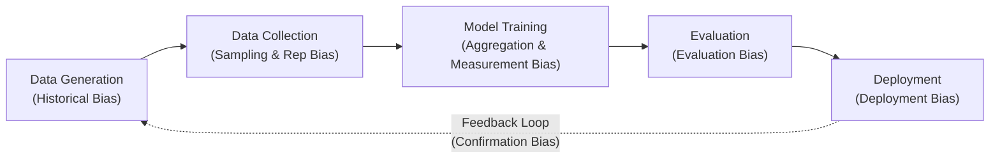
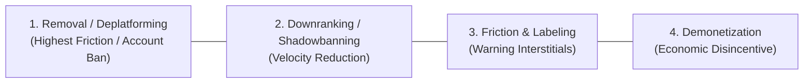
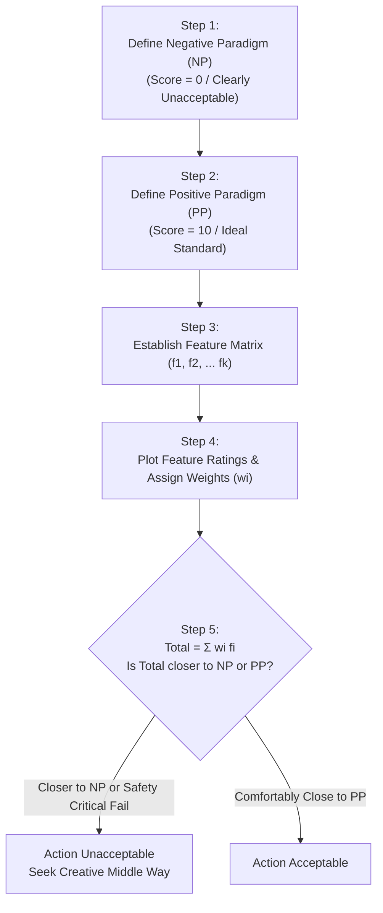

# 🎯 HUM 4441: Engineering Ethics — Final Exam Master Topic Cheat Sheet

> [!IMPORTANT]
> **Exam Hall Quick Reference**: This document is strictly aligned with the **IUT SWE Course Outline** across **Course Outcomes (CO2–CO5)**. All narrative case study stories have been removed to maximize technical density, equations, algorithms, and diagnostic frameworks.

---

## 📊 1. CO5 (PO6): Bias & Fairness in Data-Driven Technologies (37.5% Weight)

### Statistical vs. Sociological Bias
*   **Statistical Bias**: $\text{Bias}(\hat{\theta}) = \mathbb{E}[\hat{\theta}] - \theta$. Mathematical deviation of an estimator's expected value from the true ground-truth population parameter.
*   **Sociological Bias**: Systematic, unfair prejudice or disparate harm against individuals based on protected demographic attributes (race, gender, socio-economic class).
*   **Bias-Variance Tradeoff**: Underfitting (high bias, low variance) vs Overfitting (low bias, high variance). A machine learning model can have zero statistical estimation bias yet perpetuate severe sociological discrimination.

### Bias Across the Machine Learning Lifecycle

### The 7 Core Types of Machine Learning Bias

| Bias Type | Technical Mechanism | Real-World Engineering Failure |
| :--- | :--- | :--- |
| **1. Historical Bias** | Training data faithfully reflects pre-existing societal inequalities and historical prejudices. | Word embeddings linking "doctor" to male and "nurse" to female vectors based on historical text corpora. |
| **2. Representation Bias** | Skewed sampling where minority demographic subgroups are underrepresented in training datasets. | **Gender Shades**: Commercial facial analysis systems exhibited error rates up to 34.7% for darker-skinned females vs <1% for lighter males. |
| **3. Measurement Bias** | Utilizing an unrepresentative or flawed proxy variable to stand in for an unobservable target attribute. | **Healthcare Risk Algorithm**: Using annual healthcare expenditure as a proxy for illness severity, under-allocating care to Black patients who faced systemic barriers to healthcare access. |
| **4. Aggregation Bias** | Fitting a single one-size-fits-all model across heterogeneous subpopulations with distinct underlying feature distributions. | Clinical diagnostic models failing when applied across different age cohorts or ethnic populations. |
| **5. Evaluation Bias** | Performance benchmarks and test suites over-represent majority demographics, concealing severe failure rates in minority subsets. | Facial recognition models reporting 95%+ overall accuracy because test benchmarks are 80%+ light-skinned males. |
| **6. Deployment Bias** | System is applied in an operational context or decision pipeline different from what it was validated for; automation bias. | Facial recognition trained on high-resolution studio photos deployed on low-resolution CCTV footage for criminal arrests. |
| **7. Feedback Loop Bias** | Algorithmic predictions influence real-world interventions that generate biased training data for subsequent model retraining. | **Predictive Policing**: Dispatching more patrols to historically targeted neighborhoods $\rightarrow$ more arrests recorded $\rightarrow$ algorithm predicts even higher crime in those areas. |

### Mathematical Fairness Metrics & Equations
Let $Y \in \{0,1\}$ be true ground truth, $\hat{Y} \in \{0,1\}$ model prediction, $A \in \{0,1\}$ protected group attribute.

1.  **Demographic (Statistical) Parity**: Equal acceptance rates across groups:
    $$P(\hat{Y}=1 \mid A=0) = P(\hat{Y}=1 \mid A=1)$$
2.  **Equal Opportunity (FNR Parity)**: Equal True Positive Rates across groups:
    $$P(\hat{Y}=1 \mid Y=1, A=0) = P(\hat{Y}=1 \mid Y=1, A=1)$$
3.  **Equalized Odds**: Equal True Positive Rates AND False Positive Rates across groups:
    $$P(\hat{Y}=1 \mid Y=y, A=0) = P(\hat{Y}=1 \mid Y=y, A=1) \quad \forall y \in \{0,1\}$$
4.  **Predictive Parity (Calibration)**: Equal Positive Predictive Value (Precision) across groups:
    $$P(Y=1 \mid \hat{Y}=1, A=0) = P(Y=1 \mid \hat{Y}=1, A=1)$$

> [!ALERT]
> **Kleinberg's Fairness Impossibility Theorem**:
> If base rates differ between demographic groups ($P(Y=1 \mid A=0) \neq P(Y=1 \mid A=1)$), it is **mathematically impossible** for any scoring algorithm to simultaneously satisfy:
> 1. **Predictive Parity / Calibration**
> 2. **Equalized Odds (FPR and FNR Parity)**
> 
> *Exam Application (COMPAS)*: Northpointe optimized for Calibration (equal score meaning) while violating Equalized Odds (Black defendants had $2\times$ False Positive Rate; White defendants had $2\times$ False Negative Rate).

### 3-Tier Machine Learning Bias Mitigation Pipeline
*   **Pre-Processing**: Data-level interventions prior to training (SMOTE re-sampling, demographic re-weighting, adversarial data augmentation, proxy removal).
*   **In-Processing**: Algorithmic interventions during optimization (Fairness-constrained loss functions $\min_\theta \mathcal{L}(\theta) + \lambda \mathcal{D}_{\text{fairness}}(\theta)$, adversarial debiasing).
*   **Post-Processing**: Decision threshold tuning after training (Group-specific classification thresholds $\tau_{A=0} \neq \tau_{A=1}$, reject-option classification).

---

## 📱 2. CO4 (PO6): Privacy, Recommenders & IP Law (25% Weight)

### Recommender Systems AS Content Moderation
*   **Algorithmic Primacy**: Modern platforms do not separate moderation from distribution. Recommender systems (Collaborative Filtering, Matrix Factorization, KNN, Two-Tower Neural Networks) determine what content is seen; they are the primary moderation engine.
*   **The Engagement Maximization Equation**: Loss functions optimize for click-through rate (CTR), dwell time, and viral shares. Sensational, divisive, polarizing, and outrage-inducing content mathematically maximizes engagement, driving systemic algorithmic radicalization.

### The 4-Tier Content Moderation Spectrum

### The 4 Pillars of Intellectual Property

| Pillar | Protected Subject Matter | Acquisition Standard | Term Length | Core Software Scope |
| :--- | :--- | :--- | :--- | :--- |
| **Copyright** | Original expression fixed in a tangible medium. | Automatic upon creation; no filing required. | Author's life + 70 yrs (Corporate: 95 yrs from pub). | Protects source code, compiled binaries, UI graphics, icons. Does NOT protect ideas, algorithms, or functional protocols. |
| **Patent** | Novel, non-obvious, and useful processes, machines, or compositions. | Government examination and grant. | 20 years from filing date. | **Patent Bargain**: Public disclosure in exchange for limited monopoly. Protects specific technical methods and hardware architectures. |
| **Trademark** | Words, symbols, logos, trade dress identifying commercial source. | Commercial use & registration. | Indefinite (as long as continuously used in commerce). | Brand names ("Google"), product names, corporate logos. Prevents consumer confusion. |
| **Trade Secret** | Confidential commercial information conferring economic advantage. | Reasonable efforts to maintain secrecy. | Indefinite (lasts until disclosed or discovered). | Secret algorithms (Google Search ranking, Coca-Cola). Protects against theft/espionage, NOT reverse engineering. |

### Fair Use 4-Factor Statutory Test (17 U.S.C. § 107)
All 4 statutory factors must be weighed together:
1.  **Purpose and Character of the Use**: Commercial vs. Nonprofit Educational; **Transformative** (adds new meaning, utility, or insights) vs. Mere Derivative Repackaging.
2.  **Nature of the Copyrighted Work**: Factual / Technical (broader fair use scope) vs. Highly Creative / Fictional (narrower fair use scope).
3.  **Amount and Substantiality**: Proportion of work taken relative to the whole; taking the "heart of the work" negates fair use even if small %.
4.  **Effect Upon Potential Market**: Whether the secondary use usurps market demand or economic value of the original work (frequently given greatest weight).

### Software Patentability (The Alice / Mayo Framework)
*   **Step 1**: Is the claim directed to a patent-ineligible abstract idea, mathematical algorithm, or natural law?
*   **Step 2**: If yes, does the claim contain an "inventive concept" sufficient to transform the idea into a patent-eligible application?
*   **Practical Rule**:
    *   **Patentable**: *"A faster / better way for a computer to execute X"* (concrete technical improvement to hardware/OS functionality).
    *   **Not Patentable**: *"Doing X on a computer"* (abstract business methods, fundamental mathematical algorithms e.g. Bubble Sort).

### Trade Secrets, NDAs & Employee Mobility
*   **Reverse Engineering**: Lawfully disassembling a purchased product to deduce its underlying mechanism is 100% legal under Trade Secret law.
*   **NDA Scope**: Valid NDAs define confidential scope and term (1–5 years or indefinite for trade secrets). Trade secret law applies with or without an NDA.
*   **What You Can Take**: General engineering skills, know-how, professional experience, and public design patterns stay with the engineer.
*   **What You Cannot Take**: Proprietary source code, customer databases, internal testing benchmarks, and designated trade secret algorithms.

### GenAI Scraping Ethics (Hooker's Generalization Argument)
*   **Non-Rivalrous Nature**: Digital scraping is not physical theft because copying does not deprive the original owner of physical possession.
*   **Hooker's Deontological Free-Rider Dilemma**: Scraping copyrighted web content without payment or consent is unethical if universalizing the practice undermines its own premise. If AI scrapers consume all creative content without compensating human authors, creators cannot sustain livelihoods $\rightarrow$ original creation ceases $\rightarrow$ AI models destroy the very creative pool they feed on.

---

## 🧭 3. CO3 (PO8): Resolving Ethical Dilemmas & Decision Frameworks (25% Weight)

### The 4 Universal Ethical Lenses

| Lens | Fundamental Principle | Core Decision Rule & Test | Critical Blindspot / Failure Mode |
| :--- | :--- | :--- | :--- |
| **Utilitarianism** | Consequentialism | Maximize net aggregate societal utility: $\max U = \sum (B_i - C_i)$. | Ignores distribution (tyranny of majority; minority rights trampled for collective gain); treats human lives as fungible metrics in cost-benefit ratios (e.g. Ford Pinto). |
| **Duty Ethics** (Kantian Deontology) | Inherent moral duties | **CI 1 (Universalizability)**: Can the maxim be willed as a universal law without self-contradiction? **CI 2 (Formula of Humanity)**: Never treat humans merely as a means to an end, but always as autonomous ends. | Inflexible rules; cannot resolve conflicts between two absolute duties (e.g., lying to save a life). |
| **Rights Ethics** | Entitlements & dignity | Fundamental human entitlements (life, bodily safety, due process, informed consent) strictly trump collective utility. | Conflict between competing negative rights (free expression) and positive rights (protection from harm). |
| **Virtue Ethics** | Character & excellence | Cultivate virtues of character and practical wisdom (*phronesis*) following the **Aristotelian Golden Mean** (calibrated balance between deficiency and excess). | Highly context-dependent; lacks explicit algorithmic decision rules for novel technical dilemmas. |

### Line-Drawing Technique Protocol (For Ambiguous Gray Areas)

### Generative AI Ethical Dilemmas & Architectures
*   **LLM Mechanics**: Transformer self-attention, next-token probabilistic generation:
    $$P(w_t \mid w_1, \dots, w_{t-1}) = \text{softmax}(W_v h_t)$$
*   **GAN Minimax Game**: $\min_G \max_D \mathbb{E}[\log D(x)] + \mathbb{E}[\log(1 - D(G(z)))]$.
*   **Model Collapse / Garbage Loop**: Synthetic data retraining causes irreversible semantic entropy. Universalizing AI text generation destroys the epistemic commons.
*   **Jailbreaking & Dual-Use**: Prompt injection (DAN, base64, adversarial suffixes) bypassing safety guardrails for cyberweapons, malware, and CBRN hazards.

---

## 🏛️ 4. CO2 (PO8): Professional Responsibility & Duty (12.5% Weight)

### Proactive Ethics & Citicorp Structural Mechanics
*   **Proactive vs Retrospective**: Retrospective assigns blame after disaster; Proactive executes unilateral disclosure & remediation before failure occurs.
*   **Citicorp Mechanics**: Center-face stilt columns, chevron braces, TMD. Quartering winds ($\theta=45^\circ$) created **+40% member stress** and **+160% joint shear stress**. Bolted joints substituted for welds created 16-yr storm failure risk during Hurricane Ella.
*   **Ethical Leadership**: William LeMessurier confessed to owner (Walter Wriston), insurers, and building authorities; secret night-shift welding retrofit over 200+ joints.
*   **Universal Rule**: Construction substitutions are design modifications requiring full re-analysis. Public safety trumps reputation and financial cost.

### NSPE Canon 1 & Order of Precedence
> [!IMPORTANT]
> **Paramountcy Clause (Canon 1)**: Engineers shall hold paramount the safety, health, and welfare of the public.
> **Strict Hierarchy**:
> $$\text{Public Safety} > \text{Professional Ethics} > \text{Employer / Client Loyalty} > \text{Commercial / Personal Interests}$$
> When employer commands conflict with public safety, Canon 1 commands immediate dissent, refusal, and escalation.

### Whistleblowing 4-Condition Test
To ethically justify external whistleblowing, **ALL 4** must hold:
1.  **Need**: Clear, serious, imminent harm to public health/safety.
2.  **Proximity**: Firsthand technical knowledge (not hearsay).
3.  **Capability**: Realistic probability of stopping/mitigating harm.
4.  **Last Resort**: Internal reporting channels exhausted or futile.
*(Note: Whistleblowing is **mandatory** if life-safety is imminent).*

### Refutation of the 3 Classic Excuses for Inaction
*   **1. "It's not my problem"**: Refuted by **Systemic Externalities**. Product failures impose distributed costs across society (insurance, healthcare, taxpayer bailouts).
*   **2. "If I don't, someone else will"**: Refuted by **Moral Agency Non-Transferability**. The certainty of an unethical act by others does not grant moral permission to execute it.
*   **3. "I can't foresee everything"**: Refuted by **Foreseeable Misuse vs Black Swans**. Engineers have an affirmative duty to design for foreseeable stresses. Unforeseen failures require immediate disclosure and remediation.

### Accident Classification (3-Way Diagnostic)
*   **Procedural**: Operator error, rule violation, checklist omission.
*   **Engineered**: Physical flaw in design, material fatigue, software defect.
*   **Systemic**: Complex organizational pressures, normalized risk, flawed incentives across teams.

---

## 📝 5. Master Exam Response Scaffolds

### Universal 10-Mark Scenario Response Scaffold
1.  **Step 1: Technical Diagnosis (2 Marks)**:
    *   Identify the exact failure mode (measurement bias, quartering wind shear, engagement feedback loop).
    *   Classify the accident as **Procedural, Engineered, or Systemic**.
2.  **Step 2: Dual Ethical Lenses (4 Marks)**:
    *   *Utilitarian Lens*: Calculate benefit vs harm distribution; identify who profits vs who carries the risk.
    *   *Deontological / Rights Lens*: Apply Kantian Universalizability (CI 1), Formula of Humanity (CI 2), or identify violation of fundamental rights (due process, informed consent).
3.  **Step 3: Professional Codes & Canon 1 (2 Marks)**:
    *   Cite **NSPE Canon 1 (Paramountcy Clause)**; explain why employer loyalty is subordinate to public safety and non-discrimination.
4.  **Step 4: Actionable Engineering Remediation (2 Marks)**:
    *   Detail concrete technical fixes (3-tier ML debiasing, structural retrofitting, algorithmic friction, proactive disclosure).
