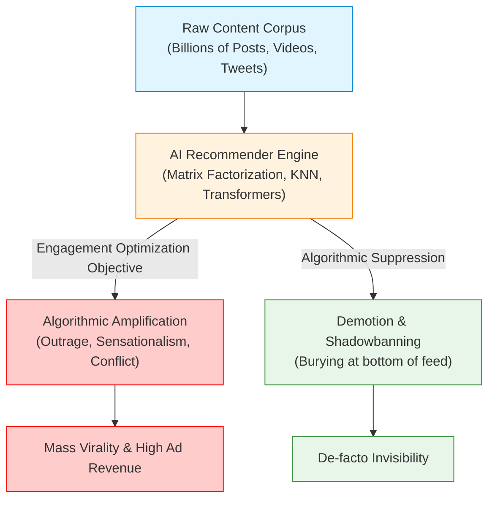
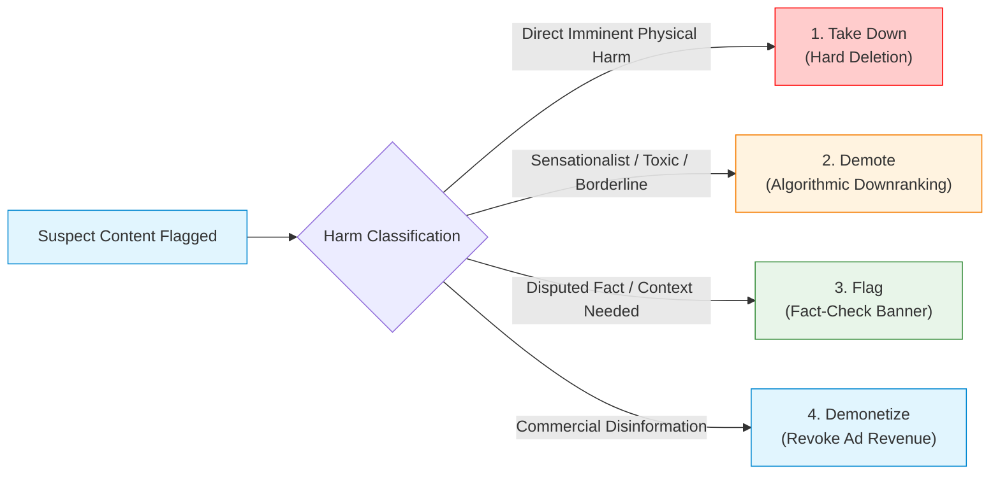
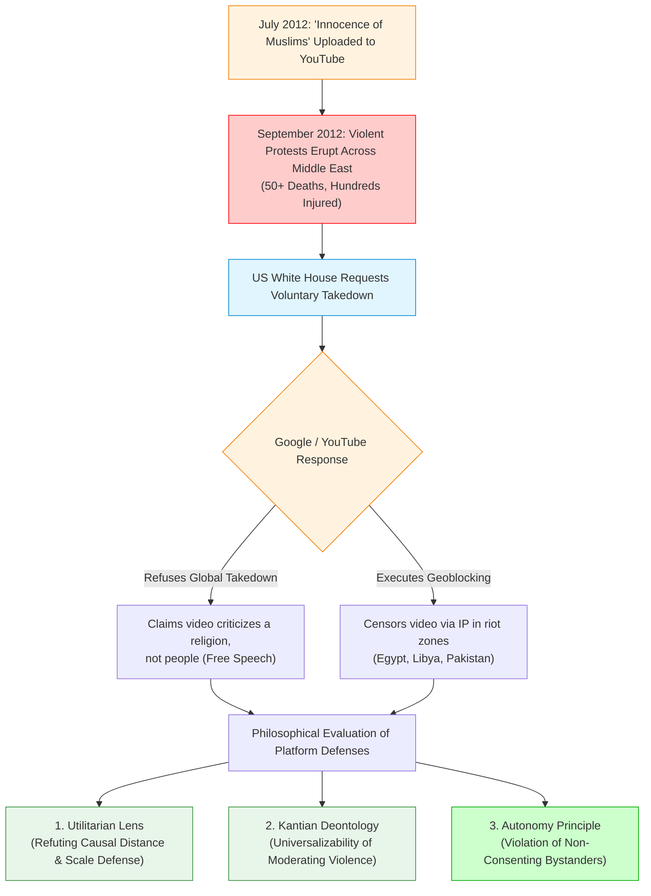

# Lecture 10: Content Moderation & AI Recommender Systems

> [!abstract] Lecture Orientation & Exam Scope
> Modern digital communication is not governed by traditional editorial publishers or neutral telecommunication pipes. It is mediated by **AI Recommender Systems** that algorithmically decide which information reaches billions of human minds. 
> 
> This lecture analyzes recommender architectures, exposes the structural **engagement maximization trap**, details the **four forms of content moderation**, and provides an exhaustive philosophical evaluation of platform responsibility using **Utilitarianism**, **Kantian Deontology**, and the **Autonomy Principle**.
> 
> **Core Case Studies**:
> 1. **Inciting Violence on YouTube (*Innocence of Muslims*, 2012 / Myanmar Rohingya)**: Platform neutrality defenses, causal distance, scale defense, and bystander autonomy.
> 2. **Social Media & Adolescent Mental Health**: The 2010–2012 smartphone/feed inflection point, algorithmic addiction, and the moral agency of children.
> 
> **Cross-Vault Connections**:
> - Draws upon [[Chapter 3 - Understanding Ethical Problems#Utilitarianism|Utilitarianism]], [[Chapter 3 - Understanding Ethical Problems#Duty Ethics|Duty Ethics]], and [[Chapter 3 - Understanding Ethical Problems#Rights Ethics|Rights Ethics]].
> - Connects to [[Chapter 5 -  Risk, Safety, and Accidents#Typology of Accidents|Systemic Accidents & Normalization of Deviance]].
> - Interlinks with algorithmic amplification in [[Lecture 9 - Types of Biases in Data-driven Technology]] and information pollution in [[Lecture 11 - Generative AI, Large Language Models & Ethics]].

---

## 1. Recommender Systems as the Chief Means of Content Moderation

A foundational premise of modern platform engineering is that **recommender systems are not separate from content moderation; they are the primary mechanism of moderation itself**.



### 1.1 The Evolution of Digital Distribution
- **Chronological Feeds (Web 1.0 / Early Web 2.0)**: Platforms displayed posts in strict reverse chronological order. The platform acted as a neutral conduit, transferring whatever users posted directly to their followers.
- **Algorithmic Curation (Modern Web)**: Due to content overload, platforms deployed machine learning models to rank, curate, and predict what content each individual user is most likely to consume.
- **The Core Architectures**:
  1. *Collaborative Filtering*: Recommending items based on similarity between user behavior patterns (user-user or item-item correlation).
  2. *Matrix Factorization (Singular Value Decomposition / SVD)*: Decomposing massive sparse user-item interaction matrices into low-dimensional latent vectors representing user tastes and item features.
  3. *K-Nearest Neighbors (KNN)*: Grouping users into clusters based on interaction metrics and serving content popular within that cluster.
  4. *Deep Neural Rankers & Transformers*: Multi-task deep networks predicting real-time probabilities of click, comment, share, and watch time.

### 1.2 The Illusion of Neutrality: Curation as Editorial Amplification
Tech platforms historically claimed immunity under legal protections (e.g., Section 230 of the US Communications Decency Act of 1996), styling themselves as "passive digital conduits" analogous to telephone companies. 

However, an algorithmic recommender system **is an active editorial engine**:
- A platform does not merely host content; it calculates a personalized probability score and actively injects specific videos or articles into billions of individual feeds.
- **Amplification is Speech**: Choosing to push an inflammatory piece of content to 10 million users via a recommendation algorithm is an active editorial choice, not passive hosting.

### 1.3 The Engagement Maximization Trap
The economic engine of modern social platforms is the **attention economy** (monetization via targeted ad impressions). The objective function of recommender algorithms is mathematically configured to maximize:
$$\text{Objective} = \arg\max_\theta \sum_{i} \left( w_{\text{click}} P(\text{click}_i) + w_{\text{watch}} \mathbb{E}[\text{watch\_time}_i] + w_{\text{share}} P(\text{share}_i) + w_{\text{comment}} P(\text{comment}_i) \right)$$

#### The Psychological Vulnerability
Human evolutionary psychology is acutely sensitive to **threats, moral indignation, tribal conflict, and shocking novelty**. Content that evokes high-arousal negative emotions (moral outrage, fear, grievance) consistently generates the highest engagement metrics:
- Users click faster.
- Users write angry comments.
- Users share with in-group peers to signal solidarity.

#### The Empirical Proof: Vosoughi et al. (*Science*, 2018)
In the largest longitudinal study of digital rumor diffusion, Soroush Vosoughi, Deb Roy, and Sinan Aral (*Science*, Vol. 359, 2018) analyzed ~126,000 rumor cascades spread on Twitter from 2006 to 2017:
- **Core Finding**: **Falsehood and lies diffused significantly farther, faster, deeper, and more broadly than the truth in all categories of information.**
- **The 6.5x Ratio**: False political news diffused **6.5 times faster** than verified factual news!
- **Mechanisms**: Falsehood possessed significantly higher novelty and emotional arousal than truth. Human users (not automated bots) were primarily responsible for spreading the false information because recommender systems placed novel falsehood at the top of their feeds.

---

## 2. The Four Forms of Content Moderation

Content moderation is not a binary switch between "leave up" and "delete." Engineering teams operate a spectrum of four primary interventions:

| # | Moderation Form | Technical Mechanism | Strategic Advantage | Critical Ethical Limitation |
| :--- | :--- | :--- | :--- | :--- |
| **1** | **Take Down (Hard Removal)** | Complete deletion of the object from platform databases and Content Delivery Networks (CDNs); URL returns HTTP 404/410. | Eliminates direct access; prevents all further distribution on that platform. | High political friction; triggers accusations of censorship; may prompt "Streisand Effect" where content migrates to unmoderated fringe platforms. |
| **2** | **Demote (Downranking / Shadowbanning)** | Artificially slashing the algorithmic rank score: $S_{\text{final}} = S_{\text{model}} \times \alpha$ (where $\alpha \in [0.01, 0.1]$); removing content from "Up Next," Explore, and Trending tabs. | Highly effective at killing virality and engagement without triggering overt censorship backlash. | **Lacks transparency and due process**. The creator and audience are rarely notified; operates as a covert corporate gatekeeper. |
| **3** | **Flag (Label / Contextualize)** | Appending persistent contextual banners, fact-check warnings, Wikipedia knowledge panels, or interstitial click-through warning screens. | Preserves free expression while tempering misinformation; informs user critical reasoning. | "Warning fatigue"; users often ignore labels; in polarized settings, warnings can backfire by reinforcing conspiracy narratives. |
| **4** | **Demonetize** | Stripping ad-network monetization, disabling creator tipping, or blocking sponsored ad placements for specific creators or keywords. | Strikes at the root financial incentive of commercial disinformation mills and hate mongers. | Does not prevent the spread of ideologically motivated actors who do not rely on ad revenue for funding. |



---

## 3. Case Study 1: Inciting Violence on YouTube (*Innocence of Muslims*, 2012)

The 2012 *Innocence of Muslims* crisis remains the foundational benchmark case for analyzing platform responsibility, corporate defenses, and moral philosophy in computational content delivery.

### 3.1 The Incident and Geopolitical Fall-out
- **The Upload**: On July 1, 2012, a 14-minute trailer for an amateur movie titled *Innocence of Muslims* was uploaded to YouTube by user "Sam Bacile" (later identified as Nakoula Basseley Nakoula).
- **The Content**: The video depicted the Prophet Muhammad as a buffoon, violent murderer, child molester, and religious fraud, using crude voice-dubbed dialogue over unrelated actors.
- **The Lethal Consequences**: In September 2012, an Arabic-translated clip was broadcast on Egyptian television. Within days, massive violent riots erupted outside US embassies and consulates across Egypt, Libya, Yemen, Tunisia, Sudan, and Pakistan. Over **50 people were killed** in riots (over 20 in Pakistan alone), and hundreds were injured.
- **Government Escalation**: United States President Barack Obama and the US State Department formally contacted Google/YouTube executive leadership, requesting that Google voluntarily take down the video from its platform to prevent further loss of life.

### 3.2 Google's Corporate Response
Google refused to execute a worldwide takedown of the video:
- **The Rationale**: Google asserted that the video complied with its Community Guidelines. Under Google's internal taxonomy, the video was categorized as criticism of the religion of Islam (which Google permitted under free expression), rather than hate speech directed against Muslim people as a protected group.
- **The Geoblocking Compromise**: Instead of a global takedown, Google executed targeted **geoblocking** (censoring access via IP geolocation) in countries experiencing active rioting (Egypt, Libya, Pakistan, Afghanistan, India, and Indonesia), while keeping the video accessible in the US, Europe, and the rest of the world. Pakistan subsequently banned YouTube nationwide for over three years because Google refused a total takedown.



---

## 4. Philosophical Evaluation of Platform Defenses

Platforms employ three standard defenses to justify non-intervention: **Causal Distance**, **The Scale Defense ("Ought Implies Can")**, and **Free Speech / The First Amendment**. We systematically evaluate each defense through the three major ethical lenses:

### 4.1 Utilitarian Analysis

#### Platform Defense A: Causal Distance
- **Platform Argument**: *"YouTube did not kill anyone. Independent third-party rioters committed criminal acts of violence. The platform is an innocent communications tool; moral culpability rests entirely on the perpetrators who pulled triggers and threw firebombs."*
- **Utilitarian Refutation**:
  1. Utilitarianism evaluates the **total net consequence** of an action or policy. 
  2. The intervention of voluntary human agents does **not break the chain of ethical causality** if the actor's conduct provided the necessary catalyst and the resulting harm was **entirely foreseeable**.
  3. By continuing to host and algorithmically recommend an incendiary video after riots had already erupted, platform executives knew with near-certainty that additional deaths would occur. In utilitarian cost-benefit terms, the negligible pleasure derived by internet users watching an amateur 14-minute video is vastly outweighed by the agonizing deaths of dozens of human beings.

#### Platform Defense B: The Scale Defense ("Ought Implies Can")
- **Platform Argument**: *"Over 500 hours of video are uploaded to YouTube every minute. It is mathematically and operationally impossible for human beings to review every video. Since we cannot police everything, ethics cannot demand that we do so ('Ought implies can')."*
- **Utilitarian Refutation**:
  1. **The Commercial Asymmetry**: Tech firms successfully engineer hyper-complex AI models when commercial revenue or legal liability is at stake. For instance, YouTube developed **Content ID**—a multi-million-dollar automated audio/video fingerprinting system that scans every uploaded second to protect Hollywood and music industry **copyright**. If a platform possesses the algorithmic capacity to protect commercial profits, claiming it lacks the capacity to protect human life is a profound moral contradiction.
  2. **Human Moderation Infrastructure**: Major tech corporations collectively employ over **100,000 human content moderators** worldwide (YouTube employs ~10,000; Meta employs ~15,000). The capacity for targeted escalation exists; invoking the "scale defense" for a video specifically highlighted by the President of the United States is intellectually dishonest.

#### Platform Defense C: The First Amendment Defense
- **Platform Argument**: *"Taking down the video violates the fundamental human right to free speech protected by the First Amendment."*
- **Utilitarian Refutation**:
  1. The First Amendment of the US Constitution restricts **state action** (the US government cannot criminalize speech). It does **not apply to private commercial corporations**. Private platforms have no legal or constitutional obligation to host any speech.
  2. Utilitarian free speech principles (derived from John Stuart Mill’s *On Liberty*) defend free discourse because it allows truth to challenge error. However, Mill explicitly articulated the **Harm Principle**: speech that constitutes direct, imminent incitement to violence (e.g., shouting inflammatory accusations to an agitated mob outside a corn dealer's house) loses all ethical protection.

---

### 4.2 Kantian Deontology and the Generalization Principle
Under Immanuel Kant’s **Categorical Imperative** (The Universal Law formulation), an action is morally permissible if and only if its underlying maxim can be universalized without creating a contradiction in conception or will.

#### Testing Candidate Maxims:
1. **Maxim 1: "A platform may host falsehoods and offensive material to maximize profits."**
   - *Universalization Test*: Can a society exist where platforms host false or offensive claims? Yes. Modern commercial digital platforms exist and generate billions of dollars despite containing widespread falsehoods. Users understand that platforms host unverified claims; hosting does not imply platform endorsement. Therefore, hosting unverified speech does not create a self-defeating contradiction.
2. **Maxim 2: "A platform should censor all untruth and offensive material."**
   - *Universalization Test*: If every platform censored everything deemed "untrue" or "offensive," who determines truth? Universalizing total private censorship requires an authoritarian apparatus that destroys open philosophical, scientific, and political inquiry. This destroys the foundational search for truth, creating a practical contradiction.
3. **Maxim 3: "A platform must remove content that directly incites imminent lethal violence."**
   - *Universalization Test*: Universalizing the removal of speech that provokes imminent physical bloodshed **is fully coherent and generalizable**. A world where platforms universally suppress direct incitement to violence prevents loss of life without suppressing open philosophical or political critique. Therefore, removing violence-inciting videos is a strict deontological duty.

---

### 4.3 The Autonomy Principle (The Decisive Lens)
The **Autonomy Principle** represents the most rigorous and demanding ethical standard for computational systems:

> [!important] The Autonomy Principle Formalized
> An action is ethical if and only if the moral agent can rationally believe that their action plan does not subject other rational persons to risks or harms to which they **have not consented**.
> 
> *Key Formula*: You must never use human beings merely as a means to corporate profit, but always respect them as autonomous ends in themselves.

#### The Implied Consent Analysis:
1. **The Violent Rioters**: Individuals who chose to assemble, manufacture firebombs, and attack embassies voluntarily entered the zone of conflict. Under ethical theory, they gave **implied consent** to the inherent risks of violence.
2. **The Innocent Bystanders**: What about the police officers on duty, the street vendors, the medical personnel, and the children living in neighborhoods engulfed by riots?
   - These individuals never watched the YouTube video.
   - They had no connection to the upload.
   - **They gave zero implied or express consent to being caught in lethal mob violence.**
3. **The Conclusion**: By continuing to amplify and distribute an incendiary video that foreseeably triggered lethal riots, platform executives **violated the autonomy of innocent bystanders**. They sacrificed the lives of non-consenting humans as collateral damage to preserve platform operational convenience and advertising revenue.

---

## 5. Case Study 2: Social Media & Adolescent Mental Health

The intersection of algorithmic recommender systems and adolescent psychological health represents one of the most critical public health challenges of the computational era.

```
Adolescent Mental Health Trends (Post-2010 Inflection)
Relative Surge in Depression / Non-Fatal Self-Harm (Ages 10–19):
Pre-2010 (Chronological Feeds):   [████] Baseline
Post-2012 (Algorithmic Feeds):    [████████████████████████████████] +150% Surge
```

### 5.1 The Empirical Inflection Point (2010–2012)
Longitudinal epidemiological data compiled by public health agencies across North America and the UK revealed an alarming phenomenon:
- Between 1995 and 2009, rates of adolescent depression, generalized anxiety disorder, and emergency room visits for non-fatal self-harm were relatively stable or declining.
- Commencing sharply around **2010–2012**, hospital admissions for adolescent self-harm (especially among girls aged 10–19) skyrocketed by over **150%**, with parallel surges in suicide rates.
- **The Technological Correlation**: The 2010–2012 window marked the global transition to:
  1. Ubiquitous teen smartphone ownership.
  2. The algorithmic re-engineering of social media feeds from chronological sorting to engagement-maximizing machine learning models.
  3. The introduction of the "Like" button, algorithmic push notifications, and facial distortion beauty filters.

### 5.2 Competing Factual Interpretations
Engineers and platform representatives propose three alternative hypotheses to explain the data:
1. **Reverse Causality**: Depressed, socially isolated adolescents seek out digital screens as a coping mechanism; the algorithm does not cause depression, but merely attracts already depressed users.
2. **Diagnostic De-Stigmatization**: Society has become more accepting of mental health challenges; the surge reflects increased diagnostic reporting and hospital visits rather than an actual increase in psychological suffering.
3. **Macroeconomic Confounders**: Lingering fallout from the 2008 global financial crisis or intensifying academic and economic competition.

### 5.3 Ethical & Autonomy Analysis Regarding Children

#### 1. The Right of Access vs. Platform Discretion
- Users possess **no inherent moral or constitutional right to access a private digital service**.
- Platforms have complete moral authority to restrict access, implement age gating, or shut down accounts without violating user autonomy.

#### 2. Are Children Autonomous Agents?
- In moral philosophy (Kant, Gert), **rational autonomy requires the cognitive capacity to understand long-term consequences and formulate coherent rational life plans**.
- Young children and adolescents possess developing prefrontal cortexes; their capacities for impulse control, risk perception, and emotional regulation are biologically immature.
- Therefore, parental and institutional **paternalism** (restricting a child’s freedom to protect them from self-harm) does not violate autonomy.

#### 3. Children as Inviolable Moral Agents
- Crucially: **A lack of fully developed rational autonomy does NOT diminish an individual’s moral status as a human subject.**
- Children are moral patients who possess absolute rights against being harmed, exploited, or manipulated.
- Causing psychological injury to a child violates both Utilitarianism (inflicting severe net suffering) and Rights Ethics.

#### 4. The Impossibility of Valid Informed Consent
- Can a 13-year-old give **valid informed consent** to an algorithmic feed engineered by teams of behavioral psychologists and machine learning PhDs?
- **NO.** The platform utilizes **variable-ratio reward schedules** (the identical psychological mechanism of Las Vegas slot machines), infinite scroll interfaces, and beauty-filtering algorithms designed to induce compulsive engagement.
- Because a minor cannot comprehend the neurological manipulation to which they are subjected, they cannot consent. Profiting from behavioral addiction engineered upon non-consenting minors is a severe ethical violation.

---

## 6. Summary & Comprehensive Review Questions

> [!faq]- 📝 Exam Quick-Reference: Key Concepts of Lecture 10
> 1. **Recommenders as Curators**: Algorithmic ranking is an active editorial choice. Engagement optimization prioritizes moral outrage, conflict, and sensationalism.
> 2. **Vosoughi et al. (Science 2018)**: Falsehood spreads **6.5x faster** than truth on social media due to higher novelty and emotional arousal.
> 3. **Four Moderation Forms**: Take Down (complete removal), Demote (shadowbanning/downranking), Flag (contextual labeling), Demonetize (revoking revenue).
> 4. **Innocence of Muslims Case**: 50+ deaths; Google refused global takedown, citing policy against religious criticism; geoblocked in riot zones.
> 5. **Ethical Lenses on Platform Defenses**:
>    - *Utilitarianism*: Refutes causal distance (intervening actors don't break foreseeable harm chain) and scale defense (Content ID proves capacity exists).
>    - *Kantian Deontology*: Universalizing removal of direct incitement to violence is fully generalizable.
>    - *Autonomy Principle*: Violated because innocent bystanders killed in riots never gave implied consent.
> 6. **Adolescent Mental Health**: 2010–2012 smartphone/feed inflection point; children cannot give valid informed consent to addictive algorithmic dopamine loops.

---

> [!example]- Question 1: Deconstruct Platform Causal Distance & Bystander Autonomy [10 Marks]
> **Scenario**: An AI-driven micro-blogging network deploys a collaborative filtering engine that maximizes comment volume. During a tense national election, the model identifies that user posts claiming "The opposition party poisoned municipal water supplies" generate a 400% surge in engagement. The algorithm aggressively injects these unverified claims into local user feeds. A mob forms and lynches two municipal water engineers.
> 
> The platform's legal counsel asserts:
> *"The platform is immune. We did not write the posts, nor did we participate in the mob. The platform is merely a neutral communications conduit protected by causal distance."*
> 
> **Task**:
> (a) Refute the "causal distance" defense using Utilitarian ethics. [5 marks]  
> (b) Apply the Autonomy Principle to evaluate the platform’s liability regarding the murdered municipal engineers. [5 marks]
> 
> **Model Answer**:
> *(a) Utilitarian Refutation of Causal Distance*:
> In Utilitarianism, moral accountability is evaluated based on the foreseeable net consequences of an agent's policy. The presence of intervening human actors (the violent mob) does not break ethical causality if the platform's action served as the active catalyst and the lethal outcome was foreseeable. 
> The platform was not a "neutral conduit." A neutral conduit delivers data chronologically. The platform’s recommender algorithm actively calculated that outrage generated higher ad impressions, chose to prioritize unverified poison allegations, and injected them into local feeds. The modest commercial utility of ad revenue is vastly outweighed by the catastrophic disutility of two human deaths and societal terror. The platform is morally culpable.
> 
> *(b) Autonomy Analysis of Municipal Engineers*:
> The Autonomy Principle dictates that an action is unethical if it subjects individuals to an action plan to which they have not or cannot rationally consent. 
> The murdered municipal engineers never interacted with the platform, never consented to having their lives endangered for corporate engagement metrics, and were performing their lawful civil duties. By prioritizing engagement algorithms that foreseeably catalyzed mob violence, the platform treated the water engineers merely as disposable means to corporate profit, directly violating their inviolable moral autonomy.

> [!example]- Question 2: The Four Forms of Moderation in Virality Control [8 Marks]
> **Prompt**: Contrast the tactical and ethical trade-offs of **Demoting (Downranking)** versus **Taking Down (Hard Removal)** when managing a rapidly spreading video promoting a fraudulent cancer cure.
> 
> **Model Answer**:
> 1. **Take Down (Hard Removal)**:
>    - *Technical Action*: Deleting the video from servers and CDNs.
>    - *Advantage*: Completely cuts off access, immediately halting lethal medical misinformation for patients contemplating abandoning chemotherapy.
>    - *Limitation*: Can trigger accusations of authoritarian censorship and prompt the "Streisand Effect," driving users to upload copies to alternative fringe networks.
> 2. **Demote (Downranking / Algorithmic Suppression)**:
>    - *Technical Action*: Reducing the video's recommendation coefficient to zero; stripping it from search auto-complete and recommendations, so only direct URL holders can view it.
>    - *Advantage*: Destroys viral spread and stops algorithmic amplification without creating high-profile censorship controversies.
>    - *Ethical Limitation*: Lacks transparency and procedural due process. The creator is not informed why their distribution collapsed, and patients already holding the direct link remain exposed to life-threatening medical fraud.
> 3. **Ethical Recommendation**: Because the video causes irreversible physical bodily harm (death from untreated cancer), **Take Down** is morally obligatory under the paramountcy of human life.
