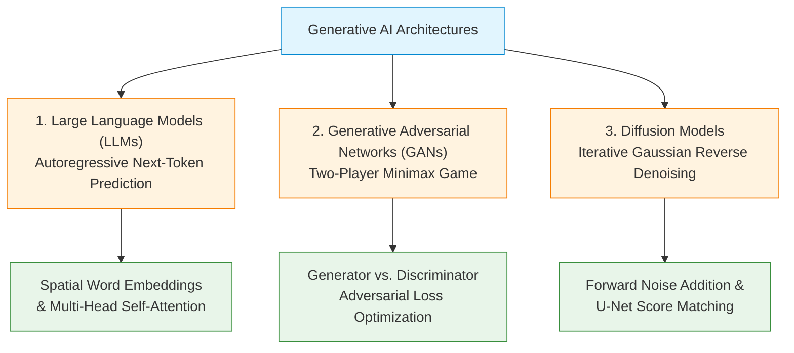
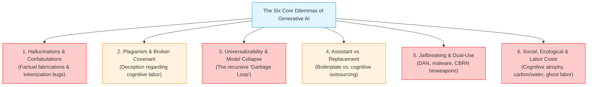
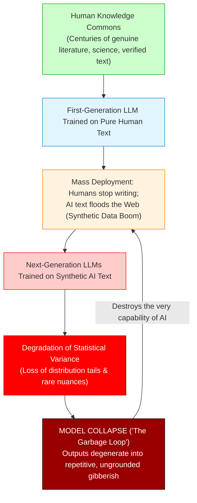
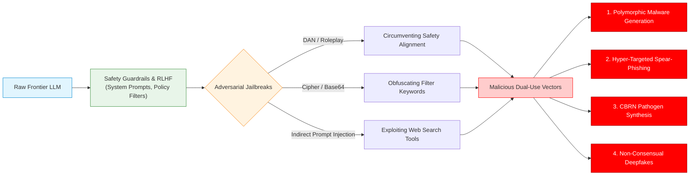

# Lecture 11: Generative AI, Large Language Models & Ethics

> [!abstract] Lecture Orientation & Exam Scope
> The emergence of Generative Artificial Intelligence (GenAI)—encompassing Large Language Models (LLMs), Generative Adversarial Networks (GANs), and Diffusion Models—marks a profound paradigm shift in computer science. Computing has migrated from deterministic calculation and analytical classification to the **autonomous synthesis of human-like language, imagery, code, and voice**.
> 
> This lecture deconstructs the foundational architectures of GenAI, exposes the epistemological reality that **ChatGPT is not an intelligent entity but an ungrounded statistical synthesizer**, and systematically investigates **The Six Core Ethical Dilemmas** confronting software engineers.
> 
> **Key Exam Anchors**:
> 1. Foundational Architectures: Transformers, Next-Token Prediction, Word Embeddings, GANs minimax game, Diffusion reverse-denoising.
> 2. The Two Immutable Realities: (a) They do not know what they are talking about; (b) They parrot what has already been said.
> 3. **The Six Dilemmas**:
>    - Dilemma 1: Hallucinations / Confabulations (Strawberry counter, Pizza glue, Prof. John Hooker fabricated CV, legal risks).
>    - Dilemma 2: Plagiarism & the Broken Promise of Authorship.
>    - Dilemma 3: Kantian Universalizability & **Model Collapse ("The Garbage Loop")**.
>    - Dilemma 4: The Assistant vs. Replacement Paradigm.
>    - Dilemma 5: Jailbreaking & Malicious Dual-Use (DAN, cyberweapons, CBRN).
>    - Dilemma 6: Societal, Ecological & Labor Externalities (Cognitive atrophy, gigawatt energy/water consumption, Kenyan RLHF ghost labor).
> 
> **Cross-Vault Connections**:
> - Grounded in Kantian Ethics from [[Chapter 3 - Understanding Ethical Problems#Duty Ethics|Duty Ethics & Categorical Imperatives]].
> - Connects to [[Lecture 9 - Types of Biases in Data-driven Technology#Taxonomies of Bias|Automation Bias & Human-Machine Traps]].
> - Previews intellectual property disputes in [[Lecture 12 - Patents and Intellectual Property in Computing]].

---

## 1. Foundational Architectures of Generative AI

Understanding the ethical risks of Generative AI requires engineers to understand its underlying computational mechanics.



### 1.1 Large Language Models (LLMs) & Transformers
- **The Core Objective**: Autoregressive next-token prediction. Given a sequence of preceding tokens $(w_1, w_2, \dots, w_{t-1})$, the model maximizes the conditional probability distribution:
  $$P(w_t \mid w_1, w_2, \dots, w_{t-1}) = \text{Softmax}\left( \frac{QK^T}{\sqrt{d_k}} \right) V$$
- **Spatial Word Embeddings**:
  - Words and sub-word tokens are mapped to dense numerical vectors in a continuous, high-dimensional vector space ($\mathbb{R}^d$, where $d \in [768, 12288]$).
  - Spatial proximity and angular alignment (measured via cosine similarity: $\cos(\theta) = \frac{\mathbf{u} \cdot \mathbf{v}}{\|\mathbf{u}\| \|\mathbf{v}\|}$) encode semantic and syntactic relationships. Famous vector arithmetic emerges naturally:
    $$\vec{v}_{\text{King}} - \vec{v}_{\text{Man}} + \vec{v}_{\text{Woman}} \approx \vec{v}_{\text{Queen}}$$
  - Dimensionality reduction techniques (such as Singular Value Decomposition / SVD or Principal Component Analysis / PCA) compress millions of co-occurrence statistical patterns into dense latent dimensions.
- **Transformers & Attention**: The Transformer architecture (Vaswani et al., 2017) eliminated the sequential bottlenecks of Recurrent Neural Networks (RNNs) using **multi-head self-attention**, allowing every token to dynamically attend to every other token across massive context windows.
- **Scale**: Frontier models (GPT-4, Claude 3.5 Sonnet, Gemini 1.5 Pro, Llama 3) contain hundreds of billions to trillions of parameters trained on petabytes of scraped internet text.

### 1.2 Generative Adversarial Networks (GANs)
Introduced by Ian Goodfellow et al. (2014), GANs frame generative modeling as a **two-player zero-sum minimax game**:
$$\min_G \max_D V(D, G) = \mathbb{E}_{x \sim p_{\text{data}}}[\log D(x)] + \mathbb{E}_{z \sim p_z}[\log(1 - D(G(z)))]$$
1. **The Generator ($G$)**: Takes random latent noise $z \sim p_z$ and attempts to generate synthetic data samples $G(z)$ (e.g., photorealistic human faces).
2. **The Discriminator ($D$)**: Evaluates samples and outputs the probability $D(x) \in [0, 1]$ that $x$ came from the true empirical dataset rather than the Generator.
3. As training progresses, the Generator learns the underlying data distribution, producing synthetic outputs that become indistinguishable from reality.

### 1.3 Diffusion Models
Dominating modern text-to-image synthesis (Stable Diffusion, Midjourney, DALL-E 3):
- **Forward Process**: Gradually destroys the structure of an image by iteratively adding Gaussian noise across $T$ timesteps until it becomes pure isotropic noise.
- **Reverse Process**: A neural network (typically a U-Net with cross-attention) is trained to predict and subtract the added noise at each step, progressively reconstructing high-fidelity synthetic images conditioned on text embeddings.

---

## 2. Epistemological Reality: "ChatGPT is Not a Chatbot"

A dangerous engineering failure is the anthropomorphic illusion that modern LLMs possess understanding, intent, or knowledge.

```
       Chatbot vs. Generative Pre-trained Transformer
+---------------------------------+  +---------------------------------+
|     ELIZA (Weizenbaum, 1966)    |  |     ChatGPT / Modern LLM        |
+---------------------------------+  +---------------------------------+
| • Rule-based scripts            |  | • Multi-billion parameter neural|
| • Pattern-matching regex        |  | • Autoregressive token sampler  |
| • Deterministic branching       |  | • High-dimensional statistics   |
| • Simulates a psychotherapist   |  | • Parrots web-scraped corpora   |
+---------------------------------+  +---------------------------------+
```

### 2.1 The Historical Chatbot vs. The Transformer
- **Historical Chatbots (e.g., ELIZA, Weizenbaum 1966)**: Used rigid, deterministic rule-based scripts and keyword-swapping pattern matchers. If a user typed *"I feel sad,"* ELIZA transformed the string into *"Why do you feel sad?"* ELIZA had no internal state or generative capability.
- **ChatGPT**: A **Generative Pre-trained Transformer**. It does not execute conversational flowcharts. It executes non-deterministic statistical sampling over token probability distributions.

### 2.2 The Two Immutable Realities of LLMs
In his CMU lectures, Prof. John Hooker articulates the two foundational, immutable constraints of Large Language Models:

> [!danger] The Two Immutable Realities of Large Language Models
> 1. **They do not know what they are talking about**:
>    LLMs operate entirely in the realm of **syntax**, completely detached from **semantics** and real-world reference. They possess no world model, no physical embodiment, no belief state, and no comprehension of truth versus falsehood. A sentence generated by an LLM asserting that *"gravity accelerates objects at $9.8 \, \text{m/s}^2$"* is produced via the exact same statistical token-transition mechanism as a sentence asserting that *"unicorns graze on the rings of Saturn."*
> 
> 2. **They parrot what has already been said**:
>    LLMs are complex statistical mirrors reflecting the collective text scraped from the internet. They interpolate, extrapolate, blend, and paraphrase pre-existing human thought. They do not originate novel truths, conduct scientific experiments, or exercise moral judgment; they merely recombine what humans have already written.

---

## 3. The Six Core Ethical Dilemmas of Generative AI



---

### 3.1 Dilemma 1: Hallucinations / Confabulations
Because LLMs optimize for syntactic plausibility rather than empirical truth, they frequently generate outputs that appear authoritative, grammatically flawless, and scholarly, yet are **factually completely fabricated**.

#### Technical Root Causes:
1. **Sub-Word Tokenization Artifacts**:
   - *The Strawberry Problem*: When asked *"How many 'r's are in the word strawberry?"*, frontier LLMs notoriously answered *"Two."* 
   - *Explanation*: LLMs do not "see" individual letters; they process discrete sub-word tokens. The word "strawberry" is tokenized into chunks (e.g., `straw` + `berry`). The model's embedding representations obscure internal character counts, causing the model to confabulate an answer.
2. **Scraping Satire and Irony as Ground Truth**:
   - *The Pizza Glue Disaster*: Google AI Overviews famously advised users to *"mix 1/8 cup of non-toxic Elmer's glue into tomato sauce to keep cheese from sliding off pizza."* 
   - *Explanation*: The underlying model scraped an 11-year-old satirical Reddit post from user `Fucksmith` and served it as verified culinary advice.
3. **The Fabricated CV of Prof. John Hooker (CMU)**:
   - When asked to compile an academic biography of Carnegie Mellon University Professor John Hooker, ChatGPT generated a prestigious, detailed curriculum vitae.
   - However, ChatGPT **fabricated non-existent book titles** (inventing *"Constraint Programming and Decision-Making in Business Applications"*), non-existent journal articles, fabricated administrative chairs, and false co-authors.

#### Catastrophic High-Stakes Risks:
- **Legal Malpractice (*Mata v. Avianca*, 2023)**: Attorneys Steven Schwartz and Peter LoDuca submitted a federal court brief containing six detailed judicial case precedents (complete with citations and judicial quotes, such as *Varghese v. China Southern Airlines*). Every single cited precedent was completely hallucinated by ChatGPT. The attorneys were sanctioned by a federal judge, facing international professional humiliation.
- **Medical Triage & Pharmacology**: Deploying generative LLMs to answer clinical patient queries has resulted in models inventing fatal drug interactions or recommending toxic chemotherapy dosages.

---

### 3.2 Dilemma 2: Plagiarism & the Broken Promise of Authorship
The widespread adoption of generative AI in academia, journalism, and software engineering threatens the foundational social contract of human intellectual production.

#### The Implied Covenant of Authorship:
When an author submits an essay, research paper, or software architecture document under their name, they make an **implicit moral promise** to the reader:
1. *Cognitive Labor*: The author personally expended the cognitive effort to read, analyze, synthesize, and structure the arguments.
2. *Good-Faith Pursuit of Truth*: The author verified the factual claims and exercised intellectual honesty.
3. *Endorsement & Comprehension*: The author understands what is written and personally endorses the thesis.

#### The Ethical Violation of AI Ghostwriting:
When a student or engineer prompts an LLM to generate text or code and submits it as their own work:
- They break this implied covenant.
- It is an act of **deception**: they extract academic credit, grades, or commercial salary for cognitive work they never performed.
- Under **Kantian Duty Ethics**, submitting AI-generated work as original scholarship treats the evaluator merely as a means to an unearned grade or credential, violating the principle of honesty.

---

### 3.3 Dilemma 3: Kantian Universalizability & Model Collapse ("The Garbage Loop")

What happens if everyone uses Generative AI? We apply Immanuel Kant's **Universal Law Formulation**: *"Act only according to that maxim whereby you can at the same time will that it should become a universal law."*



#### The Information Commons & The Free-Rider Problem
- Generative AI produces coherent text only because human writers, scientists, poets, and journalists spent millennia producing original, grounded thought and publishing it to the open web.
- AI firms and users act as **free-riders** on this shared cultural commons, harvesting human intellectual work without contributing original cognitive labor back into the ecosystem.

#### The Scientific Mechanics of Model Collapse:
In a seminal paper published in *Nature* (Shumailov et al., 2024), researchers proved the mathematical inevitability of **Model Collapse**:
1. When an LLM generates text, it samples from the central high-probability mass of its probability distribution. It rarely samples from the low-probability "tails" (rare words, nuanced philosophical arguments, unusual edge-case code).
2. If human writers stop writing and the web becomes saturated with AI-generated synthetic text, future generations of models ($M_{t+1}, M_{t+2}$) are inevitably trained on the synthetic outputs of prior models ($M_t$).
3. **The Collapse**: With each recursive training loop, the variance of the data distribution shrinks. The tails disappear entirely. Errors, hallucinations, and grammatical artifacts compound exponentially.
4. **The "Garbage Loop" Result**: The recursive ingestion of synthetic data triggers irreversible perceptual collapse, causing model outputs to degrade into repetitive, degenerate gibberish.

> [!important] Kantian Universalization Test: Model Collapse
> - **The Maxim**: *"I may use generative AI to write all my code and essays to save time and effort."*
> - **Universalization**: If every human adopts this maxim, original human writing ceases. The internet fills with synthetic text. Future AI models suffer catastrophic Model Collapse and cease to function.
> - **Contradiction in Will**: The maxim relies on the existence of a high-functioning AI trained on human text; but universalizing the maxim destroys the human text required for high-functioning AI to exist. Therefore, the maxim is **strictly self-defeating and ethically impermissible**.

---

### 3.4 Dilemma 4: The Assistant vs. Replacement Paradigm

Software engineering ethics does not demand a Luddite rejection of generative AI; rather, it demands establishing a strict boundary between **permissible assistance** and **impermissible cognitive replacement**.

| Dimension | Permissible: The Assistant Paradigm | Impermissible: The Replacement Paradigm |
| :--- | :--- | :--- |
| **Operational Role** | Tool used for ideation, syntax translation, and non-substantive boilerplate generation. | Cognitive outsourcing of critical reasoning, architectural judgment, or ethical evaluation. |
| **Human Agency** | The human engineer exercises active oversight, deeply understands every line of code, and refactors aggressively. | The human passively accepts AI code without understanding it ("Copy-Paste-Deploy"). |
| **Epistemic Duty** | **Mandatory Independent Factual Verification**: The engineer independently verifies every citation, regex boundary, and security invariant. | Blind reliance on model plausibility; accepting hallucinations as truth. |
| **Authorship Covenant** | The final architecture and core logic represent the genuine intellectual contribution of the human author. | Misrepresenting automated synthetic text as original human scholarship or engineering analysis. |

---

### 3.5 Dilemma 5: Jailbreaking & Malicious Dual-Use

Large language models represent quintessential **dual-use technology**: tools engineered for benevolent assistance that can be weaponized with catastrophic efficiency.



#### Jailbreaking Techniques:
Developers implement safety guardrails via **Reinforcement Learning from Human Feedback (RLHF)** and system prompts to prevent models from generating dangerous content. Malicious actors bypass these filters through **jailbreaking**:
1. **DAN ("Do Anything Now") Prompts**: Forcing the model into a hypothetical roleplay scenario where it pretends to be an unconstrained AI operating outside all ethical guidelines.
2. **Adversarial Suffixes & Gradient Optimization**: Appending specialized, nonsensical token sequences discovered via gradient search that disrupt the model's safety activation layers.
3. **Indirect Prompt Injection**: Embedding hidden text instructions inside web pages or documents (e.g., in white text on a white background) that hijack an AI assistant during automated web browsing.

#### Threat Vectors of Malicious Dual-Use:
1. **Automated Cyberweapons**: Generating polymorphic malware that dynamically alters its binary signatures to evade anti-virus detection, or synthesizing automated zero-day exploit payloads.
2. **Hyper-Personalized Social Engineering**: Ingesting target executive emails to generate flawless, context-aware spear-phishing messages at industrial scale.
3. **CBRN Weapons (Chemical, Biological, Radiological, Nuclear)**: Providing actionable, step-by-step laboratory synthesis protocols for weaponized biological pathogens (e.g., enhanced smallpox or ricin), overcoming the knowledge barrier that previously restricted bioterrorism.
4. **Non-Consensual Deepfakes**: Weaponizing generative diffusion models to synthesize non-consensual sexually explicit imagery or political election-disinformation audio.

---

### 3.6 Dilemma 6: Societal, Ecological & Labor Externalities

Behind the sleek interface of modern generative AI lies a vast apparatus of human and environmental exploitation.

#### 1. Cognitive Atrophy & Intellectual Deskilling (Utilitarian Harm)
- In education and software engineering, writing is not merely a method of transcribing thoughts; **writing is the cognitive process of thinking itself**.
- Structuring an argument, debugging an algorithm, and resolving conceptual ambiguities builds neural pathways and critical reasoning capabilities.
- Widespread reliance on generative tools atrophies human analytical literacy, creating a generation of developers who can prompt an AI but cannot evaluate, verify, or debug the resulting architecture when it fails.

#### 2. Severe Environmental & Ecological Costs
- **Energy Footprint**: Training a frontier foundation model consumes tens of gigawatt-hours of electricity, generating hundreds of tons of carbon dioxide. A single ChatGPT query consumes up to **10 times more electricity** than a traditional Google search.
- **Potable Water Consumption**: Data center server clusters require millions of gallons of fresh water for evaporative cooling towers. Hyperscale AI data centers placed in drought-stricken regions deplete municipal potable water supplies, exacerbating environmental racism.

#### 3. Ghost Work & Labor Exploitation in the Global South
- **The RLHF Reality**: To prevent models from spewing overt racism, child exploitation, and gore, AI corporations require human annotators to review, classify, and label millions of toxic text fragments.
- **Sama in Kenya (2022 Investigation)**: An investigation by *TIME Magazine* revealed that OpenAI contracted with Sama, a San Francisco outsourcing firm, employing data workers in Nairobi, Kenya:
  - Workers were paid between **$1.32 and $2.00 per hour** to review graphic descriptions of sexual abuse, incest, bestiality, suicide, and torture.
  - Workers reported severe long-term psychological trauma, recurring nightmares, and depression, with negligible mental health counseling provided.
  - Silicon Valley tech giants externalized the psychological trauma of safety alignment onto low-wage workers in the Global South.

---

## 4. Summary & Comprehensive Review Questions

> [!faq]- 📝 Exam Quick-Reference: Key Concepts of Lecture 11
> 1. **Architectures**: LLMs use next-token prediction and spatial embeddings; GANs play a minimax game; Diffusion performs reverse denoising.
> 2. **Epistemic Truth**: ChatGPT is not a chatbot; it has no world model and simply parrots web statistics without semantic comprehension.
> 3. **The Six Dilemmas**:
>    - *Hallucinations*: Plausible fabrication caused by tokenization and statistical sampling (Strawberry counter, Pizza glue, Hooker CV, *Mata v. Avianca*).
>    - *Authorship*: AI submission breaks the implied covenant of cognitive effort and honesty.
>    - *Model Collapse*: Kantian universalizability failure; training models on synthetic AI text causes variance decay and the "Garbage Loop."
>    - *Assistant vs. Replacement*: Permissible for verified boilerplate; impermissible for cognitive outsourcing of judgment.
>    - *Jailbreaking*: DAN prompts and adversarial evasion enabling cyberweapons, CBRN synthesis, and deepfakes.
>    - *Externalities*: Cognitive deskilling, gigawatt energy/water consumption, and Kenyan RLHF annotator trauma (<$2/hr).

---

> [!example]- Question 1: Kantian Universalization and Model Collapse [10 Marks]
> **Scenario**: A major software enterprise instructs all junior developers to stop writing manual unit tests and documentation, mandating the use of generative AI coding assistants to maximize sprint velocity. Within two years, the enterprise code repository is composed of 85% AI-generated synthetic code.
> 
> **Task**:
> (a) Formulate the developer's maxim and apply Kant's Universal Law formulation to evaluate the ethical permissibility of completely outsourcing code generation to LLMs. [5 marks]  
> (b) Explain the technical phenomenon of **Model Collapse ("The Garbage Loop")** and explain how it manifests as the practical contradiction in Kantian deontology. [5 marks]
> 
> **Model Answer**:
> *(a) Kantian Universalization Analysis*:
> - *The Maxim*: "An engineer may outsource the writing of code and unit tests entirely to generative AI models in order to maximize speed and eliminate cognitive labor."
> - *Universalization Test*: Imagine a world where all software engineers and computer science students universalize this maxim. Human programmers stop writing code from scratch and cease learning foundational syntax and logic. All open-source repositories (GitHub, GitLab) fill with synthetic AI-generated code.
> - *Contradiction in Conception / Will*: Generative AI coding assistants function effectively only because they were trained on millions of repositories of human-authored, human-debugged code. If all engineers stop writing original code, the source of high-quality training data vanishes, triggering Model Collapse. The maxim relies on high-functioning AI, but universalizing the maxim destroys the very conditions required for AI to function. Therefore, the maxim is self-contradictory and morally impermissible.
> 
> *(b) Model Collapse and the Practical Contradiction*:
> Model Collapse (Shumailov et al., *Nature*, 2024) occurs when recursive machine learning models are trained on the synthetic outputs of earlier models. Because models sample primarily from high-probability clusters, low-probability tail distributions (rare architectural patterns, complex security edge cases) are unrepresented and vanish. Over iterative generations ($M_1 \rightarrow M_2 \rightarrow M_3$), errors compound exponentially, statistical variance collapses, and the code generator outputs non-functional, vulnerable, or degenerate code. In Kantian terms, this is the empirical manifestation of the practical contradiction: using the tool universally destroys the utility of the tool itself.

> [!example]- Question 2: Deconstructing the Assistant vs. Replacement Boundary [8 Marks]
> **Prompt**: A junior cybersecurity analyst uses an LLM to draft an incident response report regarding a critical zero-day data breach. The analyst prompts the model with raw server logs, allows the model to summarize the attack vector and prescribe mitigation steps, pastes the output directly into a client report, and signs their name.
> 
> Critically evaluate the analyst’s conduct using:
> (1) The Implied Covenant of Authorship, and  
> (2) The Assistant vs. Replacement Paradigm.
> 
> **Model Answer**:
> 1. **Violation of the Implied Covenant of Authorship**:
>    Signing one's name to an engineering security report constitutes an implicit moral pledge that the analyst personally examined the telemetry, verified the forensic attack chain, understands the vulnerability, and endorses the remediation strategy. By copying and pasting LLM output without verification, the analyst committed professional deception. If the LLM hallucinated an incorrect attack vector (e.g., misidentifying a SQL injection as a DDoS attack), the client's infrastructure remains exposed to ongoing intrusion.
> 2. **Evaluation under Assistant vs. Replacement Paradigm**:
>    - *Impermissible Replacement*: The analyst engaged in total cognitive outsourcing of critical security analysis. Incident triage requires rigorous domain judgment, forensic causality, and liability evaluation—tasks that cannot be delegated to an ungrounded statistical synthesizer.
>    - *How to Use as a Permissible Assistant*: The analyst could have legitimately used the LLM to write a Python regex script to parse log timestamps, or summarize public CVE vulnerability documentation. However, the analyst was ethically required to:
>      - Manually verify the log correlations against ground-truth firewall metrics.
>      - Personally formulate and test the mitigation patch.
>      - Disclose the use of automated tools in accordance with organizational compliance.
