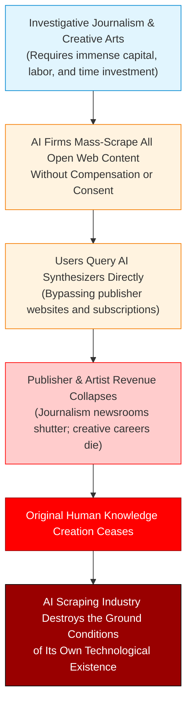
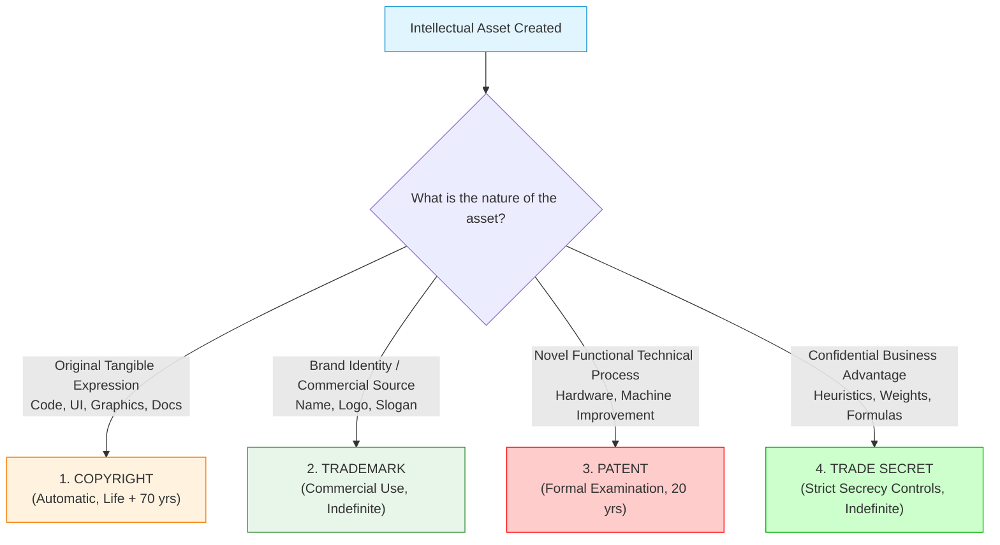
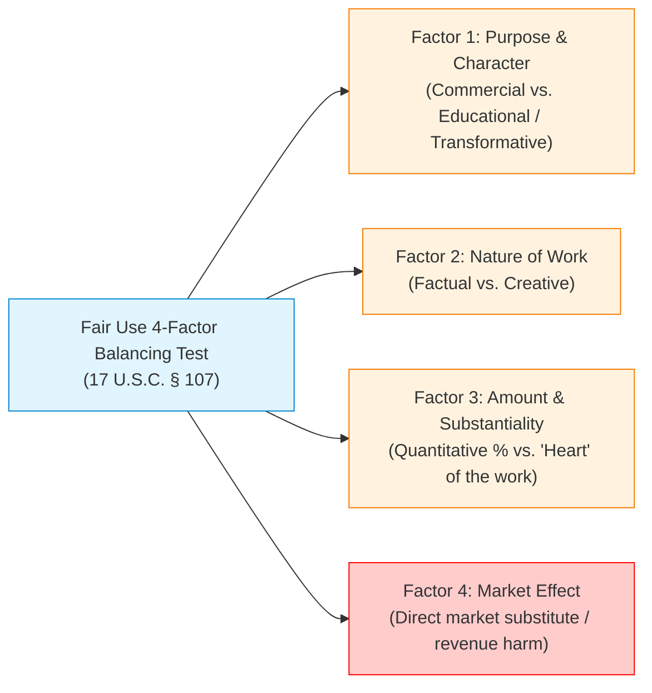
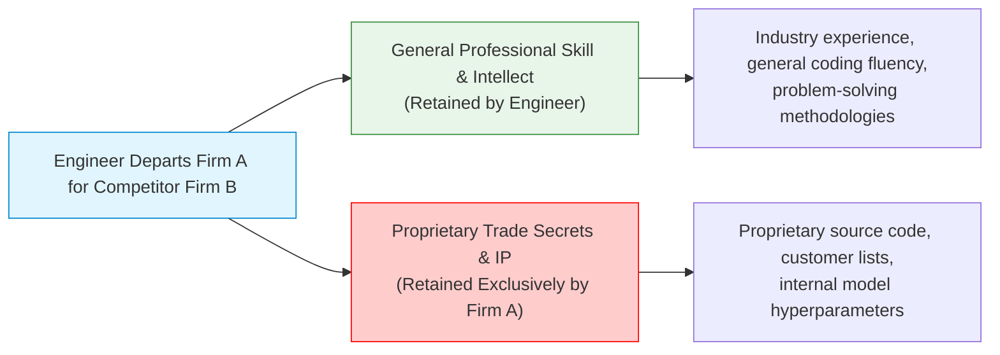

# Lecture 12: Patents and Intellectual Property in Computing

> [!abstract] Lecture Orientation & Exam Scope
> In traditional engineering, property concerns physical assets: land, concrete structures, turbine engines, and factory machinery. In computer science and software engineering, value resides almost entirely in intangible **Intellectual Property (IP)**: source code, trained model weights, proprietary architectures, and algorithmic techniques.
> 
> This lecture explores the ontology of intellectual property, resolves why digital copying differs fundamentally from physical theft, details the **Four Pillars of IP**, explores **Software Patentability under the Alice doctrine**, and investigates the ethical frontiers of **GenAI Web Scraping** via **Hooker's Generalization Argument**.
> 
> **Key Exam Anchors**:
> 1. Physical Property (Rivalrous) vs. Intellectual Property (Non-Rivalrous).
> 2. **The Four IP Pillars Comparative Table**: Copyright, Trademark, Patent, and Trade Secret.
> 3. Steamboat Willie Public Domain Transition (Copyright vs. Trademark interplay).
> 4. **The Fair Use 4-Factor Balancing Test (17 U.S.C. § 107)**.
> 5. Software Patentability: "Faster way for computer to do X" vs. "Doing X on a computer" (*Alice Corp.*).
> 6. Employee Mobility vs. Trade Secrets (General skill vs. Defend Trade Secrets Act).
> 7. **Hooker's Generalization Argument on Web Scraping & AI Training**.
> 8. Multi-Layered IP Case Studies: Google Search Engine and the Modern Smartphone.
> 
> **Cross-Vault Connections**:
> - Integrates with [[Chapter 7 - Ethical Issues in Engineering Practice#Computer Ethics|Midterm Computer Ethics & IP]].
> - Connects to [[Chapter 6 - The Rights and Responsibilities of Engineers#Confidentiality|Employee Mobility & NDAs]].
> - Explores legal foundations of model training discussed in [[Lecture 11 - Generative AI, Large Language Models & Ethics#Dilemma 3 Kantian Universalizability Model Collapse The Garbage Loop|Model Collapse and Training Corpora]].

---

## 1. The Nature of Intellectual Property: Is IP Really Property?

To understand intellectual property law and ethics, computer scientists must first interrogate the fundamental physical and philosophical nature of "property."

```
           Physical Property vs. Digital Intellectual Property
+-----------------------------------+  +-----------------------------------+
|         Physical Property         |  |    Digital Intellectual Property  |
+-----------------------------------+  +-----------------------------------+
| • RIVALROUS / EXCLUSIVE           |  | • NON-RIVALROUS / NON-EXCLUSIVE   |
| • One person's possession excludes|  | • Replicable at near-zero marginal|
|   all others.                     |    cost.                             |
| • Physical theft deprives the     |  | • Copying leaves the original     |
|   original owner of utility.      |    owner in full physical possession.|
| • Zero-sum physical resource.     |  | • Non-zero-sum informational asset|
+-----------------------------------+  +-----------------------------------+
```

### 1.1 Rivalrous vs. Non-Rivalrous Goods
- **Physical Property (Rivalrous & Exclusive)**: 
  - If Alice takes Bob's laptop, car, or physical textbook, Bob no longer possesses it. Alice's consumption directly deprives Bob of its physical utility.
  - Physical theft is a **zero-sum deprivation**.
- **Intellectual Property (Non-Rivalrous & Non-Exclusive)**:
  - If Alice copies Bob's Python script, trained PyTorch model weights, or MP3 audio file, Bob **still retains the exact, fully functional digital asset**.
  - Digital reproduction occurs at near-zero marginal cost without degrading the original asset.

### 1.2 Why Traditional Anti-Theft Arguments Fail for Software Copying
In classical Kantian moral philosophy, theft of physical property is unethical because it fails the **Universal Law Formulation**:
- *The Maxim*: "I may steal physical property whenever I desire it."
- *The Contradiction*: If everyone stole physical objects at will, the very institution of "ownership" would collapse, making theft itself impossible (you cannot steal what cannot be owned).
- **The Digital Dilemma**: When someone copies a software program or scrapes online text, the original owner is not deprived of possession. Therefore, the simple physical-theft argument does **not apply** to digital copying. 
- The ethical justification for intellectual property rights must be grounded elsewhere: in **Lockean labor theory** (an author's moral right to the fruits of their cognitive labor) and **Utilitarian incentive structures** (granting temporary legal monopolies to incentivize costly innovation).

---

## 2. Hooker's Generalization Argument on Web Scraping

With the rise of Large Language Models and text-to-image synthesis, tech firms argue that mass web scraping of human text, journalism, and artistic creations without payment or consent is morally permissible because digital data is non-rivalrous and the models do not physically deprive creators of their work.

Carnegie Mellon University philosopher and computing ethicist **Prof. John Hooker** provides the definitive refutation of this argument:



### 2.1 The Economic Foundations of Knowledge Creation
- Producing high-quality investigative journalism, academic research, literature, and digital art requires colossal capital, labor, and intellectual investment.
- Example: An investigative report by the *New York Times* or an exhaustive technical book by an author may require hundreds of thousands of dollars in payroll and years of full-time human investigation.

### 2.2 The Generalization Test
Hooker subjects mass unauthorized web scraping to Kant’s generalization test:
1. **The Maxim**: *"An AI enterprise may freely scrape and ingest all human-authored content from the public web without consent or financial compensation to train commercial generative models that answer user queries."*
2. **Universalization**: Imagine that every software company, AI startup, and tech enterprise adopts this maxim.
3. **The Resulting World**:
   - End-users receive summarized answers directly from AI interfaces and cease clicking through to original publisher websites.
   - Subscriptions, ad revenues, and licensing royalties for authors, newspapers, and artists completely collapse.
   - Publishers go bankrupt. Professional investigative journalism and artistic creation cease because humans cannot afford to dedicate full-time labor to uncompensated creation.
4. **The Contradiction in Will**:
   - The AI scraping enterprise relies on a steady, rich supply of newly published, fact-checked human knowledge to keep its models accurate, updated, and functional.
   - But universalizing the practice of uncompensated scraping **destroys the very economic foundation required to produce original human knowledge**.
   - The practice is parasitic on an ecosystem it actively starves to death, rendering the maxim self-defeating and ethically impermissible.

> [!important] Hooker's Key Ethical Insight
> The ethical wrongness of mass AI scraping **does not depend on whether the model's generated output verbatim infringes copyright or resembles the training data**.
> 
> It is wrong because the systemic practice undermines the economic sustainability of human knowledge creation, violating the duty of reciprocity and fair exchange.

---

## 3. The Four Pillars of Intellectual Property

Software engineers, technical architects, and computing managers encounter four distinct legal instruments for protecting intellectual property:

| IP Pillar | Subject Matter Protected | Acquisition Mechanism | Legal Duration | Key Computing Example | Legal Infringement Standard |
| :--- | :--- | :--- | :--- | :--- | :--- |
| **Copyright** | Original, tangible **expressions** of ideas (source code, prose, images, audio, UI graphics). Does *not* protect the underlying idea or algorithm. | Arises **automatically** upon fixation in a tangible medium. Formal registration required for statutory damage litigation. | **Life of Author + 70 years** (US individual); **95 years from publication** / 120 years from creation (corporate work-for-hire). International minimum: Life + 50 years (TRIPS). | Application source code, graphical UI icons, audio notification chimes, API code (*Google v. Oracle*). | Substantial similarity and access to the original work. Literal copying or illicit derivative work. |
| **Trademark** | Distinctive words, names, symbols, logos, sounds, or trade dress that identify and distinguish the commercial **source** of goods/services. | Commercial use in interstate commerce. Strengthened via formal USPTO registration. | **Indefinite / Permanent**, as long as actively maintained in commerce and defended against genericization. | The "Google" wordmark, Apple logo, Android green robot, "Windows" operating system name. | Likelihood of consumer confusion regarding the commercial source or origin of the product. |
| **Patent** | Novel, useful, and non-obvious **inventions, processes, machines, manufacturing methods, or functional compositions**. | Rigorous formal application, patent search, examination, and approval by government patent office (e.g., USPTO). | **Exactly 20 years** from filing date (utility patent); 15 years from grant (design patent). Non-renewable. | Hardware sensors, 5G antenna designs, PageRank algorithm (US Patent 6,285,999, expired 2019). | Unauthorized making, using, selling, or offering to sell any device practicing the patent claims. |
| **Trade Secret** | Confidential, non-public technical or commercial information providing a competitive business advantage. | Maintaining **reasonable security measures** to preserve absolute operational secrecy (NDAs, access control, encryption). | **Indefinite / Permanent**, as long as secrecy is rigorously maintained. Terminates upon public disclosure or reverse engineering. | Google Search ranking algorithm weights, proprietary high-frequency trading heuristics, Coca-Cola syrup formula. | Misappropriation via improper means (theft, industrial espionage, breach of NDA/fiduciary duty). |



---

### 3.1 Public Domain Transition: The Steamboat Willie Case (2024)
The legal transition of Mickey Mouse into the public domain on **January 1, 2024**, illustrates the critical boundary between Copyright and Trademark:
- **The Copyright Expiration**: The animated short film *Steamboat Willie* (directed by Walt Disney and Ub Iwerks in 1928) had its 95-year US corporate copyright expire on January 1, 2024.
- **What Is Now Permissible**: Anyone may legally distribute, screen, remix, monetize, or sell the original 1928 black-and-white *Steamboat Willie* film and its specific depictions of Mickey and Minnie Mouse without paying royalties to Disney.
- **The Critical Legal Nuance**:
  1. *Subsequent Derivative Copyrights*: Later iterations of Mickey Mouse (e.g., Sorcerer Mickey from *Fantasia* 1940, or Mickey with white gloves and colored pupils) remain vigorously protected under unexpired copyrights.
  2. *The Trademark Trap*: While copyright expires, **trademarks do not expire** as long as they are used in commerce. Disney maintains active trademarks on Mickey Mouse as a corporate emblem. If an independent game developer creates a commercial product using 1928 Mickey in a manner that creates consumer confusion—leading buyers to believe the product was produced or endorsed by Disney—Disney can sue and win under **Trademark Law**.

---

## 4. The Fair Use Doctrine (17 U.S.C. § 107)

In US copyright law, the **Fair Use Doctrine** provides an affirmative defense against copyright infringement, allowing unauthorized use of copyrighted works under specific conditions to foster criticism, commentary, news reporting, teaching, scholarship, and technological research.

A court evaluating Fair Use must weigh **The Four-Factor Balancing Test**:



### Factor 1: Purpose and Character of the Use
- Weighs whether the use is commercial or nonprofit educational.
- **Transformative Use**: The central judicial question: *Does the new work merely supersede the original, or does it add something new, with a further purpose or different character, altering the first with new expression, meaning, or message?* Highly transformative uses (e.g., search engine thumbnail indexing in *Kelly v. Arriba Soft*) favor Fair Use.

### Factor 2: Nature of the Copyrighted Work
- Recognizes that certain works are closer to the core of copyright protection than others.
- Creative, expressive, or fictional works (novels, feature films, songs) receive broad protection; factual, historical, scientific, or functional works receive narrower ("thin") protection.

### Factor 3: Amount and Substantiality of the Portion Used
- Evaluates both the quantitative fraction taken and the qualitative importance.
- Taking even a small percentage of a work can defeat Fair Use if the portion taken constitutes the **"heart of the work"** (e.g., taking the climactic plot revelation or the core proprietary algorithmic kernel).

### Factor 4: Effect of the Use Upon the Potential Market (The Most Critical Factor)
- Inquires whether the unauthorized use inflicts substantial economic injury on the copyright holder or serves as a **direct market substitute** for the original work or its derivative licensing markets.
- If consumers purchase the defendant's work *instead* of buying the original, Factor 4 heavily disfavors Fair Use.

---

## 5. Software Patentability: The Practical Test

Historically, the US Patent and Trademark Office (USPTO) granted thousands of questionable software patents. In 2014, the landmark US Supreme Court decision in ***Alice Corp. v. CLS Bank*** established a strict two-step framework for patent eligibility under 35 U.S.C. § 101.

### 5.1 The *Alice* Two-Step Framework
1. **Step 1**: Are the claims directed to a patent-ineligible concept, such as an **abstract idea, law of nature, or natural phenomenon** (e.g., mathematical algorithms, methods of organizing human activity)?
2. **Step 2**: If yes, do the claim elements—considered individually and as an ordered combination—transform the nature of the claim into a patent-eligible application by providing an **"inventive concept"** (something significantly more than routine, conventional computer implementation)?

### 5.2 The Fundamental Rule of Thumb for Engineers

> [!tip] The Practical Rule of Thumb for Software Patents
> - **PATENTABLE**: *"A faster, more memory-efficient, or technically novel way for a computer to execute X."*  
>   (An invention that improves the internal operation of the computing machine itself, optimizes hardware bandwidth, or solves a physical/computational bottleneck).
> 
> - **NOT PATENTABLE**: *"Doing X (an abstract business, mathematical, or mental concept) on a computer."*  
>   (Simply taking an abstract human concept—such as escrow settlement, hedging risk, or organizing files—and saying "do it over the internet" fails Step 2).

#### The Bubble Sort Exclusion:
Why can’t an engineer patent **Bubble Sort** or **Dijkstra’s Algorithm**?
- Sorting numbers and finding shortest paths on a graph are **fundamental mathematical truths and mental concepts**.
- Granting a patent on Bubble Sort would grant a 20-year legal monopoly over a basic law of mathematics, preempting all future computer science development. Pure algorithms can only be protected via copyright (protecting literal code syntax against copying) or trade secrecy.

---

## 6. Employee Mobility, NDAs, and Trade Secrets

A frequent career dilemma for software engineers involves switching employers or founding a startup in the same specialized domain.



### 6.1 General Professional Intellect vs. Proprietary Secrets
- **General Professional Skill**: An engineer is legally and ethically entitled to retain their general intellect, coding skills, software design patterns, and industry experience gained during employment. Society benefits from engineer mobility and the cross-pollination of knowledge.
- **Proprietary Assets**: Specific customer lists, unreleased product roadmaps, proprietary source code repositories, and trained model weights remain the exclusive intellectual property of the former employer.

### 6.2 Nondisclosure Agreements (NDAs) vs. Trade Secret Law
- **Non-Disclosure Agreements (NDAs)**: Private contractual agreements defining confidential information and specifying non-disclosure durations (typically 1 to 5 years).
- **Statutory Trade Secret Law (DTSA / UTSA)**:
  - Under the US **Defend Trade Secrets Act (DTSA)** and international equivalents, misappropriating trade secrets is a civil and criminal violation.
  - **Crucial Distinction**: Statutory trade secret protection **survives long after an NDA expires, and applies even if no NDA was ever signed**! An engineer cannot wait for a 2-year NDA to expire and then legally disclose their former employer’s proprietary algorithms.

### 6.3 Reverse Engineering vs. Misappropriation
- **Reverse Engineering**: Starting with a legally purchased, publicly available commercial product and working backward to analyze its construction or interoperability is **completely legal** under trade secret law.
- **Misappropriation**: Illicitly acquiring internal confidential blueprints, downloading git repositories onto USB drives, or bribing former employees is **criminal trade secret theft** (e.g., *Waymo v. Uber*, where Anthony Levandowski downloaded 14,000 confidential LiDAR files before founding Otto).

---

## 7. Generative AI Intellectual Property Dilemmas

### 7.1 Visual Plagiarism and Memorization
In an influential 2024 study published in *IEEE Spectrum*, researchers Gary Marcus and Reid Southern audited commercial text-to-image models (Midjourney v6 and OpenAI DALL-E 3).

They discovered that models frequently commit blatant **visual plagiarism**:
- When given completely generic prompts lacking any trademarked names:
  - Prompt: *"black armor with light sword"* $\longrightarrow$ generated near-pixel-identical images of **Darth Vader** (Disney/Lucasfilm).
  - Prompt: *"animated toys"* $\longrightarrow$ generated exact frames containing **Woody and Buzz Lightyear** (Disney/Pixar).
  - Prompt: *"video game plumber with mustache"* $\longrightarrow$ generated exact images of **Mario** (Nintendo).
- **The Legal Reality**: This demonstrates that diffusion models do not merely synthesize abstract stylistic patterns; they memorize and replicate copyrighted training frames, exposing both developers and end-users to direct copyright infringement claims.

---

## 8. Multi-Layered Intellectual Property Case Studies

In modern high-tech engineering, a single commercial product is never protected by a single IP pillar. It is enveloped in a multi-layered shield combining all four pillars:

### 8.1 Case Study: Google Search Engine
- **Copyright**: Protects the literal source code of Google's web crawling infrastructure, page-rendering engines, and artistic homepage Google Doodles.
- **Trademark**: Protects the "Google" brand name, logo typography, distinctive multi-color scheme, and corporate slogans ("Don't Be Evil").
- **Patent**: Protected the foundational **PageRank algorithm** (US Patent 6,285,999, *"Method for node ranking in a linked database"*, invented by Larry Page, assigned to Stanford University, licensed exclusively to Google; patent expired in 2019).
- **Trade Secret**: Protects Google's real-time ranking algorithm weights, anti-spam heuristics, search intent neural networks, and click-stream signals (which Google never patented, guarding them in permanent secrecy to prevent SEO manipulation).

### 8.2 Case Study: The Modern Smartphone (e.g., Apple iPhone / Samsung Galaxy)
- **Copyright**: Operating system source code (iOS / Android kernels), graphical user interface (GUI) desktop icons, and custom proprietary system audio notification chimes.
- **Trademark**: Brand names ("Apple", "iPhone", "Samsung", "Galaxy"), hardware logo emblems, and model typography.
- **Patent**: Hardware engineering: capacitive multi-touch screen gesture recognition, folded periscope optical zoom lenses, 5G RF phased-array antenna layouts, and ultrasonic under-display fingerprint sensors.
- **Trade Secret**: Proprietary Image Signal Processing (ISP) machine-learning computational photography weights, manufacturing yield calibration formulas, and battery thermal management heuristics.

---

## 9. Summary & Comprehensive Review Questions

> [!faq]- 📝 Exam Quick-Reference: Key Concepts of Lecture 12
> 1. **IP vs. Physical Property**: Digital IP is non-rivalrous and non-exclusive; copying does not deprive the owner of possession, so simple anti-theft arguments fail.
> 2. **Hooker's Generalization on Scraping**: Scraping without compensation destroys publisher revenue models; universalizing the practice starves the human knowledge ecosystem required for AI to function.
> 3. **The Four Pillars**:
>    - *Copyright*: Expression, automatic, Life + 70 yrs.
>    - *Trademark*: Brand source, commercial use, indefinite.
>    - *Patent*: Novel functional invention, formal examination, exactly 20 yrs.
>    - *Trade Secret*: Confidential advantage, reasonable secrecy, indefinite.
> 4. **Steamboat Willie**: 1928 copyright expired in 2024; trademark on Mickey Mouse as a corporate brand remains permanently active.
> 5. **Fair Use 4 Factors**: Purpose/character (transformative), Nature of work, Amount/substantiality ("heart"), Market effect (substitution).
> 6. **Software Patents (*Alice* Test)**: Patentable = faster way for computer to do X; Unpatentable = doing abstract X on a computer.

---

> [!example]- Question 1: Applying Hooker's Generalization to AI Web Scraping [10 Marks]
> **Prompt**: An AI foundation model company scrapes 50 million copyrighted digital articles and books from open web repositories without seeking licensing agreements or paying creators. The company defends its conduct under the Utilitarian claim that "digital copies cost the original authors nothing, and the resulting AI provides massive net benefit to society."
> 
> **Task**:
> (a) Formulate the company's maxim and apply Prof. John Hooker's Generalization Test to evaluate the ethical permissibility of this mass scraping practice. [6 marks]  
> (b) Contrast Hooker's deontological critique with the Fair Use Factor 4 (Market Effect) analysis. [4 marks]
> 
> **Model Answer**:
> *(a) Hooker's Generalization Argument*:
> - *The Maxim*: "An AI enterprise may freely scrape copyrighted journalism, books, and art without consent or royalty compensation to train models that synthesize answers for users."
> - *Universalization Test*: Universalize this maxim across all tech companies and commercial developers.
> - *Contradiction in Will*: Producing high-quality original journalism and scholarship requires substantial capital and human labor investment. When all AI developers scrape content freely and serve synthesized answers directly to users, internet traffic to original publisher websites collapses. Subscriptions and advertising revenues drop to zero, forcing newsrooms and publishers into bankruptcy. Original, verified human content production ceases. 
> - Because AI models depend on a continual supply of newly published, verified human knowledge to avoid Model Collapse and maintain factual relevance, universalizing uncompensated scraping destroys the necessary condition of the AI industry's existence. The maxim is self-contradictory and impermissible.
> 
> *(b) Hooker's Critique vs. Fair Use Factor 4*:
> - *Fair Use Factor 4 (Legal Market Effect)*: Asks whether the specific unauthorized output serves as a direct commercial market substitute for the original work (e.g., does reading the AI summary substitute for purchasing the original book?).
> - *Hooker's Ethical Insight*: Hooker's argument is broader and deeper. It does not require proving that the AI's generated output visually or textually resembles the scraped book. Instead, it demonstrates that the systemic practice of uncompensated extraction undermines the macro-economic sustainability of knowledge production as an institution.

> [!example]- Question 2: Trade Secrets vs. Employee Mobility [8 Marks]
> **Scenario**: An autonomous vehicle perception engineer leaves Company A (where she designed a patented sensor fusion system and signed a 2-year NDA) to join rival Company B. At Company B, she is asked to develop a sensor fusion pipeline that runs 30% faster.
> 
> **Task**:
> Detail what the engineer may legally and ethically bring to Company B versus what she must strictly protect, referencing the Defend Trade Secrets Act (DTSA) and the expiration of NDAs.
> 
> **Model Answer**:
> 1. **What the Engineer May Bring (General Skill & Intellect)**:
>    - Her general professional problem-solving competence, mathematical fluency in Kalman filters, knowledge of public machine learning libraries (PyTorch, ROS), and design experience gained during her career. Society protects employee career mobility to foster innovation.
> 2. **What the Engineer Must Strictly Protect (Trade Secrets & Patents)**:
>    - *Proprietary Source Code & Hyperparameters*: The specific proprietary code repositories, sensor calibration lookup tables, and custom neural network training weights developed at Company A remain Company A’s exclusive property.
>    - *Independence of Trade Secret Law*: Even after the 2-year NDA expires, statutory trade secret protection under the Defend Trade Secrets Act (DTSA) **continues indefinitely**. An engineer cannot legally use Company A’s secret internal architectures after the NDA expires.
>    - *Patents*: Company A holds a 20-year legal monopoly over its patented sensor fusion architecture. The engineer and Company B cannot practice or implement those patented claims without a formal license, even if she was the original inventor named on the patent.
