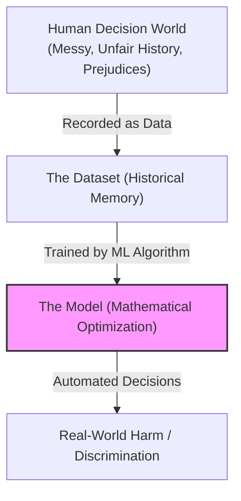
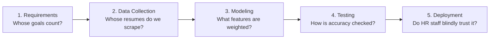
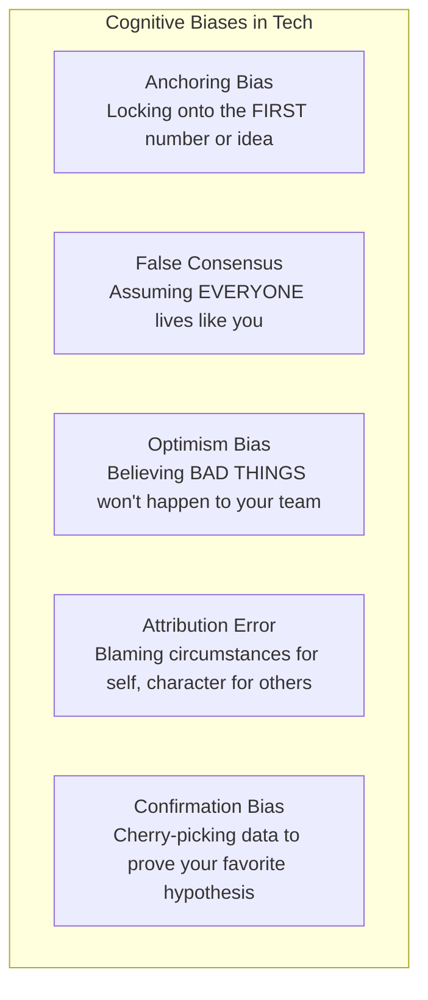
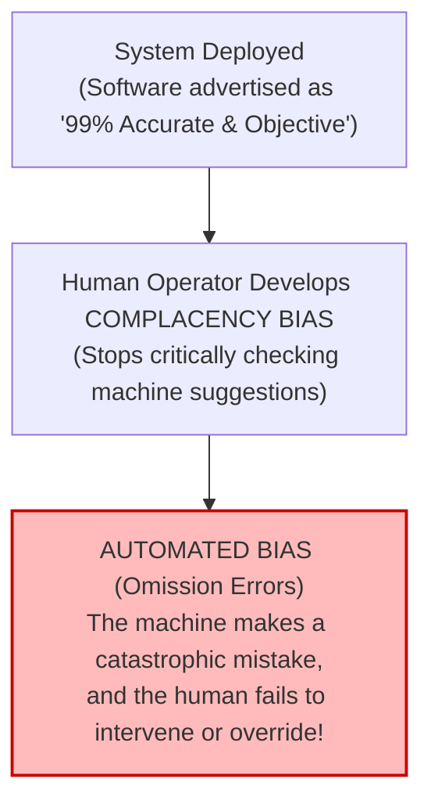
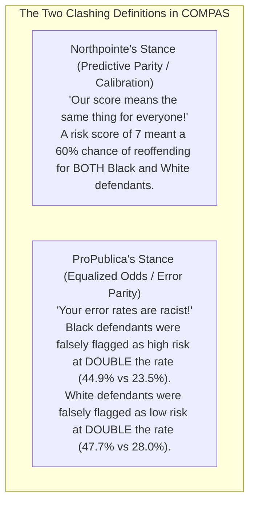
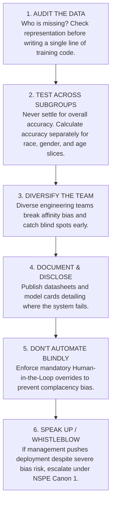

# 🧠 Lecture 9: Understanding Bias & Fairness in Data-Driven Technology

> [!TIP]
> **How to Use This Guide**: This is not a summary of slides. This guide breaks down the core concepts through **real-world analogies, software engineering scenarios, and intuitive walkthroughs** so you can deeply understand *why* algorithmic bias happens, *how* mathematical fairness metrics clash, and *how* to answer scenario questions on your exam tomorrow.

---

## 🎯 1. The Core Dilemma: What Actually is "Bias" in Computing?

When people hear the word **"bias"**, they usually think of human hatred, racism, or prejudice. But in computer science, bias is more subtle and dangerous because **it hides behind clean math and code**.



### The Crucial Distinction: Math vs. Sociological Reality

*   **The Math is not "Broken"**: An AI model is simply an optimization function minimizing a loss metric (e.g., Mean Squared Error or Cross-Entropy). If you feed it historical data where men were hired 90% of the time, the algorithm is doing its job mathematically by predicting that men are better candidates.
*   **The Problem is the Problem Framing & Data**: Machine learning algorithms do not understand justice, human rights, or societal progress. They only find patterns in the past. If the past was unequal, the algorithm will **automate and amplify that inequality into the future**.

> [!IMPORTANT]
> **The Software Engineer's Responsibility (ACM Code 1.4 & 2.5)**:
> An engineer cannot say: *"The algorithm just learned from the data, it's not my fault."*
> As the system designer, you choose the data, the objective function, the thresholds, and the deployment context. You hold professional responsibility for the downstream human consequences of your automated predictions.

---

## 🔄 2. The 5 Stages Where Bias Infiltrates the Software Lifecycle

To understand how bias enters software, imagine your team is building an **AI-Powered Automated Hiring System** for tech companies:



1.  **Requirements Stage**:
    *   *The Trap*: Management asks for an AI that *"finds candidates just like our current top 10% high-performers."*
    *   *The Inherent Bias*: If the current top 10% are all 25-year-old male graduates from one specific university, the very requirements define success in an exclusionary way.
2.  **Data Collection Stage**:
    *   *The Trap*: Scraping 10 years of past resumes submitted to the company.
    *   *The Inherent Bias*: If the company historically hired men due to past industry disparity, the training dataset encodes that history as ground truth.
3.  **Modeling & Optimization Stage**:
    *   *The Trap*: The model finds correlations between words like *"captain of men's rugby club"* and successful hiring, while penalizing *"president of women's robotics society"*.
4.  **Testing & Evaluation Stage**:
    *   *The Trap*: Evaluating the model's accuracy on an overall test set and seeing "95% accuracy".
    *   *The Inherent Bias*: If 90% of the test set is male, the model can have 99% accuracy on men and 0% accuracy on women and still report a deceptive 90%+ overall score!
5.  **Deployment Stage**:
    *   *The Trap*: HR recruiters assume the AI is "objective and scientific", so they stop reading resumes manually and blindly accept the AI's top 5 recommendations (**Complacency & Automated Bias**).

---

## 🧬 3. The Layers of Bias: From Human Psychology to Data Pipelines

---

### Layer 1: Sociological Bias (Society-Level Prejudices Encoded in Data)

Sociological biases are large-scale structural prejudices that exist in human culture. When algorithms learn from human data, they inherit these prejudices:

```text
┌─────────────────────────┬──────────────────────────────────┬────────────────────────────────────────────────────────────┐
│ Form of Prejudice       │ Human Social Manifestation       │ Real-World Software / Tech Failure                         │
├─────────────────────────┼──────────────────────────────────┼────────────────────────────────────────────────────────────┤
│ 1. Racism               │ Ethnocentrism; historical        │ Predictive policing algorithms sending extra police        │
│    (Ethnocentrism)      │ segregation and profiling.       │ patrols exclusively to minority neighborhoods.             │
├─────────────────────────┼──────────────────────────────────┼────────────────────────────────────────────────────────────┤
│ 2. Sexism               │ Belief in gender roles; male     │ Amazon AI hiring tool penalizing resumes containing the    │
│                         │ dominance in engineering roles.  │ word "women's" (e.g. "women's chess club captain").        │
├─────────────────────────┼──────────────────────────────────┼────────────────────────────────────────────────────────────┤
│ 3. Ageism               │ Stereotype that older people are │ Healthcare mobile apps assuming fine motor skills, locking │
│                         │ technologically incompetent.     │ out elderly patients with tiny touch targets and poor UX.  │
├─────────────────────────┼──────────────────────────────────┼────────────────────────────────────────────────────────────┤
│ 4. Religious Prejudice  │ Hostility toward specific faith  │ Automated content moderation filters disproportionately    │
│                         │ traditions and minority customs. │ censoring Arabic text or Islamic cultural discussions.     │
└─────────────────────────┴──────────────────────────────────┴────────────────────────────────────────────────────────────┘
```

---

### Layer 2: Implicit Bias & Affinity Bias (The Unconscious Traps)

#### What is Implicit Bias?
*   **The Concept**: Implicit bias refers to automatic, unconscious stereotypes stored in our brains from years of media, cultural exposure, and environment.
*   **Why It Matters for Engineers**: You do not have to be an evil or prejudiced person to write biased software. Even a developer who passionately believes in equality holds unconscious associations that can influence which features they choose to engineer or how they label data.
*   **Key Fact**: You cannot uncover implicit bias by "thinking harder" (*introspection*); it only shows up through objective testing (like Implicit Association Tests).

#### Affinity Bias (The "People Like Us" Trap)
*   **The Concept**: We naturally feel comfortable around, trust, and favor people who share our background, speaking style, university, or hobbies.
*   **In Software Teams**: A lead developer interviews a job candidate who also plays competitive video games and graduated from their alma mater. The lead gives them a high "culture fit" rating. A diverse team never gets built, creating huge blind spots in product design.

---

### Layer 3: Cognitive Biases (Mental Shortcuts that Break Technical Thinking)

Why do humans have cognitive biases? **Evolution.**
Our brains evolved under 4 constraints: *Too much data, not enough meaning, need to act fast, and limited memory.* 
In software engineering, these same mental shortcuts lead to massive architectural failures:



1.  **Anchoring Bias (The First-Impression Anchor)**:
    *   *The Trap*: Over-relying on the first piece of information received.
    *   *Real Example*: A doctor looks at an emergency triage note saying *"patient has flu symptoms"* (the anchor) and fails to check for signs of a stroke, even when new lab data arrives.
2.  **False Consensus Bias (The Bubble Trap)**:
    *   *The Trap*: Assuming your personal habits and access represent the normal global population.
    *   *Real Example*: A developer living in a metro city with unlimited fiber internet and a \$1,200 smartphone builds an app requiring heavy 50MB JavaScript bundles, assuming *"everyone has 5G anyway"*. The app fails completely in rural clinics in developing countries.
3.  **Optimism Bias (The "It Won't Happen to Us" Trap)**:
    *   *The Trap*: Believing that negative events happen to *other* people, but your system is immune.
    *   *Real Example*: An engineering manager skips security audits and bias audits, believing *"big tech companies get investigated, but our small startup won't make headlines."*
4.  **Fundamental Attribution Error (The Double Standard)**:
    *   *The Trap*: Explaining your own mistakes by *external circumstances*, but explaining others' mistakes by their *internal character or incompetence*.
    *   *Self*: *"Our algorithm made an error because the client provided dirty test data."*
    *   *Competitor*: *"Their algorithm made an error because their engineering team is incompetent and lazy."*
5.  **Confirmation Bias (The Cherry-Picking Trap)**:
    *   *The Trap*: Searching only for evidence that confirms what you already want to believe, while ignoring counter-evidence.
    *   *In Data Science*: A researcher believes feature $X$ is predictive of creditworthiness. They clean and filter the dataset in ways that amplify feature $X$, ignore datasets where feature $X$ fails, and publish the flawed model.

---

### Layer 4: Data Collection & Statistical Biases (Garbage In, Garbage Out)

```text
┌───────────────────────────────────────┬────────────────────────────────────────────────────────────────────────────┐
│ Data Collection Bias Type             │ Intuitive Example / Failure Scenario                                       │
├───────────────────────────────────────┼────────────────────────────────────────────────────────────────────────────┤
│ 1. Selection Bias                     │ Polling voters exclusively on Twitter/X or landline phones: catches only   │
│    (Non-Random Sampling)              │ extreme online users or retired seniors, missing the true population.      │
├───────────────────────────────────────┼────────────────────────────────────────────────────────────────────────────┤
│ 2. Time Interval Bias                 │ Training an e-commerce sales forecasting model using only data from        │
│    (Narrow Time Window)               │ Black Friday / Cyber Monday week, causing massive over-ordering in January.│
├───────────────────────────────────────┼────────────────────────────────────────────────────────────────────────────┤
│ 3. Observer / Labeler Bias            │ Conducting a software user satisfaction survey immediately after handing   │
│    (Subjective Human Scoring)         │ users a free \$50 gift card, producing artificially inflated ratings.      │
├───────────────────────────────────────┼────────────────────────────────────────────────────────────────────────────┤
│ 4. Misclassification Bias             │ Underpaid crowd-workers mislabeling blurry medical x-rays as "healthy",    │
│    (Mislabeled Ground Truth)          │ training an AI to systematically miss early tumors.                        │
└───────────────────────────────────────┴────────────────────────────────────────────────────────────────────────────┘
```

#### Statistical Concepts & Spurious Correlations
*   **Outliers ($25, 29, 32, \mathbf{110}, 33, 27$)**: Outliers can be measurement noise, but in engineering they can also be **critical safety signals** (e.g. a rare power spike). Deleting them blindly blinds the model to catastrophic edge cases.
*   **Spurious Correlation (Ice Cream vs. Drowning)**:
    *   *The Fact*: On days when ice cream sales surge, accidental drowning deaths also surge.
    *   *The Fallacy*: A naive statistical model predicts that banning ice cream will prevent drownings!
    *   *The Confounder*: **Hot summer weather** causes both ice cream sales and swimming. Engineers must remove uncorrelated variables that have no causal relationship to the problem.

---

### Layer 5: Algorithmic & Deployment Biases

#### The Automation Trap: Complacency Bias $\rightarrow$ Automated Bias

*   **Complacency Bias**: When users trust an automated system so much that they drop their guard and stop looking for errors.
*   **Automated Bias (Omission Error)**: When an automated system fails to flag a critical problem (or gives a wrong direction), and the human operator follows it blindly without noticing.
    *   *Examples*: A driver following GPS instructions onto a boat launch ramp into a lake; a lawyer submitting fake case citations generated by ChatGPT without verifying them.

#### Modeling Bias: The Bias-Variance Tradeoff (The Target Analogy)

Imagine shooting arrows at a target bullseye:
*   **High Bias (Underfitting)**: Your bow is misaligned. Every arrow lands tightly in the top-left corner far from the bullseye. The model is too rigid, simple, and misses the underlying real-world pattern.
*   **High Variance (Overfitting)**: Your arrows are scattered all over the target, the grass, and the tree. The model is too sensitive, memorizing the training noise rather than learning general rules.
*   **The Goal**: **Low Bias + Low Variance** — all arrows cluster tightly dead-center in the bullseye.

---

## ⚖️ 4. Mathematical Fairness: Why Can't We Just Make Algorithms "Fair"?

When engineers try to fix bias with code, they run into a profound mathematical wall.

### The Two Major Competing Definitions of Fairness

Imagine 1,000 university applicants: 500 from Group A and 500 from Group B.

#### 1. Demographic Parity (Statistical Parity)
*   **The Rule**: *"Both groups must be accepted at the exact same percentage rate, regardless of qualifications."*
*   **Math**: $P(\hat{Y}=1 \mid A=0) = P(\hat{Y}=1 \mid A=1)$.
*   **Intuition**: If you accept 20% of Group A (100 people), you **must** also accept 20% of Group B (100 people).
*   **When to use**: When societal access is the goal, or historical discrimination has distorted the qualification pool.

#### 2. Equalized Odds (Error Rate Parity)
*   **The Rule**: *"The algorithm must be equally accurate for qualified people in both groups, and make mistakes at the exact same rate."*
*   **Math**: False Positive Rates (FPR) and False Negative Rates (FNR) are equal across both groups.
*   **Intuition**: If an innocent person in Group A has a 5% chance of being wrongly flagged, an innocent person in Group B must also have a 5% chance.

---

### 💥 Kleinberg's Fairness Impossibility Theorem (The Exam Goldmine)

> [!ALERT]
> **The Mathematical Fact**:
> If the historical base rate of the outcome differs between two groups ($P(Y=1 \mid A=0) \neq P(Y=1 \mid A=1)$), it is **MATHEMATICALLY IMPOSSIBLE** for an algorithm to satisfy both **Demographic Parity** and **Equalized Odds** at the same time.

#### The Real-World Breakdown: The COMPAS Case Walkthrough
To see why this matters, look at how **Northpointe (the vendor)** and **ProPublica (the investigative journalists)** argued over the **COMPAS Recidivism Algorithm**:



*   **Who was right?** **Both were mathematically correct.**
*   Because historical arrest rates in the US differed between demographic groups due to centuries of disparate policing, the mathematics guaranteed that satisfying calibration would violate error rate parity!
*   **The Takeaway for Engineers**: Choosing which fairness metric to prioritize is **an ethical, philosophical, and legal choice**, not a technical default. You cannot hide behind math.

---

## 🛠️ 5. The Engineer's 6-Step Defense Blueprint

When building or auditing a machine learning system, follow this 6-step protocol:



### Legal & Professional Standards to Know for Exams:
*   **EU AI Act (2024)**: High-risk systems (hiring, credit, law enforcement, healthcare) legally require documented bias testing, risk mitigation, and continuous human monitoring.
*   **GDPR Article 22**: Gives citizens the right to meaningful explanation and the right to reject purely automated legal/financial decisions.
*   **"The client didn't ask for bias testing"**: This is **NOT a valid legal or ethical defense**. If bias testing is established professional best practice, omitting it constitutes engineering negligence.

---

## 📝 6. Practice Scenario Walkthrough (How to Answer on Tomorrow's Exam)

### 📌 The Scenario:
> *A healthcare startup develops an automated triage algorithm to prioritize emergency room patients. The training dataset consists of 5 years of electronic health records from a private hospital in an affluent suburb. When deployed in a busy inner-city public hospital, the algorithm systematically assigns lower priority scores to low-income and minority patients with severe chest pain.*

### 🎯 How to Structure Your Full-Mark Answer:

1.  **Identify the Failure Modes (Biases)**:
    *   *Selection Bias & Representation Bias*: Training data came exclusively from an affluent private hospital; low-income inner-city patient populations were unrepresented.
    *   *Measurement Bias*: If the algorithm used "previous healthcare expenditure" as a proxy for illness severity, low-income patients who could not afford past care appear "less sick".
    *   *Deployment Bias*: A model validated for a private suburban clinic was deployed in an inner-city trauma center with completely different patient demographics and disease prevalences.
2.  **Apply Ethical Lenses**:
    *   *Utilitarian Lens*: While the hospital claimed triage efficiency, the systemic misallocation of emergency care causes catastrophic health harms and wrongful deaths to vulnerable populations.
    *   *Rights / Duty Lens*: Violates fundamental rights to bodily safety and healthcare equity. Violates Kantian deontology by treating vulnerable patients as expendable metrics for startup deployment speed.
3.  **Cite Professional Codes**:
    *   Cite **NSPE Canon 1 (Paramountcy Clause)** and **ACM Code 1.4**: Engineers have a paramount duty to public safety and non-discrimination that overrules client deadlines or commercial rollout pressure.
4.  **Prescribe Remediation**:
    *   Pause automated dispatch immediately; re-collect stratified, representative emergency data across public urban hospitals; audit accuracy across demographic slices; enforce mandatory physician oversight.
