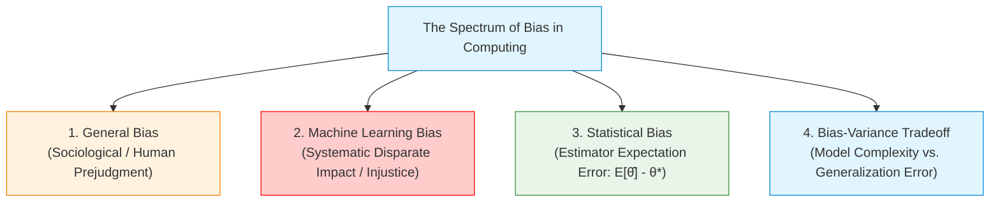
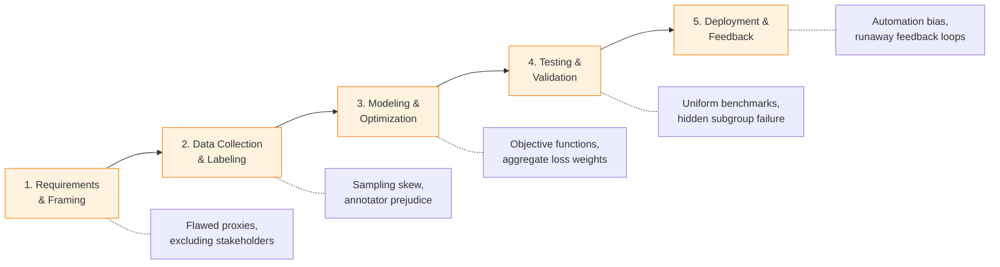
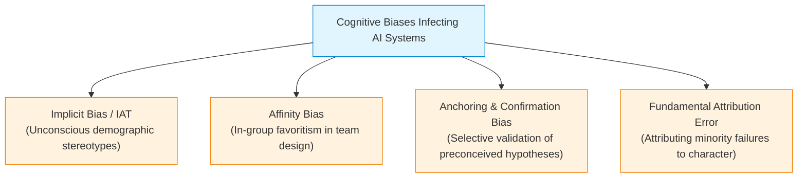
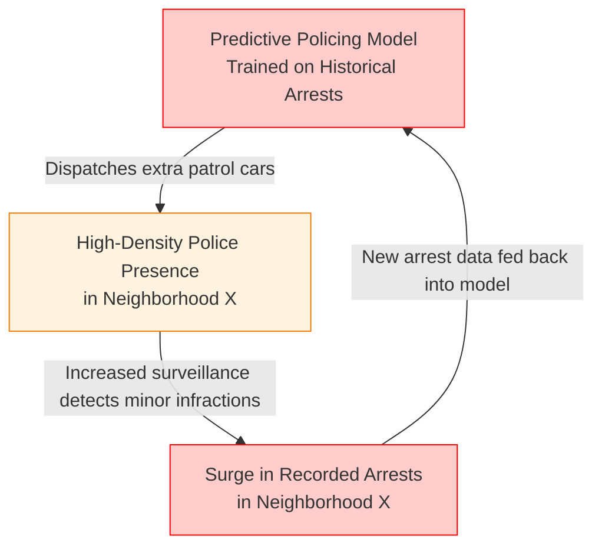
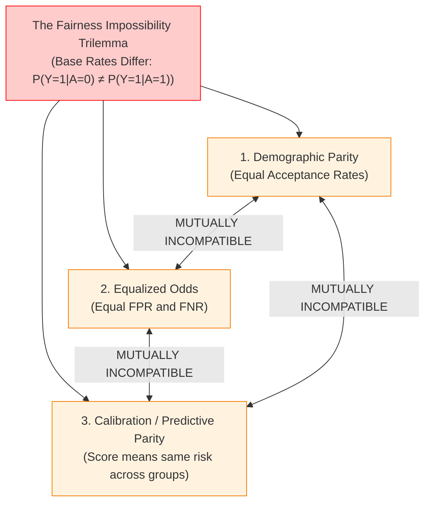
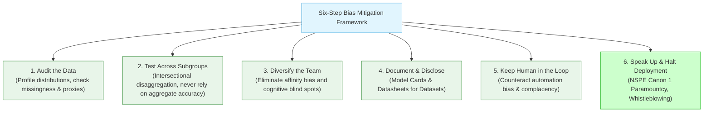

# Lecture 9: Types of Biases in Data-driven Technology

> [!abstract] Lecture Orientation & Exam Scope
> Modern computational systems increasingly govern credit allocation, criminal bail and sentencing, automated hiring, facial recognition surveillance, and medical triage. A widespread misconception assumes that because algorithms are mathematical, they are inherently objective, neutral, and fair. 
> 
> This lecture demolishes that myth. It provides a rigorous taxonomy of how biases enter machine learning pipelines, formalizes the mathematical conflict between fairness criteria (**Kleinberg's Impossibility Theorem**), analyzes seminal real-world algorithmic disasters, and establishes a **Six-Step Bias Mitigation Framework** for software engineers.
> 
> **Key Exam Anchors**:
> 1. Four distinct definitions of bias (General, ML, Statistical, Bias-Variance).
> 2. The **7 Core AI Bias Types** (Historical, Representation, Measurement, Aggregation, Evaluation, Deployment, Feedback Loop).
> 3. Cognitive biases and automation traps (Confirmation bias, Complacency bias, Automation bias).
> 4. Mathematical fairness definitions (Demographic Parity vs. Equalized Odds vs. Calibration).
> 5. **Seminal Case Studies**: COMPAS (ProPublica), Amazon AI Hiring, Gender Shades (Buolamwini & Gebru), and Obermeyer Healthcare AI.
> 
> **Cross-Vault Connections**:
> - Integrates with [[Chapter 8 - Doing the Right Thing#Automotive Crash Testing NHTSA vs IIHS The Regulatory Discrepancy|Compliance as Floor, Not Ceiling]].
> - Connects to [[Chapter 7 - Ethical Issues in Engineering Practice#Computer Ethics|Computer Ethics]] and [[Chapter 5 -  Risk, Safety, and Accidents#Typology of Accidents|Systemic Accidents]].
> - Informs platform curation in [[Lecture 10 - Content Moderation & AI Recommender Systems]] and training data contamination in [[Lecture 11 - Generative AI, Large Language Models & Ethics]].

---

## 1. Deconstructing Bias: Four Critical Definitions

In engineering ethics and data science, the term **bias** is loaded with multiple technical and colloquial meanings. Conflating these definitions leads to catastrophic design and communication failures.



### 1.1 General Bias
- **Definition**: A preconceived inclination, preference, or prejudice in favor of or against one person, group, idea, or thing compared with another, usually in a way considered to be unfair or closed-minded.
- **Origin**: Rooted in human culture, evolutionary in-group psychology, socialization, and cognitive shortcuts (heuristics).

### 1.2 Machine Learning Bias (Algorithmic Bias)
- **Definition**: Systematic, repeatable, and unjust discrimination in model predictions, classifications, or resource allocations that privileges certain demographic or socio-economic groups over others.
- **Core Truth**: Machine learning bias is **not a programming bug or mathematical calculation error**. The model’s optimization algorithm (e.g., gradient descent) functions with perfect mathematical fidelity. Algorithmic bias occurs because:
  1. The training data reflects historical human inequities and biased societal practices (**Incomplete or Contaminated Data**).
  2. The engineering team framed the problem around flawed assumptions, unrepresentative benchmarks, or toxic proxy variables (**Flawed Problem Formulation & Human Perceptions**).

### 1.3 Statistical Bias
- **Mathematical Definition**: The difference between the expected value of an estimator $\hat{\theta}$ and the true value of the underlying parameter $\theta^*$:
  $$\text{Bias}(\hat{\theta}) = \mathbb{E}[\hat{\theta}] - \theta^*$$
- **Engineering Reality**: An estimator is unbiased if $\mathbb{E}[\hat{\theta}] = \theta^*$. Statistical bias arises from omitted variable bias, non-random sampling frames, retaining uninformative features, or failing to accommodate outliers.

### 1.4 The Bias-Variance Tradeoff
- **Decomposition of Expected Prediction Error**:
  $$\mathbb{E}[(y - \hat{f}(x))^2] = \text{Bias}[\hat{f}(x)]^2 + \text{Var}[\hat{f}(x)] + \sigma^2$$
  where $\sigma^2$ is the irreducible noise in the true data-generating process.
- **Underfitting (High Bias)**: The model makes overly simplistic assumptions (e.g., fitting a linear model to quadratic data), failing to capture the underlying pattern.
- **Overfitting (High Variance)**: The model is excessively sensitive to small fluctuations and random noise in the training set, capturing noise rather than the generalizable signal.
- **Ethical Implication**: Engineers who attempt to eliminate ML bias by simply "simplifying" models often induce severe high-bias underfitting that disproportionately hurts underrepresented minority subgroups.

---

## 2. Professional Codes and Regulatory Frameworks

Algorithmic bias is no longer a purely theoretical concern; it is directly governed by international professional canons and emerging legislation:

### 2.1 ACM Code of Ethics and Professional Conduct
- **Section 1.4 (Be Fair and Take Action Not to Discriminate)**: Computing professionals must ensure that technologies do not foster discrimination based on race, sex, religion, disability, age, or national origin. Failure to design systems for equitable access constitutes professional malpractice.
- **Section 2.5 (Give Comprehensive and Thorough Evaluations of Computer Systems and Their Impacts, Including Possible Risks)**: Mandates independent auditing of algorithms for disparate impact before deployment.
- **Section 3.1 (Ensure That the Public Good Is the Central Concern During All Professional Computing Work)**: Reaffirms that commercial profitability does not override public welfare.

### 2.2 Global Regulatory Benchmarks
- **EU AI Act (2024)**: Establishes a four-tier risk classification. Systems deployed in **"High-Risk"** domains—including automated hiring, credit scoring, educational admissions, biometric identification, and criminal justice—must undergo mandatory third-party conformity assessments, demonstrate high-quality representative training datasets, ensure post-market monitoring, and maintain complete technical documentation.
- **GDPR Article 22**: Grants EU citizens the legal right **not to be subject to a decision based solely on automated processing**, including profiling, which produces legal effects or significantly affects them, alongside the right to obtain human intervention and a "meaningful explanation" of algorithmic logic.
- **IEEE 7000 Standard**: A formal engineering model for addressing ethical concerns during system design, prioritizing human values and transparent risk identification throughout the software development lifecycle.

---

## 3. SDLC Bias Entry Points: Where the Pipeline Fails

Algorithmic bias does not materialize out of thin air at the moment of code execution. It infiltrates the **Software Development Lifecycle (SDLC)** at five distinct, compounding stages:



1. **Requirements & Problem Formulation**:
   - Defining what to optimize and what to ignore.
   - Example: Formulating "employee success" solely as "retaining tenure for 3+ years," which inherently favors demographic groups with greater structural stability while penalizing employees taking maternity leave.
2. **Data Collection & Annotation**:
   - Selection bias in sampling, historical under-representation of minorities, and subjective prejudices of crowd-sourced human labelers infecting the ground-truth annotations.
3. **Modeling & Feature Engineering**:
   - Selecting features that act as latent demographic proxies (e.g., zip codes as a proxy for race; collegiate athletic club memberships as a proxy for gender).
   - Minimizing aggregate loss across the entire training set, which allows the optimizer to sacrifice performance on a 2% minority demographic to squeeze out a 0.1% gain on the 98% majority.
4. **Testing & Benchmark Validation**:
   - Validating the model on monolithic benchmark datasets that share the identical demographic skew of the training set (e.g., testing facial recognition on 85% white benchmark libraries).
5. **Deployment & Operational Environment**:
   - Using a model trained in one context (e.g., predicting hospital bed utilization in private suburban clinics) in a totally different operational setting (e.g., inner-city public emergency departments).

---

## 4. Comprehensive Taxonomies of Bias

To diagnose algorithmic discrimination, engineers must distinguish between sociological, cognitive, operational, and mathematical bias vectors.

### 4.1 Sociological Bias
- Institutional racism, systemic sexism, caste prejudice, ageism, and wealth inequality embedded in societal structures.
- When algorithms are trained on historical real-world data, they faithfully codify and automate these past societal injustices under the veneer of mathematical neutrality.

### 4.2 Cognitive and Implicit Human Biases
Engineers and data annotators possess unconscious cognitive biases that infect software architecture:



- **Implicit Bias**: Unconscious associations, attitudes, and stereotypes that influence human judgment without conscious awareness. Measured empirically through the **Implicit Association Test (IAT)** developed by Greenwald, McGhee, and Schwartz.
- **Affinity Bias**: The unconscious tendency to favor, hire, or design systems for individuals who share our own cultural background, demographics, or educational pedigree. Homogeneous software teams suffer from severe affinity blind spots.
- **Anchoring Bias**: Disproportionate cognitive reliance on the initial piece of information received when making decisions.
- **False Consensus Effect**: The tendency of developers to overestimate the degree to which other users share their habits, preferences, and physical characteristics.
- **Fundamental Attribution Error**: The human tendency to attribute the failures of others (particularly out-group members) to internal character flaws while attributing their own failures to external environmental circumstances.
- **Confirmation Bias (The Three-Phase Engineering Pathology)**:
  1. *Hypothesis Formulation*: The engineer assumes an intuitive relationship (e.g., "graduates from elite universities make superior coders").
  2. *Selective Search*: The engineer trains models using selective metrics and weights evidence that supports the hypothesis while dismissing counter-examples as "statistical noise."
  3. *Biased Deployment*: The biased model is shipped to production, creating self-fulfilling outcomes that seemingly validate the original bias.

### 4.3 Automation Bias and Human-Machine Biases
When automated AI systems are deployed in high-stress operational environments, human operators develop psychological dependencies:
- **Complacency Bias**: A state of uncritical over-trust and passive reliance on automated outputs, where human monitors stop independently verifying system health.
- **Automation Bias (The "Authority Trap")**: The psychological tendency for human decision-makers to favor machine-generated suggestions over their own sensory observations or contradictory environmental evidence.
- **Omission Errors ("The Miss")**: The human operator fails to detect or react to an impending real-world catastrophe because the automated system failed to trigger an alert.
- **Commission Errors**: The human operator follows an erroneous automated recommendation even when direct physical evidence proves the machine is wrong.

### 4.4 Data Collection Biases
- **Selection Bias**: Systematic error introduced by non-random sampling, such that the training sample does not represent the population intended to be analyzed.
- **Time-Interval Bias**: Data collected during a unique or unrepresentative historical window (e.g., training financial algorithms exclusively during a low-interest-rate bull market).
- **Observer / Annotator Bias**: Subjective prejudices of human data labelers systematically corrupting ground-truth categorical assignments.
- **Misclassification Bias**: Systematic categorical tagging errors (e.g., medical symptoms in female patients being coded as "psychological distress" rather than cardiac distress).

---

## 5. The 7 Core AI Bias Types (Canonical Synthesis)

The following seven categories represent the definitive modern taxonomy of algorithmic bias. Every software engineer must be able to identify, define, and mitigate each type:

| # | Bias Category | Formal Definition | Data / Mathematical Manifestation | Concrete Computing Example |
| :--- | :--- | :--- | :--- | :--- |
| **1** | **Historical Bias** | Pre-existing societal inequities and structural discrimination faithfully captured in historical ground-truth data. | Training distribution reflects unjust societal baselines: $P(Y_{\text{historical}} \mid A=0) \neq P(Y_{\text{historical}} \mid A=1)$ due to past prejudice. | Training a credit scoring model on 1960–1980 US mortgage data where redlining systematically denied home loans to Black families. |
| **2** | **Representation Bias** | The development/training dataset fails to represent the diversity of the target deployment population. | Extreme demographic imbalance in sample space: $\frac{N_{\text{subgroup}}}{N_{\text{total}}} \ll \frac{Pop_{\text{subgroup}}}{Pop_{\text{total}}}$, starving minority feature weights. | Computer vision models trained on ImageNet or Web-scraped celebrity photos that are >80% lighter-skinned individuals. |
| **3** | **Measurement Bias** | Choosing proxy variables that poorly, inaccurately, or discriminatorily reflect the unobservable true target construct. | The selected proxy $\tilde{Y}$ deviates systematically from the latent construct $Y^*$: $\mathbb{E}[\tilde{Y} \mid A=0] - Y^* \neq \mathbb{E}[\tilde{Y} \mid A=1] - Y^*$. | Using **healthcare costs** as a proxy for **health need**, ignoring that systemic poverty and lack of insurance lower spending for Black patients. |
| **4** | **Aggregation Bias** | Forcing a single uniform model onto a heterogeneous population where distinct subgroups exhibit divergent underlying distributions. | A single global decision boundary $\hat{f}(X)$ performs well on the majority cluster but has inverted gradients for minority clusters. | A single clinical diabetes risk model that fails because HbA1c baseline levels and genetic risk markers vary across ethnic populations. |
| **5** | **Evaluation Bias** | Utilizing unrepresentative, skewed, or inappropriate benchmark datasets to validate model performance. | Benchmark test set $D_{\text{test}}$ has the same demographic distortion as $D_{\text{train}}$, yielding inflated aggregate accuracy metrics. | Reporting 98% overall accuracy on facial recognition while the benchmark validation dataset contains only 5% women of color. |
| **6** | **Deployment Bias** | A mismatch between the operational environment envisioned during model design and the real-world sociotechnical context of deployment. | Covariate shift and behavioral divergence: $P_{\text{deploy}}(X, Y) \neq P_{\text{train}}(X, Y)$ caused by user misinterpretation. | Deploying an AI recidivism risk tool designed for pretrial bail supervision into post-conviction prison sentencing decisions. |
| **7** | **Feedback Loop Bias** *(Runaway Loop)* | Algorithmic predictions drive interventions that generate new real-world data reinforcing the model's initial biased predictions. | The model outputs at time $t$ distort the ground-truth observations at time $t+1$: $D_{t+1} = f(\hat{Y}_t, D_t)$, compounding disparity. | **Predictive Policing**: Dispatching extra police to neighborhood $X$ results in more arrests for minor infractions, which trains the model to predict even more crime in $X$. |



---

## 6. Fairness Metrics & Kleinberg's Impossibility Theorem

A central tragedy of machine learning ethics is that **fairness cannot be defined in a single, universally accepted mathematical formula**. Multiple mathematically sound, intuitively compelling definitions of fairness exist—and they are fundamentally incompatible with one another.

### 6.1 Mathematical Definitions of Fairness
Let:
- $Y \in \{0, 1\}$ represent the true binary outcome (e.g., $1 = \text{does not reoffend / repays loan}$, $0 = \text{reoffends / defaults}$).
- $\hat{Y} \in \{0, 1\}$ represent the algorithmic prediction / decision (e.g., $1 = \text{granted bail / loan approved}$, $0 = \text{denied bail / rejected}$).
- $S \in [0, 1]$ represent the raw continuous risk score output by the model.
- $A \in \{0, 1\}$ represent the protected sensitive attribute (e.g., race, gender, religion).

#### 1. Demographic Parity (Statistical Parity / Independence)
- **Concept**: The probability of receiving a positive algorithmic outcome must be identical across all protected groups, regardless of underlying historical base rates.
- **Equation**:
  $$P(\hat{Y} = 1 \mid A = 0) = P(\hat{Y} = 1 \mid A = 1)$$
- **Philosophical Basis**: Aligns with egalitarian **distributive justice**. Assumes that underlying human capabilities are equally distributed across groups, and any disparity in base rates reflects historical structural injustice.

#### 2. Equalized Odds (Separation)
- **Concept**: The algorithm must achieve identical **True Positive Rates (TPR)** and identical **False Positive Rates (FPR)** across protected groups.
- **Equation**:
  $$P(\hat{Y} = 1 \mid A = 0, Y = y) = P(\hat{Y} = 1 \mid A = 1, Y = y) \quad \text{for } y \in \{0, 1\}$$
- **Equal Opportunity**: A relaxed variant requiring only equal True Positive Rates:
  $$P(\hat{Y} = 1 \mid A = 0, Y = 1) = P(\hat{Y} = 1 \mid A = 1, Y = 1)$$
- **Philosophical Basis**: Aligns with **individual meritocracy and procedural justice**. Individuals who are genuinely qualified (or low risk) should have the exact same probability of being recognized as such, regardless of demographic identity.

#### 3. Predictive Parity (Calibration / Sufficiency)
- **Concept**: The positive predictive value (PPV) must be equal across groups. A given risk score must mean the exact same probability of the actual outcome, regardless of group membership.
- **Equation**:
  $$P(Y = 1 \mid S = s, A = 0) = P(Y = 1 \mid S = s, A = 1) \quad \forall s$$
- **Philosophical Basis**: Aligns with **actuarial fairness**. A bank or judge wants confidence that a risk score of "7" carries the exact same recidivism or default probability for everyone.

---

### 6.2 Kleinberg's Impossibility Theorem (2016)
In seminal papers by Jon Kleinberg, Sendhil Mullainathan, and Manish Raghavan (2016), and independently by Alexandra Chouldechova (2017), researchers proved a devastating mathematical theorem:

> [!danger] Kleinberg's Impossibility Theorem
> If two demographic groups have different base rates of the true outcome ($P(Y=1 \mid A=0) \neq P(Y=1 \mid A=1)$), **no risk scoring algorithm can simultaneously satisfy all three of the following fairness conditions**:
> 1. **Sufficiency / Calibration** (Predictive Parity across risk bins).
> 2. **Separation / Equalized Odds** (Equal False Positive and False Negative Rates).
> 3. **Independence / Demographic Parity** (Equal acceptance rates).
> 
> The only mathematical exception is if the predictor is **100% perfect** (zero classification error: $\text{AUC} = 1.0$), which is impossible in noisy human social environments.



> [!important] Ethical Significance of Kleinberg's Theorem for Exams
> Kleinberg's Theorem proves that **fairness in algorithmic systems is not an engineering optimization problem with a single mathematical solution**. 
> 
> When an engineer selects an objective function or threshold, they are **making an inescapable moral and political value judgment**:
> - Prioritizing *Calibration* protects the commercial institution from actuarial mispricing, but forces disparate False Positive Rates on marginalized groups.
> - Prioritizing *Equal False Positive Rates* protects innocent individuals from wrongful state detention, but violates calibration.
> - Engineers must explicitly justify this choice using ethical frameworks (Utilitarianism vs. Rights Ethics vs. Duty Ethics), rather than hiding behind claims of "objective mathematics."

---

## 7. Deep-Dive Case Studies in Algorithmic Bias

### 7.1 COMPAS Recidivism Algorithm (Northpointe / Equivant, 2016)
- **Background**: The **Correctional Offender Management Profiling for Alternative Sanctions (COMPAS)** algorithm, developed by Northpointe (now Equivant), was widely adopted by US courts to score criminal defendants on a 1-to-10 decile scale measuring the likelihood of recidivism within two years. Judges utilized these scores to set bail amounts, sentence lengths, and parole eligibility.
- **The Investigation**: In May 2016, investigative journalism nonprofit **ProPublica** analyzed the COMPAS scores of over 7,000 defendants arrested in Broward County, Florida, tracking their actual arrest records over two years.
- **Empirical Disparity**:
  - **False Positive Rate (FPR)**: Black defendants who did **not** reoffend over the two-year window were falsely labeled as medium-or-high risk at nearly twice the rate of white non-reoffenders (**44.9% vs. 23.5%**).
  - **False Negative Rate (FNR)**: White defendants who **did** go on to commit new crimes were mistakenly classified as low-risk at nearly double the rate of Black reoffenders (**47.7% vs. 28.0%**).

```
COMPAS Error Disparities (ProPublica Findings)
False Positive Rate (Flagged High Risk, Did NOT Reoffend):
Black Defendants: [████████████████████████] 44.9%
White Defendants: [████████████] 23.5%

False Negative Rate (Flagged Low Risk, DID Reoffend):
Black Defendants: [██████████████] 28.0%
White Defendants: [████████████████████████] 47.7%
```

- **The Mathematical & Philosophical Controversy**:
  - **Northpointe’s Defense (Calibration)**: Northpointe defended the algorithm by proving it satisfied **Predictive Parity (Calibration)**: a COMPAS score of "7" corresponded to roughly a 60% probability of recidivism for both Black and white defendants.
  - **The Root Cause**: Because Black communities in Broward County were subjected to higher historical arrest rates (due to targeted patrol deployment and systemic poverty), the baseline recidivism arrest rate differed ($P(Y=1 \mid \text{Black}) > P(Y=1 \mid \text{White})$). By Kleinberg's Theorem, satisfying Calibration made equal False Positive Rates mathematically impossible!
- **Ethical Violation**: COMPAS was a **proprietary trade-secret "black box"**. Defendants could not inspect the 137 survey questionnaire weights or challenge the mathematical validity of their scores, violating constitutional **procedural due process** and fundamental rights ethics.

---

### 7.2 Amazon AI Recruitment Tool (2014–2018)
- **Background**: In 2014, Amazon engineering teams developed an automated resume-screening engine to automate the evaluation of software engineering candidates. The tool scored applicant resumes from 1 to 5 stars.
- **The Mechanism**: The machine learning model was trained on thousands of resumes submitted to Amazon over the preceding 10-year period (2004–2014).
- **The Failure**: Because the global tech sector and Amazon's technical workforce had historically been male-dominated, the training corpus consisted predominantly of male resumes (**Historical and Representation Bias**).
- **The Learned Discrimination**: The neural network learned that male phrasing, male keywords, and male extracurriculars were predictive of hiring success. The algorithm actively **penalized resumes containing the word "women's"** (e.g., *"Captain, women's soccer club"*) and downgraded applicants from two all-women colleges.
- **Engineering Patch Failure**: Engineers attempted to create explicit keyword blacklists (forcing the model to ignore the token "women's"). However, the model discovered latent proxy variables—such as linguistic verb choices (e.g., "executed," "captured" vs. "collaborated," "supported") and specific high school geographic markers.
- **Resolution**: Recognizing that the algorithmic discrimination was deeply structural and unfixable without discarding the historical dataset, Amazon executives officially dissolved the project team in early 2018.

---

### 7.3 Gender Shades (Joy Buolamwini & Timnit Gebru, MIT Media Lab, 2018)
- **Background**: MIT Media Lab researcher Joy Buolamwini discovered that commercial facial analysis systems failed to detect her face until she donned a plain white plastic mask. Teaming up with Timnit Gebru, they designed the seminal **Gender Shades** audit.
- **Methodology**: Evaluated commercial facial analysis and gender classification APIs from industry giants: **IBM**, **Microsoft**, and **Face++** (and later Amazon Rekognition). Evaluated systems across an intersectional benchmark: sex (male/female) cross-referenced with skin phototype using the dermatological Fitzpatrick scale (Types I–VI).
- **The Findings**:
  - Across all three commercial systems, overall aggregate accuracy was marketed as exceeding **90% to 93%**.
  - **Disaggregated Intersectional Disparity**:
    - Lighter-skinned males: Error rates between **0.0% and 0.8%**.
    - Lighter-skinned females: Error rates between **1.7% and 7.1%**.
    - Darker-skinned males: Error rates between **0.7% and 12.0%**.
    - **Darker-skinned females**: Catastrophic error rates reaching **20.8% to 34.7%**!

```
Error Rates in Commercial Facial Analysis (Gender Shades, 2018)
Lighter Males:   [█] 0.8% error
Darker Females:  [███████████████████████████████████] 34.7% error
```

- **Root Causes**:
  1. *Representation Bias*: Widely used training and benchmark datasets (such as IJB-A and Adience) were over **75% male** and over **80% lighter-skinned**.
  2. *Evaluation Bias*: Vendors validated systems against their own racially skewed internal benchmarks, completely obscuring their total failure on women of color.
- **Real-World Impact**: Led to real-world false arrests of Black citizens by police departments utilizing automated facial surveillance (e.g., Robert Williams in Detroit), automated passport photo rejection, and safety sensor failures.
- **Outcome**: IBM and Microsoft overhauled their computer vision pipelines, released balanced datasets (e.g., IBM Diversity in Faces), and IBM subsequently exited the general-purpose facial recognition market entirely.

---

### 7.4 Obermeyer Healthcare Risk Algorithm (Obermeyer et al., *Science*, 2019)
- **Background**: Commercial health systems utilized an algorithmic risk-scoring tool affecting an estimated **200 million individuals** across the United States. The system assigned patients a risk score predicting who would require specialized high-touch chronic illness management programs.
- **The Empirical Finding**: Researchers led by Dr. Ziad Obermeyer discovered that at any given risk score, Black patients were considerably sicker than white patients. To receive the same priority risk score, a Black patient had to exhibit significantly more chronic medical conditions (e.g., diabetes, renal failure, severe hypertension).
- **The Root Cause (Measurement Bias)**:
  - The designers did not have access to an objective, unified metric of "future health need."
  - Instead, the engineering team chose **healthcare expenditure / medical costs** over the past year as a numerical proxy for health need.
  - **The Flawed Proxy**: In the US healthcare system, less money is spent on Black patients than on white patients with identical chronic illnesses, due to lower average income, less comprehensive insurance coverage, lack of transportation, and systemic physician bias in prescribing expensive interventions.
  - The algorithm did not measure sickness; it measured dollars spent. By equating money spent with illness, the algorithm codified racial spending disparities into healthcare rationing.
- **Resolution**: When researchers collaborated with the vendor to correct the proxy—replacing cost with an index of active chronic conditions and biomarker deterioration—the enrollment of Black patients in specialized care programs surged from **17.7% to 46.5%**.

---

## 8. The Six-Step Engineering Bias Mitigation Framework

Software engineers building data-driven systems must implement systematic, auditable protocols to eliminate discriminatory harm:



1. **Step 1: Audit the Data**:
   - Conduct pre-training exploratory data analysis (EDA) to map demographic distributions.
   - Interrogate feature proxies (e.g., asking: *"Does zip code correlate with race?"*, *"Does spending correlate with health?"*).
   - Document missingness and historic exclusion before a single model weight is trained.
2. **Step 2: Test Across Subgroups (Intersectional Auditing)**:
   - **Never rely on aggregate, monolithic performance metrics** (e.g., aggregate accuracy, macro F1).
   - Break down False Positive Rates, False Negative Rates, and calibration curves across cross-cutting demographic intersections (e.g., age $\times$ gender $\times$ race).
3. **Step 3: Diversify the Engineering Team**:
   - Homogeneous teams inevitably produce affinity bias and blind spots.
   - Build multi-disciplinary teams including domain sociologists, ethicists, affected community representatives, and diverse demographic perspectives.
4. **Step 4: Document and Disclose (Standardized Artifacts)**:
   - Adopt **Datasheets for Datasets** (Gebru et al., 2018): Document data provenance, collection methods, consent, and demographic limitations.
   - Publish **Model Cards for Model Reporting** (Mitchell et al., 2019): Explicitly state intended use cases, out-of-scope deployments, and evaluated subgroup performance metrics.
5. **Step 5: Keep a Meaningful Human in the Loop (HITL)**:
   - Automated recommendations must remain advisory. Design software user interfaces to actively combat **automation bias** (e.g., forcing clinicians or judges to review contradictory evidence and enter written justifications before accepting algorithmic recommendations).
6. **Step 6: Speak Up and Halt Deployment**:
   - In accordance with [[Chapter 2 -  Professionalism and Codes of Ethics#Codes of Ethics|NSPE Canon 1]] and [[Chapter 6 - The Rights and Responsibilities of Engineers#Whistle-Blowing|Whistleblowing Frameworks]], if an algorithmic tool exhibits severe, unmitigated disparate impact in a high-stakes life domain (criminal justice, healthcare, hiring), engineers have a strict professional obligation to refuse sign-off, escalate concerns, or blow the whistle.

---

## 9. Comprehensive Review Questions

> [!example]- Question 1: Kleinberg Impossibility and Recidivism Bail Systems [10 Marks]
> **Prompt**: A state judicial committee commissions your software firm to build an automated risk-assessment algorithm for bail hearings. The committee demands that the tool simultaneously guarantee:
> (1) Predictive Parity (defendants scoring 'High Risk' must reoffend at the exact same rate regardless of race), and  
> (2) Equal False Positive Rates (defendants who do not reoffend must have the exact same chance of being flagged 'High Risk' regardless of race).  
> 
> **Task**:
> (a) Explain why the committee’s demand is mathematically impossible whenever historical base rates differ, citing Kleinberg’s Impossibility Theorem. [5 marks]  
> (b) Formulate an ethical argument for which fairness metric a software engineer should prioritize in a pretrial bail system, contrasting Utilitarianism with Rights Ethics. [5 marks]
> 
> **Model Answer**:
> *(a) Mathematical Impossibility via Kleinberg's Theorem*:
> Kleinberg et al. (2016) and Chouldechova (2017) proved that whenever two demographic groups have different base rates of the true outcome ($P(Y=1 \mid A=0) \neq P(Y=1 \mid A=1)$), an algorithm cannot simultaneously satisfy Predictive Parity (Calibration) and Equalized Odds (Equal False Positive and False Negative Rates) unless prediction is 100% perfect ($\text{AUC}=1.0$). 
> In criminal justice, due to historical over-policing and systemic socioeconomic disparities, the recorded baseline arrest rate for minority defendants is higher. Therefore, if the algorithm is forced to calibrate the score (ensuring a score of '8' means a 65% rearrest probability across all races), the False Positive Rate for the higher-base-rate group **must mathematically be higher** than that of the lower-base-rate group. Demanding both is mathematically contradictory.
> 
> *(b) Ethical Evaluation of Metric Prioritization*:
> - *Utilitarian Perspective (Predictive Parity / Calibration)*: A utilitarian judge might prioritize calibration to maximize overall societal security. Calibration ensures that the state’s resources and high bail conditions are allocated efficiently based on true actuarial risk, minimizing net crime across the whole population.
> - *Rights Ethics / Deontological Perspective (Equal False Positive Rates)*: Rights ethics (and the Blackstonian criminal jurisprudence principle: *"Better that ten guilty persons escape than that one innocent suffer"*) asserts that an individual has an inviolable moral right not to be wrongfully deprived of liberty by the state. A False Positive in a bail decision means an innocent person is jailed pretrial, losing their job, custody of children, and liberty. Therefore, Rights Ethics demands prioritizing **Equal False Positive Rates**, ensuring minority defendants do not bear double the risk of wrongful incarceration.

> [!example]- Question 2: Diagnosing SDLC Bias in Automated Recruitment [8 Marks]
> **Scenario**: A major tech enterprise deploys an AI tool to rank candidate resumes. After 18 months, the company notices that zero female engineers were shortlisted for senior architect roles, despite women comprising 22% of applicants. The model achieved a 94% aggregate precision score on historical test data.
> 
> **Task**:
> (1) Identify the two primary AI bias types responsible for this outcome and trace where they entered the SDLC. [4 marks]  
> (2) Explain why standard aggregate precision failed to detect this problem and prescribe two corrective interventions. [4 marks]
> 
> **Model Answer**:
> *(1) Bias Identification & SDLC Entry Points*:
> - **Historical Bias** (entered at Requirements/Data Collection): The historical dataset reflected past male-dominated promotions and hiring within the company. The algorithm treated historical male tenure as the ground truth of technical competence.
> - **Measurement / Representation Bias** (entered at Modeling/Feature Engineering): The engineering team used linguistic keywords, resume length, and specific open-source repository contributions as proxies for "architect competency," which acted as latent proxies for male applicants.
> 
> *(2) Failure of Aggregate Precision & Corrective Interventions*:
> - *Why Aggregate Metrics Failed*: Because women comprised only a small fraction of the historical training data, the machine learning optimizer maximized aggregate precision across the overwhelmingly male majority. The model could achieve 94% aggregate precision even while failing on 100% of female applicants (**Evaluation Bias**).
> - *Corrective Interventions*:
>   1. **Intersectional Disaggregated Auditing**: Mandate testing that reports precision, recall, and false rejection rates disaggregated across gender and race.
>   2. **Feature Proxy De-biasing & Datasheets**: Strip latent gender proxies, retrain on balanced counter-factual datasets, and publish a formal *Model Card* defining known operational constraints and subgroup performance metrics.
