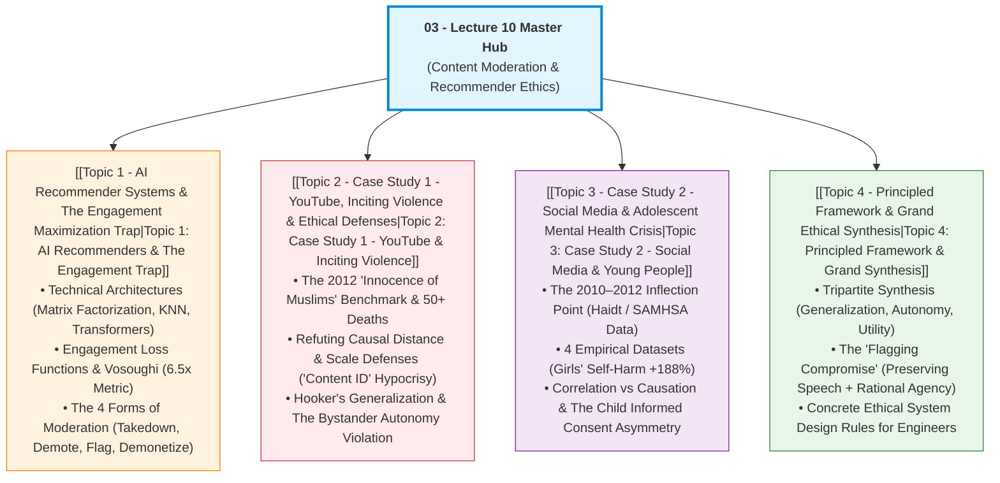

# Lecture 10: Content Moderation & AI Recommender Systems

> [!abstract] Master Navigation & Lecture Orientation
> Welcome to the comprehensive study suite for **Lecture 10: Content Moderation**. 
> If you missed class, this master hub organizes the entire slide deck into four structured, self-contained teaching modules, followed by an **Open-Book Exam Revision Playbook**.
> 
> **The Central Moral Problem**: Modern digital communication is not governed by neutral telecommunications pipes, but by **AI Recommender Systems** that algorithmically decide which information reaches billions of human minds. When platforms optimize purely for engagement and ad profit, lies diffuse 6.5x faster than truth, catalyzing deadly riots and triggering an unprecedented adolescent mental health crisis.
> 
> **Core Philosophical Architecture**: Evaluated via **Prof. John Hooker's** three rational conditions: the **Generalization Principle**, the **Utilitarian Principle**, and the **Autonomy Principle**.

---

## 🗺️ Visual Course Map & Modular Navigation



---

## 📚 Study Modules Directory

Click on any topic below to access its comprehensive, concept-building teaching notes:

1. **[[Topic 1 - AI Recommender Systems & The Engagement Maximization Trap]]** (Slides 1–6)
   - *Learn*: Why algorithms are editorial curators; Matrix Factorization & Deep Rankers; why human evolutionary psychology falls into the outrage trap; Vosoughi et al. (Science 2018); the four technical forms of moderation.
2. **[[Topic 2 - Case Study 1 - YouTube, Inciting Violence & Ethical Defenses]]** (Slides 7–22)
   - *Learn*: The *Innocence of Muslims* crisis; refuting causal distance and "ought implies can"; the First Amendment vs private platforms; John Hooker's Generalization Test; the lethal **Bystander Problem**; the Bar for Staying in Business.
3. **[[Topic 3 - Case Study 2 - Social Media & Adolescent Mental Health Crisis]]** (Slides 23–30)
   - *Learn*: The post-2010 epidemiological shock; 4 empirical graphs (UK screens, US depression, university diagnoses, self-harm hospitalizations); reverse causality vs confounders; child moral agency; why children cannot give valid informed consent.
4. **[[Topic 4 - Principled Framework & Grand Ethical Synthesis]]** (Slides 31–33)
   - *Learn*: The grand unification of Generalization, Autonomy, and Utilitarianism; why flagging with authoritative citations is the mathematically and ethically superior compromise; the affirmative duty to moderate rather than shut down.

---

## ⚡ High-Yield Exam Cheat-Sheet

Use this quick-reference summary for rapid revision during open-book exams:

### 1. Key Metrics & Empirical Proofs
- **Vosoughi et al. (*Science*, 2018)**: Falsehoods spread **6.5x faster** than truth on social media. Driven by novelty and high-arousal negative emotions (outrage, disgust) in human users, not bots.
- **The 2010–2012 Inflection Point**: The precise historical window when smartphones and algorithmic feeds became ubiquitous, initiating a synchronized surge in adolescent psychological disorders.
- **US 10–14 Girls Self-Harm**: Emergency hospital admissions for nonfatal self-harm exploded by **+188%** since 2010.
- **Content Moderation Workforce**: ~100,000 human moderators globally (~10k at YouTube, ~15k at Meta).

---

### 2. Platform Defenses vs. Rigorous Philosophical Refutations

| Platform Defense | Platform Claim | Ethical Theory Applied | Philosophical Refutation |
| :--- | :--- | :--- | :--- |
| **Causal Distance** | *"YouTube didn't kill anyone; third-party rioters did."* | **Utilitarianism** | Intervening human actors do **not** sever moral culpability if the catalyst was provided by the platform and the catastrophic harm was **entirely foreseeable**. |
| **"Ought Implies Can" (Scale Defense)** | *"500 hours/minute is uploaded; impossible to screen everything."* | **Empirical Reality & Utilitarianism** | Scale is a factual difficulty, not an ethical exemption. Platforms engineered **Content ID** to protect Hollywood copyright profits; claiming inability to protect human lives is a profound moral contradiction. |
| **Free Speech** | *"Content moderation violates the First Amendment."* | **Constitutional & Moral Law** | First Amendment restricts the **government**, not private corporations. Moderation is not silencing speech; it is **refusing to grant an algorithmic megaphone**. |
| **Voluntary Use by Minors** | *"Teens use our app voluntarily; utility outweighs harm."* | **Autonomy Principle & Informed Consent** | Minors **cannot give valid informed consent** to predatory variable-ratio reward loops. Autonomy has lexical priority: utilitarian benefits can **never** override autonomy violations against children. |

---

### 3. Prof. John Hooker's Three Ethical Tests Summary

```
   ┌─────────────────────────┬────────────────────────────────────────────────────────┐
   │ Principle               │ Key Test & Application in Platform Moderation          │
   ├─────────────────────────┼────────────────────────────────────────────────────────┤
   │ 1. Generalization       │ Can the policy achieve its purpose if universalized?   │
   │    Principle            │ • Removing violent incitement: PASSES (Saves lives)    │
   │                         │ • Blanket private censorship: FAILS (Destroys truth)   │
   │                         │ • Flagging with citations: PASSES (Enhances agency)    │
   ├─────────────────────────┼────────────────────────────────────────────────────────┤
   │ 2. Autonomy Principle   │ Does action interfere with rational action plans       │
   │    (Decisive Standard)  │ without informed consent?                              │
   │                         │ • Violent rioters: Implied consent exists.             │
   │                         │ • Innocent bystanders: ZERO consent = FATAL VIOLATION! │
   │                         │ • Minors: Incompetent to consent = MUST BE PROTECTED.  │
   ├─────────────────────────┼────────────────────────────────────────────────────────┤
   │ 3. Utilitarian          │ Maximize net societal well-being.                      │
   │    Principle            │ • Duty to engineer ethical policy rather than shut     │
   │                         │   down, due to immense educational & social utility.   │
   └─────────────────────────┴────────────────────────────────────────────────────────┘
```

---

## 📝 Practice Exam Scenarios & Model Answers

### Scenario 1: The Algorithmic Riot & Innocent Bystander Liability [10 Marks]
> **Prompt**: An algorithmic video platform in a developing nation deploys a recommender engine that boosts videos with high comment controversy. During an election, a video falsely claiming that a minority group poisoned town water wells goes viral. A violent mob burns the minority neighborhood, killing 12 people, including 4 children and a visiting doctor. 
> 
> The platform's legal team argues:
> 1. *"We did not make the claims; we are protected by causal distance."*
> 2. *"The First Amendment protects open communication."*
> 
> **Tasks**:
> (a) Refute the causal distance and First Amendment defenses. [5 Marks]  
> (b) Apply Prof. John Hooker's Autonomy Principle, contrasting the rioters with the doctor and children. [5 Marks]

> [!example]- Model Answer for Scenario 1
> **(a) Refutation of Defenses (5 Marks)**:
> 1. *Utilitarian Refutation of Causal Distance*: Utilitarianism evaluates policies by their net foreseeable consequences. Intervening actors do not sever moral responsibility if the platform provided the algorithmic amplification and the violent mob action was predictable and foreseeable. The platform was not a passive conduit; its algorithm actively computed engagement scores and prioritized unverified, incendiary accusations. The negligible ad revenue earned is catastrophically outweighed by 12 human deaths.
> 2. *First Amendment Refutation*: The First Amendment constrains government censorship; it confers no obligation upon private commercial enterprises to host or amplify speech. Furthermore, refusing to give an algorithmic megaphone to imminent incitement to violence is not censorship; it is the prevention of crime.
> 
> **(b) Autonomy Principle & Bystander Analysis (5 Marks)**:
> Under Prof. John Hooker's Autonomy Principle, an action is unethical if it subjects individuals to an action plan to which they have not or cannot rationally consent.
> - *The Rioters*: By voluntarily choosing to assemble, arm themselves, and burn homes, rioters gave implied consent to the physical dangers of civil unrest.
> - *The Innocent Bystanders (The Doctor & Children)*: They never viewed the video, participated in politics, or consented to mortal peril. By failing to remove content that managers were rationally constrained to believe would cause debilitating harm, the platform treated non-consenting innocent human lives merely as disposable collateral damage for engagement metrics, committing an absolute, severe autonomy violation.

---

### Scenario 2: The "Scale Defense" vs. The *Content ID* Paradox [10 Marks]
> **Prompt**: A video-sharing platform receives intense criticism for allowing violent extremist recruitment videos to circulate for weeks before removal. The Chief Technology Officer states:
> *"We receive 600 hours of video every minute. It is technologically and economically impossible to pre-screen uploads. Under the philosophical doctrine of 'Ought implies can', we cannot be held morally blameworthy for what is computationally impossible."*
> 
> **Tasks**:
> (a) Deconstruct the CTO's "ought implies can" argument using the platform's commercial copyright practices. [6 Marks]  
> (b) Formulate the company's maxim and apply the Generalization Test to their moderation policy. [4 Marks]

> [!example]- Model Answer for Scenario 2
> **(a) Deconstructing "Ought Implies Can" via Content ID (6 Marks)**:
> 1. *Factual Difficulty vs. Moral Exemption*: The "scale defense" confuses engineering difficulty with moral absence of duty.
> 2. *The Copyright Hypocrisy*: When Hollywood film studios and record labels threatened copyright lawsuits, major platforms did not throw their hands up and cite "ought implies can." They invested tens of millions of dollars to build sophisticated, real-time fingerprinting systems (e.g., YouTube's **Content ID**) that automatically scan every uploaded frame and acoustic second against commercial databases to prevent revenue loss.
> 3. *The Ethical Contradiction*: If an engineering team possesses the technical capability to automatically identify and block copyrighted pop music in real time, claiming an inability to build automated detection for known extremist recruitment and violent incitement reveals a deliberate commercial priority: protecting corporate profits while discounting human life.
> 
> **(b) Application of the Generalization Test (4 Marks)**:
> - *The Maxim*: "A platform may delay or neglect the removal of lethal extremist content whenever automated screening incurs high operational costs."
> - *The Universalization Test*: If every communication platform adopted this maxim, extremist and terrorist organizations would systematically weaponize digital infrastructure to mobilize violence, resulting in widespread civil destabilization, global government crackdowns, and the forced nationalization or shutdown of commercial platforms. The policy is self-defeating and fails the Generalization Test.

---

### Scenario 3: Adolescent Algorithmic Dopamine Loops & Moral Agency [10 Marks]
> **Prompt**: A social network launches an AI recommendation feature tailored to 11-to-15-year-old girls. The model detects when a young user feels insecure and feeds her endless streams of extreme fitness, cosmetic alteration, and weight-loss videos to maximize retention. Within six months, clinical hospitalizations for anorexia and nonfatal self-harm in that demographic rise sharply.
> 
> The company's vice president asserts:
> *"The app provides immense utility: millions of young girls find friends and creative expression. The users choose to open the app; we do not force them. Utilitarianism clearly supports our product."*
> 
> **Tasks**:
> (a) Explain why the vice president's utilitarian calculation is philosophically invalid under Hooker's framework. [5 Marks]  
> (b) Evaluate the claim that the children "chose to open the app voluntarily" using the concept of **Child Moral Agency** and **Informed Consent**. [5 Marks]

> [!example]- Model Answer for Scenario 3
> **(a) The Lexical Priority of Autonomy over Utility (5 Marks)**:
> Under Prof. John Hooker's ethical system, the Autonomy Principle possesses **lexical priority** over the Utilitarian Principle. A commercial enterprise cannot justify violating an individual's fundamental moral autonomy by demonstrating that the action produces a large sum of aggregate happiness or profit for others. Even if millions of users enjoy the app, deliberately engineering feeds that inflict debilitating psychological trauma and bodily hospitalization on non-consenting minors is an absolute moral violation that no quantity of positive utility can override.
> 
> **(b) Child Moral Agency & The Informed Consent Asymmetry (5 Marks)**:
> 1. *Incomplete Rational Autonomy*: Children and early adolescents possess developing neurological systems; they lack the cognitive maturity to formulate coherent long-term rational life plans or evaluate predatory psychological techniques.
> 2. *The Nature of the Algorithmic Trap*: The platform deploys variable-ratio reward schedules (identical to gambling slot machines) and exploits teenage social comparison vulnerabilities to induce compulsive engagement.
> 3. *The Failure of Consent*: An 11-year-old child cannot grant **valid informed consent** to neurological manipulation designed by adult machine learning engineers. Because children are moral agents who cannot consent to these risks, subjecting them to harmful feedback loops violates their autonomy. The claim of "voluntary choice" is ethically groundless.

---

## 🔗 Cross-Vault Connections

- **Foundational Moral Theories**: Re-visit [[Chapter 3 - Understanding Ethical Problems#Utilitarianism|Utilitarianism]], [[Chapter 3 - Understanding Ethical Problems#Duty Ethics|Duty Ethics]], and [[Chapter 3 - Understanding Ethical Problems#Rights Ethics|Rights Ethics]].
- **Engineering Responsibility**: Compare platform causal distance with the structural obligations of William LeMessurier in [[01 - Lecture 8 - Doing the Right Thing (Integrity, Courage & Proactive Ethics)|Lecture 8: Proactive Ethics & Citicorp Center]].
- **Algorithmic Fairness**: See how recommendation filtering connects to training data distortions in [[02 - Lecture 9 - Algorithmic Bias & Fairness in Data-Driven Systems|Lecture 9: Algorithmic Bias & Fairness]].
- **Generative Risks & Scraping**: Explore how Hooker's Generalization Principle applies to mass web scraping in [[05 - Lecture 12 - Patents, Copyright & Intellectual Property in Computing|Lecture 12: Patents & IP in Computing]].
