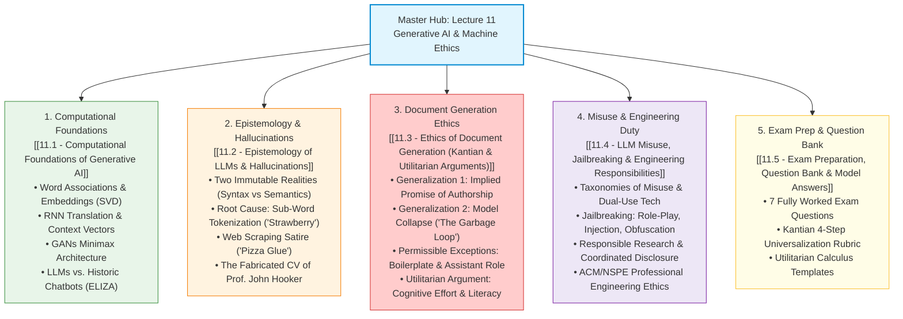

# 🤖 Lecture 11: Generative AI, Large Language Models & Machine Ethics

> [!abstract] Course Orientation & Post-Midterm Context
> **Course**: HUM 4441 — Engineering Ethics for Computer Science Engineers (IUT CSE)  
> **Instructors**: Reaz Hassan Joarder, Samnun Azfar, Yousuf Ibne Kamal Niloy  
> **Lecture Scope**: Slides 1 to 25 (Complete Module on Generative AI)  
> **Prerequisites**: None assumed. This study guide is built to teach you every concept from first principles, even if you did not attend lectures after the midterm.

---

## 🗺️ Visual Topic Roadmap

The entire lecture is organized into four core conceptual domains and a dedicated exam revision workbook:

---

## 📚 Reading Path & Learning Modules

| Module | Core Question It Answers | Primary Slide Scope |
| :--- | :--- | :--- |
| **[[11.1 - Computational Foundations of Generative AI]]** | *How does GenAI mathematically synthesize text and images without "thinking"?* | Slides 2–11 |
| **[[11.2 - Epistemology of LLMs & Hallucinations]]** | *Why do LLMs confidently invent fake citations, fake resumes, and glue on pizza?* | Slides 12–15 |
| **[[11.3 - Ethics of Document Generation (Kantian & Utilitarian Arguments)]]** | *When is generating documents with AI an ethical violation vs. permissible assistance?* | Slides 16–20 |
| **[[11.4 - LLM Misuse, Jailbreaking & Engineering Responsibilities]]** | *How are guardrails bypassed, and what is the software engineer's ethical duty?* | Slides 21–24 |
| **[[11.5 - Exam Preparation, Question Bank & Model Answers]]** | *How do I answer exam questions using Kantian and Utilitarian rubrics to score full marks?* | Exam Synthesis |

---

## ⚡ High-Yield Exam Cheat Sheet

For rapid last-minute revision, memorize these core pillars:

### 1. Technical Anchors
* **Word Embeddings**: Words are points in high-dimensional space ($\mathbb{R}^d$); coordinates represent document frequencies; semantic proximity is measured via cosine similarity; dimensions are compressed from millions to hundreds using **Singular Value Decomposition (SVD)**.
* **RNN Translation**: Uses an **Encoder-Decoder** architecture where input text is compressed into a fixed-length **Context Vector** before sequential decoding into the target language.
* **GANs**: Generative Adversarial Networks operate as a **two-player zero-sum minimax game** between a **Generator** ($G$, creates fakes from noise) and a **Discriminator** ($D$, classifies real vs. fake).
* **ChatGPT $\neq$ Chatbot**: Traditional chatbots (ELIZA, 1966) used rule-based string substitution. ChatGPT is an **autoregressive transformer** that performs statistical next-token prediction across $>1\text{ trillion}$ parameters.

### 2. Epistemological Anchors
* **Fact 1: They don't know what they are talking about**: LLMs manipulate pure **syntax** without real-world **semantics** or truth-grounding. They would perform identically on meaningful text or encoding gibberish.
* **Fact 2: They parrot what has already been said**: They recombine web-scraped text via statistical interpolation; they cannot differentiate empirical fact from fiction.
* **Hallucinations**:
  * *Strawberry Problem*: LLM fails to count 3 'r's because of **sub-word tokenization** (`straw` + `berry`), hiding individual character strings.
  * *Pizza Glue*: Model served satire (Reddit joke) as culinary truth because it lacks world knowledge.
  * *Prof. John Hooker CV*: Fabricated book editions (3rd instead of 2nd), non-existent journal articles, and wrong academic positions.

### 3. Ethical Frameworks (The Core Exam Scoring Section)
* **Generalization Argument 1 (Implied Promise)**: Writing an essay carries a 3-part covenant: (1) good-faith effort at truth, (2) author's own cognitive labor, (3) author is the genuine author. Outsourcing to GenAI breaks this promise; doing so for convenience or profit is **not universalizable** under Kantian Duty Ethics.
* **Generalization Argument 2 (The Garbage Loop / Model Collapse)**: AI relies on the human information commons. If all humans use GenAI to write, the web fills with synthetic data. Future models train on synthetic data, lose statistical variance in distribution tails, and suffer **Model Collapse** (degradation into gibberish). A maxim that destroys the very tool it uses contains a **contradiction in will**.
* **Permissible Exceptions**:
  * *Routine & Boilerplate Documents*: Contracts and templates are already derivative; no implied promise of novel creative synthesis.
  * *Using GenAI as an Assistant*: Permissible **only if** (a) all facts and citations are independently checked, and (b) the document is substantially reorganized and rewritten to reflect genuine human intellect.
* **Utilitarian Argument**: Mental labor hones research and reasoning skills. Outsourcing writing atrophies human intelligence. Conscientious writing creates literacy.
* **Jailbreaking & Engineering Duty**: Bypassing safety guardrails (via roleplay, injection, or obfuscation) threatens society with cybercrime, malware, and misinformation. Engineers have an affirmative ethical duty to design robust defensive systems and practice **responsible, coordinated disclosure**.

---

## 🔗 Cross-Vault Navigation
* Return to Master Canvas: [[Course Knowledge Graph.canvas]]
* Start with Topic 1: [[11.1 - Computational Foundations of Generative AI]]
