# 05 - Lecture 12 - Patents, Copyright & Intellectual Property in Computing

> [!abstract] Course Orientation & Master Dashboard
> **Course**: HUM 4441: Engineering Ethics  
> **Institution**: Islamic University of Technology (IUT), Department of CSE  
> **Instructors**: Reaz Hassan Joarder, Samnun Azfar, Yousuf Ibne Kamal Niloy (Junior Lecturers)  
> **Foundational Module**: Follows Prof. John Hooker, *AI and Intellectual Property*, Module 10 of *Ethical Issues in AI*, Carnegie Mellon University (CMU Osher, Feb 2024).  
> 
> *Directly connected in [[Course Knowledge Graph.canvas|The Course Knowledge Graph]]*.
> 
> This Master Hub organizes the entire syllabus of Lecture 12 into **Nine Pedagogical Topic Modules** designed to teach the subject from first principles for exam mastery.

---

## 1. Syllabus Roadmap & Interactive Map of Content (MOC)

Explore each dedicated topic note below. Each note contains first-principles conceptual explanations, slide visual embeds, strict Mermaid flowcharts, solved slide dilemmas, and exam drill questions:

```mermaid
flowchart TD
    Hub["Master Hub: Lecture 12<br>Patents and Intellectual Property"]
    
    Hub --> T1["[[12.1 - The Nature of IP, Rivalry & The Patent Bargain]]<br>• Rivalrous vs. Non-rivalrous goods<br>• Why copying is not physical theft<br>• The $80 textbook dilemma"]
    Hub --> T2["[[12.2 - Generative AI & The Web Scraping Crisis (Hooker's Test)]]<br>• Marcus & Southern visual plagiarism<br>• Hooker's Garbage Loop Generalization<br>• Resemblance vs. funding journalism"]
    Hub --> T3["[[12.3 - The International Legal Framework & The Four Pillars]]<br>• TRIPS agreement (WTO baseline floor)<br>• 4 Pillars comparative matrix<br>• Clock vs. event expiration"]
    Hub --> T4["[[12.4 - Copyright Law, Fair Use & Software Source Code]]<br>• Idea/expression dichotomy<br>• Steamboat Willie (2024) & trademark interplay<br>• Fair Use 4-factor test & code copyright"]
    Hub --> T5["[[12.5 - Trademark Law & Tech Branding (The Two Apples)]]<br>• Source identification & consumer trust<br>• Product classes & genericide<br>• The Beatles vs. Apple 30-year war"]
    Hub --> T6["[[12.6 - Patent Law, The Alice Doctrine & Algorithm Eligibility]]<br>• Patent bargain (20-yr monopoly vs disclosure)<br>• Alice 2-step test: faster computer vs computerization<br>• Why Bubble Sort was denied; Work-for-hire"]
    Hub --> T7["[[12.7 - Trade Secrets, NDAs & Employee Mobility]]<br>• Coca-Cola vault operational security<br>• Reverse engineering vs. misappropriation<br>• 2-year NDA trap & internship scenario"]
    Hub --> T8["[[12.8 - Multi-Layered Protection (Google Search & Smartphones)]]<br>• Google Search 4-pillar breakdown<br>• Smartphone 4-pillar breakdown<br>• System architecture IP audit framework"]
    Hub --> T9["[[12.9 - Exam Scenario Playbook & Model Answers]]<br>• Slide 30 summary synthesis<br>• 5 High-yield exam scenarios with model answers<br>• Quick-fire revision flashcards"]

    style Hub fill:#eceff1,stroke:#607d8b,stroke-width:2px
    style T1 fill:#e1f5fe,stroke:#0288d1
    style T2 fill:#fff3e0,stroke:#f57c00
    style T3 fill:#e8f5e9,stroke:#388e3c
    style T4 fill:#fce4ec,stroke:#c2185b
    style T5 fill:#f3e5f5,stroke:#7b1fa2
    style T6 fill:#fffde7,stroke:#fbc02d
    style T7 fill:#efebe9,stroke:#5d4037
    style T8 fill:#e0f2f1,stroke:#00796b
    style T9 fill:#ffcdd2,stroke:#d32f2f
```

---

## 2. Executive Synthesis: The Four Pillars of Intellectual Property

| Pillar | Protected Subject Matter | Acquisition Mechanism | Statutory Duration | Expiration Mechanism | Golden Engineering Example |
| :--- | :--- | :--- | :--- | :--- | :--- |
| **[[12.4 - Copyright Law, Fair Use & Software Source Code\|Copyright]]** | Original tangible **expressions** (source code syntax, UI art, audio, prose). Does *not* cover ideas or algorithms. | **Automatic** upon fixation in a tangible medium. | **Life + 50 yrs** (TRIPS); **Life + 70 yrs** (US individual); **95 yrs** (corporate). | **On a clock**: Enters public domain when time elapses. | Operating system source code, homepage Google Doodles, video game assets. |
| **[[12.5 - Trademark Law & Tech Branding (The Two Apples)\|Trademark]]** | Distinctive marks, logos, brand names, phrases, and trade dress identifying the commercial **source**. | **Commercial use** in trade; strengthened by registration. | **Indefinite / Permanent**, as long as maintained in commerce. | **Dies of disuse**: Abandonment, failure to renew, or *genericization*. | The "Google" name & 4 colors, Apple logo, "Windows" brand name. |
| **[[12.6 - Patent Law, The Alice Doctrine & Algorithm Eligibility\|Patent]]** | New, useful, and non-obvious **functional methods, machines, devices, or materials**. | Rigorous **application, examination**, and full technical disclosure. | **Exactly 20 years** from filing date (utility patent). | **On a clock**: Expiration of the 20-year term; becomes free technology. | PageRank (US Pat 6,285,999), camera CMOS sensors, 5G RF antenna layouts. |
| **[[12.7 - Trade Secrets, NDAs & Employee Mobility\|Trade Secret]]** | Confidential technical or commercial data giving a **competitive business edge**. | **Operational secrecy** (access control, NDAs, encryption). | **Indefinite / Permanent**, until publicly exposed. | **Dies of disclosure**: Leaks, independent invention, or lawful reverse engineering. | Google's live ranking algorithm weights, Coca-Cola syrup formula. |

---

## 3. High-Priority Exam Anchors & Concept Bridges

### 1. Physical Theft vs. Digital Copying
- Physical goods are **rivalrous** (possession by Alice prevents possession by Bob). Physical theft fails Kant's generalization test because universal theft dissolves possession itself.
- Digital IP is **non-rivalrous** (reproduction has near-zero marginal cost). Copying does not deprive the owner of their file.
- *Exam Trap*: Digital copying fails the **economic free-rider test**, not the physical possession test (*See [[12.1 - The Nature of IP, Rivalry & The Patent Bargain|Topic 12.1]]*).

### 2. Hooker's Generalization on GenAI Scraping
- Generative models memorize training data, committing visual plagiarism from generic prompts (*Marcus & Southern 2024*).
- Prof. John Hooker (CMU) proves mass uncompensated scraping is unethical via the **"Garbage Loop"**: universalizing uncompensated scraping bankrupts newsrooms and authors $\rightarrow$ original knowledge creation ceases $\rightarrow$ models starve.
- *Exam Trap*: The ethical wrong **does not depend on whether the AI output resembles the input**; it is an economic crisis of funding human knowledge creation (*See [[12.2 - Generative AI & The Web Scraping Crisis (Hooker's Test)|Topic 12.2]]*).

### 3. The 2024 Steamboat Willie Transition
- The 1928 corporate copyright on Mickey Mouse expired on **January 1, 2024** (95-year term).
- *Exam Trap*: Later colored versions with gloves remain copyrighted, and Disney's **trademark on Mickey Mouse never expires on a clock**, meaning independent creators cannot create commercial confusion (*See [[12.4 - Copyright Law, Fair Use & Software Source Code|Topic 12.4]]*).

### 4. Software Patentability & The *Alice* Doctrine
- Pure mathematical algorithms and theorems cannot be patented (e.g., Bubble Sort was denied).
- The *Alice* Test Rule of Thumb:
  - ✅ **Patentable**: *"A faster, novel way for a computer to do X"* (machine performance improvement).
  - ❌ **Unpatentable**: *"Doing X, but on a computer"* (automating human business/mental ideas) (*See [[12.6 - Patent Law, The Alice Doctrine & Algorithm Eligibility|Topic 12.6]]*).

### 5. Employee Mobility vs. Trade Secrets
- Engineers retain their **general professional skill, programming fluency, and design patterns**.
- Proprietary trade secrets belong to the employer permanently.
- *Exam Trap*: A 2-year NDA expiration does **not** permit an engineer to leak or use trade secrets; statutory trade secret law protects secrets permanently (*See [[12.7 - Trade Secrets, NDAs & Employee Mobility|Topic 12.7]]*).

### 6. Layered IP in Modern Engineering
- Modern devices (Google Search, modern smartphones) combine all four pillars simultaneously.
- Copyright protects code syntax; Trademark protects branding; Patent protects novel hardware; Trade Secret protects backend heuristics and ISP sensor tuning (*See [[12.8 - Multi-Layered Protection (Google Search & Smartphones)|Topic 12.8]]*).

---

## 4. Recommended Study Sequence

To achieve top marks on the final exam starting from zero post-mid preparation:
1. **Day 1**: Study [[12.1 - The Nature of IP, Rivalry & The Patent Bargain]] and [[12.2 - Generative AI & The Web Scraping Crisis (Hooker's Test)]] to master the philosophical and GenAI foundations.
2. **Day 2**: Master the Four Pillars: [[12.3 - The International Legal Framework & The Four Pillars]], [[12.4 - Copyright Law, Fair Use & Software Source Code]], [[12.5 - Trademark Law & Tech Branding (The Two Apples)]], and [[12.6 - Patent Law, The Alice Doctrine & Algorithm Eligibility]].
3. **Day 3**: Study career ethics and system architectures: [[12.7 - Trade Secrets, NDAs & Employee Mobility]] and [[12.8 - Multi-Layered Protection (Google Search & Smartphones)]].
4. **Day 4**: Practice solving all five exam scenarios in [[12.9 - Exam Scenario Playbook & Model Answers]].

---
*Vault Node Navigation*:
- Return to: [[Course Knowledge Graph.canvas|Course Knowledge Graph]]
- Continue to: [[12.1 - The Nature of IP, Rivalry & The Patent Bargain|Topic 12.1: The Nature of IP, Rivalry & The Patent Bargain]]
