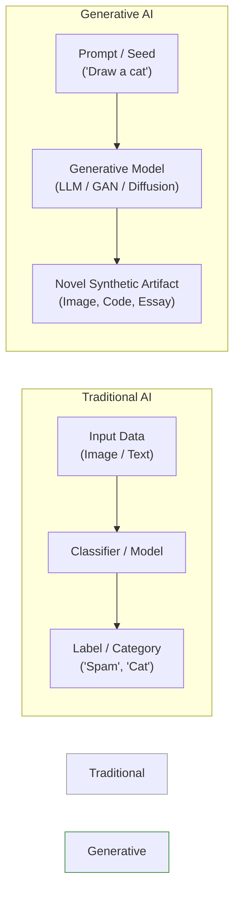
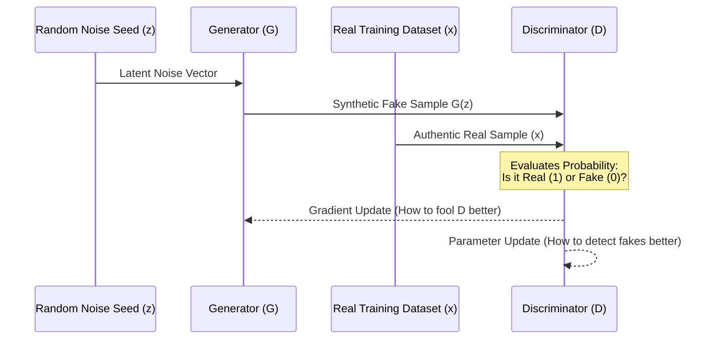

# ⚙️ 11.1 Computational Foundations of Generative AI

> [!abstract] Module Overview & Slides Scope
> **Covered Slides**: Slide 2 to Slide 11  
> **Core Objective**: Explain the mathematical and computational mechanics of Generative AI from the ground up. By the end of this note, you will understand how machines transform raw text into geometric vector spaces, how translation works via RNN encoder-decoders, why GANs engage in an adversarial game, and why modern LLMs like ChatGPT are fundamentally distinct from historic chatbots.

---

## 1. What is Generative AI?

Historically, classical computing and early Artificial Intelligence were **analytical** and **deterministic**:
* **Deterministic / Rule-Based**: If condition $X$ is met, execute branch $Y$.
* **Analytical / Discriminative ML**: Given an input $X$ (e.g., an email or an X-ray), predict its class $Y \in \{0, 1\}$ (e.g., `Spam` vs. `Not Spam`, or `Benign` vs. `Malignant`).

> [!tip] The Generative Paradigm Shift
> **Generative AI** shifts computing from *classification* to *autonomous synthesis*. Instead of outputting a simple label, generative models model the joint probability distribution $P(X)$ or $P(X \mid Y)$ to synthesize **novel, high-dimensional human-like artifacts**: complete essays, Python code, photorealistic portraits, or conversational dialogue.



---

## 2. Large Language Models (LLMs) & Next-Token Prediction

Modern LLMs include commercial and open-weight models from leading AI research laboratories across the globe:

![[attachments/popular-llms-logos.png|550]]

### 2.1 The Core Mechanism: Statistical Word Associations
At its heart, an LLM does not possess thoughts, intentions, or comprehension. Its fundamental computational engine solves one specific task:
$$\text{Given a sequence of preceding words, what word tends to occur next?}$$

* **Statistical Co-occurrence**: The model analyzes how words cluster near other words in human documents.
* **Massive Scale**: Modern Large Language Models contain from tens of billions to **over one trillion parameters** ($> 10^{12}$ numerical weights).
* **Massive Training Data**: The networks ingest petabytes of web pages, digitized books, academic journals, Wikipedia, and open-source code repositories.

---

## 3. Spatial Word Embeddings & Dimensionality Reduction

To perform mathematical operations on human language, computers cannot use raw alphabetical characters. They must convert words into **continuous numerical vectors**.

### 3.1 Words as Coordinates in Vector Space
Imagine creating a massive table where:
* Every row is a distinct vocabulary word.
* Every column represents a specific document from the training library.
* Each entry $(i, j)$ records the **number of occurrences** of word $i$ in document $j$.

If a vocabulary has $V$ words across $D$ documents, each word becomes a point in a **$D$-dimensional geometric space**:
$$\vec{w} = \langle c_1, c_2, c_3, \dots, c_D \rangle$$

> [!note] The Distributional Hypothesis (J.R. Firth, 1957)
> *"You shall know a word by the company it keeps."*  
> If two words frequently appear in the same kinds of documents or sentences (e.g., *"doctor"* and *"hospital"*, or *"planet"* and *"orbit"*), their coordinate vectors will point in similar directions.

```
                  Dimension 2 (Cosmology)
                             ^
                             |       • Mars
                             |    • Moon
                             |  • Planet
                             |
-----------------------------+-----------------------------> Dimension 1 (Religion)
                             |    • Church
                             |  • Bible
                             | • Christ
                             v
```

### 3.2 Semantic Vector Arithmetic
When words are mapped into dense vector spaces, geometric relationships reflect semantic relationships:
$$\vec{v}_{\text{King}} - \vec{v}_{\text{Man}} + \vec{v}_{\text{Woman}} \approx \vec{v}_{\text{Queen}}$$

Proximity is quantified using **Cosine Similarity**:
$$\text{Cosine Similarity}(\mathbf{u}, \mathbf{v}) = \frac{\mathbf{u} \cdot \mathbf{v}}{\|\mathbf{u}\| \|\mathbf{v}\|} = \cos(\theta)$$

### 3.3 Dimensionality Reduction via SVD (Singular Value Decomposition)
* **The Problem**: A raw document-co-occurrence matrix has millions of dimensions (one for each document on the web). Most coordinates are zero (extreme sparsity). It is computationally intractable to train deep neural networks on millions of sparse dimensions.
* **The Solution**: Apply dimensionality reduction techniques mathematically similar to **Singular Value Decomposition (SVD)** or Principal Component Analysis (PCA).
* **The Mechanism**: SVD decomposes the huge sparse matrix $M \in \mathbb{R}^{V \times D}$ into orthogonal singular vectors:
  $$M \approx U_k \Sigma_k V_k^T$$
  This compresses millions of sparse dimensions down to a dense vector of a few hundred (e.g., 300 to 4,096) latent dimensions while preserving the principal semantic variances.

### 3.4 Visualizing Word Clusters (Slide 5)
When high-dimensional word vectors are projected down into a two-dimensional plot, distinct semantic clusters emerge naturally based purely on co-occurrence:

![[attachments/word-embeddings-2d-projection.png|600]]

* **Cosmology / Physics Cluster** (Center): *moon, mars, time, space, science, gases, temperature*.
* **Theology Cluster** (Bottom-Left): *bible, lord, christ, church, god*.
* **Business & Commerce Cluster** (Bottom-Right): *management, escrow, sectors, manufactures, procurement, agencies*.
* **Hardware & Computing Cluster** (Top-Right): *photocell, fdisk, megabytes, playback, polyrax, metrics, quark*.

---

## 4. Language Translation via Recurrent Neural Networks (RNNs)

Before modern Transformers, neural machine translation relied on **Recurrent Neural Networks (RNNs)** structured in an **Encoder-Decoder** architecture.

![[attachments/recurrent-nn-translation.png|650]]

### 4.1 How the RNN Encoder-Decoder Operates:
1. **The Embedding Layer**: Each word of the source sentence (*"the"*, *"green"*, *"witch"*, *"arrived"*) is converted into its spatial embedding vector.
2. **The Encoder**: An RNN processes the tokens sequentially. At each time step $t$, the recurrent cell updates its internal hidden state:
   $$h_t = \tanh(W_{hh} h_{t-1} + W_{xh} x_t)$$
3. **The Context Vector ($h_m$)**: The final hidden state of the encoder represents the **"Context Vector"**. It acts as a compressed semantic summary of the entire source sentence.
4. **The Decoder**: The decoder takes the Context Vector and sequentially generates tokens in the target language (*"llegó"*, *"la"*, *"bruja"*, *"verde"*).
5. **Spatial Cross-Lingual Alignment**: The network aligns words across languages that occupy analogous geometric positions in the spatial embedding space, adapting for grammatical word order differences (e.g., adjective placement: English *"green witch"* $\rightarrow$ Spanish *"bruja verde"*).

> [!warning] The Context Vector Bottleneck
> Because the Context Vector has a fixed numerical size, compressing a long sentence or paragraph into a single vector inevitably causes earlier information to be forgotten. This bottleneck led researchers at Google in 2017 to invent the **Transformer** with **Self-Attention**, allowing every token to dynamically attend to every other token regardless of distance.

---

## 5. Generative Adversarial Networks (GANs)

Introduced by Ian Goodfellow et al. in 2014, **Generative Adversarial Networks (GANs)** synthesize realistic data using an adversarial game between two competing neural networks.

![[attachments/gan-architecture.png|600]]

### 5.1 The Two Competitors:
1. **The Generator ($G$)**:
   - Takes a vector of random noise (random seed $z$) as input.
   - Transforms this noise into synthetic data $G(z)$ (e.g., an image of a cat or human face).
   - *Goal*: Fool the Discriminator into believing the synthetic output is an authentic, real-world sample.
2. **The Discriminator ($D$)**:
   - Takes an image as input (either a genuine sample from the real dataset or a synthetic fake from $G$).
   - Outputs a probability score $D(x) \in [0, 1]$ indicating whether the image is authentic or fake.
   - *Goal*: Correctly catch and reject every fake sample produced by $G$.

### 5.2 The Two-Player Zero-Sum Minimax Game:
$$\min_G \max_D V(D, G) = \mathbb{E}_{x \sim p_{\text{data}}}[\log D(x)] + \mathbb{E}_{z \sim p_z}[\log(1 - D(G(z)))]$$



Through hundreds of thousands of training iterations, both networks improve simultaneously. Eventually, the Generator learns the exact high-dimensional probability distribution of the training data, producing **photorealistic but completely fictitious outputs**.

### 5.3 Concrete Examples of GAN Outputs

#### Example 1: Synthetic Cats ("Cats that do not exist", Slide 8)
GANs trained on feline photography generate distinct breeds, fur textures, and eye colors. None of the cats pictured below ever existed in the physical world:

![[attachments/fake-cats-gan.png|500]]

#### Example 2: Synthetic Human Faces ("People who do not exist", Slide 9)
Frontier GAN architectures (such as NVIDIA's StyleGAN) generate human faces with realistic pores, lighting, and hair:

![[attachments/fake-people-gan.png|500]]

---

## 6. ChatGPT: Generative Pre-trained Transformers

### 6.1 What Does "GPT" Actually Stand For?
* **Generative**: Capable of generating novel sequences of text, code, or images.
* **Pre-trained**: Trained ahead of time on vast internet corpora. When you talk to ChatGPT, **it is not learning on the fly**; its model weights are frozen. It is simply executing forward inference.
* **Transformer**: An attention-based neural network architecture that computes contextual relationships between all tokens across a context window simultaneously.

```python
# Slide 10 Example Interaction:
Prompt: "Create a Python script that calculates my age based on a birthday input"

ChatGPT Output:
import datetime

def calculate_age(birthdate):
    today = datetime.date.today()
    age = today.year - birthdate.year
    return age
```

---

## 7. Deconstructing the Myth: "ChatGPT isn't really a Chatbot"

Slide 11 makes a profound distinction essential for computer science engineers:

| Dimension | Historic Chatbots (e.g., ELIZA, 1966) | Modern LLMs (e.g., ChatGPT, 2022+) |
| :--- | :--- | :--- |
| **Foundational Mechanism** | Hardcoded scripts, regular expressions, keyword pattern matching. | Multi-layer Transformer neural network ($> 1\text{ trillion}$ parameters). |
| **Logic Representation** | Explicit deterministic rule branches (IF-THEN-ELSE). | Continuous high-dimensional vector embeddings and token probabilities. |
| **Conversational State** | Simulates conversation via canned templates (e.g., Weizenbaum's psychotherapist persona). | Autoregressive statistical sampling: predicts text that statistically co-occurs with the prompt. |
| **Generalization** | Zero. Fails completely outside scripted patterns. | Massive. Synthesizes essays, code, translations, and technical analyses. |

> [!important] Why Prof. Hooker States "ChatGPT is Not a Chatbot"
> In classical AI, it is completely unclear how one could train a true "conversational agent" with genuine dialogue intentionality purely from passive internet text.  
> ChatGPT does not "converse" with you. It simply treats your prompt as an input prefix and computes the most statistically probable completion based on trillion-parameter co-occurrences.

---

## 📝 Practice Check & Self-Quiz

> [!question]- Quick Quiz 1: Why is SVD used in word embeddings?
> **Answer**: A raw word-document co-occurrence matrix contains millions of dimensions (one per document) and is mostly filled with zeros (sparse). Singular Value Decomposition (SVD) compresses this massive sparse space down to a dense vector of a few hundred continuous dimensions while preserving the core semantic relationships.

> [!question]- Quick Quiz 2: In a GAN, what is the mathematical goal of the Generator?
> **Answer**: The Generator minimizes $\mathbb{E}_{z}[\log(1 - D(G(z)))]$, meaning it strives to produce synthetic data so realistic that the Discriminator classifies it as authentic real data ($D(G(z)) \rightarrow 1$).

---

## 🔗 Next Step
Proceed to **[[11.2 - Epistemology of LLMs & Hallucinations]]** to examine why statistical token prediction inevitably causes hallucinations, fake legal citations, and fabricated academic resumes.
