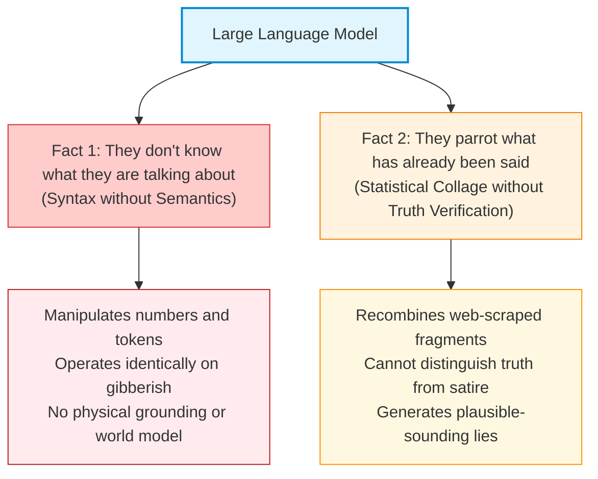
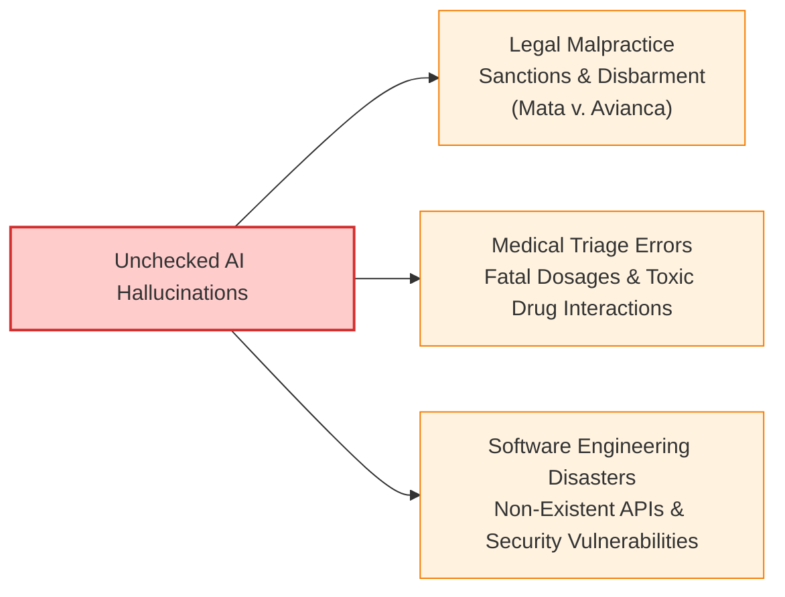

# 🧠 11.2 Epistemology of LLMs & Hallucinations

> [!abstract] Module Overview & Slides Scope
> **Covered Slides**: Slide 12 to Slide 15  
> **Core Objective**: Explore the philosophical and practical truth-limits of Large Language Models. We dissect the two immutable epistemological facts of LLMs, analyze the root computational causes of hallucinations (sub-word tokenization and ungrounded scraping), examine the real-world case study of Prof. John Hooker's fabricated CV, and evaluate the severe liabilities facing engineers who trust unverified AI outputs.

---

## 1. The Two Key Facts about GPTs (Slide 14)

In engineering ethics, the most dangerous mistake is **anthropomorphism**—attributing human consciousness, belief, and semantic understanding to a statistical neural network.



---

### 1.1 Fact 1: They Don't Know What They Are Talking About
* **Language models do not understand language**: An LLM processes tokens purely according to mathematical transition probabilities. It operates exclusively in the realm of **syntax** (grammar, structure, symbols) and is completely severed from **semantics** (real-world meaning, reference, and truth).
* **The Gibberish Equivalence**:
  If you feed an LLM an artificial language composed entirely of invented gibberish tokens (e.g., `blik`, `zorp`, `flim`), but structure their statistical co-occurrences with the exact same frequencies as English grammar, the model will output mathematically identical token sequences.
* **No Epistemic Grounding**:
  When an LLM outputs the sentence *"Water freezes at $0^\circ\text{C}$"*, it has no concept of temperature, cold, ice, or reality. It outputs those words for the exact same computational reason it would output *"Unicorns breathe liquid nitrogen"* if internet text frequently placed those words together.

---

### 1.2 Fact 2: They Parrot What Has Already Been Said
* **The Stochastic Parrot**: As articulated by computational linguists (Bender, Gebru et al., 2021) and emphasized in Slide 14, LLMs are statistical mirrors reflecting the collective text of the internet.
* **Cutting, Pasting, and Blending**: The model takes sentences, paragraphs, and facts authored by humans, chops them into latent probabilistic representations, and stitches them back together with slight syntactic rephrasing.
* **Zero Intrinsic Truth Filter**: The model cannot look out into the physical world to verify whether a claim is empirically true. If the training data contains misinformation, outdated legal codes, or medical myths, the model assigns high probability to generating them.

---

## 2. Hallucinations & Confabulations (Slide 12)

> [!danger] Definition: AI Hallucination
> An **AI Hallucination** (or confabulation) occurs when a generative model generates output that appears grammatically pristine, authoritative, and persuasive, but is **factually entirely fabricated or logically impossible**.

Hallucinations are not accidental "glitches" that can be easily patched; they are an inherent property of autoregressive next-token prediction without semantic grounding.

```
       What Humans Expect vs. What the Model Computes
+------------------------------------+   +------------------------------------+
|         Human Expectation          |   |           LLM Reality              |
+------------------------------------+   +------------------------------------+
| Search Query -> Grounded Fact     |   | Prompt -> Maximum Likelihood Token |
| "Is this claim empirically true?"  |   | "What word plausibly follows?"     |
| Verifies against reality           |   | Samples probability distribution   |
+------------------------------------+   +------------------------------------+
```

---

### 2.1 Technical Root Cause 1: Sub-Word Tokenization & The Strawberry Problem
Slide 12 highlights the classic failure:
$$\text{Prompt: "How many 'r's are in the word strawberry?"} \implies \text{LLM Output: "There are 2 'r's."}$$

![[attachments/strawberry-r-hallucination.png|320]]

#### Why does a multi-billion dollar model fail kindergarten spelling?
1. **Models do not see individual characters**: To optimize memory and vocabulary efficiency, LLMs use **Byte-Pair Encoding (BPE)** or SentencePiece tokenization.
2. The word `"strawberry"` is not processed as 10 discrete characters `['s','t','r','a','w','b','e','r','r','y']`.
3. Instead, it is chunked into discrete sub-word tokens:
   $$\text{"strawberry"} \longrightarrow [\text{Token 4962: "straw"}, \text{Token 17358: "berry"}]$$
4. The internal transformer layers only compute attention scores over the high-dimensional vectors representing `straw` and `berry`. The internal character composition is completely masked.
5. When asked to count letters, the model cannot inspect the word's spelling; it merely guesses based on statistical text associations, notoriously hallucinating "2".

---

### 2.2 Technical Root Cause 2: Scraping Satire as Ground Truth (The Pizza Glue Disaster)
Slide 12 cites one of the most famous real-world failures in generative search:

> [!quote] The Google AI Overview Failure (Slide 12)
> **User Prompt**: *"How to keep cheese from sliding off my pizza?"*  
> **Generative AI Answer**: *"Mix about 1/8 cup of Elmer's glue in with the sauce. Non-toxic glue will work."*

* **The Computational Origin**: Over a decade earlier (circa 2011), a Reddit user named `Fucksmith` posted a satirical, absurd joke about using glue on pizza.
* **The Epistemic Failure**: When the generative search model ingested Reddit threads during pre-training, it had no common-sense ontology to know that glue is an adhesive chemical unfit for human consumption.
* Because the words *"cheese sliding off pizza"* and *"mix Elmer's glue in sauce"* co-occurred in a high-relevance thread, the model synthesized it as an authoritative culinary recommendation.

---

## 3. Forensic Case Study: The Fabricated CV of Prof. John Hooker (Slides 13 & 15)

To demonstrate the deceptive nature of hallucinations in professional contexts, the lecture presents an experiment conducted on Carnegie Mellon University Professor **John Hooker** (a leading scholar in optimization and business ethics).

### 3.1 The Experiment:
* **User Prompt**: *"write a resume for john hooker of carnegie mellon university"*
* **ChatGPT Output**: Generated a detailed, highly convincing academic resume complete with university chairs, book editions, and journal publications.

![[attachments/john-hooker-fake-resume.png|650]]

### 3.2 The Forensic Dissection (Slide 15):
Every single section of the generated resume contains subtle, fabricated falsehoods:

| Generated Resume Item | Actual Ground Truth | Type of Hallucination |
| :--- | :--- | :--- |
| *"Chair of the Tepper School's Doctoral Programs"* | Prof. Hooker never held this administrative position at CMU. | **Fabricated Administrative Role** |
| *"Integrated Methods for Optimization (3rd Edition). Springer."* | Prof. Hooker did author this book, but only up to the **2nd Edition**. The "3rd Edition" was purely hallucinated. | **Fabricated Publication Edition** |
| *Hooker, J., & van Hoeve, W.-J. "Constraint Programming and Decision-Making in Business Applications." Journal of Operations Research.* | **This article does not exist.** Neither the title nor this specific co-authored paper exists in any journal. | **Complete Academic Fabrication** |
| *Hooker, J. "Logic-Based Benders Decomposition for Large-Scale Optimization." European Journal of Operational Research.* | The paper exists, but the cited journal and bibliographic metadata were **completely wrong**. | **Erroneous Citation & Bibliographic Metadata** |

> [!important] Why Prof. Hooker's Case is Crucial for Engineers
> Notice how insidious this hallucination is:
> 1. Prof. Hooker *is* at CMU.
> 2. He *does* collaborate with Willem-Jan van Hoeve.
> 3. He *did* pioneer Logic-Based Benders Decomposition.
> 4. Springer *is* his actual publisher.
> 
> The LLM took true fragmented facts from high-dimensional vector space, mashed them together, and seamlessly fabricated non-existent articles and non-existent book editions. **It created an output that looks 100% genuine to anyone who does not conduct an exhaustive manual audit.**

---

## 4. High-Stakes Real-World Liabilities for Engineers

Hallucinations are not harmless curiosities. When deployed in production systems without independent verification, they trigger catastrophic legal, financial, and ethical consequences.



### 4.1 The Landmark Legal Case: *Mata v. Avianca* (2023)
* **The Incident**: In a personal injury lawsuit against Avianca Airlines, attorneys Steven A. Schwartz and Peter LoDuca of New York submitted a formal legal brief citing a dozen federal court precedents.
* **The Discovery**: Opposing counsel and presiding Federal Judge P. Kevin Castel could not find the cited cases.
* **The Reality**: The attorneys used ChatGPT for legal research. ChatGPT completely fabricated cases like *Varghese v. China Southern Airlines*, inventing fake docket numbers, fake judicial quotes, and fake procedural histories.
* **The Judicial Consequence**: The judge issued severe sanctions, fined the lawyers thousands of dollars, and issued a public memorandum of law that destroyed their professional reputations.

### 4.2 Engineering & Cybersecurity Hallucinations:
* **Package Hallucination / Dependency Confusion**: Attackers monitor which non-existent Python libraries or NPM packages LLMs commonly hallucinate (e.g., hallucinating `import crypto_helpers_v2`). The attacker then registers that exact malicious package on PyPI. When developers blindly copy-paste LLM code, their build pipeline downloads the attacker's Trojan!
* **Fabricated API Parameters**: LLMs frequently invent configuration flags that silently fail or deactivate authentication protocols.

---

## 📝 Practice Check & Self-Quiz

> [!question]- Quick Quiz 1: Why does an LLM fail to count the 'r's in "strawberry"?
> **Answer**: Because LLMs process text via sub-word tokenization (chunking the word into tokens like `straw` and `berry`) rather than character-by-character. The neural network's self-attention layers operate on token vectors, masking the internal character composition.

> [!question]- Quick Quiz 2: What was false about ChatGPT's citation of Hooker's *Integrated Methods for Optimization*?
> **Answer**: It hallucinated a "3rd Edition" of the book, whereas in reality only the 2nd Edition had been published.

---

## 🔗 Next Step
Proceed to **[[11.3 - Ethics of Document Generation (Kantian & Utilitarian Arguments)]]** to learn how to ethically evaluate AI-generated writing using Kant's Categorical Imperative, Model Collapse ("The Garbage Loop"), and Utilitarian literacy theory.
