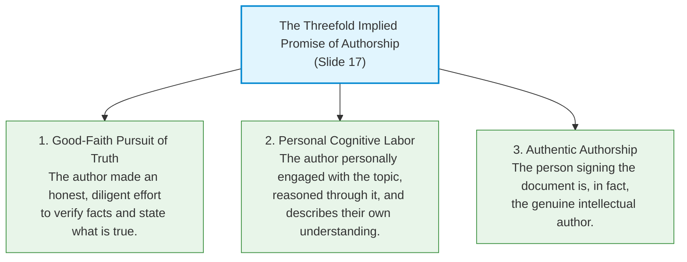
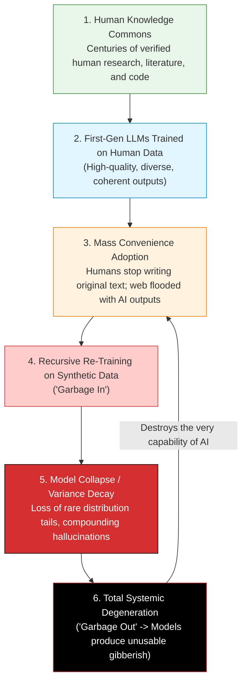
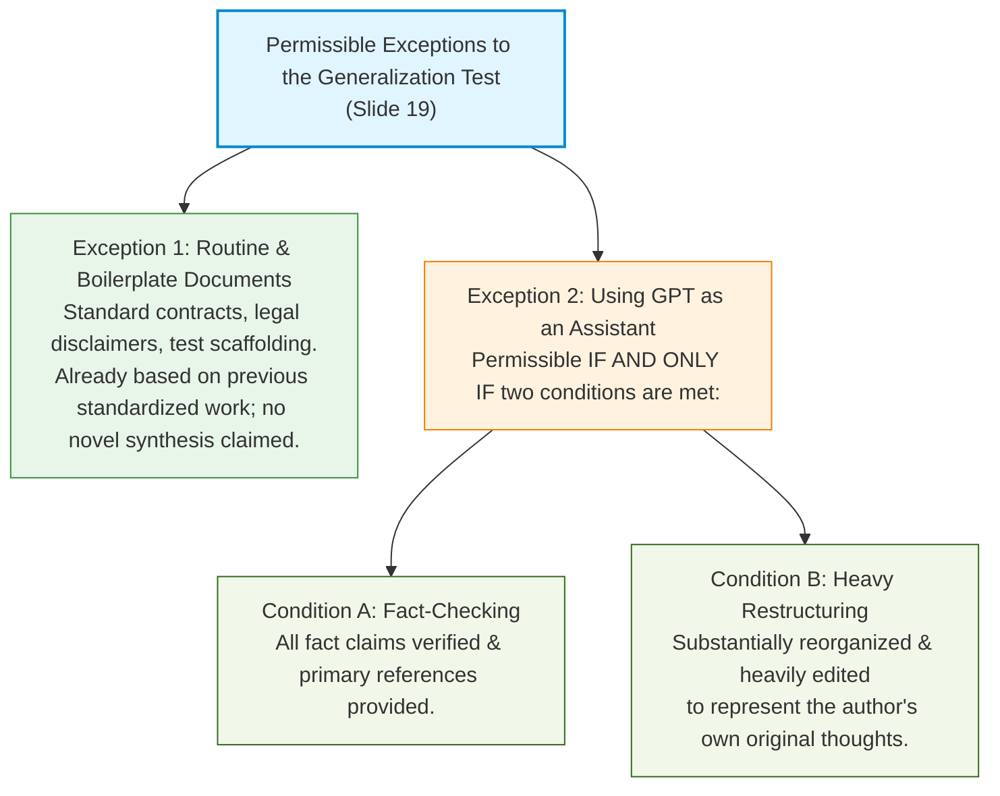

# ⚖️ 11.3 Ethics of Document Generation (Kantian & Utilitarian Arguments)

> [!abstract] Module Overview & Slides Scope
> **Covered Slides**: Slide 16 to Slide 20  
> **Core Objective**: Master the ethical frameworks governing AI-assisted and AI-generated documents. We analyze the industry euphemism of "document processing", execute two formal Kantian Generalization tests (The Implied Promise of Authorship and Model Collapse / "The Garbage Loop"), examine the two permissible exceptions (boilerplate and assistant use), and construct the Utilitarian argument on cognitive labor, skill acquisition, and student literacy.

---

## 1. The Core Dilemma: When is Document Generation Ethical?

In modern software engineering, law, and academia, text generation has migrated from human fingers to automated neural networks. Slide 16 poses the fundamental ethical question:
$$\text{When is it ethical to generate documents with GPTs?}$$

```
                The Industry Euphemism (Slide 16)
+---------------------------------------------------------------+
|   Old Term: "Document Generation"                             |
|   -> Implies autonomous AI synthesis; raises ethical red flags|
|                                                               |
|   New Industry Euphemism: "Document Processing"               |
|   -> Sounds like routine clerical sorting, formatting, or OCR;|
|      deliberately obscures the ethical liability of AI text.  |
+---------------------------------------------------------------+
```

To evaluate the morality of document generation, engineering ethics applies two foundational philosophical frameworks:
1. **Deontological / Kantian Ethics**: The **Generalization Principle** (Categorical Imperative).
2. **Teleological / Consequentialist Ethics**: The **Utilitarian Principle** (Maximizing overall human capability and net well-being).

---

## 2. Generalization Argument 1: The Implied Promise of Authorship (Slide 17)

### 2.1 The Concept of the Implied Promise
Whenever an author submits an essay, a software architecture specification, a research paper, or a code review under their own signature, the document carries an **Implied Promise** to the reader:



### 2.2 How GPT Breaks the Promise
When a student or engineer prompts an LLM to write a document and submits it as their own work:
* The model made no effort to state what is true (it is an ungrounded statistical synthesizer).
* The human did not think through the concepts or develop an authentic understanding.
* The human signer is an impostor: they are an editor/prompter claiming the status of an author.

---

### 2.3 Formal Kantian Generalization Test:
In Kantian duty ethics, an action is morally permissible if and only if its underlying maxim can be generalized into a universal law without destroying the very possibility of the action.

```markdown
Step 1: Formulate the Maxim
"I may use a GPT to generate my documents and submit them under my name whenever 
doing so is convenient or profitable."

Step 2: Universalize the Maxim
Imagine a universal world where EVERY student, engineer, researcher, and journalist 
adopts this maxim: everyone generates documents via GPT and claims authorship to save time.

Step 3: Test for Practical Contradiction (Self-Defeat)
In such a world, no one would believe that any document represents genuine human thought, 
diligence, or verified truth. The entire institution of "authorship" and academic/professional 
credentials collapses. 

The liar/cheater relies on the reader falsely believing that the document represents honest 
cognitive labor. But under universalization, nobody believes that anymore. The universal adoption 
of the maxim destroys the very expectation of authorship upon which the deceiver relies.

Conclusion:
Generating a document with a GPT for convenience or profit is NOT generalizable. 
It is strictly unethical under Kantian Deontology.
```

---

## 3. Generalization Argument 2: The "Garbage Loop" (Model Collapse) (Slide 18)

Slide 18 presents a second, deeply technical Kantian contradiction rooted in the statistical mechanics of machine learning: **The Garbage Loop** (known in AI research literature as *Model Collapse*).

![[attachments/lec11-020.png|180]]
*(Icon representing document generation)*



### 3.1 The Mechanics of the Cycle (Slide 18):
1. **Meaningful training data exists only because humans created it**: An LLM cannot generate useful text in a vacuum; it requires a pre-existing commons of human cognitive effort.
2. **GPT is already consuming its own output**: As millions of AI-generated articles, blogs, and code snippets are uploaded to the internet daily, web scrapers ingest this synthetic text back into new training sets.
3. **The Mathematical Degeneration (Shumailov et al., *Nature*, 2024)**:
   * When models generate text, they sample from the central peak of their probability distributions.
   * Low-probability "tails" (rare edge cases, nuanced vocabulary, subtle logical proofs) are lost.
   * In recursive training loops ($M_1 \rightarrow M_2 \rightarrow M_3$), variance steadily shrinks, errors compound exponentially, and output devolves into ungrounded nonsense.

### 3.2 Formal Kantian Generalization Test: The Garbage Loop

```markdown
Step 1: Formulate the Maxim
"I will use GPTs to write my documents because they create usable material 
and save me time and effort."

Step 2: Universalize the Maxim
Everyone uses GPTs to create documents because it is convenient and produces usable text. 
Consequently, human writing ceases, and the internet becomes 100% synthetic AI text.

Step 3: Contradiction in Will / Practical Contradiction
Future GPTs must train on internet text. Since the web is now purely synthetic AI text, 
the recursive Garbage Loop triggers catastrophic Model Collapse. GPTs completely cease 
to produce usable material!

The original maxim was: "Use GPTs because they create USABLE material." 
Universalizing the maxim results in a state where GPTs CANNOT create usable material. 
The maxim is self-defeating and logically incoherent under universalization.

Conclusion:
Relying entirely on GPTs to bypass writing is NOT generalizable.
```

---

## 4. Exceptions: When IS Generative AI Permissible? (Slide 19)

Does engineering ethics forbid all use of LLMs? **No.** Slide 19 explicitly identifies two legitimate, generalizable exceptions:



### 4.1 Exception 1: Routine and Boilerplate Documents
* **What it covers**: Standardized Non-Disclosure Agreements (NDAs), end-user license agreements (EULAs), routine email scheduling, boilerplate unit test setups, SQL table migrations.
* **Why it is Generalizable**:
  - Boilerplate documents are *expected* to be derivative and standard.
  - The recipient does not expect a novel creative masterpiece; they expect conformity to standard legal or technical norms.
  - Generating boilerplate with an LLM does not deceive the reader regarding genuine intellectual originality.

### 4.2 Exception 2: Using GPT as an Assistant (The Assistant vs. Replacement Boundary)
Using an LLM is morally permissible only if the engineer maintains rigorous **epistemic agency**:

| Criterion | ❌ Impermissible: Cognitive Replacement | ✅ Permissible: Genuine Assistant |
| :--- | :--- | :--- |
| **Operational Role** | The model writes the thesis, conclusions, and core arguments. | The model is used for brainstorming, outlining, or debugging syntax. |
| **Factual Verification** | Blind trust in model plausibility; accepting hallucinated citations. | **Mandatory independent verification**: Every claim and citation is cross-referenced with primary sources. |
| **Human Labor** | Direct copy-paste-deploy with superficial changes. | **Heavy restructuring & editing**: The text is substantially re-architected to reflect the author's personal intellect. |
| **Authorship Status** | Deceptive claim of false effort. | Transparent ownership and authentic cognitive contribution. |

---

## 5. The Utilitarian Argument (Slide 20)

> [!important] Utilitarianism Refresher
> Utilitarianism (Jeremy Bentham, John Stuart Mill) judges the morality of an action by its **consequences**: an action is right if and only if it produces the greatest net happiness, knowledge, and well-being for the greatest number of people.

Slide 20 builds a rigorous utilitarian case against cognitive outsourcing:

```
        The Utilitarian Value Chain of Cognitive Labor
+-------------------------------------------------------------+
| 1. Laboring to create one's own documents                   |
|    |                                                        |
|    v                                                        |
| 2. Hones research and reasoning skills (scarce resources)   |
|    |                                                        |
|    v                                                        |
| 3. Individual makes greater positive contributions to society|
|    |                                                        |
|    v                                                        |
| 4. Higher net societal well-being and technological progress|
+-------------------------------------------------------------+
```

### 5.1 The Logic of the Argument (Slide 20):
1. **Scarce Human Capabilities**: Deep analytical reasoning, critical research, rigorous problem-solving, and precise synthesis are scarce and essential for civilization.
2. **Mental Labor as Exercise**: Just as physical muscles grow only through physical exertion, cognitive reasoning faculties develop only through the arduous effort of structuring ideas and articulating them into words.
3. **Cognitive Atrophy via Reliance**: When engineers and students rely on GPTs to write their essays and code, their research and reasoning capabilities atrophy from disuse.
4. **Net Societal Harm**: A society populated by deskilled engineers who cannot reason independently or verify complex systems suffers severe long-term harm (plane crashes, medical failures, cyber vulnerabilities).
5. **Conclusion**: Reliance on GPTs is **not utilitarian**.

### 5.2 Special Application: "Conscientious Writing Creates Literacy"
Slide 20 concludes with a profound pedagogical principle:
$$\text{"In fact, one can argue that conscientious writing creates literacy."}$$

* **Writing is Thinking**: Writing is not merely the transcription of already-formed thoughts. The act of drafting, revising, deleting, and clarifying sentences is the cognitive furnace where clarity of thought is forged.
* To rob a student of writing is to rob them of literacy and independent intellect.

---

## 📝 Practice Check & Self-Quiz

> [!question]- Quick Quiz 1: What are the three parts of the "Implied Promise" of authorship?
> **Answer**: 
> 1. The author made a good-faith effort to state what is true.
> 2. The author thought through the topic and describes their own understanding.
> 3. The author is, in fact, the genuine author.

> [!question]- Quick Quiz 2: Under what two conditions is using an LLM as an assistant generalizable?
> **Answer**:
> 1. All factual claims are independently verified and primary references are given.
> 2. The text is reorganized and heavily edited to represent the author's own thoughts.

---

## 🔗 Next Step
Proceed to **[[11.4 - LLM Misuse, Jailbreaking & Engineering Responsibilities]]** to explore the cybersecurity and adversarial vulnerabilities of LLMs, jailbreak mechanisms, and the professional ethics of AI safety research.
