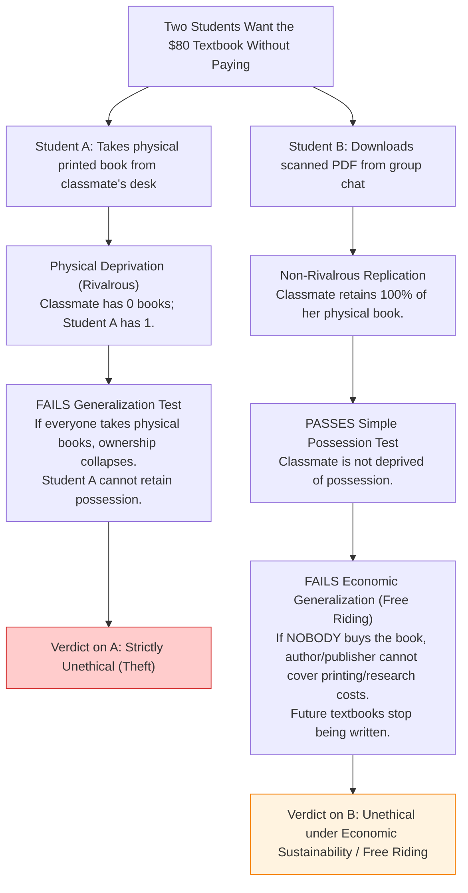
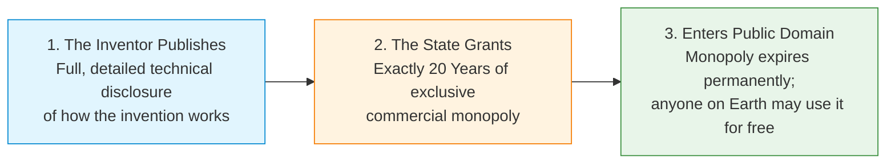

# 12.1 - The Nature of IP, Rivalry & The Patent Bargain

> [!abstract] Learning Objectives & Topic Roadmap
> In this note, we deconstruct the very concept of "property" from the ground up:
> 1. Why calling an idea or a piece of code "property" is fundamentally misleading.
> 2. The critical economic and physical difference between **Rivalrous Goods** and **Non-Rivalrous Goods**.
> 3. Why the classic Kantian Generalization Test against physical theft (from Lecture 11) completely breaks down when applied to digital copying.
> 4. **The $80 Textbook Dilemma (Slide 7)**: Analyzing physical theft vs. downloading a scanned PDF.
> 5. **The Patent Bargain (Slide 5)**: Understanding intellectual property not as a "natural right," but as an artificial social trade.
> 
> *Part of the [[05 - Lecture 12 - Patents, Copyright & Intellectual Property in Computing|Lecture 12 Master Hub]]*.

---

## 1. The Intuitive Problem: Is "Intellectual Property" Really Property?

When people hear the word **property**, they picture physical objects:
- A bicycle chained to a post.
- An iPhone in someone's pocket.
- A car parked in a driveway.
- A plot of land with a fence.

![[attachments/private-property-sign.png|320]]
*Figure: Slide 6 — A private property sign. Possession by one person strictly rules out possession by another.*

### What happens when someone "takes" physical property?
If a thief takes your bicycle:
- You no longer have the bicycle.
- You cannot ride it to university.
- The thief has possession; you suffer total physical deprivation.

Because physical objects take up space and cannot be in two places at once, physical property is **zero-sum**.

---

## 2. Rivalrous vs. Non-Rivalrous Goods: The Defining Technical Divide

In economics and computer science, we distinguish goods by their **rivalry**:

```
                       Physical Property vs. Digital Intellectual Property
+---------------------------------------------+  +---------------------------------------------+
|              Physical Property              |  |         Digital Intellectual Property       |
+---------------------------------------------+  +---------------------------------------------+
| • RIVALROUS / EXCLUSIVE                     |  | • NON-RIVALROUS / NON-EXCLUSIVE             |
| • Consumption by Alice strictly prevents    |  | • Consumption by Alice leaves Bob's copy    |
|   Bob from consuming the exact same item.   |    completely intact and 100% functional.      |
| • Replicating requires raw materials,       |  | • Replicating takes microseconds and near-  |
|   factories, supply chains, and labor.      |    zero marginal cost (Ctrl+C, Ctrl+V).        |
| • Theft = Deprivation of utility.           |  | • Copying = Creation of an identical clone. |
+---------------------------------------------+  +---------------------------------------------+
```

### The Concept of Marginal Cost
- **Physical Good**: To make a second Toyota Corolla, the company must buy steel, lithium, rubber, pay assembly line workers, and pay shipping. The marginal cost of the second unit is thousands of dollars.
- **Digital IP**: To make a second copy of a Python script, an MP3 song, or a PDF textbook, you write bits from RAM to SSD or over Wi-Fi. The marginal cost is effectively **\$0.00**.

Because of this, digital information can be possessed simultaneously by one person or by eight billion people without degrading the original file!

---

## 3. Why Taking Things Is Wrong: The Generalization Test

In Engineering Ethics (specifically Kantian Deontology, introduced in Lecture 11), we evaluate whether an action is morally permissible using the **Generalization Test**:

> [!important] The Generalization Test (Kantian Categorical Imperative)
> **An action is morally wrong if the underlying reason (maxim) for doing it stops working once everyone does it.**
> 
> To test an action:
> 1. Formulate the agent's goal and reason: *"I will do action X to achieve goal Y."*
> 2. Universalize the action: What if *every single person* in the world did action X whenever they wanted goal Y?
> 3. Check for a contradiction: In that universalized world, would action X still achieve goal Y? If the practice undermines itself, it is **unethical**.

### Applying the Test to Physical Stealing (Slide 6)
1. **The Maxim**: *"I will take someone else's physical bicycle without paying, because I want to possess and use it."*
2. **Universalization**: Imagine a world where *everyone* takes whatever physical object they want whenever they want it. Nobody respects private property.
3. **The Contradiction**:
   - The thief's only reason for stealing the bike is to enjoy *possession and use* of it.
   - But in a world where everyone steals at will, the moment the thief parks the bike outside the grocery store, someone else immediately rides away on it!
   - In fact, the very concept of "possession" and "ownership" ceases to exist. You cannot possess what anyone can take from you without consequence.
   - Therefore, the thief's original reason for stealing (*"to have and use the bike"*) collapses. Stealing is self-defeating and **morally impermissible**.

---

## 4. The Digital Dilemma: "Copying Is Not Taking" (Slide 7)

Now, what happens if we attempt to use this exact same argument against digital copying?

> [!warning] The Crucial Philosophical Insight
> **The standard argument against theft does NOT, by itself, explain why digital copying is wrong.**

Let's test digital copying under the exact same logic:
1. **The Maxim**: *"I will copy Alice's Python script without paying, because I want to execute it on my machine."*
2. **Universalization**: Suppose every programmer in the world copies everyone else's public Python scripts freely.
3. **Does the reason stop working?**:
   - Alice still has her script. Her script still runs on her machine.
   - You have your copy. It runs on your machine.
   - Millions of other people can run the script simultaneously.
   - The script does not vanish from your hard drive just because others copy it.

Because digital goods are non-rivalrous, copying Alice's file **does not deprive Alice of her possession or utility**. Therefore, calling digital copying "theft" is logically inaccurate, and the simple anti-theft generalization test fails to condemn it.

---

## 5. Slide 7 Thought Experiment: The $80 Textbook Dilemma

Let's examine the exact thought experiment presented on Slide 7 of the lecture:

> [!question] Slide 7 Classroom Challenge
> *"Two students obtain the same \$80 textbook without paying.*
> - *Student A takes a classmate's printed copy off her desk.*
> - *Student B downloads a scanned PDF from a group chat, and the classmate keeps hers.*
> 
> *Does the generalization test condemn both, one, or neither? If B did something wrong, what argument are you using?"*

### Step-by-Step Ethical Analysis



#### Evaluating Student A (Physical Theft)
- **Action**: Physical taking of a rivalrous asset.
- **Application of Generalization Test**: Fails immediately. If all students take physical books off desks at will, no student can maintain possession of a book to study. The institution of physical ownership dissolves.
- **Conclusion**: Student A's action is unequivocally wrong under the classical generalization test.

#### Evaluating Student B (Digital Piracy / Copying)
- **Does it fail the simple possession test?**: No. The classmate still has her physical book. She can study for the exam unimpeded.
- **Why is Student B still acting unethically?**:
  - Student B's action fails a **different formulation of the generalization test**: the **Economic Sustainability / Free-Rider Test**.
  - *The Maxim*: *"I will benefit from the intellectual labor, editing, and publishing costs of an \$80 textbook by downloading a pirated copy, letting others pay the purchase price."*
  - *Universalization*: If *every* student downloaded the scanned PDF and zero students paid the \$80 purchase price.
  - *The Contradiction*: Publishing high-level academic textbooks requires hundreds of hours of expert writing, peer review, diagrams, and typesetting. If revenue drops to zero, publishers go bankrupt and professors stop writing comprehensive textbooks. The very textbook Student B wanted to download would never have been written or published in the first place!
  - Student B is a **free rider**: exploiting a system that only survives because *other* people are paying for it.

---

## 6. The Patent Bargain: Property vs. Temporary Deal (Slide 5)

Because intellectual goods are non-rivalrous ideas, society does not grant "natural, permanent property rights" over them the way it does over land or a pocket watch.

Instead, intellectual property rights (particularly patents) are an **artificial social contract** known as **The Patent Bargain**:



> [!important] The Core Principle of the Patent Bargain (Slide 5)
> **A patent is a temporary trade rather than permanent ownership.**
> 
> - If an inventor keeps an invention secret, society never learns how it works. If the inventor dies, the technological knowledge might be lost forever.
> - To avoid this, society offers a deal:
>   - *"Show us exactly how your machine or process works so all engineers can study it."*
>   - *"In exchange, the government will give you a legal monopoly for exactly 20 years to recoup your R&D investment and earn profits."*
>   - *"Once the 20 years expire, the monopoly ends forever. The technology belongs to all of humanity."*

### Ideas Themselves Are NEVER Covered
Slide 5 emphasizes a foundational legal rule:
- A pure **idea**, **scientific theorem**, **literary plot**, or **mathematical technique** can **NEVER** be patented or copyrighted by anyone.
- Einstein could not patent $E = mc^2$.
- Newton could not patent the laws of motion.
- Shakespeare could not copyright the plot of "two star-crossed lovers from warring families."
- Only the **concrete, practical embodiment** (a specific machine or method) or the **specific expressive text** is protectable.

---

## 7. Key Takeaways & Self-Test Checklist

> [!tip] Quick Review Summary
> - **Physical Property**: Rivalrous, exclusive, zero-sum. Theft deprives the owner of physical possession.
> - **Intellectual Property**: Non-rivalrous, non-exclusive, near-zero marginal reproduction cost. Copying leaves the original owner in possession.
> - **Kantian Theft Test**: Proves physical theft is wrong because universal theft destroys possession. Does *not* explain digital copying.
> - **The Free-Rider Problem**: Digital copying is wrong when universalizing non-payment destroys the economic incentive to produce the good (the publisher collapses).
> - **Patent Bargain**: Temporary 20-year exclusivity in exchange for immediate public disclosure; never permanent ownership.

### Self-Test Practice Questions

> [!question]- Quick Test 1: Why doesn't copying code deprive the author of property?
> **Answer**: Because digital code is non-rivalrous. When you copy source code, you replicate bit patterns onto new storage media at near-zero marginal cost. The author still retains their original code, their ability to execute it, and their ability to sell it.

> [!question]- Quick Test 2: Why would it be bad for society if patents lasted forever?
> **Answer**: If patents lasted forever, no engineer could ever build upon prior inventions without paying perpetual royalties. Society would suffer monopolistic pricing forever on fundamental technologies (e.g., electricity, antibiotics, microprocessors), halting human progress. The 20-year limit balances short-term incentive with long-term public benefit.

---
*Next Topic: [[12.2 - Generative AI & The Web Scraping Crisis (Hooker's Test)|Topic 12.2: Generative AI & The Web Scraping Crisis (Hooker's Generalization Test)]]*
